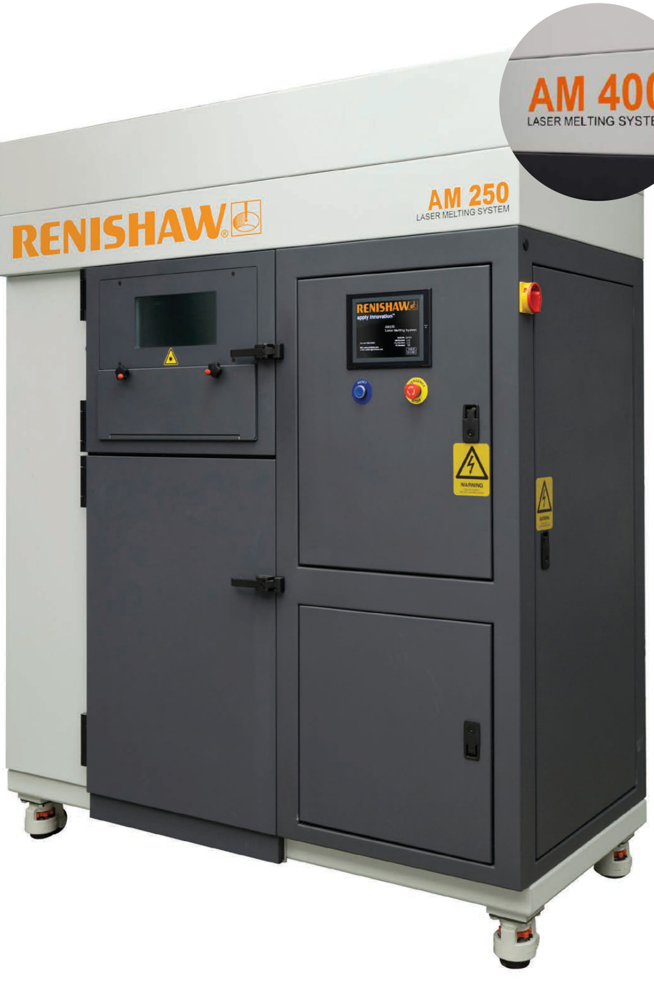
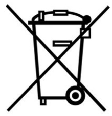
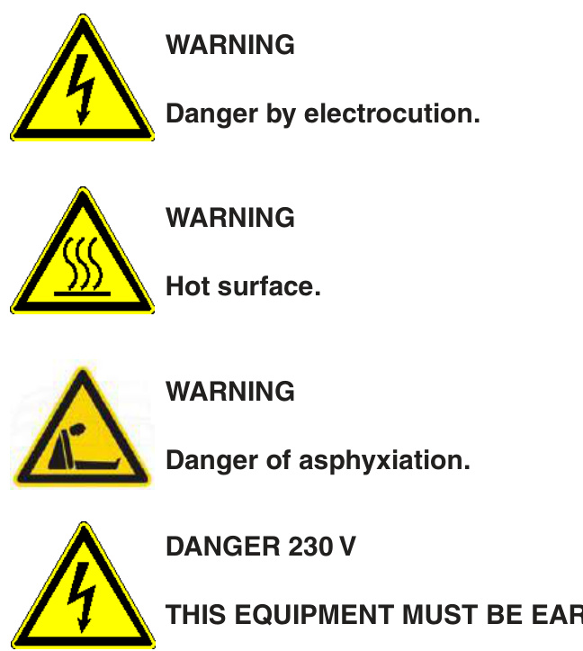
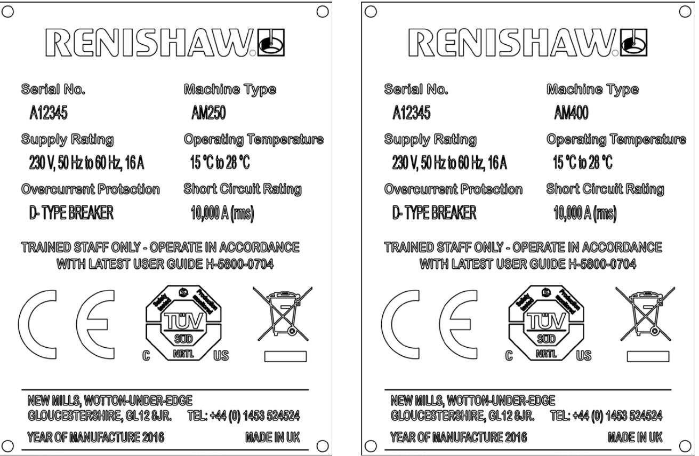
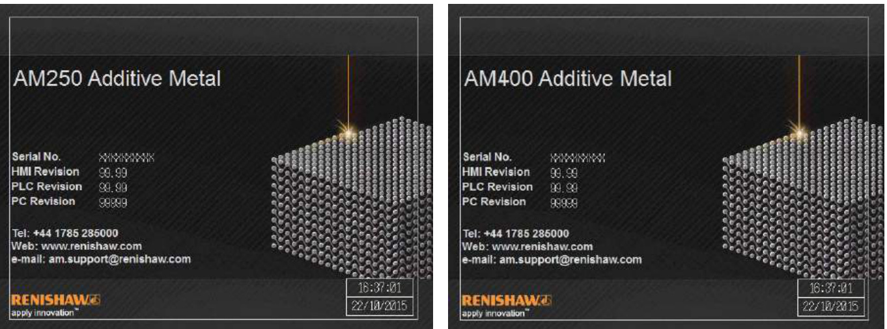

# Renishaw additive manufacturing: AM250 and AM400 laser melting systems  

  

# 1.1 Disclaimer  

RENISHAW HAS MADE CONSIDERABLE EFFORTS TO ENSURE THE CONTENT OF THIS DOCUMENT IS CORRECT AT THE DATE OF PUBLICATION BUT MAKES NO WARRANTIES OR REPRESENTATIONS REGARDING THE CONTENT. RENISHAW EXCLUDES LIABILITY, HOWSOEVER ARISING, FOR ANY INACCURACIES IN THIS DOCUMENT.  

# 1.2 Trademarks  

RENISHAW and the probe symbol used in the RENISHAW logo are registered trade marks of Renishaw plc in the United Kingdom and other countries. apply innovation and names and designations of other Renishaw products and technologies are trade marks of Renishaw plc or its subsidiaries.  

All other brand names and product names used in this document are trade names, trade marks, or registered trade marks of their respective owners.  

# 1.3 Warranty  

Equipment requiring attention under warranty must be returned to your equipment supplier.  

Unless otherwise specifically agreed in writing between you and Renishaw, if you purchased the equipment from a Renishaw company, the warranty provisions contained in Renishaw’s CONDITIONS OF SALE apply. You should consult these conditions in order to find out the details of your warranty but, in summary, the main exclusions from the warranty are if the equipment has been:  

neglected, mishandled or inappropriately used; or modified or altered in any way except with the prior written agreement of Renishaw.  

If you purchased the equipment from any other supplier, you should contact them to find out what repairs are covered by their warranty.  

# 1.4 Changes to equipment  

Renishaw reserves the right to change equipment specifications without notice.  

# 1.5 Patents  

Features of the AM250/AM400 additive manufacturing system, and other similar systems, are the subject of one or more of the following patents and/or patent applications:  

<html><body><table><tr><td>CA 2010/007394</td><td>CN 102164696</td><td>EP 2323787</td><td>JP 5514210</td><td>US 2010/007396</td></tr><tr><td>CA 2010/007396</td><td>CN 102186554</td><td>EP 2318164</td><td></td><td>US 2010/026397</td></tr><tr><td>CA2010/026396</td><td>CN 103357874</td><td>EP 2331232</td><td></td><td>US 2014/0287080</td></tr><tr><td>CA 2010/026397</td><td></td><td>EP 2342042</td><td></td><td>US 8753105</td></tr><tr><td></td><td></td><td>EP 2620241</td><td></td><td>US 8794263</td></tr><tr><td></td><td></td><td>EP 2687305</td><td></td><td></td></tr></table></body></html>  

# 1.6 WEEE directive  

The use of this symbol on Renishaw products and/or accompanying documentation indicates that the product should not be mixed with general household waste upon disposal. It is the responsibility of the end user to dispose of this product at a designated collection point for waste electrical and electronic equipment (WEEE) to enable reuse or recycling. Correct disposal of this product will help to save valuable resources and prevent potential negative effects on the environment. For more information, please contact your local waste disposal service or Renishaw distributor.  

  
WEEE symbol  

# 1.7 EC declaration of conformity  

Renishaw plc declares that the AM250/AM400 complies with the applicable standards and regulations.  

Renishaw plc hereby declares that the AM250/AM400 is in compliance with the essential requirements and other relevant provisions of Directive 1999/5/EC.  

Contact Renishaw plc or visit www.renishaw.com/am400 for the full EC declaration of conformity.  

# 1.8 FCC information to user (USA only)  

# 1.8.1 47CFR section 15.21  

The user is cautioned that any changes or modifications not expressly approved by Renishaw plc or authorised representative could void the user’s authority to operate the equipment.  

# 1.8.2 47CFR section 15.105  

This equipment has been tested and found to comply with the limits for a Class A digital device, pursuant to part 15 of the FCC Rules. These limits are designed to provide reasonable protection against harmful interference when the equipment is operated in a commercial environment. This equipment generates, uses, and can radiate radio frequency energy and, if not installed and used in accordance with the instruction manual, may cause harmful interference to radio communications. Operation of this equipment in a residential area is likely to cause harmful interference in which case the user will be required to correct the interference at his own expense.  

The following section gives details of the equipment supplied with the system, and the equipment available as options.  

# 2.1 Summary  

The Renishaw additive manufacturing process creates homogeneous solid metal components, using high-powered laser energy to melt fine powder, manufacturing parts directly from 3D CAD data.  

This manual covers basic system operation and the relevant safety procedures for many commercially available materials. Users should be aware that raw materials used by the system require tightly controlled safety and handling protocols to be adhered to.  

Additionally, the system must only be operated by staff who have followed a Renishaw approved training course, and in accordance with the instructions and advice contained in this manual. If in doubt about the particular requirements of the Renishaw AM250/AM400 system for a specific material, please contact us for advice and guidance.  

# 2.2 Equipment  

# Standard equipment  

Renishaw AM250/AM400 additive manufacturing system   
Chiller – two sizes depending upon AM system supplied   
Dehumidifier – AM400 only   
Chiller fitting kit   
AM250/AM400 User guide – H-5800-0704   
AM250/AM400 Site preparation guide – H-5800-0838   
Operator training documentation   
Starter kit   
Commissioning kit  

# AM250/AM400 user guide  

Powder bottle kit with three small powder bottles with valves (A1) and one large overflow bottle   
with valve (B1)   
Additional safe change filter assembly   
File preparation software (for example Renishaw QuantAM or Materialise Magics™)  

# Required accessories  

Powder conditioning system for material sieving   
ATEX vacuum cleaner (wet separator)   
Metal powder bottles   
Computer for offline file preparation   
Metal powder   
Argon gas supply (cylinder, bank or liquid)  

# Optional items  

Furnace   
Bead blast unit   
Replacement sieve mesh   
Additional material silo   
Additional material doser   
Additional safe change/large safe change filter assembly   
Additional material bottles and valves   
Additional software modules  

Our equipment is sold subject to the terms and conditions of sale supplied with your purchase of the system; or available on request from your local Renishaw office.  

www.renishaw.com/en/contact  

# 3.1 Spare parts  

All components and sub-assemblies are subject to rigorous quality control. Components purchased from sub-suppliers, such as ball bearings, electric motors or hydraulic cylinders, are supplied in accordance with Renishaw specifications. Renishaw will not honour any warranty claims where faults arise due to non-OEM replacement parts being fitted.  

When ordering spare parts please quote the following:  

Description of the spare and its part number, if known   
Equipment name and model   
Serial number   
Year of manufacture  

Details can be found on the serial plate on the rear of your system, see Section 5 "Contact details".  

Spare parts should be ordered from your local Renishaw office. See:  

www.renishaw.com/en/contact  

For details of your nearest local Renishaw office.  

See Section 35 Appendix B – "Part numbers of spares" for information about the most commonly used spare parts.  

Caution: Renishaw strongly recommend that only Renishaw supplied parts are fitted to the AM250/AM400 system.  

The Renishaw AM250/AM400 is a complex piece of manufacturing equipment and must be used correctly to ensure optimum performance. It must not be used by untrained staff who have not completed a Renishaw approved training course.  

# 4.1 Definitions  

The following definitions are used throughout this manual:  

<html><body><table><tr><td>Term</td><td>Definition</td></tr><tr><td>Client or end user</td><td>The company responsible for purchasing or using the equipment</td></tr><tr><td>Supervisor</td><td>An individual or individuals who is/are ultimately responsible for ensuring the safe operation and maintenance of the equipment</td></tr><tr><td>Operator</td><td>An individual or individuals working for the client or end user who is/are competent to operate,maintain and clean the equipment safely.This is because they have been formally trained and assessed in the individual tasks required</td></tr><tr><td>Technician</td><td>An operator who is qualified to carry out a particular aspect of maintenance.This is because they have been formally trained and assessed in the individual tasks required</td></tr><tr><td>Equipment</td><td>The scope of supply from Renishaw that the client has purchased</td></tr><tr><td>Ancillary equipment</td><td>Any item which is required to complete the installation that is not included in the scope of supply</td></tr><tr><td>Manufacture or manufacturing</td><td>Is any process where the equipment is commissioned, trialled, operated, maintained or cleaned</td></tr><tr><td>Must</td><td>Tasks,actions or activities that are essential for the safe operation of the system</td></tr><tr><td>Should</td><td>Tasks,actions or activities that are recommended for the safe operation of the system</td></tr></table></body></html>  

# 4.2 Abbreviations  

<html><body><table><tr><td>Term</td><td>Definition</td></tr><tr><td>AM</td><td>Additive Manufacturing</td></tr><tr><td>ATEX</td><td>ATmosphéres EXplosives (explosive atmospheres)</td></tr><tr><td>COSHH</td><td>Control of Substances Hazardous to Health</td></tr><tr><td>DSEAR</td><td>Dangerous Substances and Explosive Atmospheres Regulations</td></tr><tr><td>EMC</td><td>Electro-Magnetic Compatibility</td></tr><tr><td>HMI</td><td>Human Machine Interface (touch screen)</td></tr><tr><td>IEE</td><td>Institute of Electrical Engineers (or local governing body)</td></tr><tr><td>IPA</td><td>Isopropanol Alcohol</td></tr><tr><td>ISO</td><td>International Organisation for Standardisation</td></tr><tr><td>LED</td><td>Light Emitting Diode</td></tr><tr><td>MCB</td><td>Miniature Circuit Breaker</td></tr><tr><td>PC</td><td>Personal Computer</td></tr><tr><td>PLC</td><td>Programmable Logic Controller</td></tr><tr><td>PPM</td><td>Parts Per Million</td></tr><tr><td>PV</td><td>Present Value</td></tr><tr><td>SDS</td><td>Safety Data Sheet</td></tr><tr><td>SOP</td><td>Standard OperatingProcedure</td></tr><tr><td>SP</td><td>Set Point</td></tr></table></body></html>  

# 4.3 Text structure  

The following structure has been used throughout this manual:  

The names of menus, buttons, options, icons, check boxes, functions, names of input fields and hot keys are written in bold.   
Program windows, parameters, settings for controls, system messages, signals, paths, file names, software names, areas of the screen and operating modes are written in italics. Controls and function keys are written between <angled brackets>.   
Wildcards for filenames are written in <angled brackets> and in italics.  

# 4.4 Safety warnings in this manual  

Within this user guide additional information that is important to read and understand will be presented as a Warning, Caution or Note. The defiinition of each of these and an example of each is below.  

Example Warning:  

WARNING: A WARNING IS TO TELL THE END USER THAT THERE IS A POSSIBILITY OF INJURY TO THEMSELVES OR OTHER PEOPLE IN THE VICINITY, IF THE DESCRIBED COURSE OF ACTION IS NOT FOLLOWED. A WARNING WILL BE IN UPPER CASE BOLD TEXT.  

Example Caution:  

Caution: A Caution is to tell the end user that there is a possibility of damage to the equipment if the described course of action is not followed. A Caution will be in sentence case bold text  

Example Note:  

Note: A Note is to advise the end user of important information that is related to, or will assist them in the task or activity they are carrying out. A Note will be in sentence case medium text.  

The following Warning labels are fitted to the AM250/AM400 system:  

  

# 4.5 Training schedule  

Renishaw provides a basic level of training to operate the equipment safely. Renishaw also offers extended training courses for operators and process engineers. Please refer to this manual and the training documentation supplied as part of the user training course that all users must complete before using the AM250/AM400 system.  

<html><body><table><tr><td>Phone number</td><td>+44 (0) 1785 285 000 Hours of work: Monday to Friday 08:00 to 17:00 hr BST (British summer time)</td></tr><tr><td>Email</td><td>am.support@ renishaw.com</td></tr><tr><td>Service address</td><td>Renishaw plc Brooms Road, Stone Business Park, Stone Staffordshire, ST15 0SH United Kingdom</td></tr></table></body></html>  

<html><body><table><tr><td>1. System type</td><td></td></tr><tr><td>2. System serial number</td><td></td></tr><tr><td>3. System part number</td><td></td></tr><tr><td>4. Software version numbers</td><td></td></tr><tr><td>HMI revision</td><td></td></tr><tr><td>PLC revision</td><td></td></tr><tr><td>PC revision</td><td></td></tr></table></body></html>  

Please quote the details above:  

The system serial number plate can be found on the rear of the system (Figure 1)   
The system part number:   
AM250 200 W	 A-5774-0001   
AM250 400 W	 A-5771-0100   
AM400 A-6252-0001   
The system software version on the start screen (Figure 2)  

Additional support can be sought by contacting your local Renishaw office. See:  

  
Figure 1 Build information – AM250 (l) and AM400 (r)  

  
Figure 2 Software welcome screen – AM250 (l) and AM400 (r)  