# 19 Powder transfer from supplier’s containers  

This section describes the safe transfer of metallic powder from the supplier’s container to the system powder bottles. It requires the use of an adaptor. Various types of adaptor are available from Renishaw on request.  

WARNING: ENSURE YOU ARE WEARING THE CORRECT PPE: EYE PROTECTION, FULL FACE RESPIRATOR (TO EN143 TYPE $p 3 + A 1$ ), PROTECTIVE GLOVES AND FULL LENGTH CLOTHING, (MADE FROM NON-STATIC GENERATING FABRIC SUCH AS COTTON (AVOID WOOL AND MAN MADE FABRICS) AND AVOID TURN-UPS OR POCKETS THAT MAY TRAP POWDER, REFER TO NFPA 484 FOR DETAILS) BEFORE STARTING THIS TASK.  

For titanium powder, firstly remove the silica desiccant bag from the supplier’s container on opening (Figure 139).  

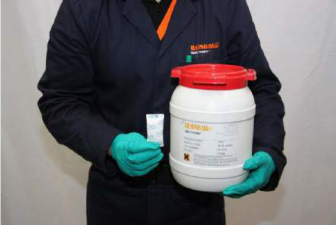  
Figure 139 Removal of silica desiccant from container  

WARNING: DO NOT LOAD POWDER DIRECTLY FROM THE SUPPLIERS POWDER BOTTLE INTO THE AM250/AM400 – POWDER MUST FIRST BE DECANTED INTO A RENISHAW POWDER BOTTLE.  

# WARNING: WHEN USING TITANIUM POWDER THE SILICA DESICCANT BAG MUST BE REMOVED FROM THE SUPPLIERS CONTAINER TO PREVENT IT BEING TRANSFERRED TO SYSTEM BOTTLE.  

Screw a suitable powder bottle adaptor on to the suppliers powder bottle, (Figure 140). Ensure the isolating valve (AV1) is closed, the handle will be at $9 0 ^ { \circ }$ to the direction of flow.  

Be aware that the powder bottle is open and it must be connected with care to avoid any spillage of powder. The time spent with the powder bottle open should be kept as short as possible.  

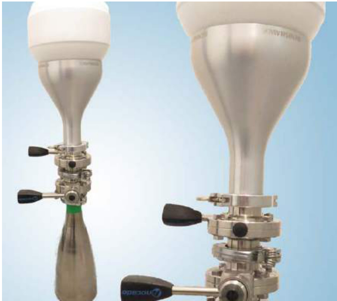  
Figure 140 Connect quick-release clamp and invert bottles  

Fit a centring ring to the isolating valve (AV1) KF flange adaptor of the supplier powder bottle.  

Take a small powder bottle complete with isolating valve (A1), ensure the isolating valve (A1) is closed, handle at $9 0 ^ { \circ }$ to the direction of flow.  

Connect the KF flanges of the small powder bottle and supplier powder bottle adaptor together and secure with a quick-release clamp, (Figure 140).  

Rotate both the supplier powder bottle and small powder bottle. Open both isolation valves (AV1 and A1) and allow the powder to transfer. Tap the small powder bottle to determine when it is full (hollow sound when empty).  

When the small powder bottle is full, close the isolating valve (A1) and invert both bottles so that the supplier powder bottle is lowermost. Allow any remaining powder in the coupling to drop back into the supplier powder bottle and then close the isolating valve (AV1).  

Remove the quick-release clamp between the two isolating valves (AV1 and A1) and separate the two powder bottles.  

The powder silo features a KF40 flange for loading. This should be fitted with a valve (V1) secured by a clamp (L1) at all times. To fill the silo, follow the procedure detailed in this section.  

Ensure that there is a minimum of three full bottles of powder in the system before starting the process. The silo can be filled whilst the process is running – but not during the vacuum cycle.  

WARNING: ENSURE YOU ARE WEARING THE CORRECT PPE: EYE PROTECTION, FULL FACE RESPIRATOR (TO EN143 TYPE $\mathsf { P 3 } + \mathsf { A 1 }$ ), PROTECTIVE GLOVES AND FULL LENGTH CLOTHING, (MADE FROM NON-STATIC GENERATING FABRIC SUCH AS COTTON (AVOID WOOL AND MAN MADE FABRICS) AND AVOID TURN-UPS OR POCKETS THAT MAY TRAP POWDER, REFER TO NFPA 484 FOR DETAILS) BEFORE STARTING THIS TASK.  

# WARNING: DO NOT LOAD POWDER DIRECTLY FROM THE SUPPLIERS CONTAINER INTO THE AM250/AM400 – POWDER MUST FIRST BE DECANTED INTO A RENISHAW POWDER BOTTLE.  

WARNING: DO NOT FILL THE POWDER SILO ABOVE THE LEVEL OF THE OVERFLOW PIPES. DO NOT ATTEMPT TO FILL THE SILO WHILST THE SYSTEM IS PREPARING THE BUILD ATMOSPHERE (DURING THE VACUUM CYCLE).  

WARNING: ALWAYS SIEVE POWDER USING A RENISHAW POWDER RECOVERY SYSTEM BEFORE LOADING. NEVER LOAD CONTAMINATED POWDER.  

Use a safe working at height platform to reach the silo on the top of the system (Figure 141).  

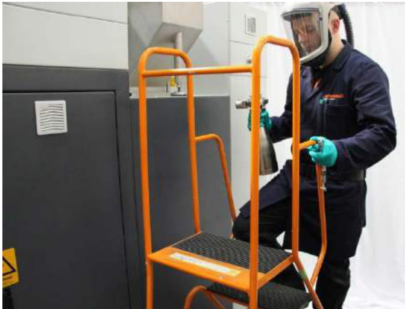  
Figure 141 Use the safe working platform  

Place a clean centring ring seal on the KF flange of the silo isolating valve (V1) (Figure 142).  

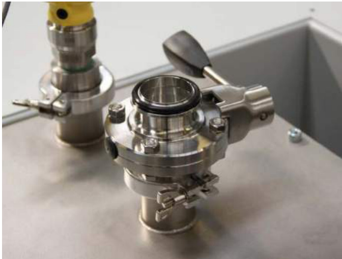  
Figure 142 Place an centring ring on silo isolating valve (V1) (closed)  

Ensure that the small powder bottle isolating valve (A1) and silo isolating valve (V1) are in the closed position (handle at $9 0 ^ { \circ }$ to the direction of flow) (Figure 143).  

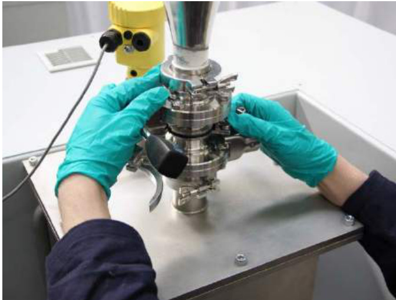  
Figure 143 Powder bottle assembled to the silo using a quick-release clamp (L1)  

Place the small powder bottle on top of the centring ring seal, then slide half the collar of the quickrelease clamp (L1) over the edge of the flange (Figure 144).  

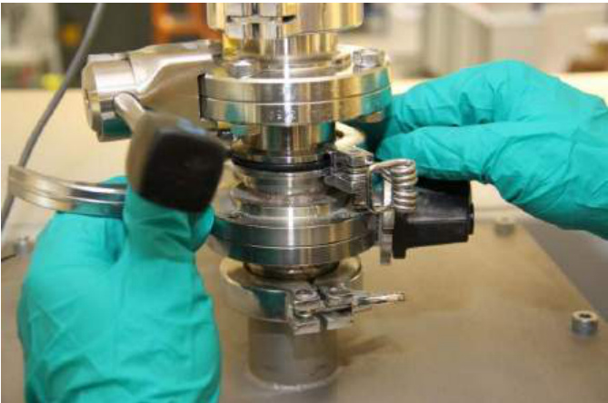  
Figure 144 Close clamp (L1)  

Close the second half of the quick-release clamp (L1) and attach the spring-loaded lever (Figure 110).   
Open the valves on the bottle first (A1) then the silo (V1), (Figure 145).  

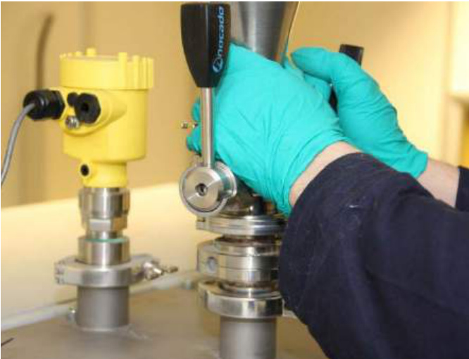  
Figure 145 Powder bottle to silo with valves (A1 and V1) open  

Wait until the bottle has emptied into the silo – check by tapping the bottle gently (Figure 146).  

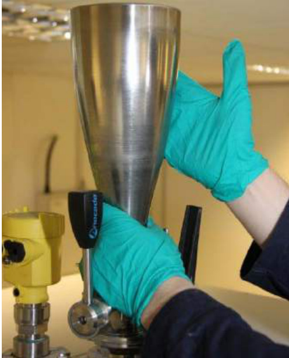  
Figure 146 Tap gently  

Close the valve on the small powder bottle (A1) and then the silo (V1).  

Remove the quick-release clamp (L1) and remove the bottle from the system.  

# 21 Installing the overflow bottles  

WARNING: ENSURE YOU ARE WEARING THE CORRECT PPE: EYE PROTECTION, FULL FACE RESPIRATOR (TO EN143 TYPE $p _ { 3 + A 1 }$ ), PROTECTIVE GLOVES AND FULL LENGTH CLOTHING, (MADE FROM NON-STATIC GENERATING FABRIC SUCH AS COTTON (AVOID WOOL AND MAN MADE FABRICS) AND AVOID TURN-UPS OR POCKETS THAT MAY TRAP POWDER, REFER TO NFPA 484 FOR DETAILS) BEFORE STARTING THIS TASK.  

The powder overflow bottles should be fitted inside the left hand access panel below the safe change filter/large safe change filter. Each should have two valves – one to isolate the system (V2 and V3) and one to isolate the bottle (A1 and B1).  

Ensure that the overflow bottle valves (A1 and B1) and system valves (V2 and V3) are in the closed position – perpendicular to the direction of flow. If not, pull the handle to unlock and rotate it by $9 0 ^ { \circ }$ (Figure 147).  

Note: Renishaw recommend fitting the front and rear powder overflow bottles before fitting the safe change filter/large safe change filter.  

Note: If either of the powder overflow bottles needs to be replaced whilst the AM250/AM400 is running then consider purging/filling the powder overflow bottle with argon gas before fitting it to the AM250/ AM400 system.  

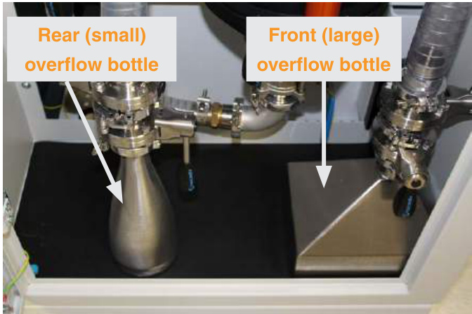  
Figure 147 Four overflow valves (A1, B1, V2 and V3) - shown in open position  

# 21.1 Rear overflow  

Position the rear overflow bottle under the rear overflow pipe (Figure 148).  

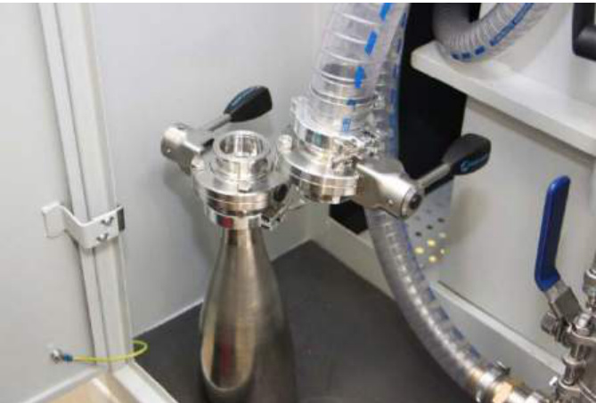  
Figure 148 Rear overflow – small powder bottle  

Place a centring ring on the KF flange of the rear powder bottle isolating valve (A1) (Figure 149).  

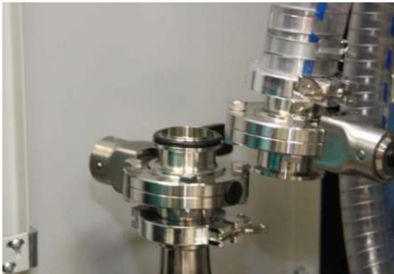  
Figure 149 Place seal on flange  

Engage the rear powder bottle flange with the rear overflow pipe flange and slide half the collar of the quick-release clamp (L10) over the edge of the KF flanges (Figure 150).  

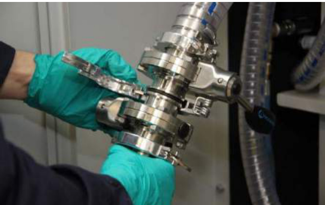  
Figure 150 Engage the first half of the clamp (L10)  

Close the quick-release clamp (L10), ensuring a correct fit around the flanges (Figure 151).  

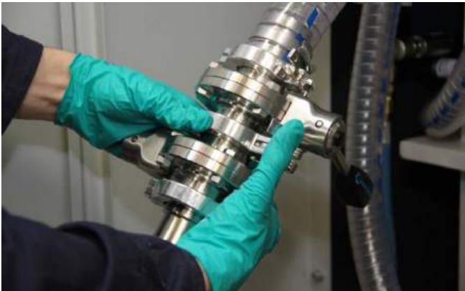  
Figure 151 Engage second half and close clamp L10)  

Open both the valves (A1 and V2) to complete the installation of the rear overflow bottle (Figure 152 and Figure 153).  

  
Figure 152 Open both valves (A1 and V2)  

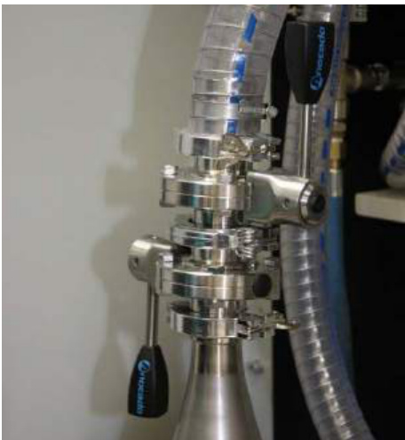  
Figure 153 Valves (A1 and V2) open  

# 21.2 Front overflow  

Position the front (large) overflow bottle under the front overflow pipe.  

Place a centring ring seal on the KF flange of the large overflow bottle isolation valve (B1) (Figure 154).  

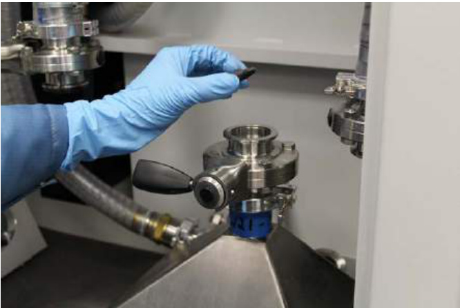  
Figure 154 Locate seal on flange  

Engage the large overflow bottle isolation valve (B1) flange with the overflow pipe flange (V3) (Figure 155).  

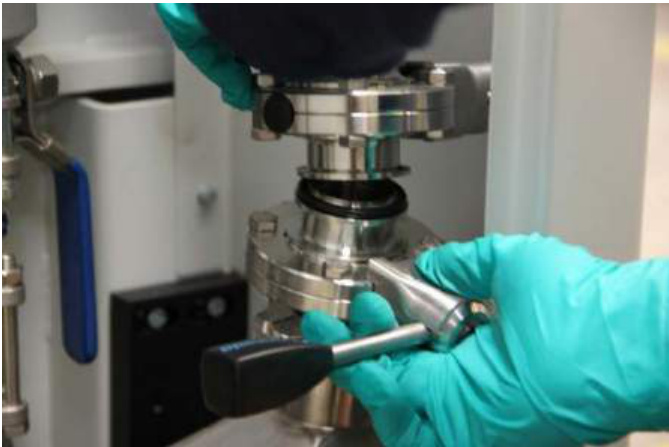  
Figure 155 Mate large overflow bottle isolation valve (B1) flange with pipework isolation valve (V3) flange  

Slide half the collar of the quick-release clamp (L13) over the edge of the isolating valves (B1 and V3) mating flanges (Figure 156).  

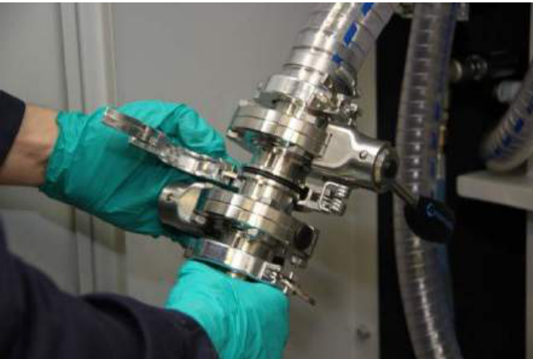  
Figure 156 Engage first half of the clamp (L13)  

Swing the other collar of the quick-release clamp (L13) over the flanges, ensuring that the engaged flanges are secure, then lock the latch on the quick-release clamp (L13) to secure in place (Figure 157).  

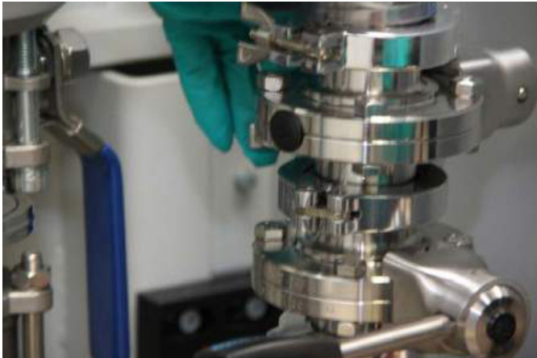  
Figure 157 Engage second half and close clamp (L13)  

Open both valves (B1 and V3) to complete the installation of the front (large) overflow bottle (Figure 158). All used metal powder must be sieved to remove part-sintered material before refilling the system.  

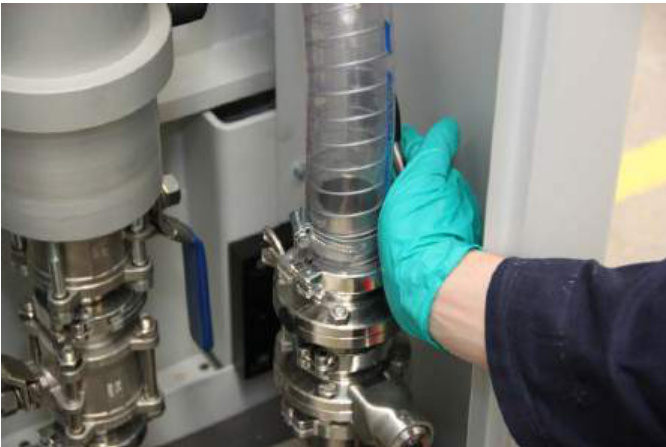  
Figure 158 Open both valves (B1 and V3)  