# 22 Safe change filter and large safe change filter – change  

# 22.1 Safe change filter OR large safe change filter?  

WARNING: THE AM250, AM250 WITH PLUSPAC AND AM400 SYSTEMS FEATURE A FILTER TO CAPTURE PROCESS EMISSIONS. THIS FILTER MUST BE CHANGED AFTER EVERY BUILD. THIS APPLIES TO BOTH THE SAFE CHANGE FILTER AND LARGE SAFE CHANGE FILTER.  

If your machine is fitted with a safe change filter, (Figure 159) follow the procedure in Section 22.2.  

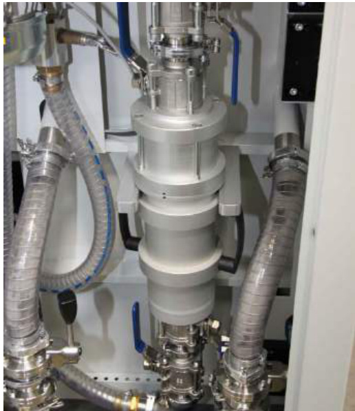  
Figure 159 Safe change filter  

If your machine is fitted with a large safe change filter, (Figure 160) follow the procedure in Section 22.3  

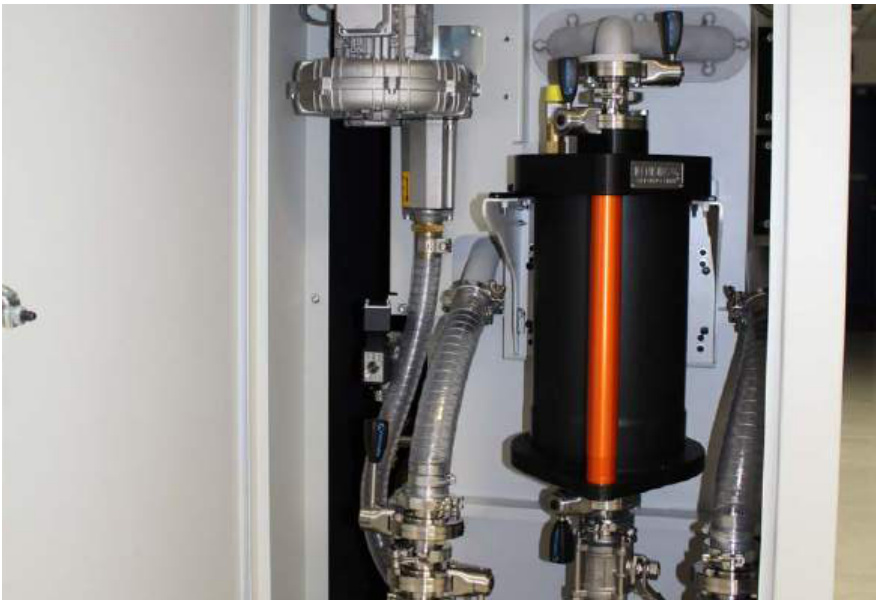  
Figure 160 Large safe change filter  

# 22.2 Safe change filter - replace  

# 22.2.1 Removing the safe change filter assembly  

WARNING: ENSURE YOU ARE WEARING THE CORRECT PPE: EYE PROTECTION, FULL FACE RESPIRATOR (TO EN143 TYPE $p _ { 3 + A 1 }$ ), PROTECTIVE GLOVES AND FULL LENGTH CLOTHING, (MADE FROM NON-STATIC GENERATING FABRIC SUCH AS COTTON (AVOID WOOL AND MAN MADE FABRICS)) AND AVOID TURN-UPS OR POCKETS THAT MAY TRAP POWDER, REFER TO NFPA 484 FOR DETAILS) BEFORE STARTING THIS TASK.  

WARNING: DO NOT REMOVE OR ATTEMPT TO CHANGE THE SAFE CHANGE FILTER WHILST A BUILD IS RUNNING.  

Caution: Do not close the filter valves (V4 and V5) whilst the machine is running, only when paused or after build completion.  

1. The safe change filter must be replaced after every build.  

2. Ensure that the four valves (two upper and two lower) on the filter housing (F1 and F2) and system pipes (V4 and V5) are closed (Figure 161 and Figure 162). The handles should be at $9 0 ^ { \circ }$ to the direction of flow.  

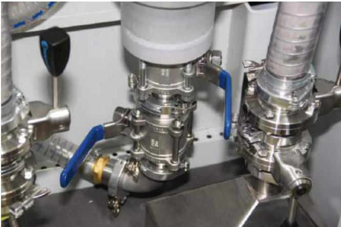  
Figure 161 Lower valves closed (V5 and F2)  

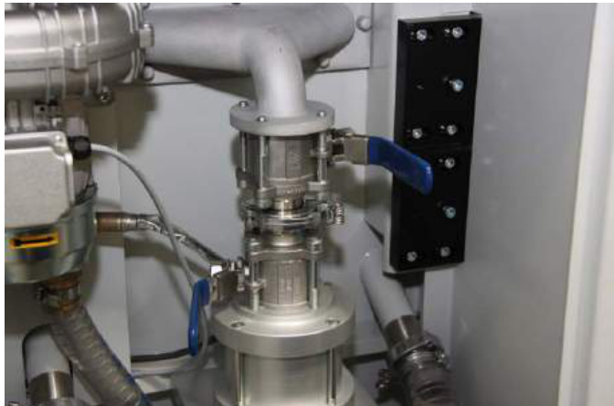  
Figure 162 Upper valves (F1 and V4) closed  

3. Open the latch on the quick-release clamp (L4) between the two upper isolation valves (F1 and V4) at the top of the filter, (Figure 163).  

4. Swing one collar of the quick-release clamp (L4) off the upper KF flange connection, whilst supporting the safe change filter assembly.   
5. Swing the second collar of the quick-release clamp (L4) off the KF flange connection to disengage the two KF flanges, whilst allowing the safe change filter assembly to drop down onto the retaining bracket (Figure 163).   
6. Remove the centring ring from the KF flange at the top of the safe change filter and store it with the quick-release clamp (L4).   
7. Open the latch on the quick-release clamp (L5) located between the two lower isolating valves (F2 and V5) at the bottom of the filter, (Figure 164).  

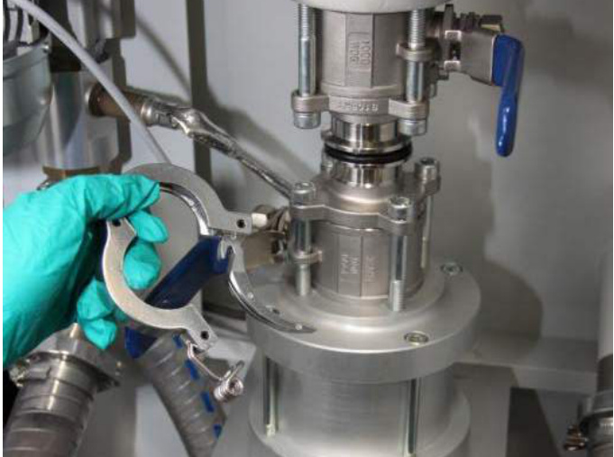  
Figure 163 Remove the upper quick-release clamp (L4)  

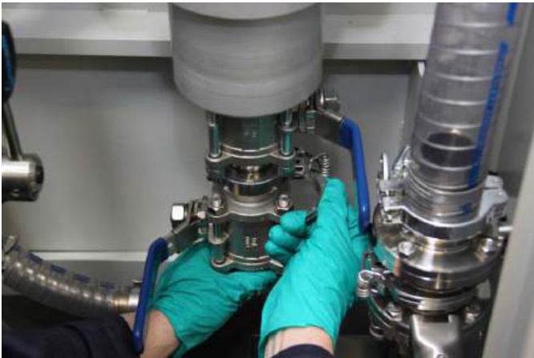  
Figure 164 Open the latch on the quick-release clamp (L5)  

8. Whilst supporting the recirculation pipe, swing one collar of the quick-release clamp (L5) off the KF flange connection, then the second collar to completely remove the clamp (L5) (Figure 165).  

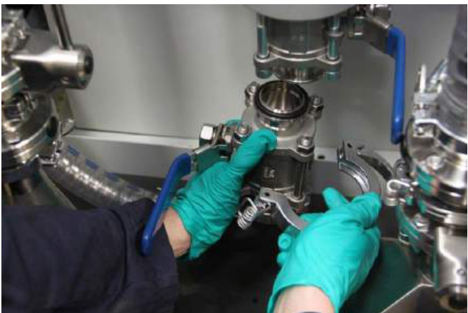  
Figure 165 Support pipe and remove clamp (L5)  

9. Gently place the recirculation pipe into the bottom of the machine.  

10.	 Remove the centring ring from the KF flange at the top of the recirculation pipe and store it with the quick-release clamp (L5).  

11.	 Take a firm grip of the handles on the safe change filter assembly. Slide the safe change filter assembly off the retaining bracket (Figure 166).  

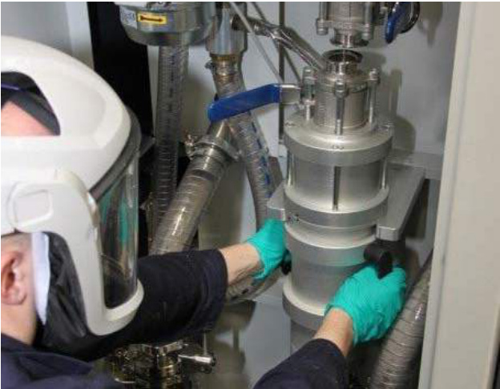  
Figure 166 Removing safe change filter from retaining bracket  

12.	 The filter element contains fine particulate, which must be neutralised by wetting, flood the filter assembly with water before removing the filter element. This procedure must be followed irrespective of material type processed.  

Caution: The safe change filter element contains fine particulate which must be neutralised by wetting.  

WARNING: FAILURE TO SUBMERGE THE FILTER ELEMENT BEFORE DISASSEMBLY MAY RESULT IN FIRE.  

13. Once the safe change filter assembly has been removed from the machine, begin the neutralising process immediately. Refer to Section 22.2.2 "Changing the filter element".  

# 22.2.2 Changing the filter element  

The safe change filter assembly needs to go straight through the disassembly process after removal from the AM250 machine.  

WARNING: IT IS MANDATORY TO INERT THE FILTER ELEMENT BY FLOODING THE FILTER ASSEMBLY WITH WATER PRIOR TO DISASSEMBLY. THIS IS BECAUSE THE FILTER ELEMENT CONTAINS SUB-MICRON PARTICLES WHICH DUE TO INCREASED SURFACE AREA CAN IGNITE IN THE PRESENCE OF OXYGEN. THIS APPLIES TO ALL MATERIALS.  

WARNING: IN ADDITION TO FLOODING THE FILTER ASSEMBLY WITH WATER THE TOP VALVE (F1) MUST BE LEFT OPEN WHEN WET. THIS IS BECAUSE THE FILTER ELEMENT CONTENTS REACT RAPIDLY WITH WATER TO LIBERATE HYDROGEN GAS; THIS MUST BE PERMITTED TO ESCAPE. FILTER DISASSEMBLY MUST BE CARRIED OUT IN A WELL VENTILATED AREA AWAY FROM POSSIBLE SOURCES OF IGNITION. THIS APPLIES TO ALL MATERIALS.  

Ensure that the following conditions are met before starting:  

Ensure the correct PPE is worn before starting – gloves, full face respirator (conforming to EN143 Type $\mathsf { P 3 + A 1 }$ ) and full length clothing, made from non-static generating fabric such as cotton (avoid wool and man made fabrics) and avoid turn-ups or pockets that may trap powder. Refer to NFPA 484 for details.   
• Immediately clean-up any water spillages and mop the area clean after use.   
1. Begin the disassembly process for the safe change filter immediately after removing it from the AM250 system.   
2. Take the safe change filter assembly to a water tap location with a hose pipe fitting.   
3. Open the upper isolating valve (F1) on the safe change filter assembly and fill with water to just below the top of the valve seal (Figure 167).  

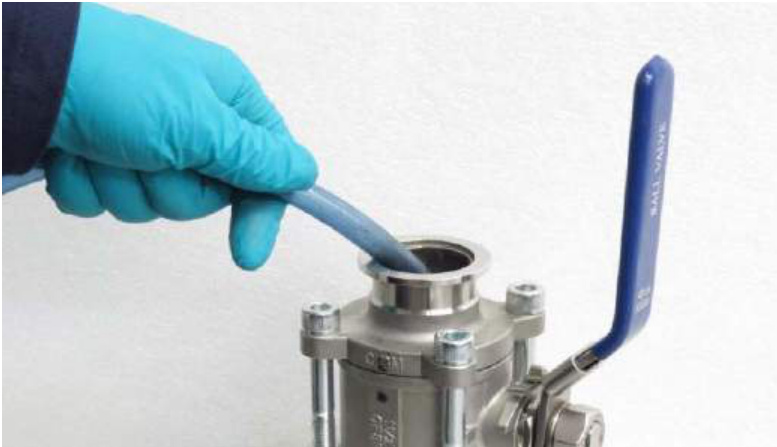  
Figure 167 Open valve (F1) and fill filter housing  

WARNING: TO AVOID HYDROGEN GAS BUILD UP THE FILTER MUST BE DISASSEMBLED AS SOON AS POSSIBLE AFTER WETTING. DO NOT CLOSE THE TOP VALVE (F1) AFTER WETTING. DO NOT STORE WET POWDER IN SEALED CONTAINERS.  

4. Assign a drum for filter disposal (Figure 168).  

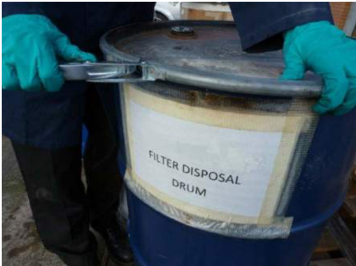  
Figure 168 Drum assigned for filter disposal  

5.	 Fill the drum with water and a $5 \%$ solution of Hydra-Sol-MAG additive (Part number P-LU08-0004).  

6.	 Open the drum and position the filter assembly above the drum. Open the lower isolating valve (F2) to empty the water drained through the filter element (Figure 169).  

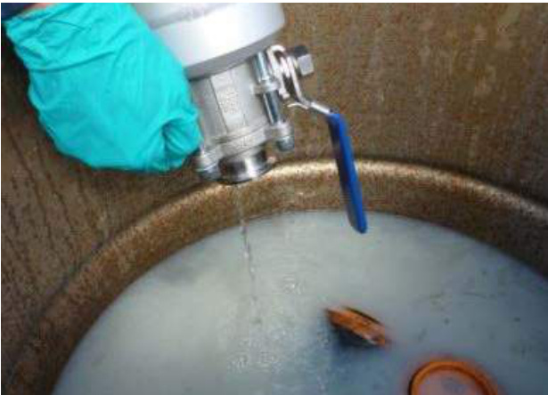  
Figure 169 Draining water through the filter  

7.	 Once the water has drained from the filter assembly, close the lower isolating valve (F2).  

8.	 Disassemble the filter assembly, using a 6 mm hexagonal key to unscrew the four M8 bolts (Figure 170).  

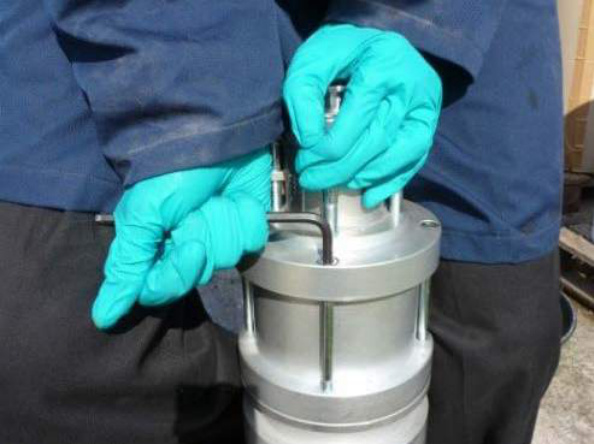  
Figure 170 Disassembly of filter assembly  

9.	 Lift the top off the filter assembly and remove the used filter element (Figure 171).  

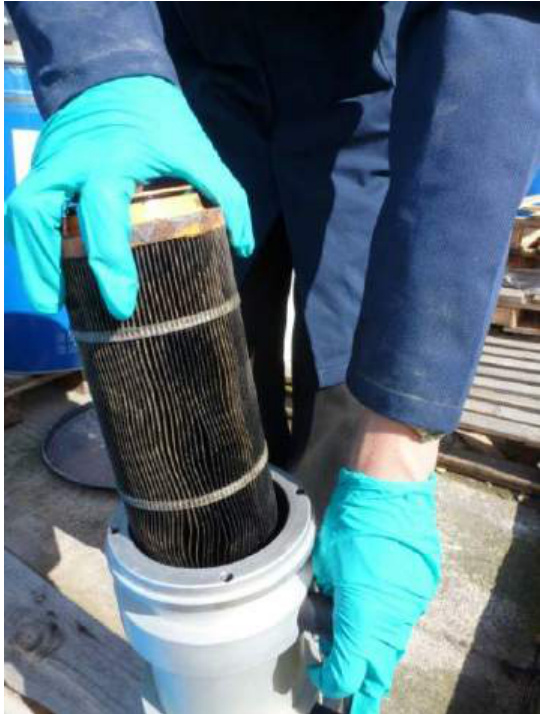  
Figure 171 Removal of used filter element from filter housing  

10.	 Store immersed in the storage drum. Replace the lid on the drum, ensuring that the drum remains ventilated, (Figure 172).  

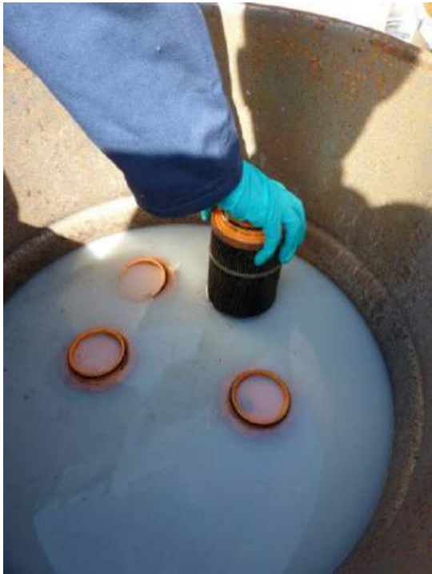  
Figure 172 Storage of used filter elements in assigned disposal drum  

11.	 Thoroughly clean and dry the filter housing using paper towels. Allow to stand in a dry environment for approximately 24 hours, or in a low temperature oven at a maximum of $5 0 ~ ^ { \circ } \mathsf { C }$ $( 1 2 2 ^ { \circ } { \mathsf { F } } )$ , until completely dry.   
12.	 Renishaw recommend stocking an additional filter assembly. Once the fully dry, install a new filter element (part number 790730000), see Section 22.2.3 "Installing a new safe change filter element".  

# 22.2.3 Installing a new safe change filter element  

The AM250 features a safe change filter to capture process emissions. This filter element must be changed after every build.  

WARNING: NEVER RESTART AN AM250/AM400 SYSTEM WITHOUT REPLACING THE FILTER ELEMENT. NEVER RUN AN AM250/AM400 SYSTEM WITHOUT A SAFE CHANGE FILTER IN PLACE.  

1. Prepare the components for assembly (Figure 173).  

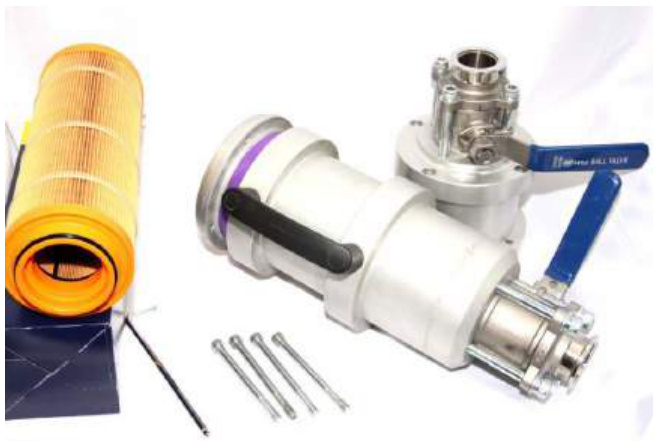  
Figure 173 Safe change filter assembly  

2. Take a machine filter element and lightly lubricate the black centring ring seals on the open end using the high vacuum grease supplied in the filter box (Figure 174).  

Caution: Ensure that the hollow end of the filter element is facing downwards.  

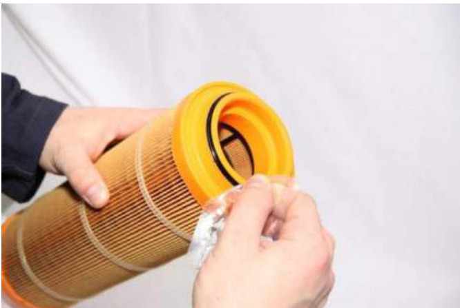  
Figure 174 Apply grease to open end  

3. Place the filter element into the bottom half of the filter housing, applying firm downward pressure, and rotate slightly to lock in place (Figure 175).  

  
Figure 175 Insert hollow end  

4. Apply grease to the seal on the closed end (Figure 176).  

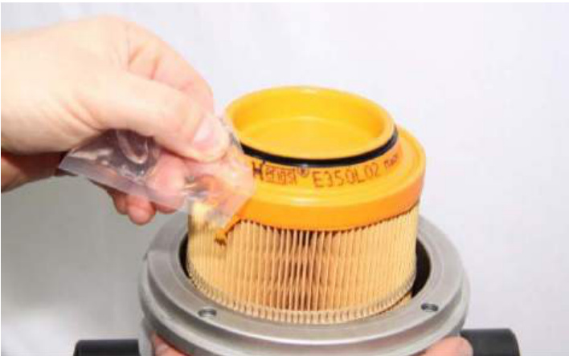  
Figure 176 Apply grease to closed end seal  

5. Replace the top half of the filter housing, ensuring that the upper and lower valves (F1 and F2) are closed (levers are perpendicular to the direction of flow). Insert the four M8 bolts into their assembly position, and tighten until resistance is felt (finger tight) (Figure 177).  

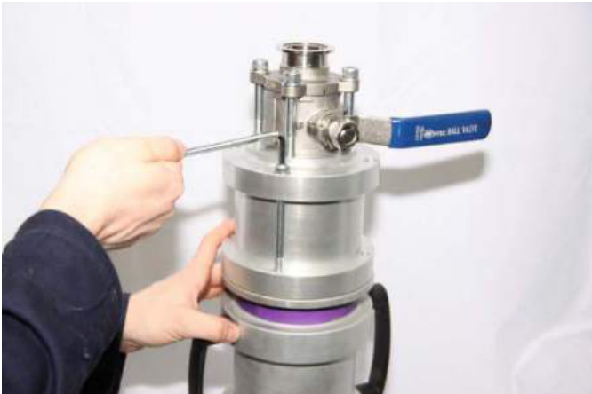  
Figure 177 Pre-tighten  

6. Tighten the bolts using a 6 mm hexagonal key to approximately $1 5 N m$ following the sequence in Figure 178.  

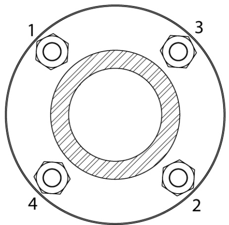  
Figure 178 Tightening sequence  

7.	 After completing the installation of a new safe change filter element, the filter assembly should be installed on the AM250 system, see Section 22.2.4 "Installing the safe change filter on the AM250 system".  

# 22.2.4 Installing the safe change filter assembly on the AM250 system  

Note: Renishaw recommend fitting the front and rear powder overflow bottles before fitting the safe change filter/large safe change filter assembly.  

1. After completing the installation of a new filter element, place a centring ring seal on the upper isolating valve (F1) KF flange of the safe change filter assembly.   
2. Slide the safe change filter assembly onto the retaining bracket at the side of the AM250 system, ensuring that all four isolating valves (V4, V5, F1 and F2) are closed (levers are perpendicular to the direction of flow) (Figure 179).  

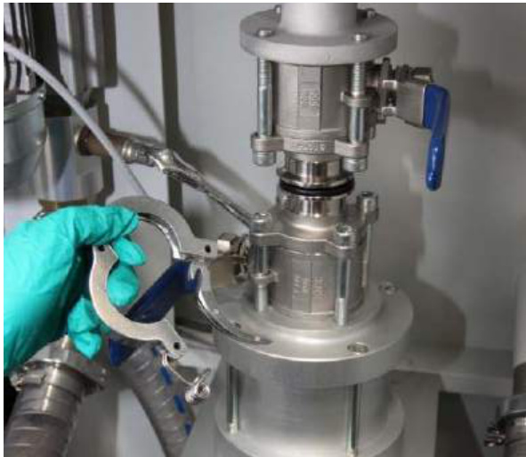  
Figure 179 Insert seal, slide onto retaining bracket with valves (F1 and V4)  

WARNING: TAKE CARE WHEN REMOVING THE SAFE CHANGE FILTER CLAMP (L4) CLOSE TO THE OXYGEN SENSOR, AS IT MAY BE HOT.  

3. Lift the safe change filter assembly slightly and engage the safe change filter upper KF flange with the system outlet KF flange (Figure 180).  

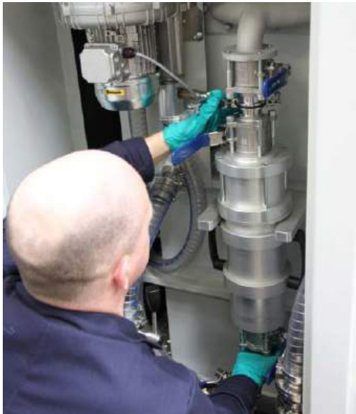  
Figure 180 Lift safe change filter assembly to top flange  

4. Slide half the quick-release clamp (L4) collar over the edge of the engaged flanges (Figure 181)  

  
Figure 181 Slide first half of the clamp (L4) over the flanges  

5. Close the quick-release clamp (L4) and ensure that it fully secures the engaged flanges (Figure 182).  

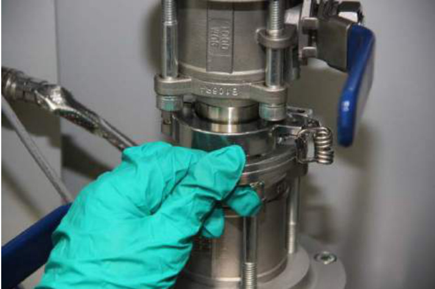  
Figure 182 Lock clamp (L4)  

6. Place a centring ring seal between the system recirculation pipe isolation valve (V5) KF flange and the lower flange of the safe change filter isolating valve (F2).  

7. Support the system recirculation pipe isolation valve (V5) against the safe change filter isolating valve (F2) and place one collar of a quick-release clamp (L5) over the two flanges.   
8. Swing the second collar of clamp (L5) around to fully secure the flanges. Lock the latch on the quick-release clamp (L5) to complete the assembly (Figure 183).  

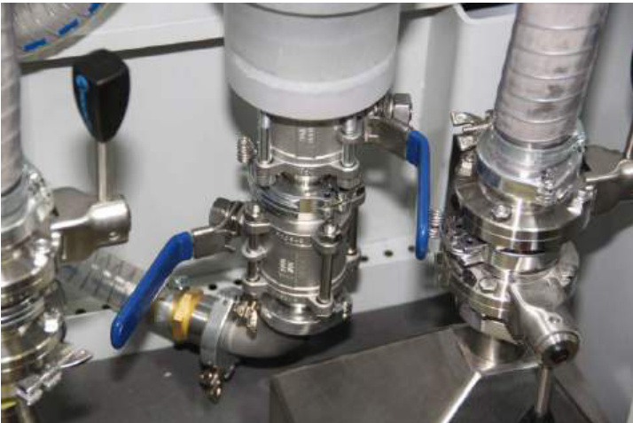  
Figure 183 System recirculation pipe isolation valve (V5) assembled to the lower safe change filter isolation valve (F2)  

9. Open all four valves (V4, V5, F1 and F2), the levers will be aligned with the direction of flow, just before the build commences (Figure 184).  

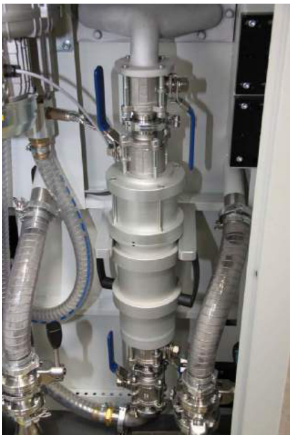  
Figure 184 Valves (F1, F2, V4 and V5) in the open position  

# 22.3 Large safe change filter - replace  

WARNING: ENSURE YOU ARE WEARING THE CORRECT PPE: EYE PROTECTION, FULL FACE RESPIRATOR (TO EN143 TYPE $\mathsf { P 3 } + \mathsf { A 1 }$ ), PROTECTIVE GLOVES AND FULL LENGTH CLOTHING, (MADE FROM NON-STATIC GENERATING FABRIC SUCH AS COTTON (AVOID WOOL AND MAN MADE FABRICS) AND AVOID TURN-UPS OR POCKETS THAT MAY TRAP POWDER, REFER TO NFPA 484 FOR DETAILS) BEFORE STARTING THIS TASK.  

WARNING: THE AM250/AM400 SYSTEM HAS A LARGE SAFE CHANGE FILTER TO CAPTURE PROCESS EMISSIONS. THE LARGE SAFE CHANGE FILTER CONTAINS A FILTER ELEMENT WHICH MUST BE REPLACED AFTER EVERY BUILD.  

A summary of this procedure is in Section 22.3.1 – Large safe change filter – replace – summary. • A detailed version of this procedure is in Section 22.3.2 – Large safe change filter – replace – detailed procedure.  

# 22.3.1 Large safe change filter – summary  

WARNING: DO NOT REMOVE OR ATTEMPT TO CHANGE THE LARGE SAFE CHANGE FILTER WHILST A BUILD IS RUNNING.  

Note: Renishaw recommend fitting the front and rear powder overflow bottles before fitting the safe change filter/large safe change filter.  

1.	 When the AM250/AM400 system is idle, close all four valves (V4, V5, F1 and F2) to retain argon (Figure 185). Remove large safe change filter assembly from the AM250/AM400 to a disassembly area.  

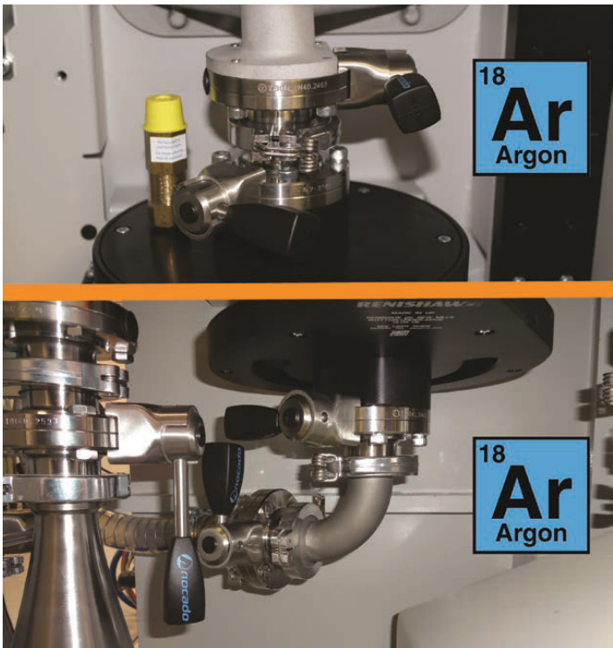  
Figure 185 Isolating valves (V4, V5, F1 and F2)  

2. Open the upper valve (F1) and fill with water (Figure 186). Check the water level and top-up as necessary. Soak for between three and five minutes. KEEP VALVE (F1) OPEN.  

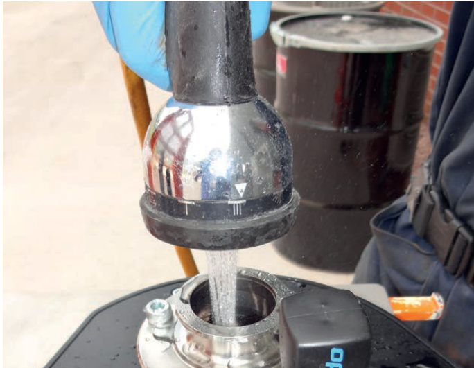  
Figure 186 Fill large safe change filter assembly with water, check level and top-up  

3. Disassemble immediately after soaking for three to five minutes. DO NOT LEAVE for longer as hydrogen gas may be formed.  

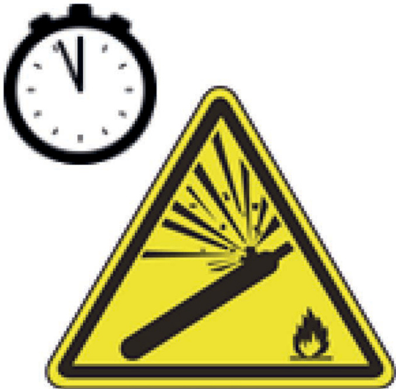  
Figure 187 Disassemble immediately after soaking  

4. Store used filter element immersed in water in a ventilated container, (Figure 188).  

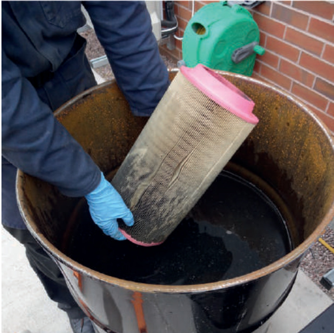  
Figure 188 Storage of used filter element  

22.3.2 Large safe change filter assembly – detailed procedure  

22.3.2.1 Large safe change filter assembly – remove  

WARNING: DO NOT REMOVE OR ATTEMPT TO CHANGE THE LARGE SAFE CHANGE FILTER WHILST A BUILD IS RUNNING.  

WARNING: DO NOT CLOSE THE LARGE SAFE CHANGE FILTER ISOLATION VALVES (V4, V5, F1 AND F2) WHILST THE AM250/AM400 SYSTEM IS RUNNING. ONLY CLOSE THE ISOLATING VALVES (V4, V5, F1 AND F2) WHEN THE AM250/AM400 SYSTEM IS PAUSED OR AFTER THE BUILD HAS COMPLETED.  

# WARNING: THE LARGE SAFE CHANGE FILTER ELEMENT MUST BE REPLACED AFTER EVERY BUILD.  

1. There are two isolating valves on the large safe change filter assembly, one above (F1) and one below (F2) the filter canister. There is one on the system outlet (V4) and one on the system recirculation (V5) pipes.   
2. Operate the four isolating valves on the filter assembly, system outlet and system recirculation pipes (V4, V5, F1 and F2), and move them to the isolated position (Figures 189 and 190). The large safe change filter assembly, system outlet and system recirculation pipes are now sealed.   
3. At the top of the large safe filter assembly, between the two isolating valves (V4 and F1) is the upper quick-release clamp (L4). The upper quick-release clamp (L4) secures the system outlet and upper large safe change filter isolation valve KF40 flanges together.   
4. Open the latch on the upper quick-release clamp (L4).   
5. Remove the two collars of the quick-release clamp (L4) from the upper KF40 flange connection, and disengage the two KF40 flanges (Figure 191).  

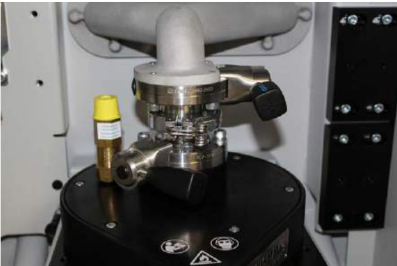  
Figure 189 Upper valves closed (V4 and F1)  

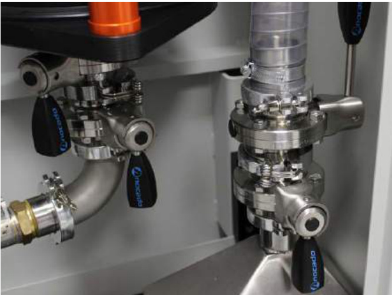  
Figure 190 Lower valves closed (V5 and F2)  

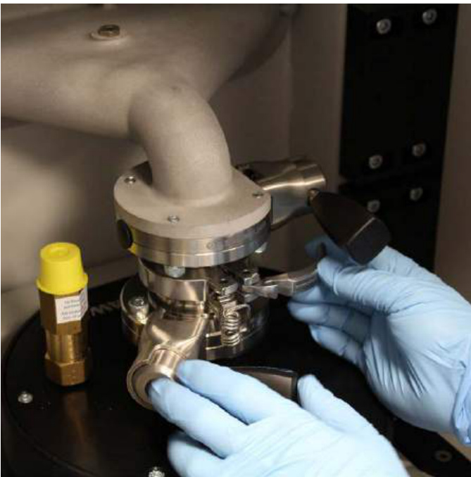  
Figure 191 Open the latch on the upper quick-release clamp (L4)  

6. At the top of the large safe change filter assembly, remove the centring ring from the KF40 flange and store it with the quick-release clamp (L4) until required during refit.  

7.	 At the bottom of the large safe change filter assembly, between the two isolating valves is the lower quick-release clamp (L5). The lower quick-release clamp (L5) secures the lower KF40 flanges together. Open the latch on the lower quick-release clamp (L5) (Figure 192).  

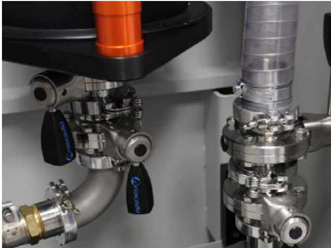  
Figure 192 Lower quick-release clamp (L5)  

8. Support the recirculation pipe and remove the two collars of the quick-release clamp (L5) off the lower KF40 flange connection.   
9. Carefully lower the recirculation pipe into the bottom of the AM250/AM400 system.   
10. At the bottom of the large safe change filter, remove the centring ring from the KF40 flange and store it with the quick-release clamp (L5) until required during refit.   
11. Push down on the large safe change filter sprung bracket until the plunger engages and secures the sprung bracket in the lower position (Figure 193).  

Note: The large safe change filter assembly weighs approximately $1 5 \mathsf { k g }$ when dry. Use suitable lifting equipment as necessary.  

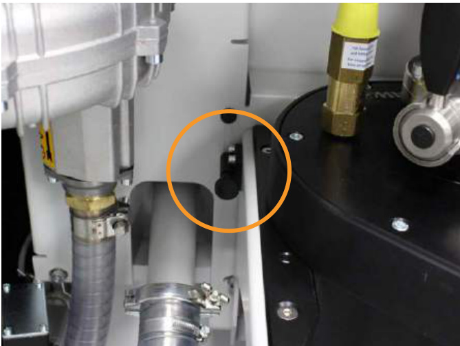  
Figure 193 Spring plunger  

12.	 Grip the handle with the right hand, support the weight of the large safe change filter assembly at the base with the left hand, and carefully slide it off the sprung bracket and out of the system (Figure 194).  

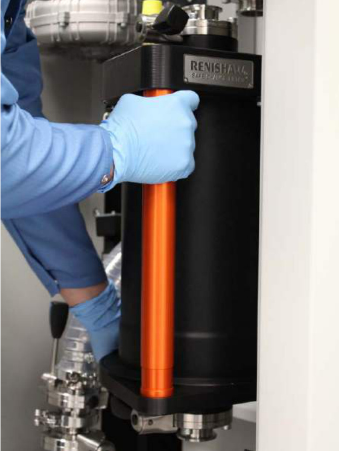  
Figure 194 Remove the large safe change filter assembly from the system  

WARNING: THE LARGE SAFE CHANGE FILTER ELEMENT CONTAINS FINE PARTICULATE WHICH MUST BE NEUTRALISED BY WETTING.  

WARNING: FAILURE TO SUBMERGE THE FILTER ELEMENT IN WATER BEFORE DISASSEMBLY MAY RESULT IN FIRE.  

13.	 The filter element contains fine particulate, which must be neutralised by wetting. The large safe change filter assembly must be filled with water before removing the filter element. This procedure must be followed regardless of the material type being processed.  

# WARNING: THE LARGE SAFE CHANGE FILTER ASSEMBLY WEIGHS APPROXIMATELY 30 KGWHEN FULL OF WATER. USE SUITABLE LIFTING EQUIPMENT TO SUPPORT THE WEIGHT OFTHE LARGE SAFE CHANGE FILTER ASSEMBLY IN AN UPRIGHT POSITION.  

14.	 Filling the large safe change filter assembly with water will increase its weight to approximately $3 0 ~ \mathsf { k g }$ . The increased weight and awkward shape of the large safe change filter assembly make it unsuitable for one person to manually handle. Use two people or suitable lifting equipment to support its weight upright. Renishaw recommends that this task is risk assessed according to the customers local rules before it is carried out.  

15.	 Renishaw recommend using a Renishaw silo changeover lift, part number A-5771-1000 fitted with a large safe change filter support bracket to move the large safe change filter assembly when full of water (Figure 195).  

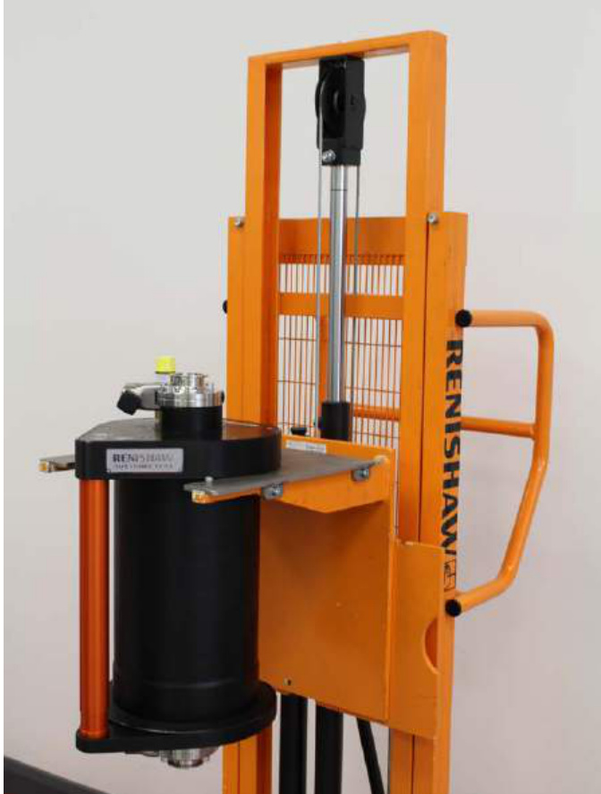  
Figure 195 Renishaw silo changeover lift fitted with large safe change filter assembly support bracket  

16. Ensure that the following precautions are put into practice:  

Ensure the correct PPE is being worn. Protective eye wear, full face respirator (conforming to EN143 Type $\mathsf { P 3 + A 1 }$ ), full length clothing, (made from non-static generating fabric such as cotton (avoid wool and man made fabrics) and avoid turn-ups or pockets that may trap powder, refer to NFPA 484 for details) and rubber or plastic gloves, are essential for this task.   
• Immediately clean-up any water spillages and mop the area clean and dry after use.   
17. Using suitable lifting equipment take the large safe change filter assembly to a water tap location with a hose pipe fitting.   
18. On the large safe change filter assembly, open the upper isolating valve (F1), insert a hose and fill with water until full (Figure 196). The full level is just below the top of the valve seal.  

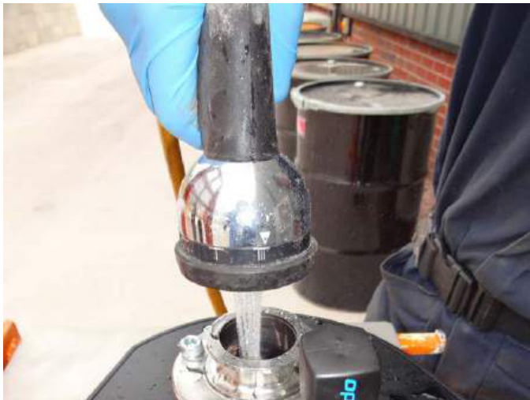  
Figure 196 Open valve (F1) and fill the filter chamber with water  

19.	 When the large safe change filter assembly is full, observe the water level, if the water level drops, add more water. Continue observing the water level and adding more water as necessary until the water level has stabilised just below the top of the valve seal. This may take several minutes.  

# WARNING: THE LARGE SAFE CHANGE FILTER ASSEMBLY MUST BE COMPLETELY FILLED WITH WATER TO NEUTRALISE THE FINE PARTICLES IN THE FILTER ELEMENT.  

20.	 After filling with water DO NOT close the upper isolating valve (F1).  

21.	 Leave the filter to soak in water for three to five minutes before disassembling it. DO NOT leave the filter to soak for more than five minutes. See Section 22.3.2.2 – "Large safe change filter element – remove".  

# 22.3.2.2 Large safe change filter element – remove  

The large safe change filter assembly must be disassembled after removal from the AM250/AM400 system and soaking in water for three to five minutes.  

WARNING: THE LARGE SAFE CHANGE FILTER ELEMENT CONTAINS FINE PARTICULATE WHICH MUST BE NEUTRALISED BY WETTING.  

WARNING: TO AVOID HYDROGEN GAS BUILD UP THE LARGE SAFE CHANGE FILTER ASSEMBLY MUST BE DISASSEMBLED AS SOON AS POSSIBLE AFTER WETTING.  

WARNING: DO NOT CLOSE THE UPPER ISOLATION VALVE (F1) AFTER WETTING.  

1. Locate the filter disposal drum and open it (Figure 197).  

  
Figure 197 Filter disposal drum  

2. If the drum is empty, fill it with enough water to submerge the filter element and a $5 \%$ solution of Hydra-Sol-MAG additive (Part number P-LU08-0004).   
3. Position the lifting equipment supporting the large safe change filter assembly above the drum.   
4. Open the lower isolating valve (F2) and empty the water from the large safe change filter assembly into the drum (Figure 198).   
5. When the water has drained from the large safe change filter assembly, close the lower isolating valve (F2).   
6. When the drum becomes full, ensure the contaminated water and filters are disposed of by suitably licenced waste contractors in accordance with the applicable local legislation.   
7. Using a 5 mm hex key, remove the six M5 bolts securing the top cover of the large safe filter assembly (Figure 199).  

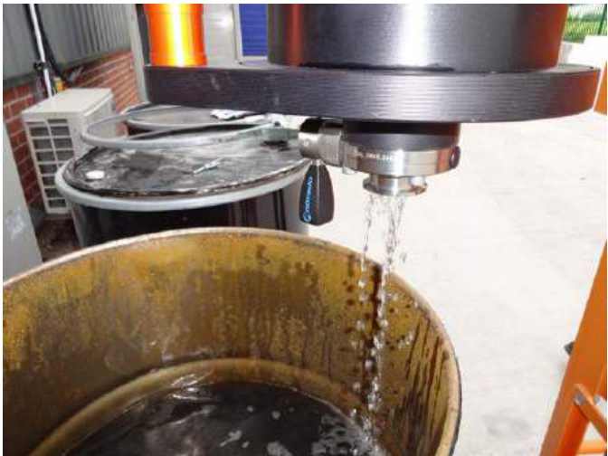  
Figure 198 Filter disposal drum  

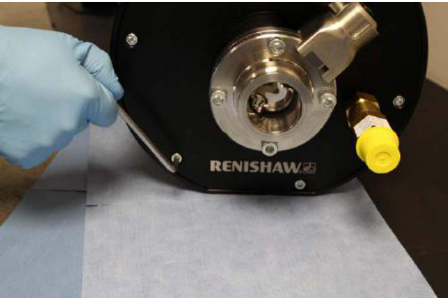  
Figure 199 Disassemble the large safe change filter assembly  

8.	 Lift the top cover off the large safe change filter assembly and remove the used filter element (Figure 200).  

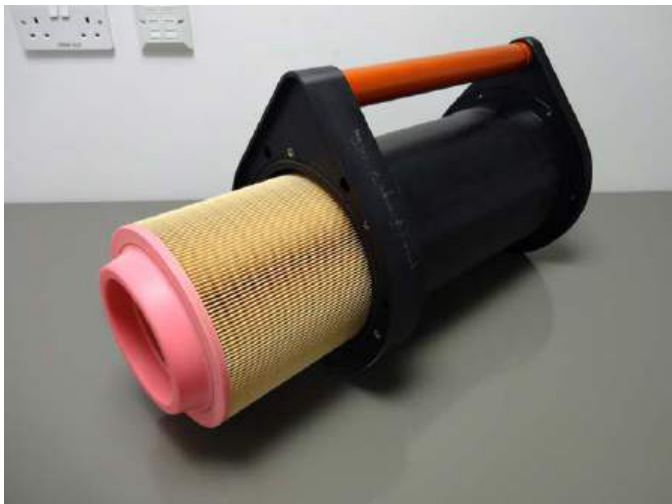  
Figure 200 Remove used filter element from large safe change filter assembly  

9. Dispose of the used filter element in the filter disposal drum and ensure it is fully submerged (Figure 201).  

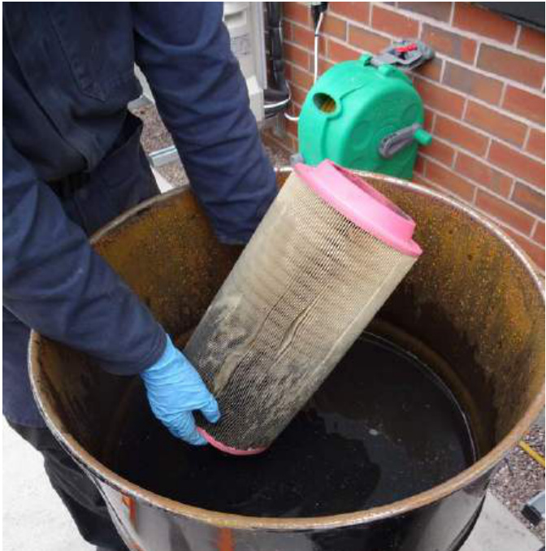  
Figure 201 Dispose of used filter element in the filter disposal drum  

10. Refit the lid to the drum. Ensure that the drum remains ventilated.  

11.	 Wipe the filter chamber and top cover inside and out with isopropanol alcohol and a disposable cloth to remove any residue.   
12. To reduce system down time, Renishaw recommend that a second filter assembly is purchased. Drying time will depend upon ambient humidity and temperature - it is important that moisture is not introduced into the AM250/AM400 system. Recommended drying times (following a dry wipe) is 4 hours for the large safe change filter chamber and top cover.   
13.	 At the top of the filter chamber check the o-ring seal. Ensure it is fitted correctly. Ensure there are no signs of damage or deformation that will affect its ability to seal. Replace the o-ring as necessary (Figure 202).  

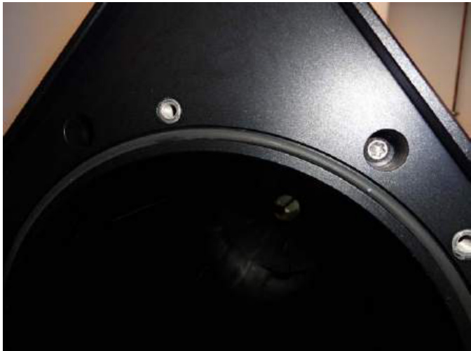  
Figure 202 Filter chamber o-ring seal  

14.	 Once the filter chamber is fully dry, install a new filter element from the filter kit (part number A-5778-6000), see Section 22.3.2.3 – Large safe change filter element – refit.  

22.3.2.3 Large safe change filter element – refit  

# WARNING: NEVER RESTART AN AM250/AM400 SYSTEM WITHOUT A FILTER INSTALLED. NEVER RESTART AN AM250/AM400 SYSTEM WITH A USED FILTER.  

1. Open the packaging and remove the filter element.  

# WARNING: ENSURE THAT THE OPEN END OF THE FILTER ELEMENT IS AT THE OPEN END OFTHE FILTER CHAMBER.  

2. Fit the filter element into the filter chamber. The closed end of the filter element must be at the   
closed end of the filter chamber.   
3. Ensure the filter element is centred in the filter chamber.   
4. Refit the top cover to the filter chamber.   
5. Refit the six M5 bolts securing the top cover to the filter chamber.  

# AM250/AM400 user guide  

6. Torque tighten the bolts to $2 0 \mathsf { N m }$ in a diagonal sequence, using a 5 mm hex key and a suitable torque wrench.   
7. On the large safe change filter assembly ensure the upper (F1) and lower (F2) isolating valves are closed, the handles will be at $9 0 ^ { \circ }$ to the direction of gas flow.   
8. Once the filter element has been replaced install the large safe change filter assembly into the AM250/AM400 system, see Section 22.3.2.4 – "Large safe change filter assembly – refit".  

# 22.3.2.4 Large safe change filter assembly – refit  

Note: Renishaw recommend fitting the front and rear powder overflow bottles before fitting the large safe change filter.  

After completing the procedure for fitting a new filter element to the filter chamber, the large safe change filter assembly must be fitted to the AM250/AM400 system.  

WARNING: DO NOT CLOSE THE LARGE SAFE CHANGE FILTER ISOLATING VALVES (F1 AND F2) WHILST THE AM250/AM400 SYSTEM IS RUNNING. ONLY CLOSE THE ISOLATING VALVES (F1 AND F2) WHEN THE AM250/AM400 SYSTEM IS PAUSED OR AFTER THE BUILD HAS COMPLETED.  

Note: The large safe change filter assembly weighs approximately $1 5 \mathsf { k g }$ when dry.  

1. Check that the large safe change filter sprung bracket is in the lower position. If it is not, push down on the sprung bracket until the plunger engages and secures the bracket in the lower position.   
2. Grip the large safe change filter handle with the right hand, support the weight at the base with the left hand, and carefully slide it on to the sprung support bracket in the AM250/AM400 system (Figure 203).   
3. Obtain the upper and lower quick-release clamps (L4 and L5) and centring rings removed during filter assembly removal.   
4. Check the two centring ring seals are free from damage and deformation. Replace the seals as necessary.   
5. Place one centring ring on the upper KF40 flange of the large safe change filter assembly.   
6. Operate the plunger and raise the large safe change filter assembly to engage the filter assembly KF40 flange with the system outlet KF40 flange.   
7. Fit the quick-release clamp (L4) over the KF flanges.   
8. Close the quick-release clamp (L4) collars and ensure that it fully secures the engaged flanges.   
9. Close the latch on the quick-release clamp (L4) to fully secure the quick-release clamp, (Figure 204).   
10. Place the second centring ring on to the KF flange of the system recirculation pipe.   
11.	 Lift the system recirculation pipe and bring its KF flange together with the lower KF flange of the large safe change filter isolation valve (F2).   
12. Support the system recirculation pipe and fit the quick-release clamp (L5) over the KF flanges.   
13. Close the quick-release clamp (L5) collars and ensure that it fully secures the engaged flanges.   
14. Close the latch on the quick-release clamp (L5) to fully secure the quick-release clamp.   
15. There are four isolation valves on the large safe change filter assembly, system outlet pipe (V4), system recirculation pipe (V5), large safe change filter upper isolation valve (F1) and large safe change filter lower isolation valve (F2). Check that all four valves are all in the closed position, (Figure 205).  

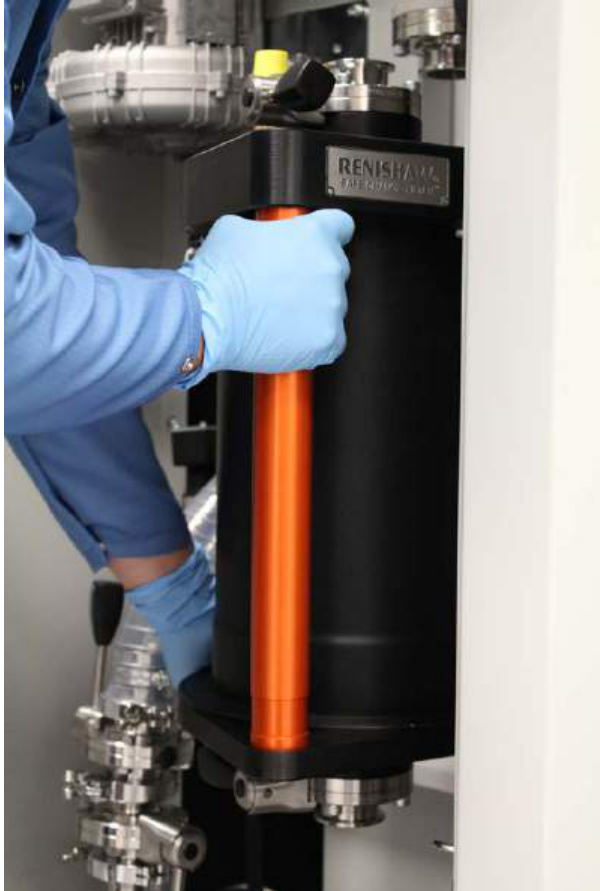  
Figure 203 Refit the large safe change filter assembly to the sprung support bracket  

  
Figure 204 Close the latch on the upper quick-release clamp (L4)  

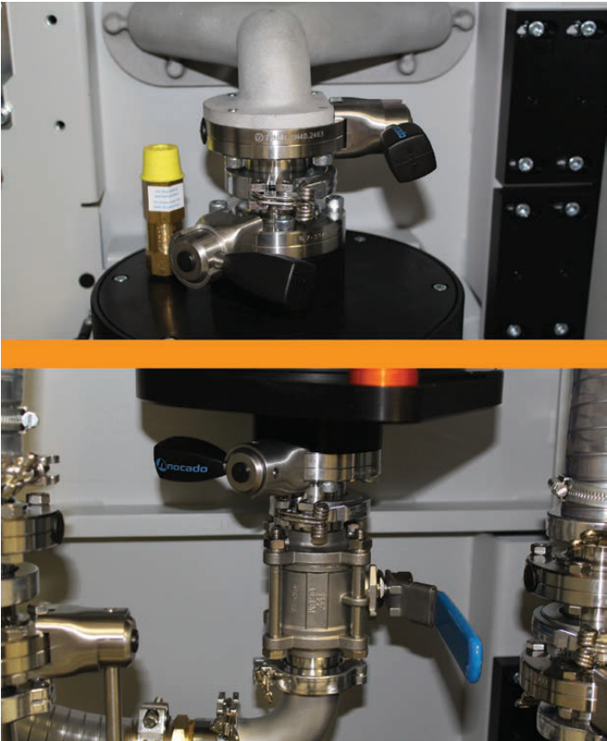  
Figure 205 Upper and lower isolating valves (F1, F2, V4 and V5) in the closed position  