Relevant national legislation and internal company policies will dictate normal minimum requirements for health and safety.  

WARNING: OPERATION OF THE RENISHAW AM250/AM400 IS ONLY PERMITTED BYOPERATORS WHO HAVE COMPLETED A RENISHAW APPROVED TRAINING PROGRAM.  

WARNING: DO NOT OVERRIDE SAFETY INTERLOCKS AND CIRCUITS.  

Caution: Use of controls or adjustments or performance of procedures other than those specified herein may result in hazardous radiation exposure.  

# 6.1 Basic safety measures  

Risk assessments for all foreseeable hazards must be carried out prior to operating the system.  

All end user companies must undertake a full risk assessment to establish the requirement for additional measures such as a COSHH or DSEAR assessment (or the local equivalent). This will subsequently inform the provision of correct personal protective equipment and site operating conditions and procedures for safe use of the equipment, storage and handling of raw materials and waste product. Any ancillary equipment must be selected giving due consideration to these requirements.  

Governing bodies will differ depending upon geographic location, and the appropriate governmental and regulatory bodies must be identified for each territory. Considerations need to include regulations governing:  

The use of lasers. Fine metallic powders below $4 5 \mu \mathrm { m }$ (0.002 in) diameter. The use, storage and monitoring of inert gas. • Small quantities of waste product including nano soot particles captured by the filter system.  

Review all data sheets (especially Safety Data Sheets) containing information about the metal powder(s) being used in the AM250/AM400 system.  

By following the correct procedures, it is possible for most powder handling to be executed under an inert atmosphere; however measures must be taken to minimise exposure to any airborne metallic powder produced during the handling and processing of builds by the use of the appropriate personal protective equipment and other equipment as the components are removed from the system.  

If in doubt about the health and safety issues and your legal obligations, our recommendation is to engage the services of a competent person.  

# 6.2 Safety signs  

Various safety signs are fixed to the AM250/AM400. These are described below.  

<html><body><table><tr><td> Safety sign</td><td>Description and location</td></tr><tr><td>WARNING</td><td>Warning - ISOLATE SUPPLY BEFORE OPENING COVER. AM250 and AM250 with PlusPac-3 stickers on each door of the electrical cabinet adjacent to the handles. AM400-4 stickers on each door of the electrical cabinetadjacent to the handles.</td></tr><tr><td></td><td>Warning -DANGER OF HOT SURFACES. Sticker near the oxygen sensor inside the recirculation cabinet.</td></tr><tr><td></td><td>WARNiNG-Danger of asphyxiation. Sticker near the argon gas exhaust on the rear of the system.</td></tr><tr><td></td><td>DANGER230V THISEQUIPMENTMUSTBEEARTHED AM250 and AM4o0 - Sticker on the back of the system adjacent to the power cable</td></tr><tr><td>RESIDUALVOLTAGEDONOTTOUCH TERMINALSFORGMINUTESAFTER DISCONNECTION ORIFCHARGE WARNING LIGHTISILLUMNATED 公</td><td>RESIDUALVOLTAGEDO NOTTOUCHTERMINALS FOR6 MINUTES AFTERDISCONNECTIONOR IFCHARGELIGHTIS ILLUMINATED AM400 - Sticker inside electrical cabinet on rear of system.</td></tr><tr><td>今 MAETELINSUVANTE POWER SOURCETOMACHINE WARNING BEFCRETOUCHING</td><td>MAINSFILTERREMAINSLIVEAFTERMACHINEIS ISOLATED- DISCONNECTPOWERSOURCETOMACHINEBEFORETOUCHING AM400 - Sticker inside electrical cabinet on right hand side of the system.</td></tr></table></body></html>  

<html><body><table><tr><td>Safety sign</td><td>Description and location Mandatory personal protective equipment label</td></tr><tr><td>m</td><td>AM400 - Sticker on left hand user access door on left hand side of the system.</td></tr><tr><td></td><td>Mandatory read the manual label AM400 - two stickers on system. one in front of system above display screen and one near the silo.</td></tr></table></body></html>  

# 6.3 General note on eye protection  

In normal use laser operation, the main chamber door is interlocked.  

Potential for Class 4 laser emissions.  

# WARNING: DO NOT OVERRIDE SAFETY INTERLOCKS.  

During any adjustment or maintenance with the laser on and the chamber door open, laser eyewear MUST BE WORN, as specified in EN 207 (EN 58215) which provides protection against laser beams with wavelengths of $1 0 0 0 \mu \mathrm { m }$ to $1 1 0 0 \mu \mathrm { m }$ . Failure to do so may result in permanent irreparable eye damage.  

Any maintenance MUST be carried out by a suitably qualified person.  

WARNING: ON AM250 FITTED WITH PLUSPAC AND AM400 THERE IS AN LED LIGHTASSEMBLY FITTED TO THE TOP OF THE BUILD CHAMBER. DO NOT STARE AT THE LED LIGHTASSEMBLY AS IT MAY BE HARMFUL TO THE EYES.  

# 7 Laser warning labelling  

In order to comply with international standards, the Renishaw AM250/AM400 carries various safety warning labels regarding the emission of laser light. These labels form part of the safety information and it is recommended that users regularly (we suggest weekly) check the condition and presence of the labels in the locations shown in the following images. Many labels are generic and fitted to both AM250 and AM400, but some labels are specific to AM250 and some are specific to AM400.  

Replacement warning labels can be ordered from Renishaw.  

Laser power is classified the higher the class number, the greater the laser radiation hazard. Refer to international standard IEC 60825 for details.  

The Renishaw AM250/AM400 in normal operation with the build chamber door closed, is classified as Class 1 according to the Standard EN 60825-1, edition: 2014, Safety of Laser Equipment – Part 1.  

A summary of the standard is as follows:  

<html><body><table><tr><td>Laser class</td><td>Definition</td></tr><tr><td>Class 1</td><td>Output power is below the level at which it is believed eye damage will occur. May contain laser systems of a higher Class with adequate engineering control measures to ensure that access to the beam is not reasonably likely.</td></tr><tr><td>Class 1M</td><td>Can be harmful to the eye if the beam is viewed using magnifying optical instruments.</td></tr><tr><td>Class 2</td><td>More powerful than class 1, natural aversion (blink response) should terminate the eye exposure before eye damage can occur. Repeated, deliberate exposure to the laser beam may not be safe.</td></tr><tr><td>Class 2M</td><td>Similar to a Class 2 laser product. However, these products can be harmful to the eye if the beam is viewed using magnifying optical instruments or for long periods of time.</td></tr><tr><td>Class 3R</td><td>Users must avoid viewing the beam directly. Although the risk of eye injury is low the power exceeds the maximum permissible exposure for accidental viewing and can potentially cause eye injuries.</td></tr><tr><td>Class 3B</td><td>Class 3B lasers may have sufficient power to cause an eye injury, both from the direct beam and from reflections.</td></tr><tr><td>Class 4</td><td>Class 4 lasers are capable of causing injury to both the eye and skin and may also presenta fire hazard.</td></tr></table></body></html>  

# 7.1 AM250 laser warning labels  

On AM250 systems supplied prior to 2016 – Class 2 General classification label inside the chamber (Figure 3). To reference the targeting laser, this is not affected by the door interlock system.  

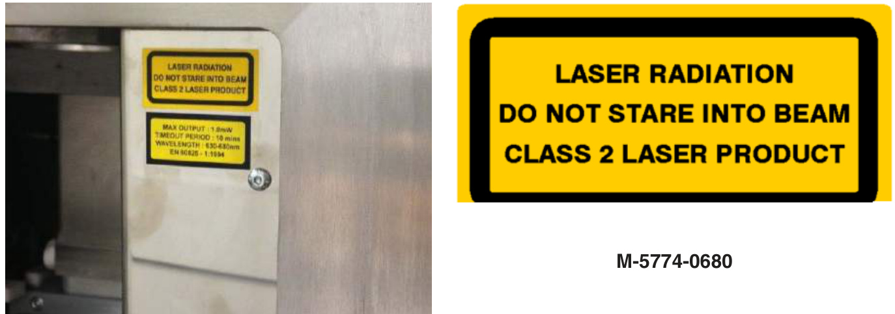  
Figure 3 General classification label  

On AM250 systems supplied from 2016 and retrofitted to systems supplied before 2016 – Class 3R Custom laser specific label positioned inside the chamber on the right hand side recoater cover (Figure 4).  

  
Figure 4 General classification label  

Class 2 Custom laser specific label detailing the Class 2 targeting laser positioned directly below the Class 2 label on the right hand side recoater cover inside the chamber (Figure 5).  

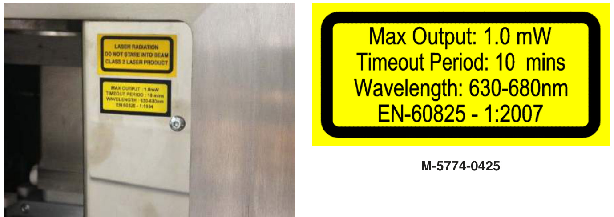  
Figure 5 Laser specific label  

Laser warning triangle to be displayed on the top door (Figure 6).  

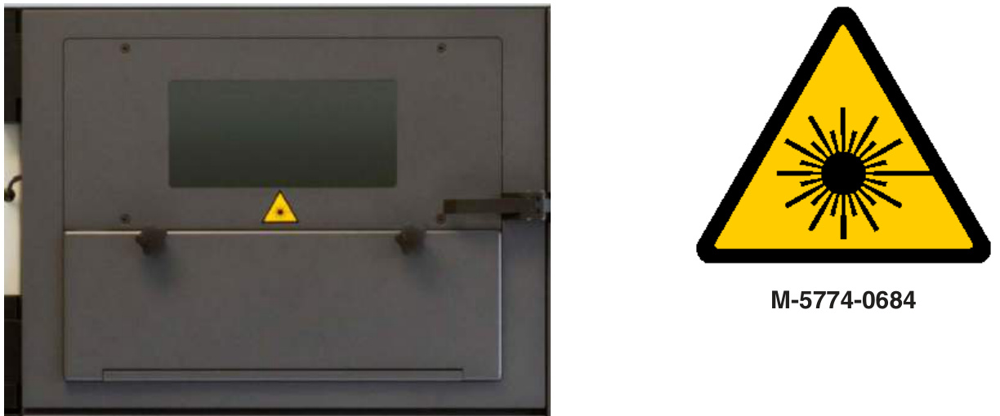  
Figure 6 Laser warning triangle  

Class 4 Interlocked housing label to be added to the header, placed in line with the outer edge of the top door (Figure 7).  

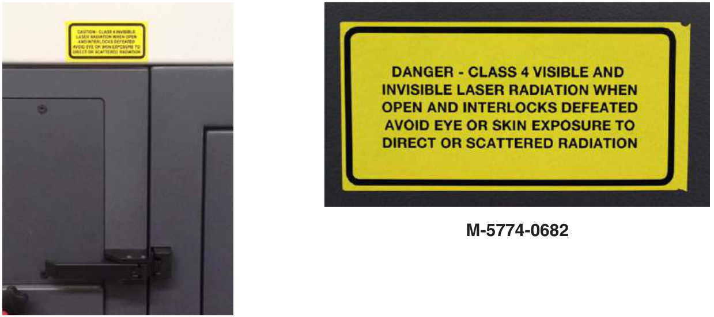  
Figure 7 Interlocked housing label  

Class 1 general classification label, during normal operation with the system door closed. Fitted to the right of the serial plate, aligned with the bottom edge (Figure 8).  

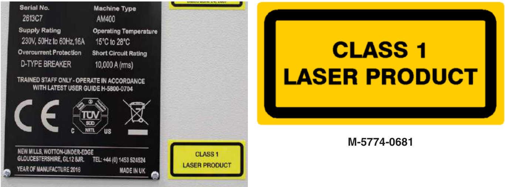  
Figure 8 General classification label  

Label detailing the conformance with 21 CFR 1040.10 and 1040.11. Fitted adjacent to rear serial plate aligned with tope edge (Figure 9).  

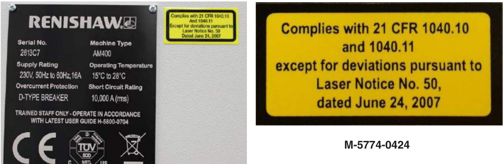  
Figure 9 Compliance label  

Class 4 Protective housing labels fitted to the right of the silo. Must be placed above the level of the silo flange to allow it to be seen before or after removing silo removal (Figure 10).  

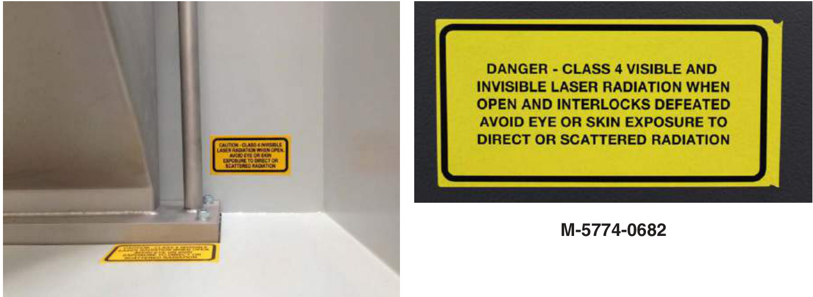  
Figure 10 Protective housing label  

Class 4 Protective housing labels, displayed in line with the right edge of the silo seal plate (Figure 11).  

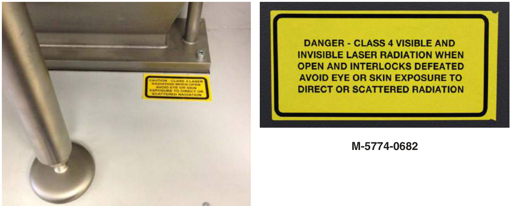  
Figure 11 Protective housing label  

Class 4 Protective housing labels, fitted in between the two fans closest to the front of the system, directly on the top cover (Figure 12).  

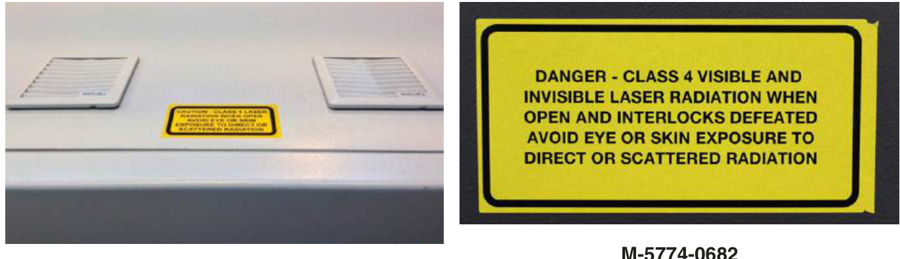  
Figure 12 Protective housing label  

Class 4 Protective housing labels, fitted by the light aperture under the top cover (Figure 13). In clear line of sight avoiding any cabling.  

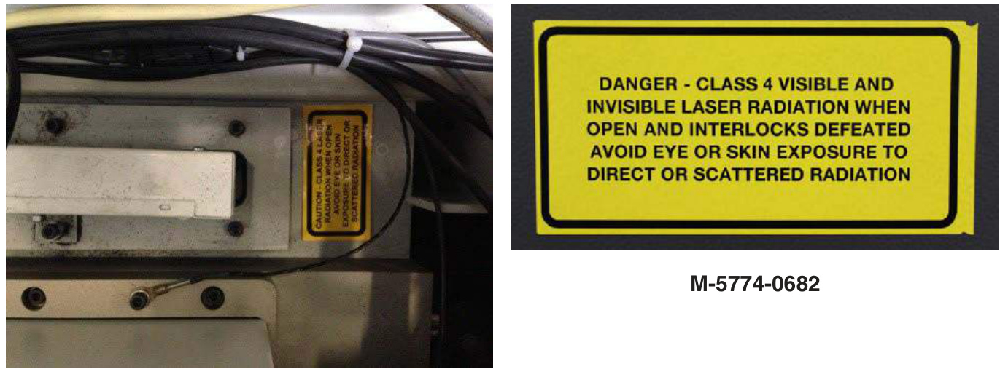  
Figure 13 Protective housing label  

# 7.2 AM400 laser warning labels  

Class 3R General classification label inside the chamber (Figure 14). To reference the targeting laser, this is not affected by the door interlock system.  

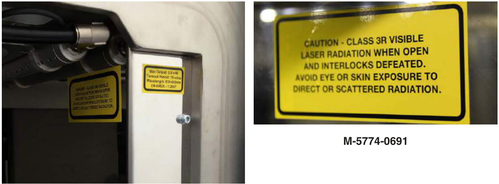  
Figure 14 Protective housing label  

Class 3R Custom laser specific label detailing the Class 3R targeting laser positioned directly adjacent to the Class 3R label on the right hand side recoater cover inside the chamber (Figure 15).  

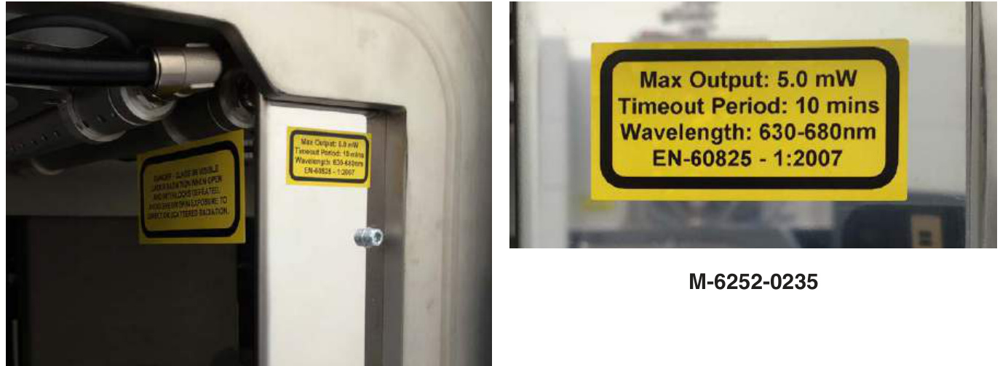  
Figure 15 Protective housing label  

Laser warning triangle to be displayed on the top door (Figure 16).  

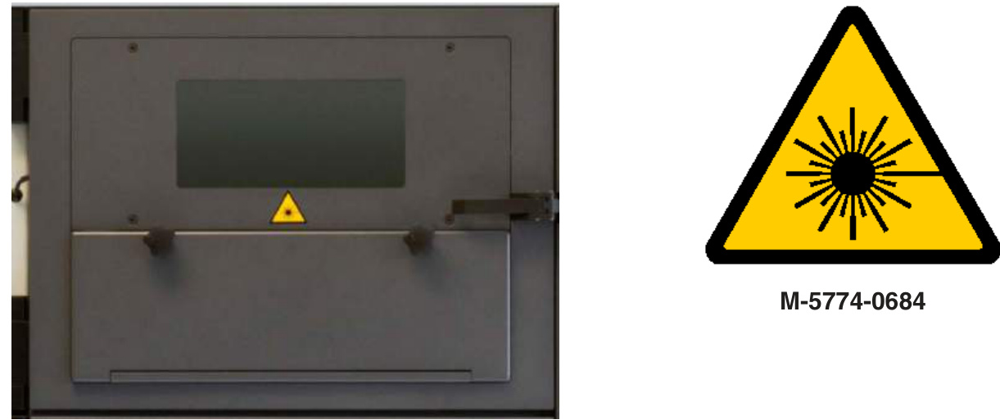  
Figure 16 Laser warning triangle  

Class 4 Interlocked housing label to be added to the right hand door surround, placed in line with the top edge of the build chamber door (Figure 17).  

  
Figure 17 Interlocked housing label  

Class 1 general classification label, during normal operation with the system door closed. Fitted to the right of the serial plate, aligned with the bottom edge (Figure 18).  

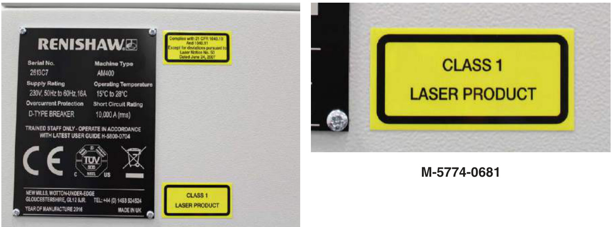  
Figure 18 General classification label  

Label detailing the conformance with 21 CFR 1040.10 and 1040.11. Fitted adjacent to rear serial plate aligned with tope edge (Figure 19).  

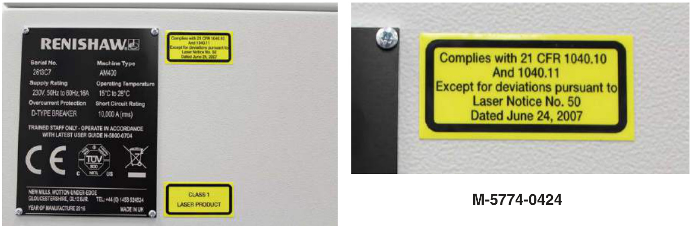  
Figure 19 Compliance label  

Class 4 Protective housing labels fitted to the right of the silo. Must be placed above the level of the silo flange to allow it to be seen before or after removing silo removal (Figure 20).  

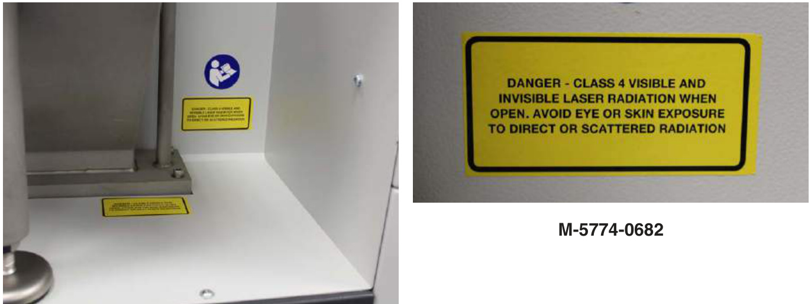  
Figure 20 Protective housing label  

Class 4 Protective housing labels, displayed in line with the right edge of the silo seal plate (Figure 21).  

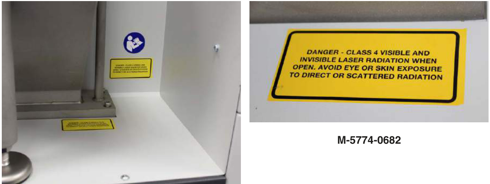  
Figure 21 Protective housing label  

Class 4 Protective housing labels, fitted on the left hand end of the optical module, underneath the top cover (Figure 22).  

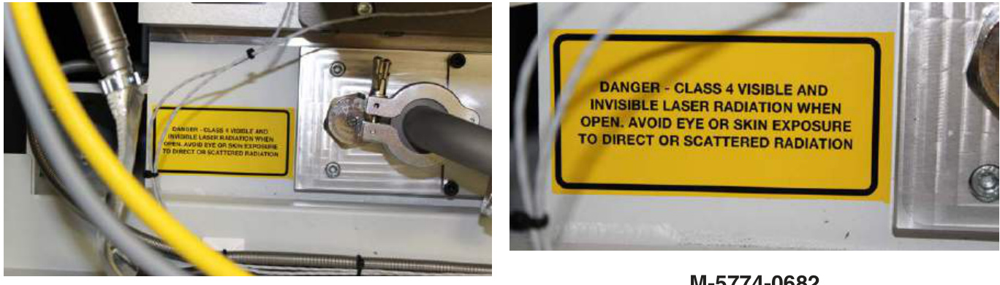  
Figure 22 Protective housing label  

M-5774-0682  

Class 4 Protective housing label, fitted to the top of the of the optical module under the top cover (Figure 23).  

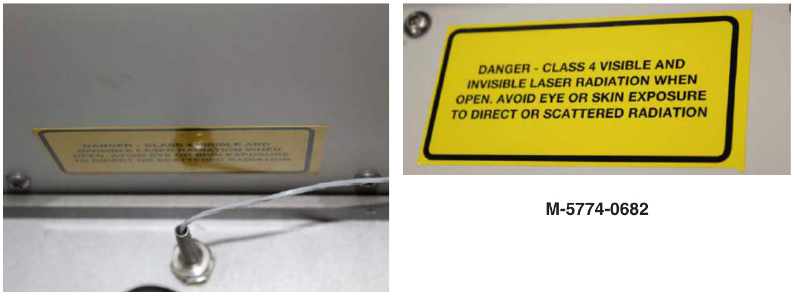  
Figure 23 Optical module housing label  

Class 4 Protective housing label, fitted to the end of the of the optical module under the top cover (Figure 24).  

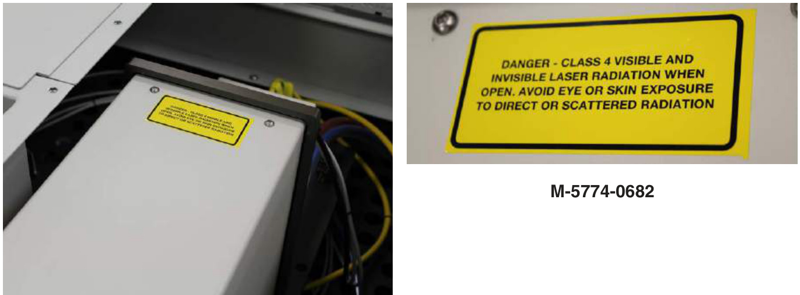  
Figure 24 Optical module housing label  

Class 4 Protective housing label, fitted to the lower end of the of the optical module under the top cover (Figure 25)  

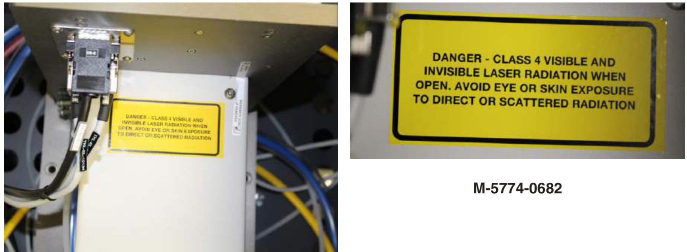  
Figure 25 Optical module housing label  