# 23 Preparing the build chamber  

# 23.1 Build plate requirements  

The build plate is the surface upon which the build process takes place. It is covered by progressive layers of metal powder which are selectively melted and fused to the adjacent created layer in order to create a homogeneous solid component.  

It is a sacrificial consumable and can be re-machined and used again, providing the tolerances detailed in Appendix A of this manual are adhered to. Replacements can be purchased from your local Renishaw office.  

The substrate plate is secured onto the top surface of the z-axis table housed in the bottom chamber using M5 cap screws. It is accessed via the upper process chamber door of the AM250/AM400 system.  

# CAUTION: DO NOT USE ZINC PASSIVATED SCREWS TO SECURE THE BUILD PLATE TO THE Z-AXIS. THERE IS A POSSIBILITY OF ZINC FUMES BEING EMITTED AND THE SCREWS BECOMING BRITTLE WHEN THE BUILD PLATE IS HEATED BEFORE THE BUILD COMMENCES.  

Each material requires a compatible substrate material. Ideally all plates should be indelibly marked (such as engraved or stamped) on the edge of the plate to indicate their material composition.  

# 23.2 Homing the wiper  

Before installing the substrate, first ensure that the wiper is in the home position at the back of the AM250/AM400 system. To do this, first close the system door, press the blue reset button on the front of the system and then select the Find Wiper Home home button (Figure 206):  

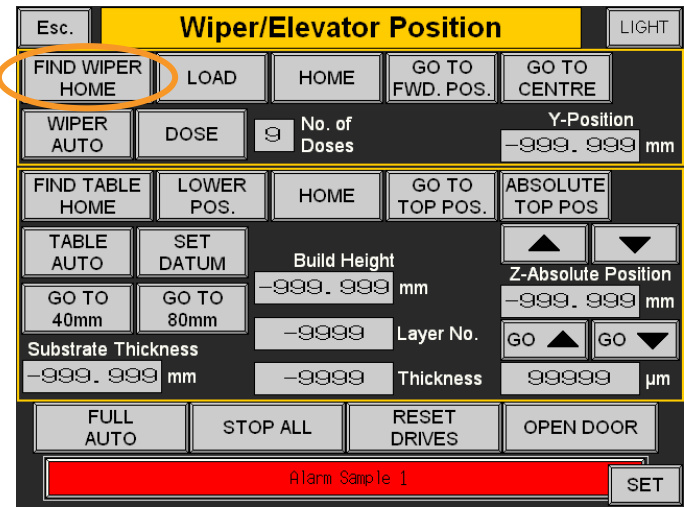  
Figure 206 Select Find wiper home  

# $>$ Wiper/Elevator Control $>$ Find Wiper Home  

Once the wiper is homed, the button will turn red and the Y position readout will be stable.  

# 23.3 Installing the build substrate  

Follow the process described in Section 17 to open the system door.  

Select a build substrate in a suitable material for the powder being processed.  

# WARNING: BUILD SUBSTRATES CAN BE HEAVY. A STAINLESS STEEL SUBSTRATE WEIGHS 7.5 KG, TITANIUM 4 KG AND ALUMINIUM 3 KG. HANDLE SUBSTRATES CAREFULLY TO AVOID INJURY AND DAMAGE TO THE SUBSTRATE.  

Clean-down the substrate with isopropanol to remove any machining fluid residue, taking care to ensure that the surface is completely dry (Figure 207).  

WARNING: ALWAYS CLEAN AWAY ISOPROPANOL RESIDUES TO AVOID CHEMICAL REACTIONS WITH CARBON STEEL.  

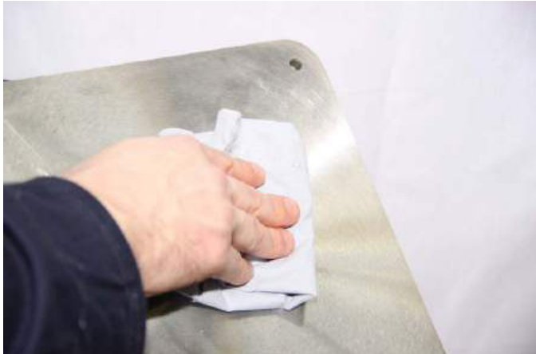  
Figure 207 Wipe with IPA  

Using an appropriate measuring device such as a micrometer or digital calliper, measure the substrate at each corner (Figure 208).  

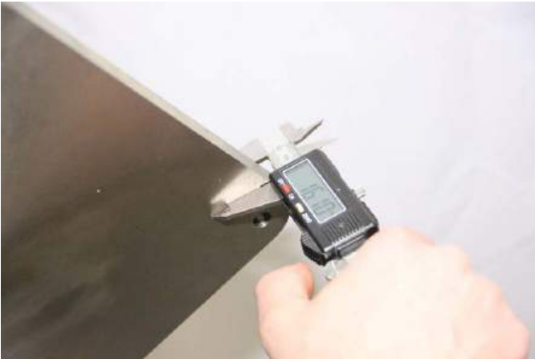  
Figure 208 Measure thickness  

Take an average reading and ensure that the mean reading does not deviate more than $0 . 0 5 \mathsf { m m }$ (0.002 in) between the highest and lowest measurements. If in doubt, see Section 36 Appendix A " AM250/AM400 build plate drawings".  

From the AM250/AM400 system control interface main menu select the following:  

# $>$ Wiper/Elevator Control  

Select the value for the Substrate Thickness and input the average of the measured substrate thickness using the number pad, and then press Enter (Figure 209).  

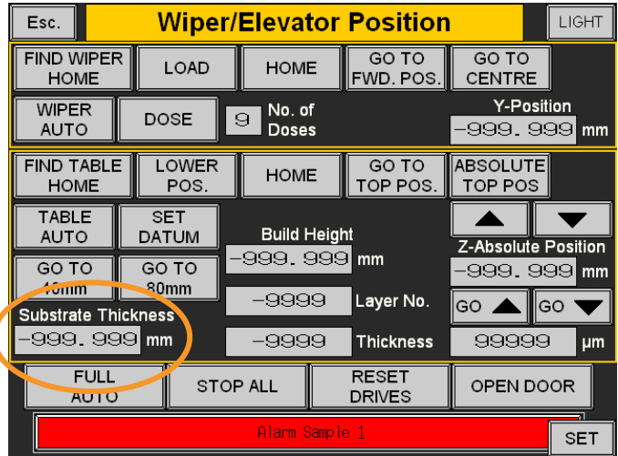  
Figure 209 Enter average of measured thickness  

Ensure that the wiper is at the home position at the rear of the platform, then place the substrate on the platform with the counter-bored holes facing upwards (Figure 210).  

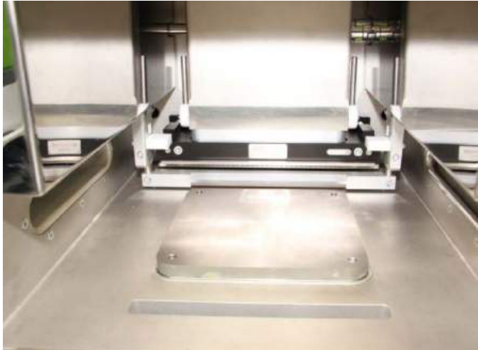  
Figure 210 Place build plate on platform  

Caution: Ensure a build plate is fitted as building directly on to the system substrate will damage the z-axis of the AM250/AM400 system.  

Caution: Although the build plate can be installed in any of four positions, the front of the build plate is marked with a shallow blind hole in the centre of the front edge, (Figure 211).  

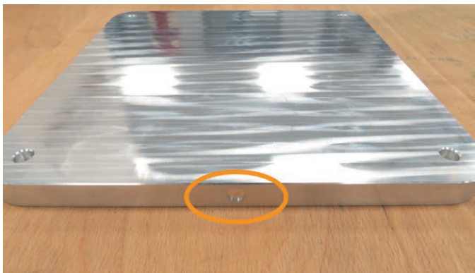  
Figure 211 Build plate front edge identification  

# WARNING: DO NOT USE ZINC PASSIVATED SCREWS TO SECURE THE BUILD PLATE TO THE Z-AXIS. THERE IS A POSSIBILITY OF ZINC FUMES BEING EMITTED AND THE SCREWS BECOMING BRITTLE WHEN THE BUILD PLATE IS HEATED BEFORE THE BUILD COMMENCES.  

Insert the four M5 bolts and tighten to between 3 Nm and 5 Nm (2.2 lbf/ft and 3.7 lbf/ft) using a $4 \ : \mathrm { m m }$ hexagon key (Figure 212) and a suitable torque wrench. Tighten opposing corners in pairs.  

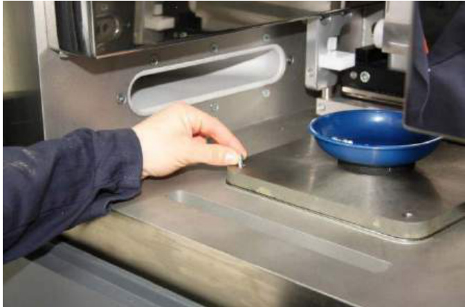  
Figure 212 Insert and tighten the four bolts  

Close the door and reset the Emergency Stop operated error by pressing the blue reset button (Figure 213).  

  
Figure 213 Press blue reset button  

Still in the Wiper Elevator Control menu, select Find Wiper Home then select Go To Top Position (Figure 214).  

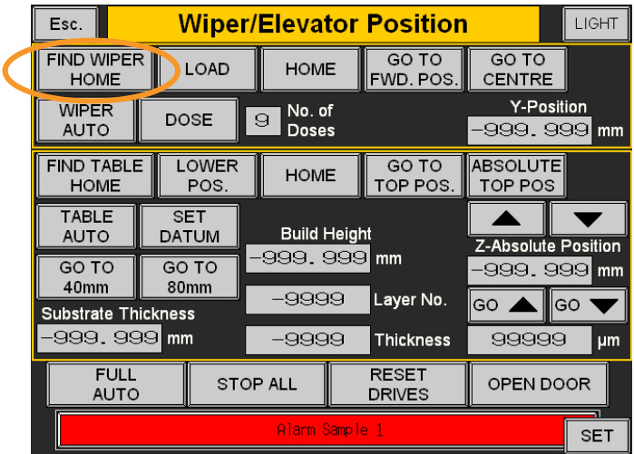  
Figure 214 Press Find wiper home then Go to top pos.  

The build plate installation is now complete.  

# 24 Installing and setting the wiper blade  

# 24.1 Installing the wiper blade  

The wiper housing is made from two pieces of aluminium and is secured together with M4 cap screws and requires an M3 hexagon key for disassembly and reassembly. Removing the cap screws along the entire length of the aluminium housing allows the old blade insert to be rotated to a clean area prior to refitting the cap screws and tightening. Alternatively, replace the wiper material if it is too badly damaged to continue. A replacement wiper insert is available from your local Renishaw office.  

Description: Silicone wiper blade  

Part number: M-5774-0886  

Wiper blades may be reused several times by rotating the silicone rubber, however if damaged it is prudent to replace it after every build.  

To replace the wiper blade insert, first measure a length of silicone wiper blade to $2 5 9 \ : \mathrm { m m } \pm 1 \ : \mathrm { m m }$ (10 5⁄32 in to 10 15⁄64 in) using a rule (Figure 215).  

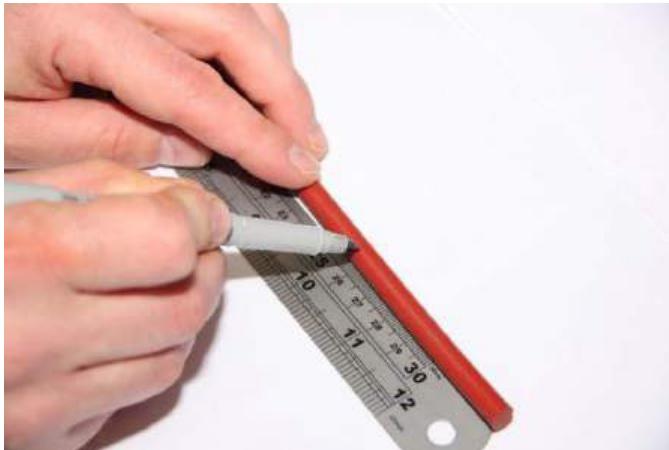  
Figure 215 Measurement of silicone rubber  

Cut the rubber using a pneumatic pipe cutter or scalpel (Figure 216).  

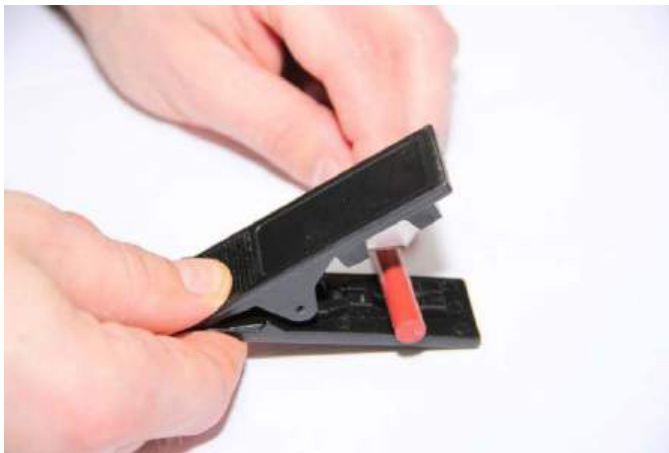  
Figure 216 Cut with pipe cutter  

Gauge the cut length using the blade assembly – it should just fit in the chamfer. If it is too long, re-cut it (Figure 217). Note that an oversize insert can cause distortion and poor powder surface, leading to failed builds.  

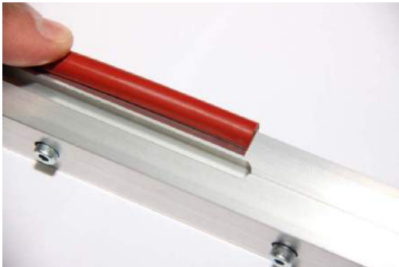  
Figure 217 Gauge length using blade assembly  

Loosen the five M4 bolts of the wiper blade housing using a 3 mm hexagon key (Figure 218).  

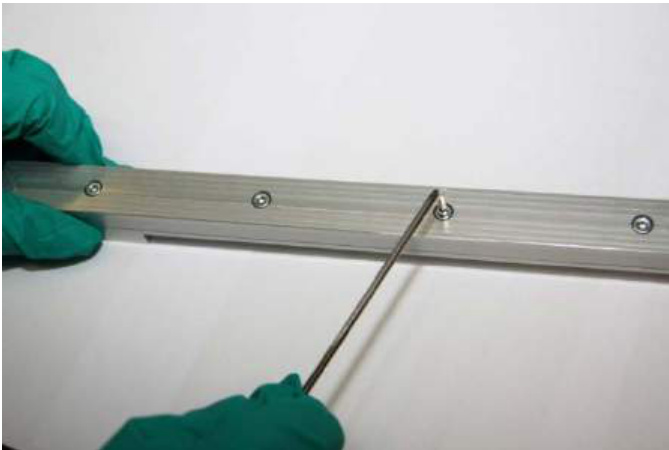  
Figure 218 Loosening of bolts in wiper blade retainer  

Unscrew until the heads are proud, do not remove them completely (Figure 219).  

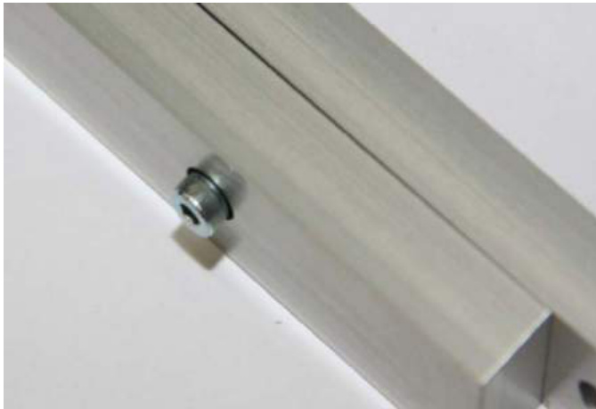  
Figure 219 Unscrew until head is proud  

Insert the cut length of the silicone wiper blade (Figure 220).  

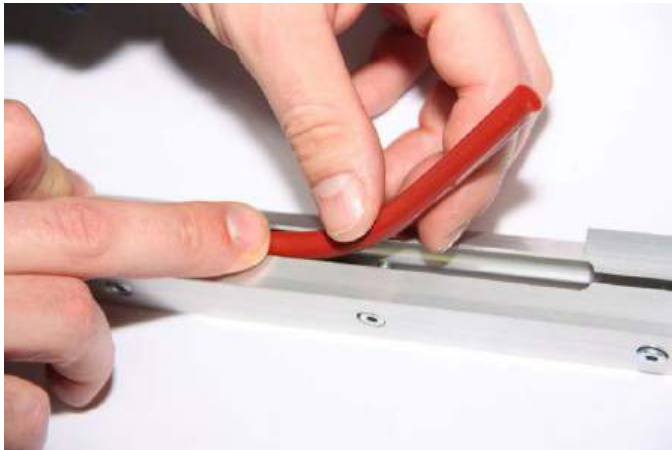  
Figure 220 Insertion of rubber silicone into the wiper blade retainer  

Check the gap left at both ends of the wiper – it should not pass the start of the radius arrowed (Figures 221 and Figure 222).  

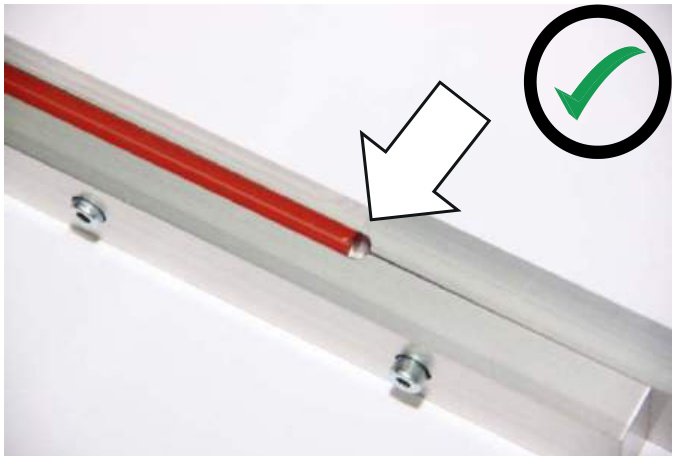  
Figure 221 Correctly align with chamfer  

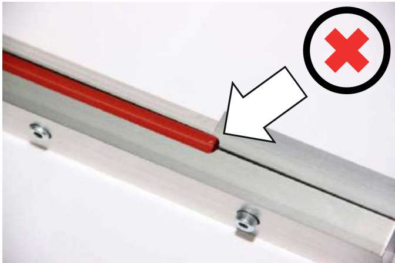  
Figure 222 Incorrectly – past the chamfer  

Using a flat surface, such as a surface table, press down firmly on the reverse side of the wiper housing and tighten from the centre the five M4 retaining bolts using a $3 \mathsf { m m }$ hexagon key. Do not overtighten $- 2 N m$ (1.5 lbf/ft) maximum (Figure 223).  

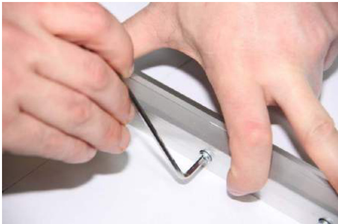  
Figure 223 Tightening of bolts to clamp silicone rubber into the wiper blade retainer  

Ensure even pressure across the blade to prevent deformation of the silicone. This is helped by laying the wiper on a flat surface and applying slight pressure.  

# 24.2 Setting up the wiper  

Ensure that the substrate thickness has been entered and that the substrate is at the top position. Select the following (Figure 224 and Figure 225):  

# Wiper/Elevator Control $>$ Go To Top Pos  

Close the door and reset the emergency stop.  

Use the Go To Centre button on the Wiper/Elevator Position page of the HMI touch screen to send the wiper to the centre position (Figure 224 and 225):  

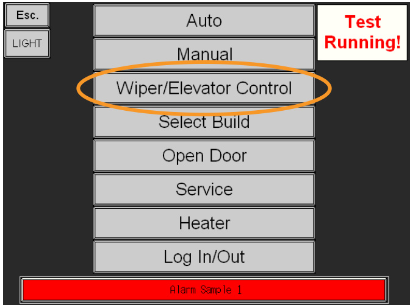  
Figure 224 Wiper/Elevator control  

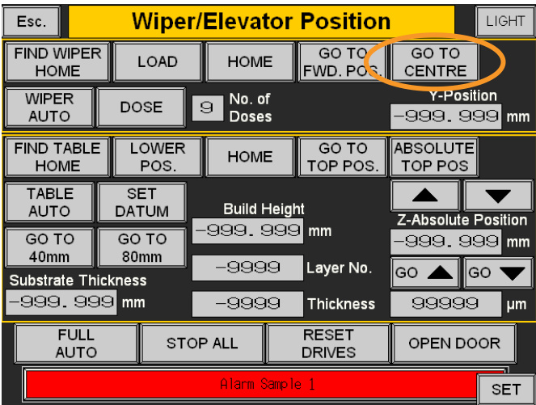  
Figure 225 Go to centre  

# Wiper Elevator Control $>$ GO TO CENTRE  

Open the door as described in section 18.1.  

Install the wiper assembly into the system using the two M6 cap screws and an M5 hexagon key (Figure 226).  

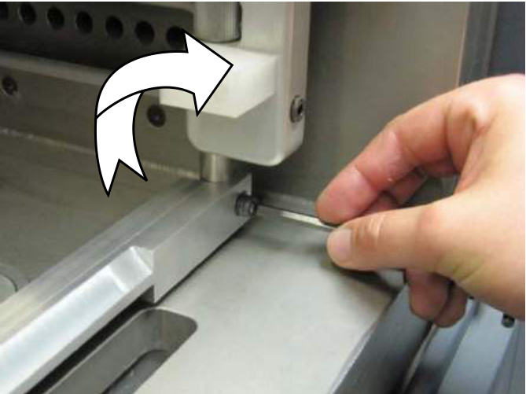  
Figure 226 Securing the wiper  

Once the wiper assembly is secured in place, loosen the pinch bolt (Figure 227) on the driven uprights to allow adjustment in the Z height of the wiper blade assembly (Figure 228).  

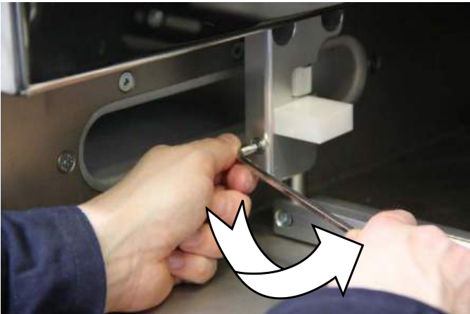  
Figure 227 Loosen the pinch bolt  

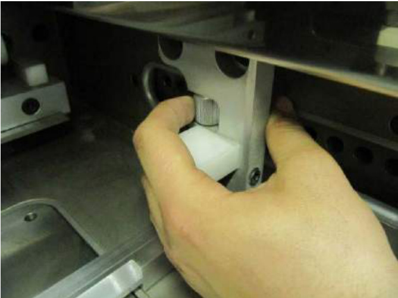  
Figure 228 Thumb screw adjustment  

Turn the thumb screw clockwise to raise the wiper blade, and anti-clockwise to lower the wiper blade.  

Raise the wiper blade allowing sufficient space to place a $0 . 0 5 ~ \mathsf { m m }$ (0.002 in) feeler gauge under the wiper blade (Figure 229).  

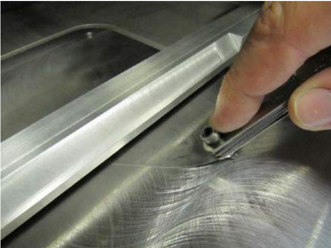  
Figure 229 Feeler gauge used to set wiper blade z height  

Lower the wiper blade and use the feeler gauge to ensure an even $0 . 0 5 \mathsf { m m }$ (0.002 in) gap between the wiper and the substrate – measure in at least three places.  

There should be even pressure and resistance on the feeler gauge across the width of the substrate.  

Tighten the pinch bolts on the wiper arm using a 5 mm hexagon key (Figure 230).  

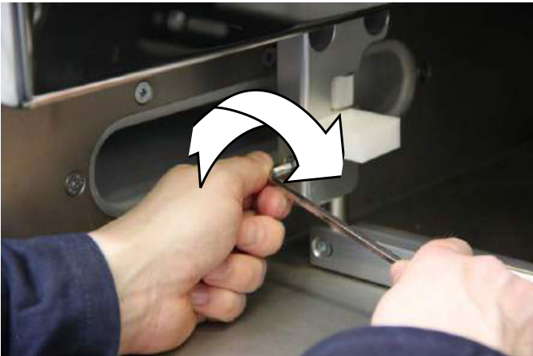  
Figure 230 Tighten the upper bolts on wiper  

After setting up the wiper blade, close the chamber door, and reset the alarm.  

Caution: The wiper must be setup $( 0 . 0 5 \mathsf { m m }$ (0.002 in) above the substrate) before dosing or moving to home position. Failure to set the height can result in the wiper assembly hitting the doser, and subsequent damage.  

To set the dosing level to 3 in the control window, enter 3 into No. of Doses (Figure 231):  

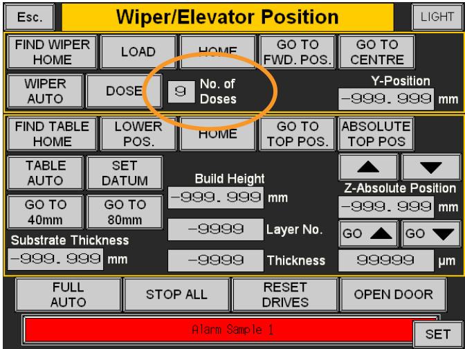  
Figure 231 Set No of doses to 3, dose, then go to FWD POS  

# Wiper/Elevator Control $>$ No of Doses  

Dose the powder (Figure 231):  

# Wiper/Elevator Control $>$ Dose  

Send the wiper to the forward position (Figure 231):  

# Wiper/Elevator Control $>$ GO TO FWD. POS.  

The first powder layer should be an even spread across the whole of the substrate, and the substrate should still be visible, whilst all four bolt holes are completely full of powder (Figure 232).  

If the layer is not even – repeat the setup steps and check again.  

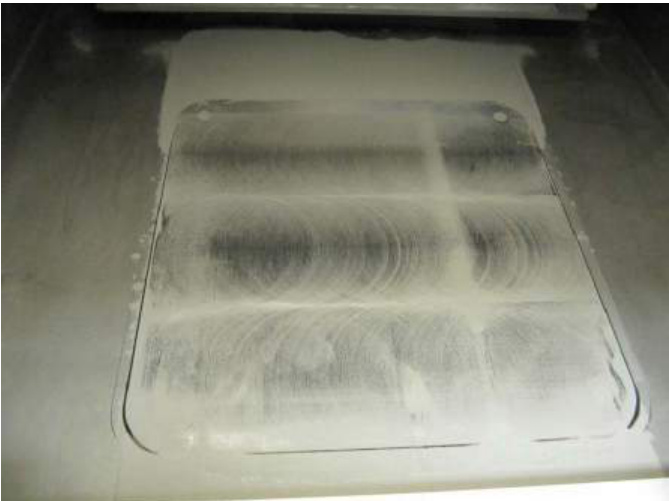  
Figure 232 Ensure a thin and even distribution  