# 25.1 Heat soak procedure  

The use of the heated build plate is guided by the choice of materials. It can aid material flow and assist the processing of some materials. Above $7 0 ^ { \circ } \mathsf { C }$ ( $1 5 8 ^ { \circ } F )$ the door remains interlocked and does not allow the main process chamber door to be opened.  

# WARNING: IT IS POSSIBLE TO ACCESS THE CHAMBER VIA THE GLOVE BOX WHILST THE HEATER IS ON. ALWAYS CHECK THE CHAMBER TEMPERATURE VIA THE HMI TOUCH SCREEN BEFORE OPENING THE GLOVE BOX DOOR AND PROCEED WITH CAUTION.  

Login at the delegated user level and select the heater from the main menu on the control interface (Figure 233). Enter the required material temperature (Figure 234). Always refer to the material file supplied with your metal powder for the most accurate temperature to suit your application.  

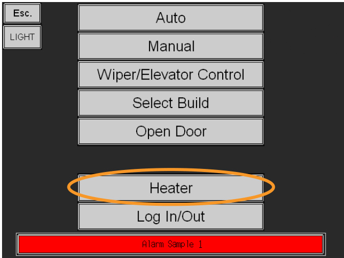  
Figure 233 Select heater  

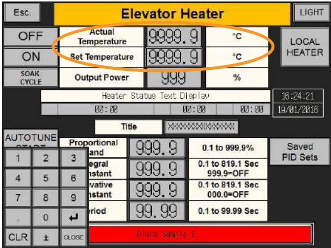  
Figure 234 Enter temperature  

# Heater $>$ Set Temperature $>$ Enter the required material temperature  

Always refer to the material file supplied with your metal powder for the most accurate temperature to suit your application. If the material file is not available or you would like further advice contact your local Renishaw office, www.renishaw.com/contact  

Begin the heater soak cycle by selecting the following on the control interface (Figure 235):  

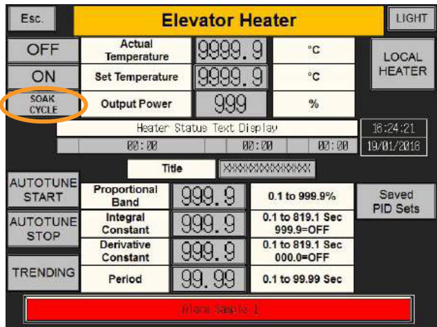  
Figure 235 Press Soak Cycle  

# Heater $>$ Soak Cycle  

The heat soak process lasts for 40 minutes – this is to allow an even temperature throughout the build chamber.  

Caution: Do not attempt to drive the z-axis until the heat soak process is complete. Always allow 30 minutes for the system temperature to stabilise before driving the z-axis if the heat soak process is aborted.  

# 25.2 Heater tuning  

# 25.2.1 Summary  

The AM250/AM400 is fitted with a heated build plate, this will be factory set for optimum performance. If a significantly thicker build plate is used or the Heater May Require Tuning alarm message appears there is an Autotune function which will determine the settings required for the best heater response. (Proportional Band, Integral Constant and Derivative Constant).  

Note: This requires level 2 access with software version 2.39 or greater, and level 3 access with earlier software versions.  

Heater setup must be performed under an inert atmosphere and with the build plate installed, as both will affect the thermal characteristics.  

# 25.2.2 System preparation  

Install a build plate and setup the system, ensure there is no powder in the chamber.  

Set the user oxygen threshold to 1000 parts per million and start the Semi Automatic Chamber Preparation with vacuum.  

Leave the system to prepare.  

# 25.2.3 Automatic tuning  

Select Heater (Figure 236).  

  
Figure 236 Select heater  

Adjust the set Set Temperature to $1 0 0 ^ { \circ } \mathsf { C }$ .  

Ensure the Period is 1 second.  

Press On followed by Autotune Start (Figure 237).  

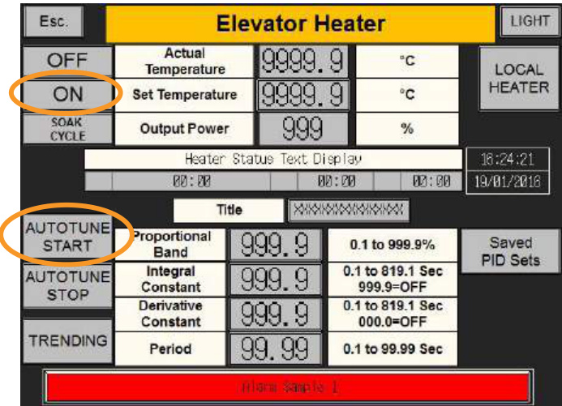  
Figure 237 Set temperature to $1 0 0 ^ { \circ } \mathsf { C }$ , period 1, On, Autotune Start  

The progress can be monitored by pressing Trending button to show the graph (Figure 238) which displays set-point (SP), present value (PV) and $\%$ demand (MV). The auto tune process will take approximately 10 to 20 minutes.  

On completion of the auto tune process record the new Proportional Band, Integral Constant, and Derivative Constant will be saved.  

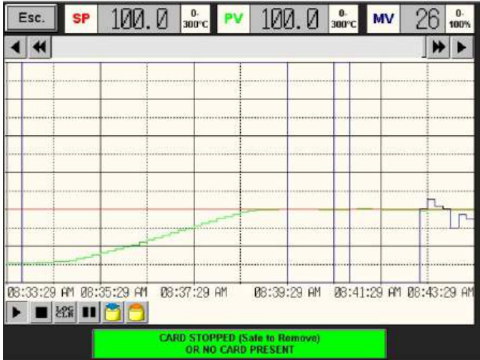  
Figure 238 Temperature and demand graph  

Leave for 40 minutes to settle, once stable the demand (MV) should only fluctuate slightly (Figure 239).  

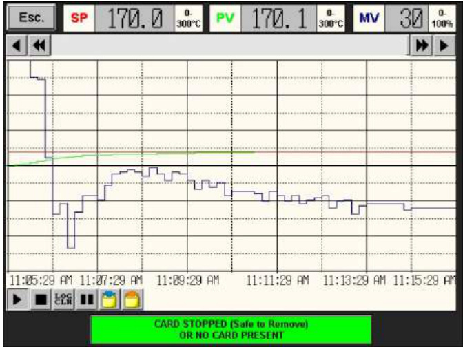  
Figure 239 Stable temperature and demand  

If the heater demand (MV) oscillates and does not quickly settle it may be necessary to repeat the process a 2nd or 3rd time (Figure 240 and Figure 241).  

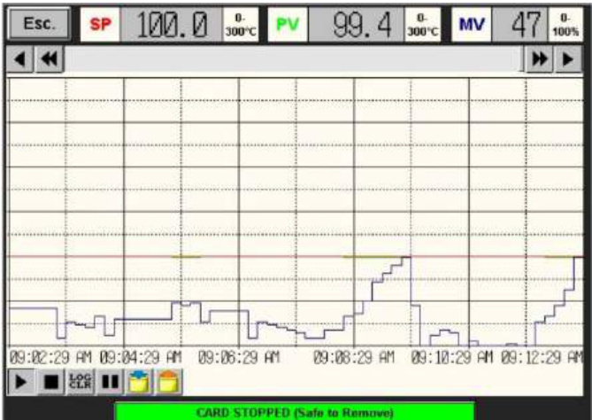  
Figure 240 Demand oscillations  

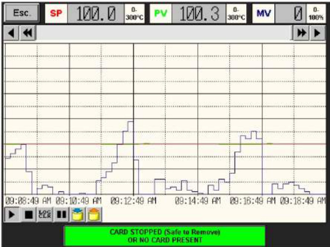  
Figure 241 Demand oscillations hitting zero  

# 25.2.4 Testing  

The heater should be permitted to cool before testing, this may take several hours.  

Change the set temperature to $1 7 0 ^ { \circ } \mathsf { C }$ .  

Switch the heater On.  

Open the graph by pressing Trending.  

The duty of the heater should start at $100 \%$ and drop as the temperature reaches target value.   
Temperature should not overshoot the target temperature (Figure 242).  

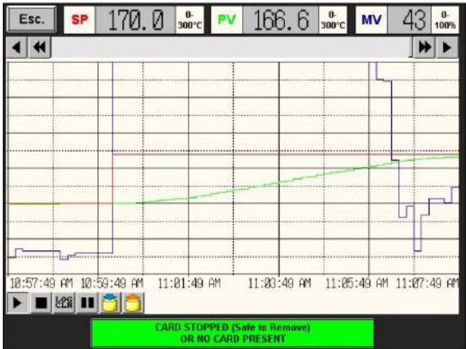  
Figure 242 Demand at $100 \%$ as temperature increases  

Demand and temperature should then both stabilise.  

Leave a further 40 minutes to heat soak, the demand and temperature should now both be stable as shown, (Figure 243).  

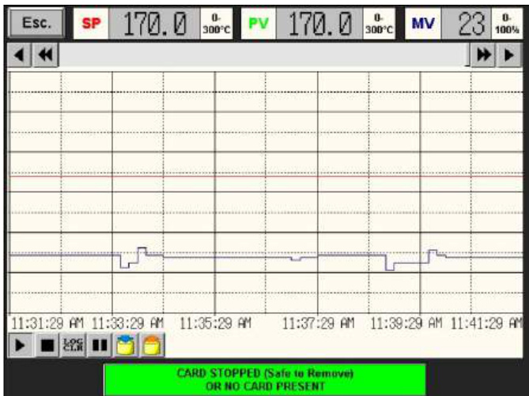  
Figure 243 Consistent heater duty at $1 7 0 ^ { \circ } \mathsf { C }$  

Press Off on the Elevator Heater page and wait for the system to cool.  

# 26.1 Setting up a file transfer service  

Install a suitable FTP transfer service.  

Note: Renishaw recommend using WinSCP for file transfer. WinSCP is freeware.  

  
Figure 244 WinSCP icon  

Save your Renishaw system location with the following settings (Figure 245):  

File protocol: FTP (File Transfer Protocol)   
Host name: The IP (Internet Protocol) address can be found on the service menu of the AM system (this can be renamed to the assigned system name if required)   
User Name: AM-User   
Password: ampdam250 (case sensitive)  

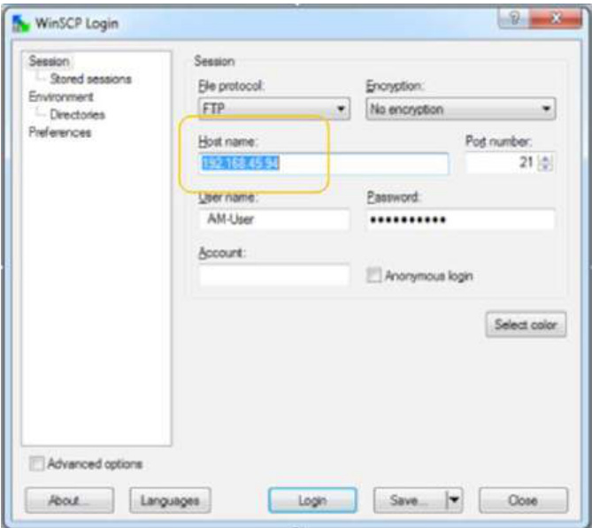  
Figure 245 Login details  

# 26.2 Sending a file to the system  

Open WinSCP.  

Select your system name from the network addresses and login (Figure 246):  

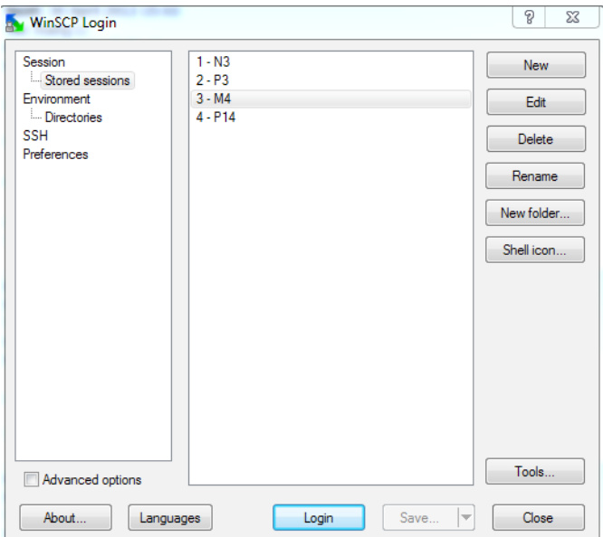  
Figure 246 Select system  

Navigate to the directory where your .mtt file is saved and drag the file into the Builds folder in the right hand column (Figure 247). Accept the prompt to copy.  

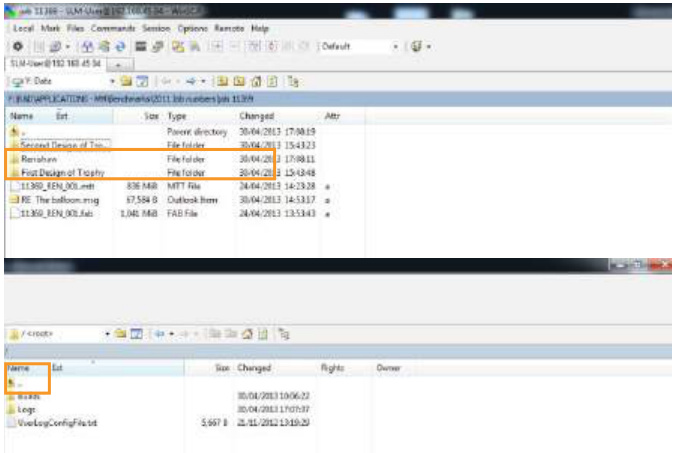  
Figure 247 Drag file into build folder  

# 26.3 Setting up FTP  

If using a standalone computer connected to the system the passive FTP, which is usually set during the system setup, must be reset after a Windows update. Automatic updating of windows should also be switched off. If this is not done there may be communication failures when transferring builds.  

Resetting the File Transfer Protocol  

1. Open Control Panel (Figure 248) then Internet Options (Figure 249).   
2. Select Advanced from the top bar menu.  

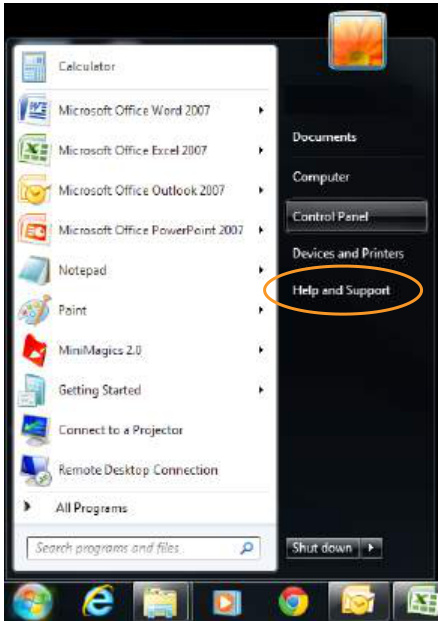  
Figure 248 Control panel  

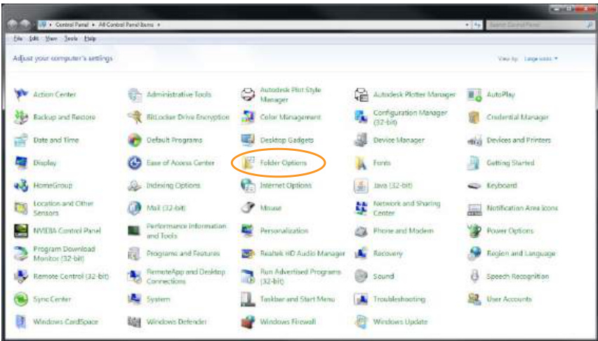  
Figure 249 Internet options  

3. Scroll to Browsing.  

4. Deselect Use passive FTP (for firewall and DSL modem compatibility).  

# Controlling future windows updates  

To prevent Windows from automatically updating, and overwriting the FTP settings, complete the following steps:  

1. Select Control Panel, then Windows update.  

2. Select Change settings (Figure 250).  

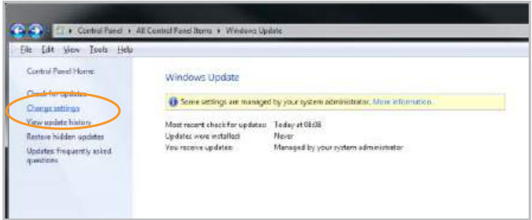  
Figure 250 Select change settings in windows update  

3. Using the drop down menu, select Let me chose whether to download and install updates. This will prevent Windows from automatically changing the FTP settings (Figure 251).  

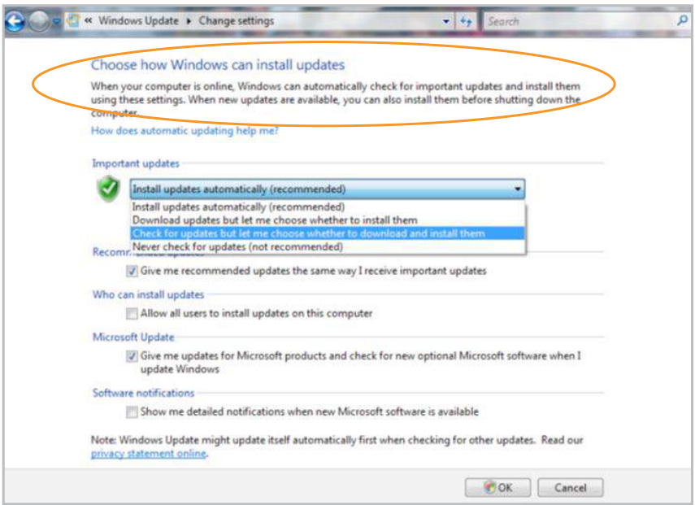  
Figure 251 Select Let me choose whether to download and install updates  

4.	 If manual updates are made, it may be necessary to reset the FTP settings again after the update.  

# 26.4 Selecting a file from the list  

Transferring a build onto the system is done via a local network connection from the file preparation PC to the system. Once completed, the build will appear in the Select Build menu (Figure 252).  

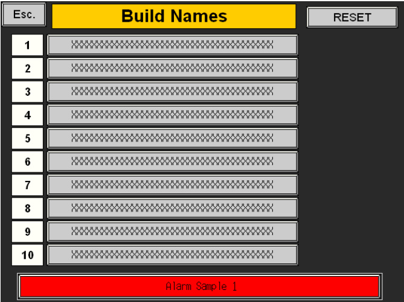  
Figure 252 Select build menu  

Note: Up to ten build files can be stored on the AM250/AM400 system.  