# 27 Starting the build  

Check that all the steps have been completed and all the necessary system checks are complete. In particular pay attention to:  

Powder level via the HMI   
Pressure of gas in the argon bottle   
Regulated argon pressure   
Condition of the chiller, ensuring that fluid levels are close to the upper level marker  

# 27.1 Process checks  

Confirm each of the steps have been completed before starting the build:  

Ensure the system has been cleaned down Login to AM250/AM400 control interface, open door Confirm chamber pressure is reading zero, if not see Section 18.3 – "Checking the pressur sensor" Transfer powder from supplier's container to system powder bottle Load powder Install substrate Assemble/install wiper. Dose powder to check for even distribution Heat soak procedure Install front and rear overflow bottles Install safe change filter assembly OR large safe change filter assembly • Check argon cylinder pressure greater than 25 bar, supply pressure less than 2 bar • Check the valve positions: Safe change filter/large safe change filter – 4 open (V4, V5, F1 and F2) Overflow bottles – 4 open (A1, B1, V2 and V3) Silo filling valve – 1 closed (V1) • Select file and start build  

# 27.2 Initiating the build  

First of all double-check all the valve positions are correct. The system will not operate correctly unless:  

• Safe change filter/large safe change filter – four valves are open (V4, V5, F1 and F2) Small rear overflow bottle – both bottle and pipe valves are open (A1 and V2) • Large front overflow bottle – both bottle and pipe valves are open (B1 and V3) • Silo – top valve is closed – even if a bottle is present (Figure 219) (V1) • Silo – dosing valve is open (Figure 253) (IV1)  

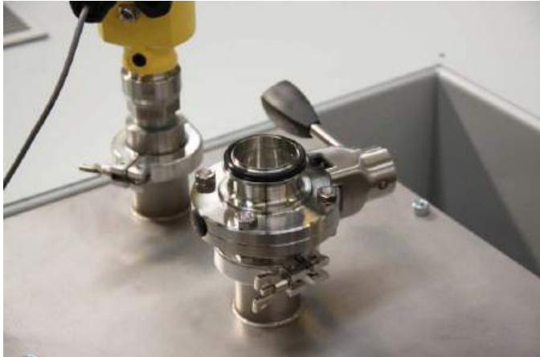  
Figure 253 Silo top valve in closed position (V1)  

The KF valve is open when aligned with the flow direction, and shut when the lever is $9 0 ^ { \circ }$ to the direction of flow (Figure 219).  

Note: The silo dosing valve (IV1) is an exception to the rule and is open when perpendicular to flow (parallel to the ground – shown in inset of Figure 254).  

  
Figure 254 Open the silo dosing valve (IV1) by pushing away  

From the main menu on the control interface, select Select Build (Figure 255).  

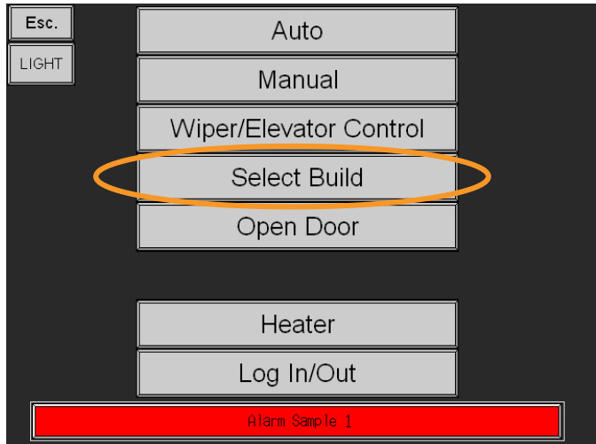  
Figure 255 Main menu  

Select the previously uploaded build name (Figure 256).  

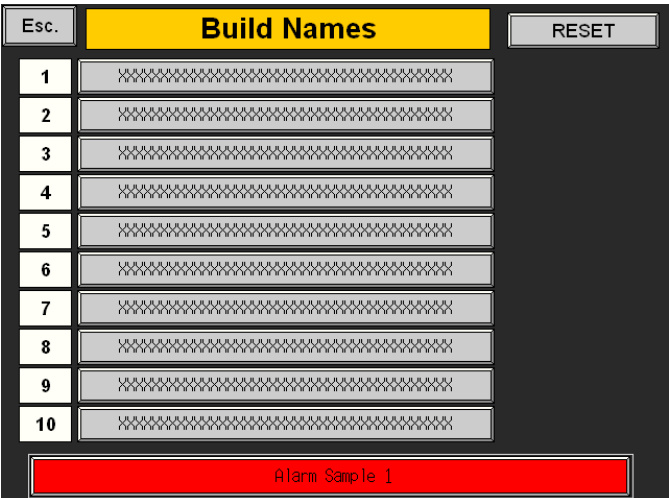  
Figure 256 Select build name  

Return to the main menu by pressing the Esc. button at the top left on the HMI. Select Wiper/Elevator Control (Figure 257).  

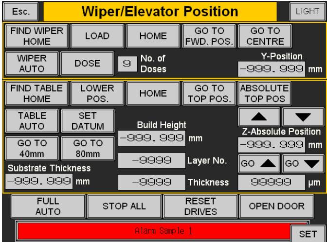  
Figure 257 Wiper control screen  

Select Find Wiper Home, ensuring that the wiper and substrate cannot collide.  

# Wiper/Elevator Control $>$ Find Wiper Home  

Ensure that the wiper installation has been performed correctly.  

Once complete, press Set Datum on the control interface.  

# Wiper/Elevator Control $>$ Set Datum  

Press Esc and select the Auto menu (Figure 258) and press the Play button (Figure 259).  

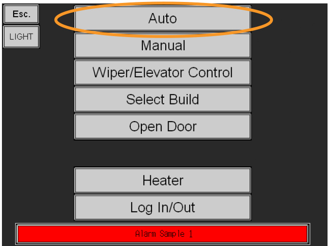  
Figure 258 Select auto  

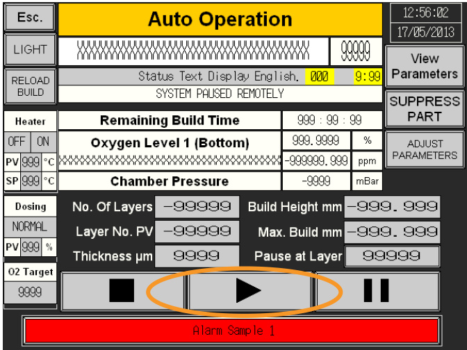  
Figure 259 Press play  

When prompted, ensure that the safe change filter valves (F1, F2, V4 and V5) are open and confirm this on the interface by pressing Yes (Figure 260).  

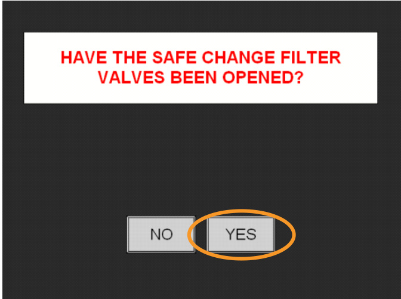  
Figure 260 Confirm by pressing Yes  

# 27.3 Stabilising the atmosphere  

At this point the system will start the process of creating the inert atmosphere. This takes between 10 and 15 minutes and throughout the process the HMI touch screen gives status updates.  

Once the preset oxygen atmosphere threshold has been achieved, the system waits two minutes for the atmosphere to stabilise. If the threshold rises above the preset limit, the system will dose additional inert gas to achieve the required level and then wait a further two minutes.  

# 27.4 Maintaining the build  

WARNING: DO NOT REMOVE OR ATTEMPT TO CHANGE THE LARGE SAFE CHANGE FILTERWHILST A BUILD IS RUNNING. DO NOT OPERATE THE LARGE SAFE CHANGE FILTER VALVES(V4, V5, F1 AND F2) WHEN A BUILD IS RUNNING.  

Note: Once the build has started, observe the first few minutes of the build process and check that the gas flow is correct from right to left, the quality of the part is acceptable, the powder is dosing correctly and the laser appears to be functioning correctly.  

Once started, the system will then run automatically. Periodically the system operator will need to add new material and take away unused material that has been collected in the overflows.  

The frequency of these activities is dictated by two factors:  

The cross sectional area of the part The amount of powder that is over-dosed  

# 27.5 Setting the dosing percentage  

Dosing is set via the HMI. Some degree of judgement is required for this value to be set, as it is dependent on the cross section of the part and also the layer thickness dictated by the materials file.  

Typically, a build in $2 5 \mu \mathrm { m }$ (0.001 in) layers requires a dose of around $40 \%$ . Thicker layers require a larger dose. The exact dose percentage depends upon the material being used, the part density on the build plate and part placement on the build plate. Experience of builds will guide you in selecting the correct dose percentage. The operator should aim to have powder in front of the wiper for the whole sweep and a small amount of powder wiped down the overflow. Overdosing will result in extra sieving, under dosing will only partially complete the build.  

To set the dose, login at level 2 and select the Service button (Figure 261).  

Following this, select the User settings button (Figure 262).  

  
Figure 261 Select Service  

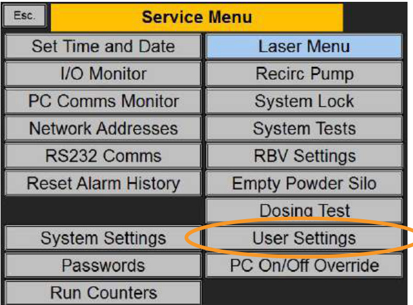  
Figure 262 Select User settings  

This then leads to the page that allows you to configure various settings including material, dosing, wiper speed and maximum oxygen threshold (Figure 263).  

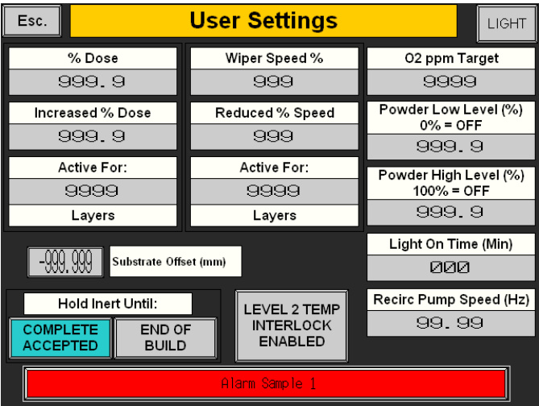  
Figure 263 User-configurable settings  

It is possible to amend the dosing percentage during the build.  

For rapid powder delivery the dose can be setup to $300 \%$ – three fully open doses per wipe.  

# 27.6 Restarting a build from a specific layer number  

On the auto operation screen Layer No. PV (Present Value) will typically display the layer number. Alternatively divide the build height by the layer thickness (for example $6 \ : \mathrm { m m }$ in $5 0 \mu \mathrm { m }$ layers $= 6 / 0 . 0 5$ $= 1 2 0$ layers).  

If the last layer number is not known, Enter Service Menu (Figure 264).  

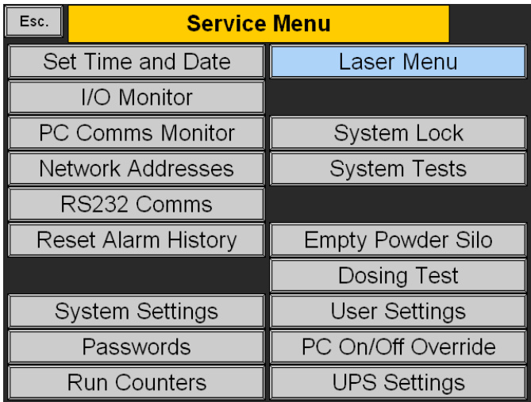  
Figure 264 Service menu  

Enter run counters menu, check the Last layer number in previous build value (Figure 265).  

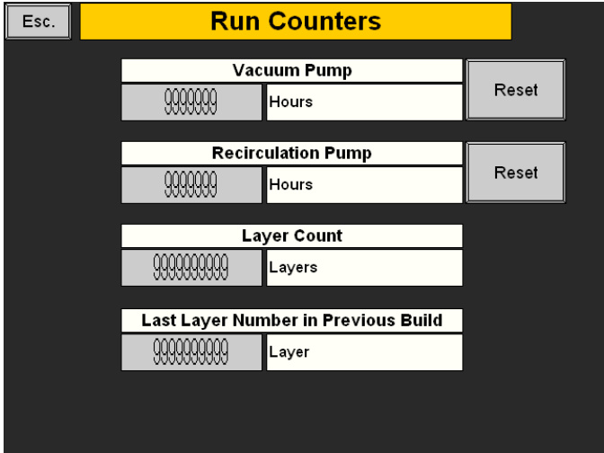  
Figure 265 Run counters  

From the menu select Wiper/Elevator Control enter the required start layer into Layer No. Reset the datum by pressing Set Datum (Figure 266).  

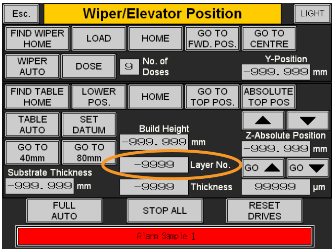  
Figure 266 Enter layer number and set datum  

In Auto press Play.  

An on screen prompt will appear, confirm the Start at Layer Number figure is correct and press Yes (Figure 267).  

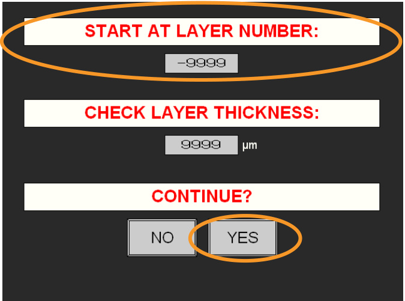  
Figure 267 Check layer number and continue  

Open safe change filter valves (F1, F2, V4 and V5) and proceed as a normal build.  

# 27.7 Suppressing a part  

In the Auto screen press View Parameters and then Slice Preview (Figure 268). Determine the number(s) of the part(s) to be suppressed (Figure 269).  

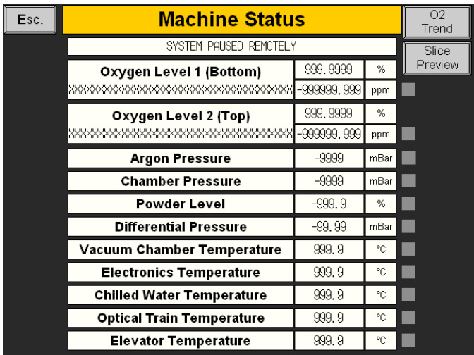  
Figure 268 Slice preview  

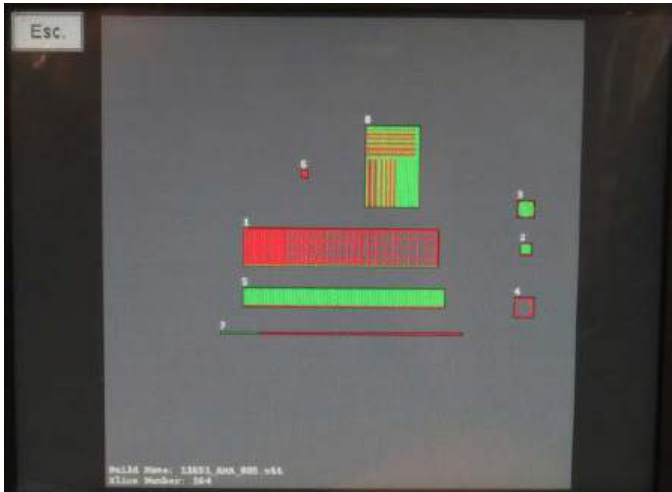  
Figure 269 Check component numbers  

In the Auto screen press Pause, additional functions will appear, press Suppress part (Figure 270).  

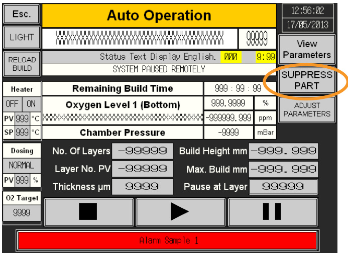  
Figure 270 Suppress parts  

Enter the part number into Suppress part number (Figure 271) follow the on screen prompts to suppress the part.  

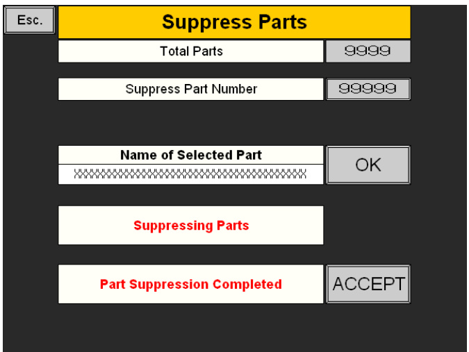  
Figure 271 Suppress parts  

Repeat if necessary for each part number.  

Press Escape to exit the menu, press Play to re-commence the build (Figure 272).  

# 27.8 Halting a build part way through  

The Emergency Stop button should only be used to stop the build in an emergency. It will instantaneously halt the complete system, which will interfere with the software logic – it will not necessarily be possible to restart the build. The z-axis uses an incremental encoder, with a proximity sensor to provide an accurate home position. Using the Emergency Stop will require the home position of the z-axis to be re-taught.  

Note: In the event of a breakdown or accident press the "Emergency Stop". Following assessment of the situation perform a restart procedure if safe, or call Renishaw AM service for support.  

If a non-emergency shutdown is required, first select Auto, then press Pause, (Figure 272 and Figure 273).  

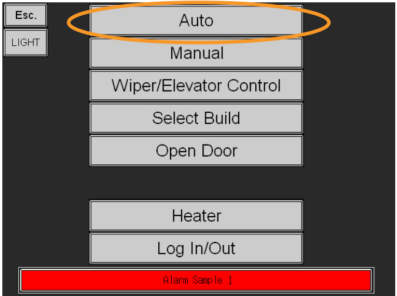  
Figure 272 Select auto  

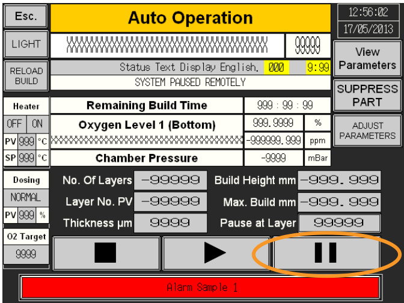  
Figure 273 Press pause  

# 28.1 Closing the filter valves  

At the end of the process, confirm the build completion when prompted on the AM control interface (Figure 274).  

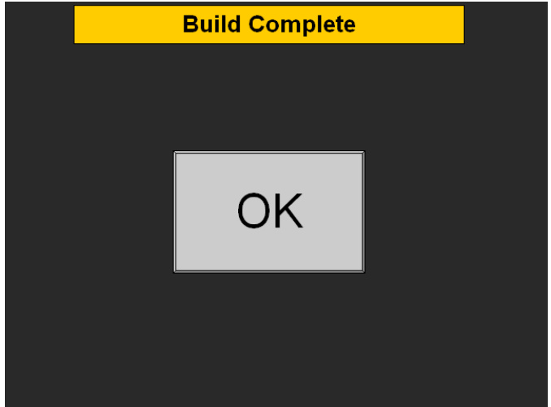  
Figure 274 Build complete prompt in the control interface  

You will then be prompted to close the safe change filter/large safe change filter valves, (V4, V5, F1 and F2) (Figure 275).  

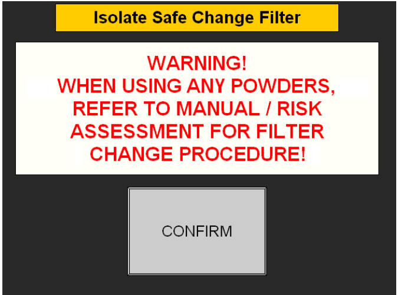  
Figure 275 Isolate safe change filter  

# WARNING: THE FILTER WETTING (INERTING) PROCEDURE MUST BE FOLLOWED FOR ALL POWDER TYPES AND AFTER EVERY BUILD, SEE SECTION 22.  

To close the four valves (V4, V5, F1 and F2), open the side door on the system to locate the safe change filter/large safe change filter and turn the levers so that they are at $9 0 ^ { \circ }$ to the direction of flow, (Figure 276).  

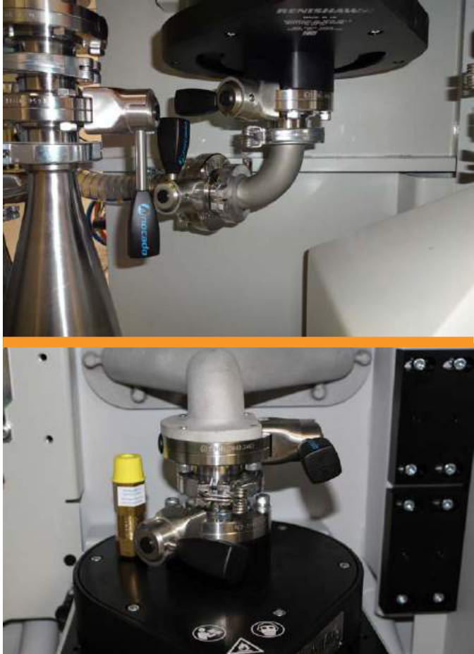  
Figure 276 Close safe change filter/large safe change filter upper and lower valves, (V4, V5, F1 and F2)  

Confirm the filter valves (V4, V5, F1 and F2) have been closed (Figure 276) by selecting the following in the AM control interface.  

# $>$ CONFIRM  

The filter valves (V4, V5, F1 and F2) must remain closed until it is ready to be wet inerted. See Section 22 – "Safe change filter and large safe change filter", for details of the inerting and filter replacement process.  

WARNING: THE SAFE CHANGE FILTER/LARGE SAFE CHANGE FILTER MUST BE REPLACED AFTER EVERY BUILD. SEE SECTION 22 "SAFE CHANGE FILTER AND LARGE SAFE CHANGE FILTER" FOR DETAILS.  

# 28.2 Cool down  

Wait for the heater temperature PV (Present Value) to reach room temperature before opening the door (Figure 277 and Figure 278).  

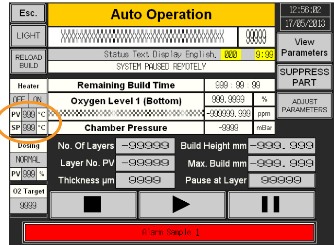  
Figure 277 Allow PV to drop to $< 4 0 ^ { \circ } \mathsf { C }$  

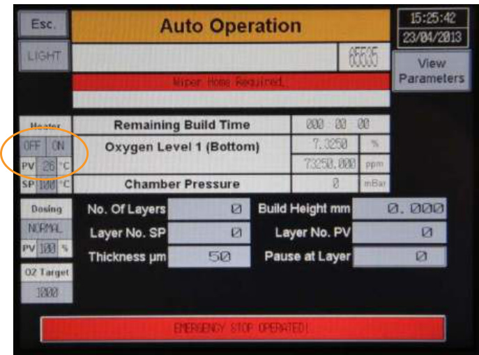  
Figure 278 PV at $2 6 ^ { \circ } \mathsf { C }$  