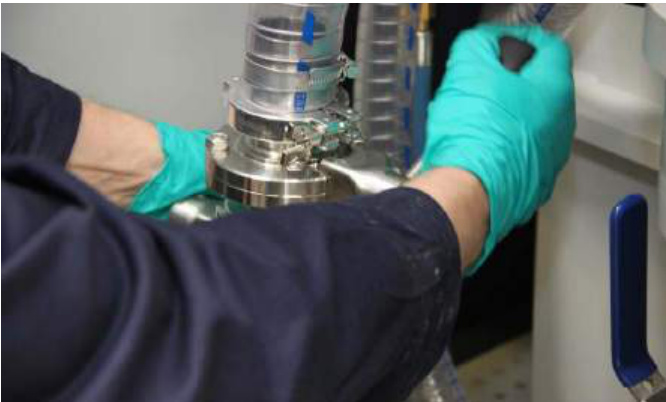
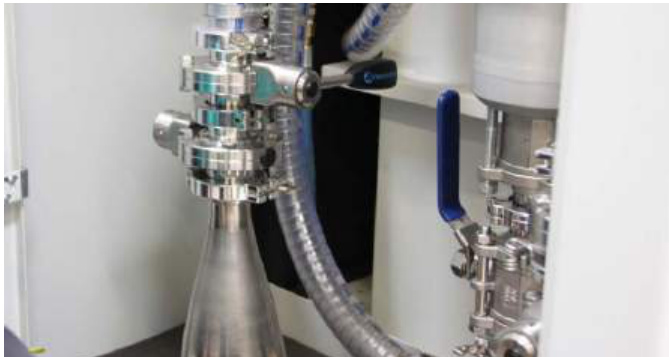
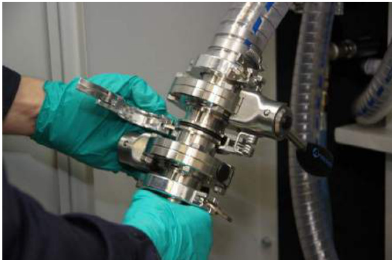
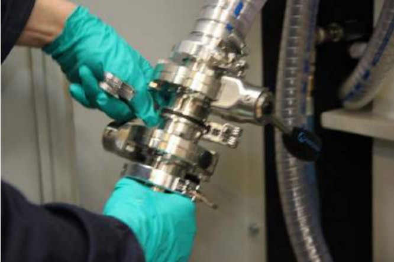
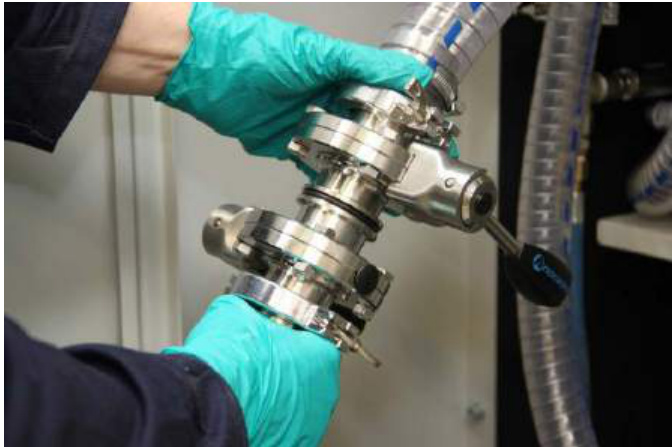
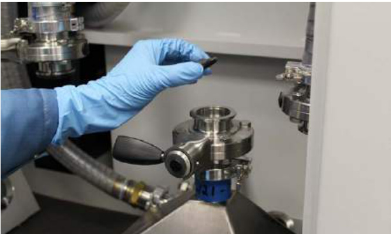

# 29 Removing the overflow bottle  

The following procedure applies to both the large overflow bottle and small powder bottle.  

WARNING: ENSURE YOU ARE WEARING THE CORRECT PPE: EYE PROTECTION, FULL FACE RESPIRATOR (TO EN143 TYPE $\mathsf { P 3 } + \mathsf { A 1 }$ ), PROTECTIVE GLOVES AND FULL LENGTH CLOTHING, (MADE FROM NON-STATIC GENERATING FABRIC SUCH AS COTTON (AVOID WOOL AND MAN MADE FABRICS) AND AVOID TURN-UPS OR POCKETS THAT MAY TRAP POWDER, REFER TO NFPA 484 FOR DETAILS) BEFORE STARTING THIS TASK.  

# WARNING: WHEN REMOVING OVERFLOW BOTTLES ENSURE THE ATEX VACUUM CLEANER (WET SEPARATOR) IS AVAILABLE TO REMOVE ANY TRACE AMOUNTS OF POWDER RELEASED WHEN SEPARATING KF FLANGES.  

Gently tap the overflow bottle until the remaining powder between the valves (A1 and V2 rear overflow) (B1 and V3 front overflow) has flowed into the bottle.  

Close both valves (A1 and V2 rear overflow) (B1 and V3 front overflow); pull the levers to unlock, and then rotate by $9 0 ^ { \circ }$ to a horizontal position (Figure 279 and Figure 280). Open the latch on the quick-release clamp (L10 rear and L13 front overflow) in the middle of the two valves (A1 and V2 rear overflow) (B1 and V3 front overflow). Swing one collar of the quick-release clamp (L10 rear and L13 front overflow) off the engaged KF flanges at a time (Figure 281).  

  
Figure 279 Tap the bottle, then close the valves (A1, V2, B1 and V3)  

  
Figure 280 Valves (A1, V2, B1 and V3) in the closed position – perpendicular to flow  

  

Figure 281 Open latch, remove first collar Disengage the KF flanges of the two valves (A1 and V2 rear overflow) (B1 and V3 front overflow) (Figure 282).  

  
Figure 282 Remove clamp  

Detach the overflow pipe from the overflow bottle (Figure 283).  

  
Figure 283 Remove bottle  

Remove the centring ring seal, clean, check the condition, replace the seal as necessary and store with the quick-release clamp (L10 rear and L13 front overflow) (Figure 284).  

  
Figure 284 Remove centring ring seal  