# 30 Post-build powder handling  

The large overflow bottle is too heavy for manual handling procedures, particularly loading the sieve and loading the system. For this reason it is necessary to decant powder from the large bottle into the small powder bottles.  

WARNING: LARGE OVERFLOW BOTTLES WEIGH APPROXIMATELY 40 KG (88 LB) WHEN FULL OF POWDER. ENSURE SUITABLE MANUAL HANDLING PROCEDURES AND EQUIPMENT ARE IN PLACE AND ARE FOLLOWED.  

WARNING: ENSURE YOU ARE WEARING THE CORRECT PPE: EYE PROTECTION, FULL FACE RESPIRATOR (TO EN143 TYPE $p 3 + A 1$ ), PROTECTIVE GLOVES AND FULL LENGTH CLOTHING (MADE FROM NON-STATIC GENERATING FABRIC SUCH AS COTTON (AVOID WOOL AND MAN MADE FABRICS) AND AVOID TURN-UPS OR POCKETS THAT MAY TRAP POWDER, REFER TO NFPA 484 FOR DETAILS) BEFORE STARTING THIS TASK.  

It is possible to avoid this step using only the small powder bottles as overflows, but this restricts the amount of unmanned operating time due to the smaller overflow capacity.  

# 30.1 Powder transfer from large overflow to small powder bottle  

To remove the powder in the large overflow bottle, you need to transfer the powder into small powder bottles.  

Firstly place a centring ring on top of the large overflow bottle (Figure 285).  

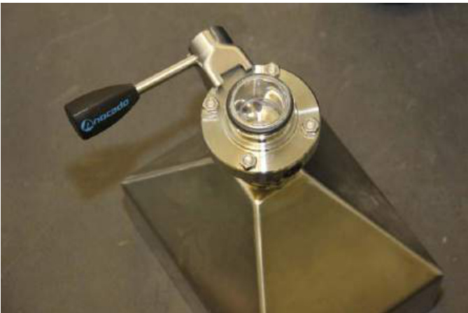  
Figure 285 Locate centring ring  

Then place an empty small powder bottle with the isolation valve (A1) closed on top of the large overflow bottle by engaging the KF flanges on the isolation valves (A1 and B1) of both bottles.  

Once the flanges are engaged and the centring ring is sealed between the flanges, place one collar of a release clamp over both flanges.  

Once the one collar is firmly in place over both flanges, swing the other collar round to seal the connection between both flanges and lock in place (Figure 286).  

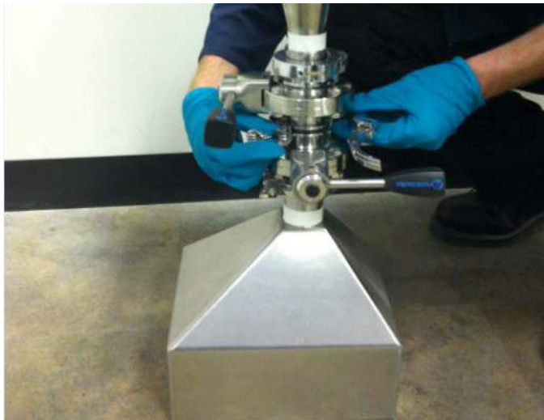  
Figure 286 Attach clamp  

# WARNING: LARGE OVERFLOW BOTTLES WEIGH APPROXIMATELY 40 KG (88 LB) WHEN FULL OF POWDER. ENSURE SUITABLE MANUAL HANDLING PROCEDURES AND EQUIPMENT ARE IN PLACE AND ARE FOLLOWED.  

Open the valves (A1 and B1) on both bottles and rotate them so the large overflow bottle is on top of the small powder bottle. As the large overflow bottle is heavy, this will require two people (Figure 287 and Figure 288).  

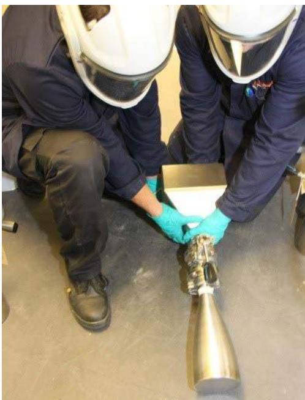  
Figure 287 Handle with care, the large overflow bottle is heavy  

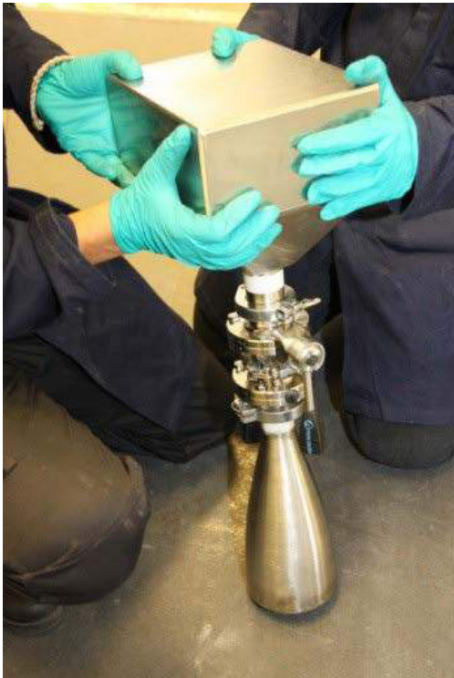  
Figure 288 Open valves and rotate bottles  

Tap the large overflow bottle to encourage the transfer of powder (Figure 289).  

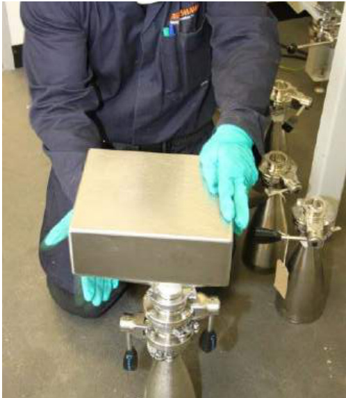  
Figure 289 Tap to encourage powder transfer  

Check the level of powder in the small powder bottle by tapping – if the sound is hollow (ringing), there is still space.  

Once the small powder bottle is full, close the valve (A1) and leave the large bottle valve (B1) open (Figure 290).  

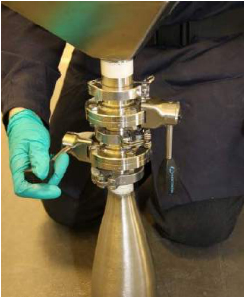  
Figure 290 When full, close small bottle valve (A1)  

Rotate the bottles so that the small powder bottle is back on top of the large bottle (Figure 291)  

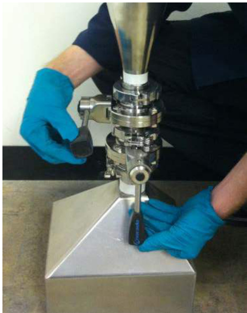  
Figure 291 Wait 10 seconds to allow powder to fall from coupling  

Allow 10 seconds for the remaining powder between them to fall back into the large bottle, then close the valve (B1) on the large bottle, ensuring that both valves (A1 and B1) are closed (Figure 292).  

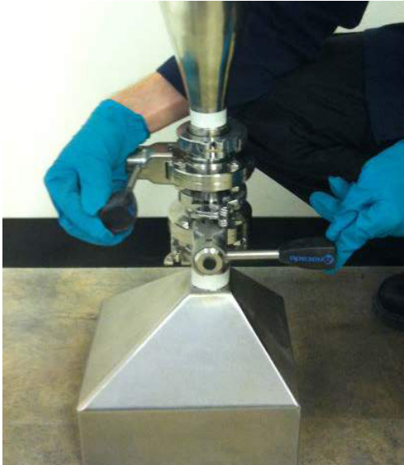  
Figure 292 Ensure that both the valves (A1 and B1) are closed before disconnecting  

Take a firm grip of the small powder bottle to secure in place and unlock the release clamp.  

Remove one collar from the engaged flanges at a time, keeping a firm grip on the small powder bottle.  

Disengage the flange on the small powder bottle from that of the large overflow bottle.  

The small powder bottle now contains powder and is ready to be installed to the sieve.  

Repeat this process until the large overflow bottle is empty, and then install it back onto the AM250/ AM400 system.  

# 30.2 Powder removal from build volume  

WARNING: THE VACUUM PUMP SHOULD NOT BE STARTED IF THE CHAMBER CONTAINS POWDER. IF MANUALLY VACUUMED THE VENT VALVE MUST NEVER BE OPENED – TURN THE GAS VALVE ON TO RETURN PRESSURE TO ATMOSPHERIC.  

WARNING: THE BUILD CHAMBER WILL CONTAIN LARGE AMOUNTS OF POWDER AT THIS STAGE. ENSURE THAT THE CORRECT PPE IS BEING WORN BEFORE OPENING THE CHAMBER DOOR.  

# WARNING: ENSURE THAT THE OVERFLOWS AND POWDER BOTTLES ARE EMPTY OF POWDER.  

Open the door and vacuum the contaminated powder from the front, left and right hand sides of the chamber as shown in (Figure 293) using the ATEX vacuum cleaner (wet separator). For selection and correct use of the ATEX vacuum, see Section 14.2 – "ATEX vacuum cleaner (wet separator)".  

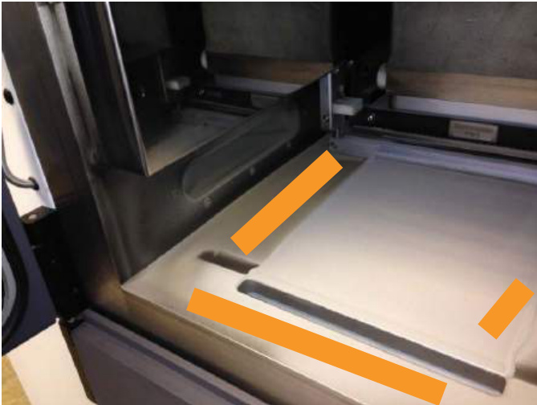  
Figure 293 Front, left and right hand side of chamber after build  

Place the appropriate brush/tools within the chamber ready for clean-down.  

Close the chamber door and re-inert chamber to an oxygen level of less than $7 \%$ , before beginning system clean-down. Open the manual control interface (Figure 294):  

  
Figure 294 Manual control, open vent turn gas on  

Manual $>$ Enable Manual  

Vent valve $>$ OPEN  

# Gas valve $>$ ON  

When oxygen levels return to below $7 \%$ on the top and bottom sensor turn off gas valve and close vent valve.  

# WARNING: REMOVING THE OXYGEN FROM THE CHAMBER IS THE SAFEST METHOD OF HANDLING THE POWDER, AS IT MINIMISES THE RISK OF IGNITION.  

To remove the powder from the build volume, the build platform needs to be raised in stages so that one large overflow bottle capacity can be removed at a time. To raise the build platform in stages, select the following on the control interface (Figure 295):  

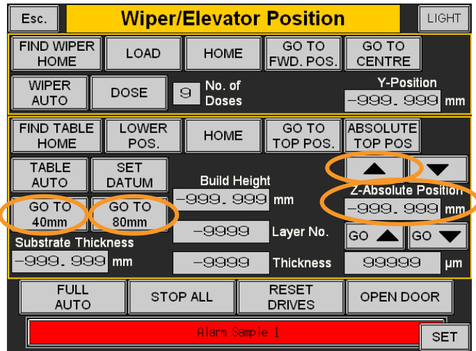  
Figure 295 Elevator control screen  

# Wiper/Elevator Control  

Raise the elevator in intervals of approximately $4 0 ~ \mathsf { m m }$ , using either the ^ up arrow, or by entering the desired height into build height. For the last two steps use the GO TO $8 0 ~ \mathsf { m m }$ and GO TO $4 0 m m$ buttons.  

After raising the elevator, follow the steps to open the glove box and clear the powder, using the chamber gloves. Before moving the elevator it is essential that hands are removed from the chamber. Hold the glove box shut to make the interlock switch, allowing elevator movement. It is not necessary to insert the retaining bolts for each step.  

At each stage, open the glove hatch door on the AM250/AM400 system to remove the powder from the build volume. To open the glove hatch door, insert the red safety keys into the retaining knob and then unscrew the bolts (Figure 296).  

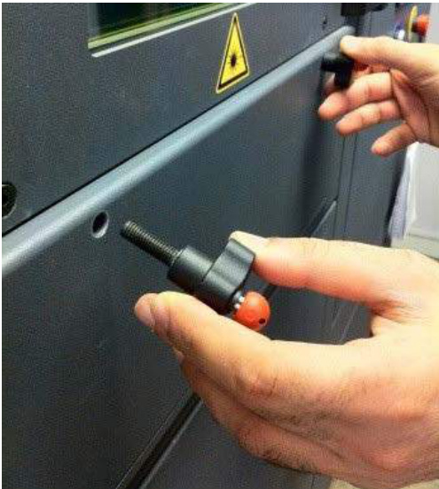  
Figure 296 Opening the glove hatch door  

On opening the door, an alarm Glove hatch open will initiate on the AM250/AM400 system (Figure 297).  

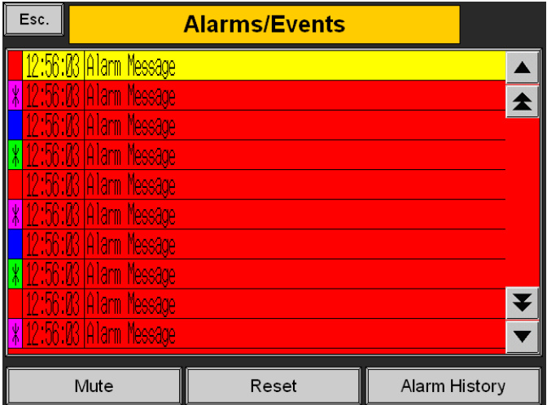  
Figure 297 Alarm/Events window in control window  

To mute the alarm, select the following on the control interface (Figure 297):  

# Alarm $>$ Mute  

To allow operation using the gloves, it is necessary to reduce the pressure inside the chamber. Insert your hands into the chamber through the gloves (Figure 298).  

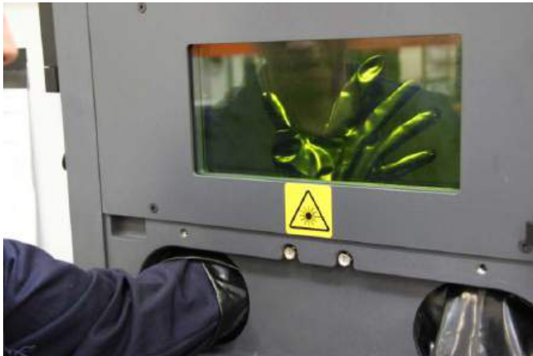  
Figure 298 Allow to cool before inserting hands into chamber gloves  

To remove the powder from the build volume, use a $1 9 \mathsf { m m }$ ( $3 / 4$ in) round brush to push the powder down the front overflow (Figure 299).  

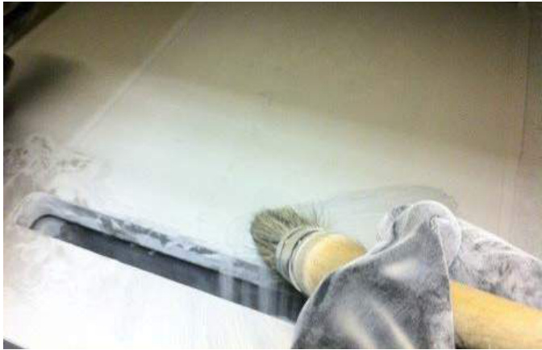  
Figure 299 Brush powder down the front overflow  

Caution: Do not touch the laser lens window during powder removal.  

# WARNING: CHECK THE SUBSTRATE TEMPERATURE BEFORE OPENING THE GLOVE BOX TO ENSURE THAT IT IS BELOW $4 0 \textdegree$ ( $\bf \Pi ^ { 1 0 0 ^ { \circ } F }$ .  

Continue to brush the powder down the front overflow until the large overflow bottle is full. To check, tap the bottle to give an indication of the hollow capacity remaining (Figure 300).  

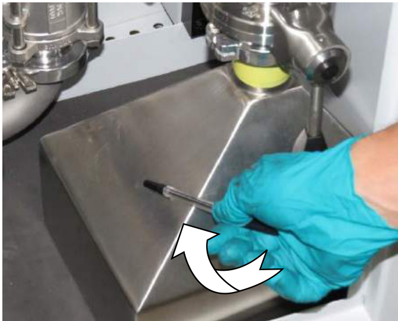  
Figure 300 Tap bottle to check capacity  

Once full, close the valves on the large overflow bottle (B1) and overflow pipe (V3) (Figure 301).  

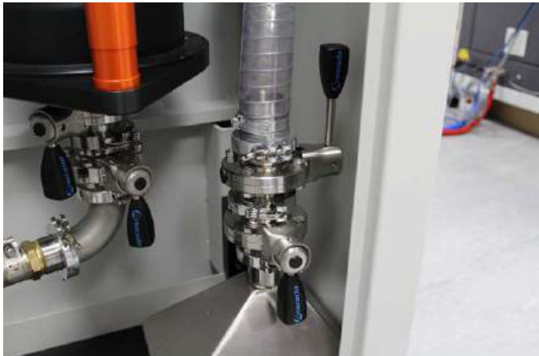  
Figure 301 Close valves on bottle (B1) and pipe (V3) (shown here in open position)  

Remove the large overflow bottle and ensure that the valve (B1) remains closed.  

To remove the powder in the large overflow bottle, it needs to be transferred into the small powder bottles. See Section 30.1 – "Powder transfer from large overflow to small powder bottle".  

Install the empty large overflow bottle back onto the AM250/AM400 system.  

You can now continue to remove the powder from the build volume.  

Raise the build platform another stage, then repeat the procedure to remove the powder, until all of the powder has been removed from the build volume.  

When the top position is reached, raise the substrate out of the build volume by selecting the following on the control interface (Figure 302):  

# Wiper/Elevator Control $>$ Substrate Thickness > 0 mm  

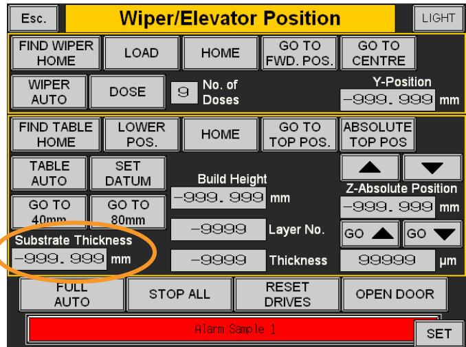  
Figure 302 Enter 0 into Substrate thickness  

Replace the brush.  

Take a 5 mm hexagon key. Place the short end of the hexagon key into one of the four bolts (Figure 303). Turn the hexagon key anti-clockwise to loosen the bolt. Until it can be removed, store it on the side of the chamber. Repeat the procedure for all four bolts.  

Caution: Substrate fastening bolts must be checked after every use for damage and wear, replace damaged or worn bolts as necessary. Regardless of damage or wear, bolts should be replaced on a regular basis.  

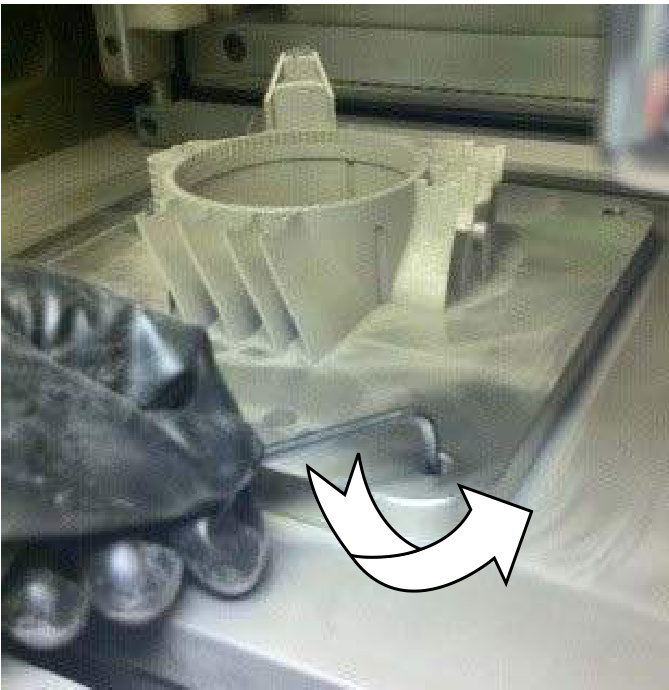  
Figure 303 Removal of substrate from build platform  

Once all the bolts have been removed, lift the substrate and tip the remaining powder inside the build parts down the front overflow (Figure 304).  

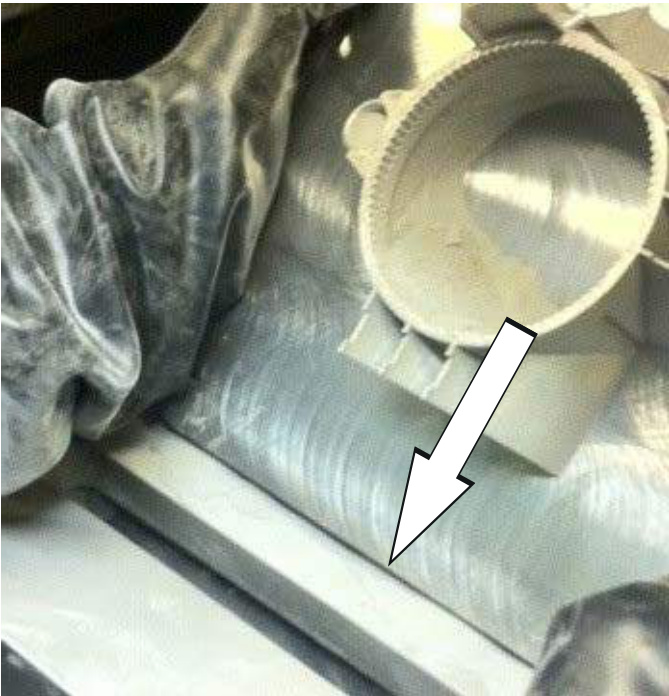  
Figure 304 Tip powder out of part down the overflow  

Ensure that you have a firm grip on the substrate and shake the substrate to allow entrapped powder to be removed from the built parts.  

Once all the powder that can be removed from the build volume and built parts has been deposited down the front overflow, place the substrate back down on the z-axis platform.  

Clean off any powder remaining on the gloves using the brush. Pull the gloves inside out, and either roll each one up tightly (Figure 305), or place the palms on top of each other and roll both gloves up together (Figure 306).  

Caution: If gloves are not tightly rolled, they can inflate into the build chamber.  

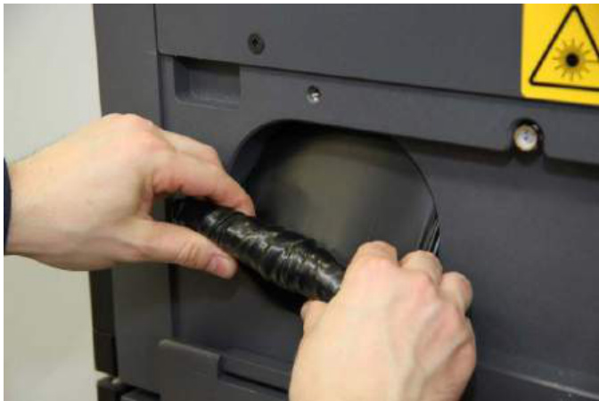  
Figure 305 Roll individual gloves tightly for storage  

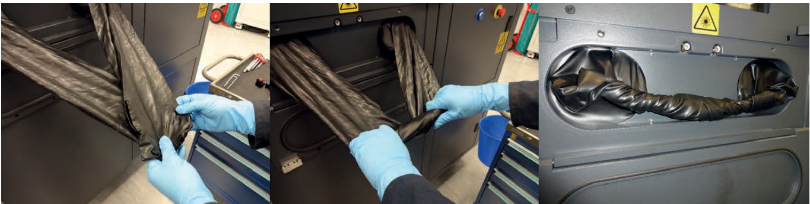  
Figure 306 Roll gloves tightly for storage  

Close the glove hatch and screw in the retaining bolts, applying pressure to the hatch door to keep hatch valves closed (Figure 307).  

Note: Pressure must be applied to the hatch door whilst replacing the retaining bolts to prevent an alarm on the control interface.  

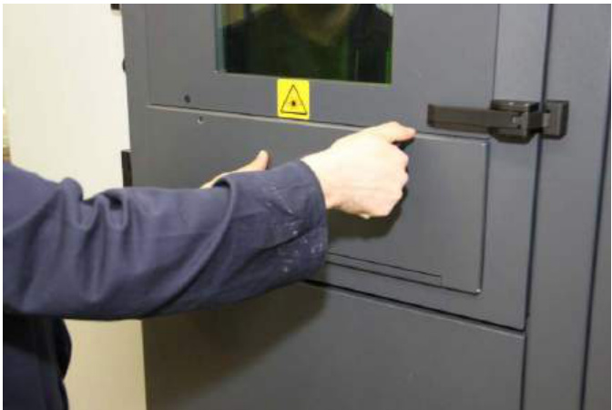  
Figure 307 Push glove hatch closed whilst tightening retaining bolts  

# 30.3 System clean-down – build chamber  

Open the build chamber door on the AM250/AM400 system.  

For selection and correct use of the ATEX vacuum, see Section 14.2 – "ATEX vacuum cleaner (wet separator)".  

Use the brush and vacuum to remove any powder residue from the recirculation manifold (Figure 308).  

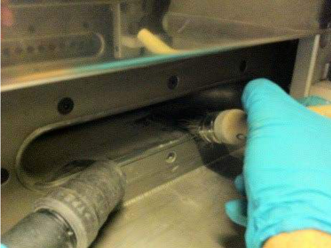  
Figure 308 Brush powder out of recirculation manifold  

Brush any remaining powder on the chamber platform down the front overflow (Figure 309).  

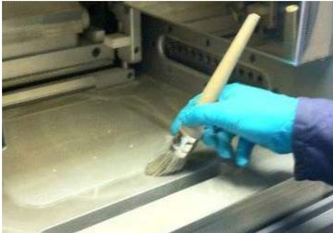  
Figure 309 Brush the remaining powder down the overflows  

To allow access to the powder at the back of the chamber, remove the wiper blade assembly. Firstly bring the wiper forward in the control interface by selecting either of the following (Figure 310):  

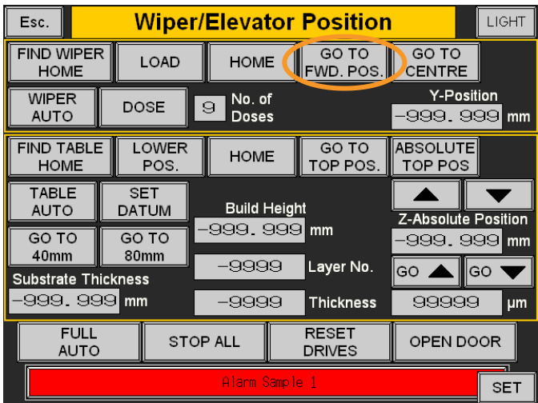  
Figure 310 Go to forward position  

Wiper/Elevator Control $>$ GO TO FWD POS.  

# Or Wiper/Elevator Control $>$ GO TO CENTRE  

Open the chamber door on the AM250/AM400 system. Loosen the left and right M6 upper locking bolts using a $5 \mathsf { m m }$ hexagon key (Figure 311).  

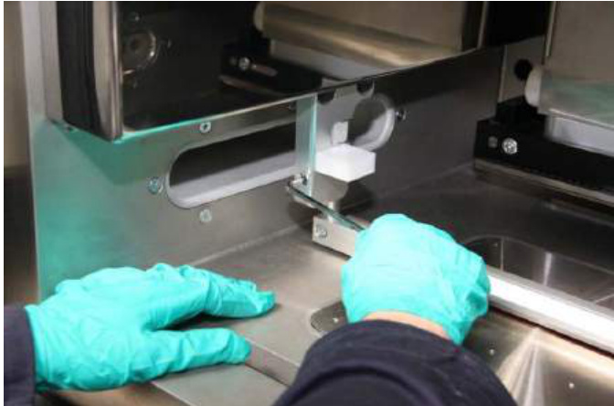  
Figure 311 Loosen M6 upper locking  

Turn the thumb screws on the wiper arms clockwise by four quarter turns to raise the wiper arms approximately 1 mm (0.04 in). This will allow sufficient clearance between the build platform for the next build setup (Figure 312).  

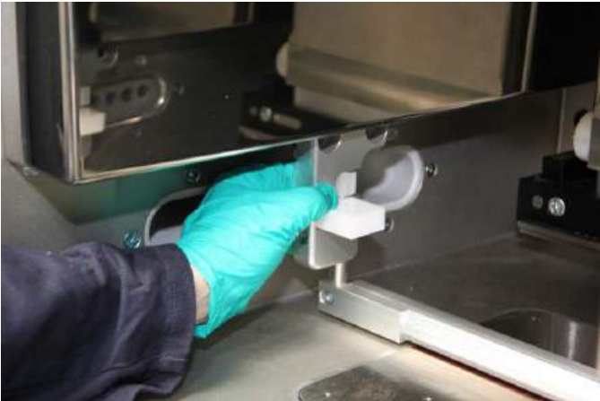  
Figure 312 Turn clockwise to raise the wiper blade  

Remove the M6 lower wiper retaining bolts connecting the wiper blade assembly to the wiper arms using a 5 mm hexagon key (Figure 313 and Figure 314).  

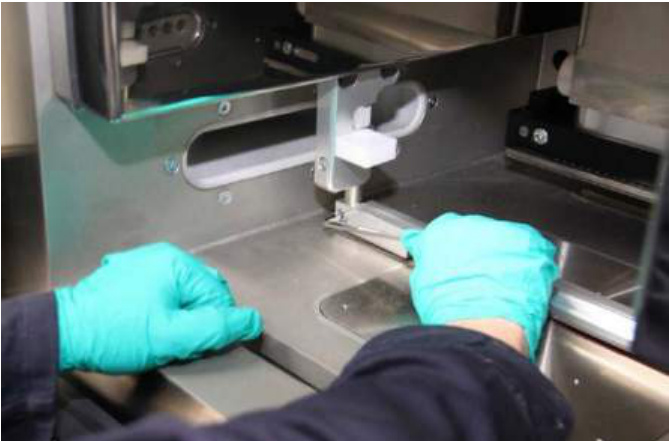  
Figure 313 Slacken lower bolt  

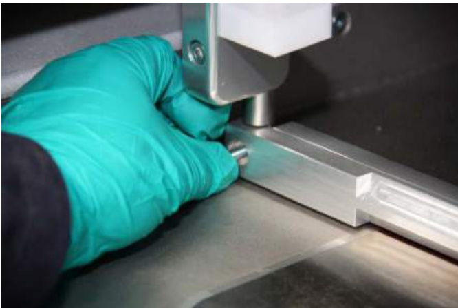  
Figure 314 Slacken lower bolt  

Place the parts into a magnetic tray (Figure 315).  

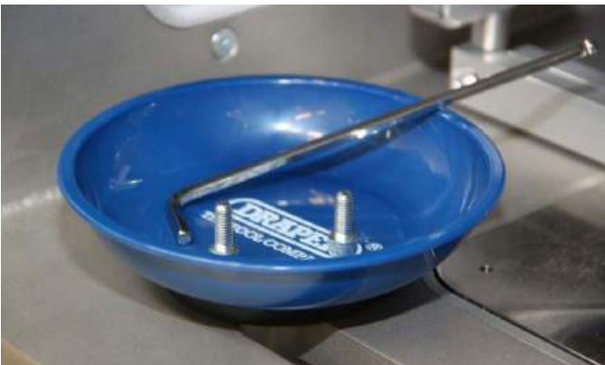  
Figure 315 Magnetic tray  

Remove the wiper blade assembly from the wiper arms.  

Take a brush and brush any powder remaining on the wiper blade assembly down the front overflow (Figure 316).  

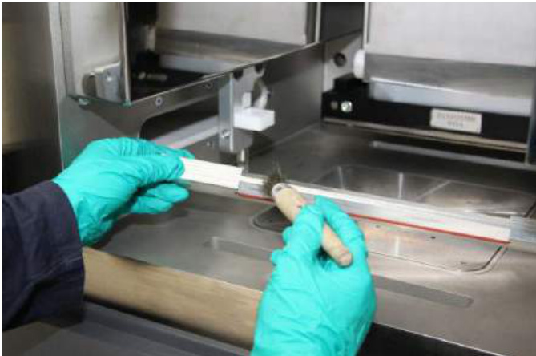  
Figure 316 Brush off powder  

Once the powder has been removed from the wiper blade assembly, remove it from the system and place it on a work bench. See Section 24.1 – "Installing the wiper blade".  

Once the wiper assembly has been removed, brush the powder at the back of the chamber, which was behind the wiper, down the back overflow (Figure 317).  

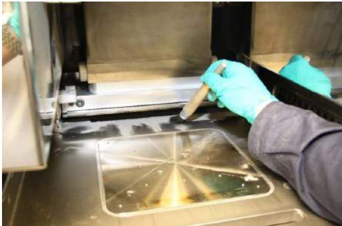  
Figure 317 Brush powder down the rear overflow  

Using the ATEX vacuum cleaner (wet separator) and attachments, remove any excess powder residue from the internal surfaces of the system (Figure 318 and Figure 319). On AM250 systems equipped with PlusPac and on AM400 systems a Window Protection System (WPS) is fitted. This has a different arrangement of lens protective window and gas pipes in the top of the upper chamber, (Figure 319).  

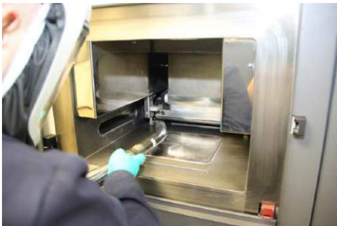  
Figure 318 Vacuum interior of the chamber  

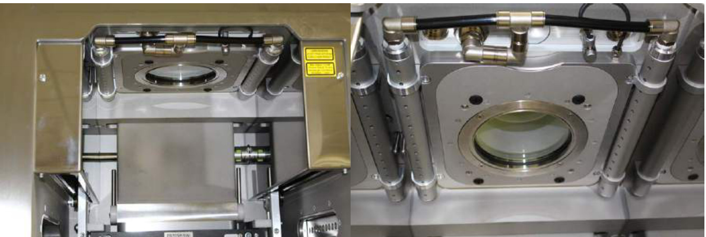  
Figure 319 Vacuum interior of the AM250 PlusPac and AM400 chamber  

Insert a fine bladed screwdriver into the bolt holes on the chamber platform and prod to loosen any compacted powder (Figure 320), then remove the loosened powder using the ATEX vacuum cleaner (wet separator). Ensure that the bolt holes on the build platform are completely clear of powder before continuing.  

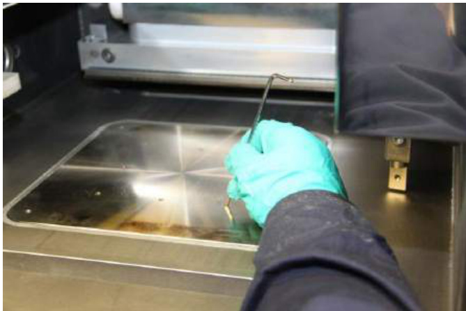  
Figure 320 Prod bolt holes to loosen compacted powder and then vacuum  

When as much of the powder and residue as possible has been removed with the brush and vacuum, the next step is to clean all the build chamber surfaces with the Class 3 isopropanol, (Figure 321).  

# Caution: Do not touch the laser lens window during chamber cleaning.  

Apply the isopropanol to a disposable cloth and wipe down the internal surfaces in the chamber from top down, starting from the chamber ceiling (Figure 321).  

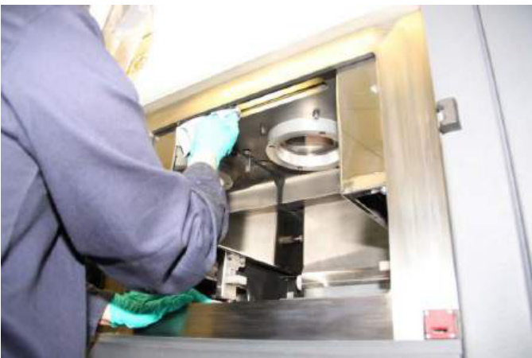  
Figure 321 Clean with isopropanol from the top down  

The internal surfaces need to be clear of any powder residue and black deposits (metal condensate) (Figure 322).  

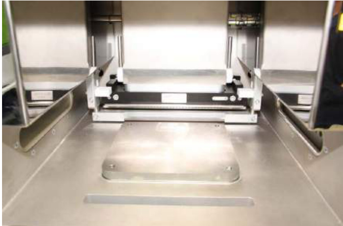  
Figure 322 Remove all powder and deposits  

Clean the door seal using a cloth and cleaning solution (Figure 323).  

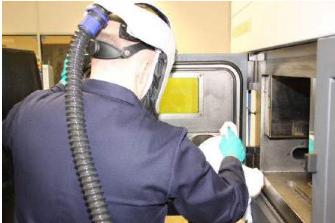  
Figure 323 Clean door seal with cloth and cleaning solution  

It may be necessary to clean the gloves with isopropanol (Figure 324).  

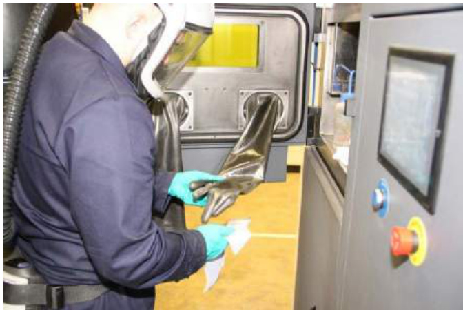  
Figure 324 Clean gloves with isopropanol  

WARNING: AFTER EVERY CLEAN-DOWN OF THE DOOR, INSPECT THE PROTECTIVE GREEN ACRYLIC FILTER. IF THE FILTER DAMAGED STOP USING THE AM250/AM400 SYSTEM AND CONTACT RENISHAW FOR A REPLACEMENT FILTER.  

# 30.4 Cleaning the lens protective window – AM250  

Note: If your system is an AM250 without PlusPac follow the procedure in Section 30.4 to clean the lens protective window. If your system is an AM250 with PlusPac or an AM400 use the procedure in Section 30.5.  

# 30.4.1 Lens protective window inspection  

Caution: The lens protective window is made from fused silica, and has an optical coating that will scratch if handled incorrectly.  

Caution: The lens protective window needs to be completely clear, removing all soot and leaving no smudges that can affect laser beam coupling efficiency and focus.  

Regularly visually examine the condition of the lens protective window. Over time the lens protective window will degrade and will require replacement in order to maintain system performance and part quality. Care and attention when cleaning will significantly improve the life of the lens protective window.  

Removal of the lens protective window for cleaning is the recommended method to ensure maximum life.  

# 30.4.2 Removing the lens protective window  

Always use a clean workbench, clean hands and gloves. • Never place the lens protective window on a hard surface, only ever handle using the outer rim of the lens protective window as this portion is not used. When wiping, apply minimal force to avoid scratching. • Never use dry wipes to clean the lens – this will result in static, which will attract more contaminate. Only use the cleaning liquids specified (P-OPTA-0101). Only use the lens cleaning tissues specified (P-WI02-0002). • Do not use tools to clean or handle the lens protective window.  

Caution: The lens protective window is not fixed in the outer housing. Keep the housing level to avoid tipping the lens protective window out.  

Caution: The lens protective window is fragile and high value and should be handled with care.  

Caution: Removing the lens protective window exposes the lens and optics to the environment. This should only ever be done following a thorough clean-down and the time open should be minimised – Renishaw recommend a second lens protective window or bung is reassembled as soon as possible.  

Ensure that the build chamber has been thoroughly cleaned by following the instructions in Section 30.3.  

Take a lens cleaning tissue and apply isopropanol. Wipe the outer aluminium lens housing until it is clean, avoiding touching the lens (Figure 325).  

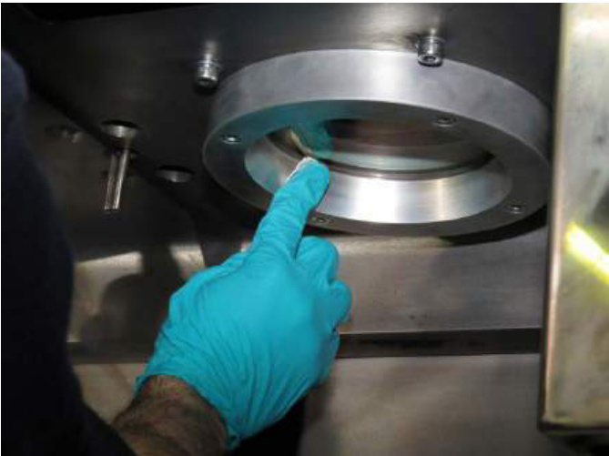  
Figure 325 Clean the outer housing  

Place bubble wrap or similar packing material in the base of the chamber as a precaution against dropping the lens protective window (Figure 326).  

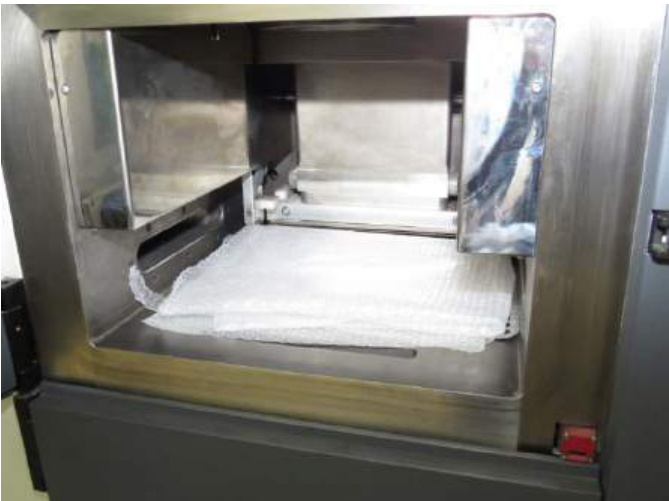  
Figure 326 Use bubble wrap as a precaution  

Remove the four M8 bolts using a $6 ~ \mathsf { m m }$ hexagon key, starting with the rear ones first. Before removing the last bolt, support the housing with your other hand (Figure 327).  

  
Figure 327 Support before removing last bolt  

# Lens stuck?  

Caution: It is possible for the lens to stick to the chamber roof o-ring – check the lens is in the housing before completely withdrawing.  

Gently remove the lens protective window, only handling the housing, and keeping it horizontal.  

As you lower the lens housing check to ensure the lens is in the housing and not stuck to the chamber roof.  

This will expose the laser optics. It is recommended to have a replacement lens protective window ready to replace immediately. If this is not possible, minimise the length of time the lens protective window is off. Close the chamber door.  

# 30.4.3 Lens protective window cleaning  

Place the outer housing onto a clean workbench – it will be used to support the lens protective window during the cleaning process.  

There will be layer of grease around the outer edge of the lens from the sealing o-ring. Apply optic cleaner (P-OPTA-0101) to a folded lens cleaning tissue (part number P-WI02-0002) and use it to clean the outer edge of the lens protective window (Figure 328).  

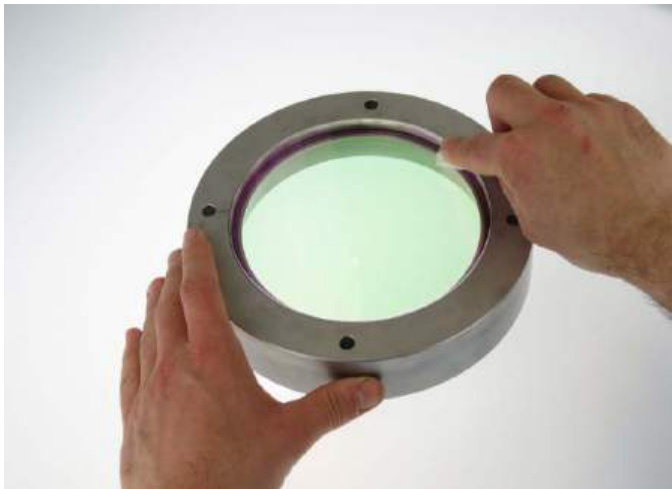  
Figure 328 Wipe outer  

Hold the lens protective window to the light to look for dust or particles.  

Any loose particles can be blown off using clean dry air, either from a aerosol or manual blower (Figure 329). Keep the nozzle at least $1 0 0 ~ \mathsf { m m }$ from the lens protective window (Figure 330).  

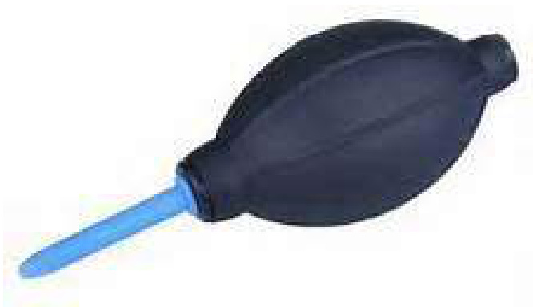  
Figure 329 Manual blower  

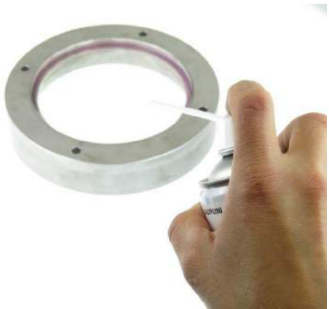  
Figure 330 Blow loose particles if using clean dry air from $> 1 0 0 \mathrm { ~ m m }$  

Caution: Do not use compressed air lines, as they may contain oil or water which will contaminate the lens protective window.  

Ensure that you are wearing clean gloves at this stage.  

Place a lens cleaning tissue on the lens protective window surface and dampen the back edge of the tissue with optic cleaner (Figure 331).  

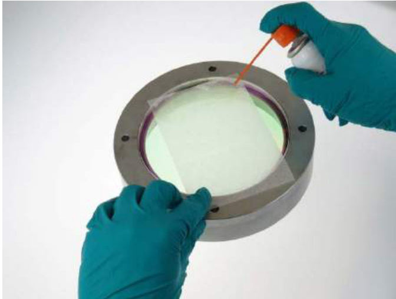  
Figure 331 Place tissue on lens protective window and apply cleaner  

Without lifting, slowly draw the lens cleaning tissue across the lens protective window. This should be done at approximately $2 0 ~ \mathsf { m m }$ /sec (1 in/sec) so that the liquid evaporates behind the tissue, leaving no streaks (Figure 332).  

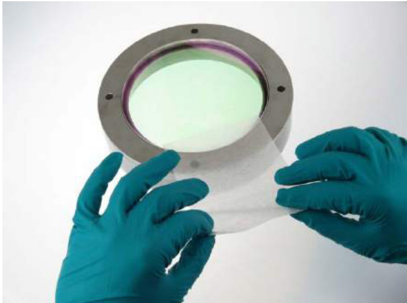  
Figure 332 Slowly draw the tissue across the lens  

After several wipes, inspect the lens protective window against a light. If there are particularly stubborn stains, take a wipe and fold it several times, then apply optic cleaner (Figure 333).  

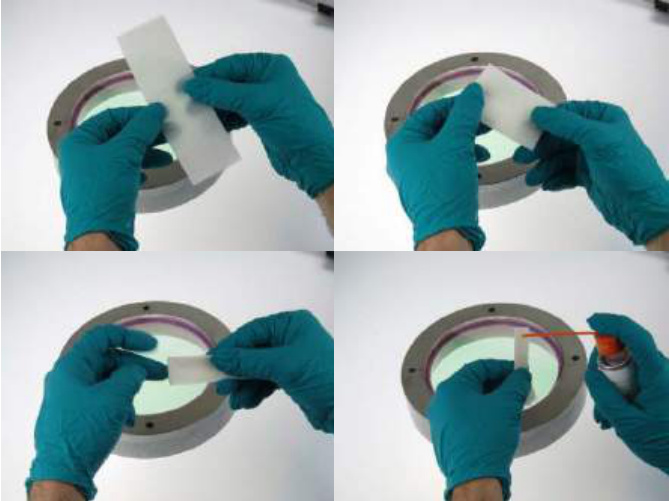  
Figure 333 Fold several times, apply cleaner  

Gently wipe the lens protective window applying minimal pressure. Do not use back-and-forth or circular motions (Figure 334).  

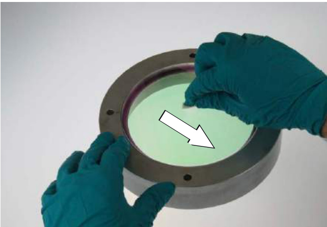  
Figure 334 Gently wipe the lens protective window  

Once complete, there should be no streaks left on the lens protective window.  

# 30.4.4 Clean both sides  

Pick up the housing, whilst supporting the lens protective window around the rim, and tip it until it frees (Figure 335).  

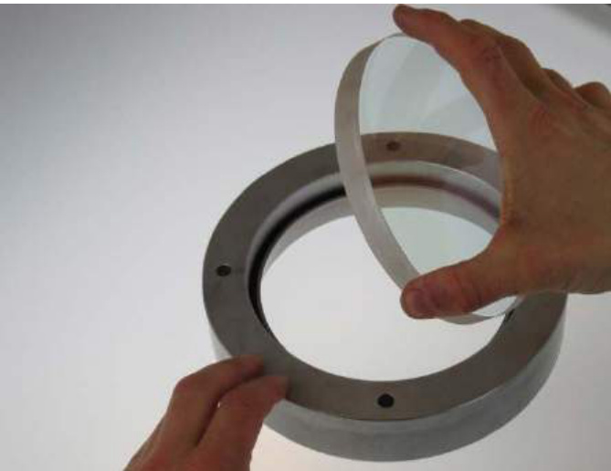  
Figure 335 Tip to remove the lens protective window  

Turn it so that the cleaned face is down, and replace in the housing. Only handle the lens using the outer edge (Figure 336). It may help to remove gloves when handling the clean lens to aid handling.  

  
Figure 336 Replace in housing clean face down  

Repeat the cleaning process on the other face.  

# 30.4.5 Reassembly of the lens protective window  

Inspect the o-ring for damage, replace if necessary.  

Apply a small smear of high vacuum grease (part number 769 890 000) to the sealing o-ring.   
For reassembly, follow the assembly steps in reverse.   
Tighten all four bolts finger tight using the long end of the hexagon key (Figure 337).  

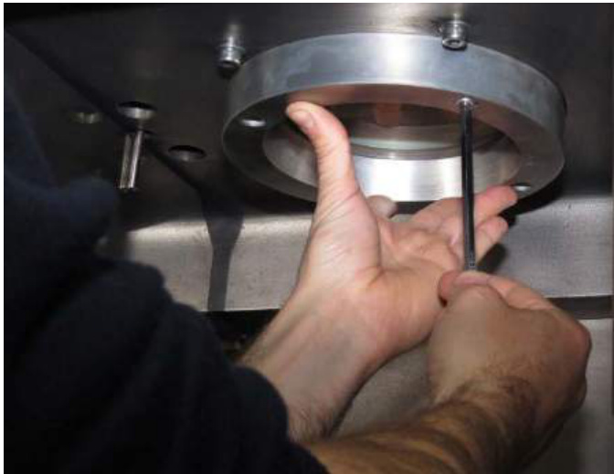  
Figure 337 Reassemble bolts finger tight  

Tighten to approximately $1 0 \mathsf { N m }$ (7.4 lbf/ft) following the sequence in (Figure 338).  

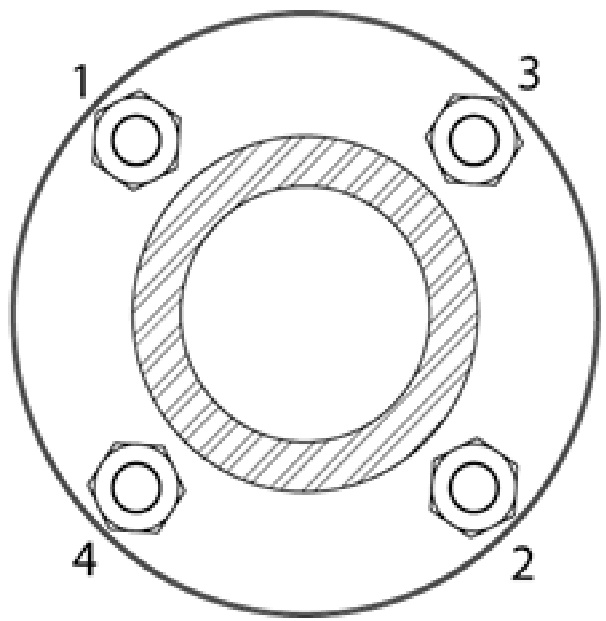  
Figure 338 Tighten in sequence  

# 30.5 Clean the window protection system – AM250 with PlusPac and AM400  

30.5.1 Clean the lens protection assembly – AM250 with PlusPac and AM400 only  

Note: If your system is an AM250 with PlusPac or an AM400 use the procedure in Section 30.5 to clean the window protection system. If your system is an AM250 without PlusPac follow the procedure in Section 30.4.  

# 30.5.1.1 Lens protection assembly inspect  

Caution: The lens protection assembly is made from fused silica, and has an optical coating that will scratch if handled incorrectly.  

Caution: The lens protection assembly needs to be completely clear, removing all soot and leaving no smudges that can affect laser beam coupling efficiency and focus.  

Regularly visually examine the condition of the lens protection assembly. Over time the lens protection assembly window will degrade and will require replacement in order to maintain system performance and part quality. Care and attention when cleaning will significantly improve the life of the lens protection assembly window.  

Removal of the lens protection assembly window for cleaning is the recommended method to ensure maximum life.  

# 30.5.1.2 Removing the lens protection assembly  

Always use a clean workbench, clean hands and gloves. Never place the lens protection assembly on a hard surface. Only handle using the outer rim of the lens protection assembly as this portion is not used. When wiping, apply minimal force to avoid scratching. Never use dry wipes to clean the window – this will result in static, which will attract more contaminate. • Only use the cleaning liquids specified (P-OPTA-0101).  

Only use the lens cleaning tissues specified (P-WI02-0002).   
Do not use tools to clean or handle the lens protection assembly.  

Caution: Removing the lens protection assembly exposes the system optics to the environment. This should only ever be done following a thorough clean-down of the build chamber and the time open should be minimised – Renishaw recommend purchasing a second lens protection assembly or a bung and fitting it as soon as possible after removing the lens protection assembly.  

1. Ensure that the build chamber has been thoroughly cleaned by following the instructions in Section 30.3.   
2. Take a lens cleaning tissue (part number P-WI02-0002) and apply optic cleaner (P-OPTA-0101). Wipe the lens protection assembly metal housing, (arrowed) (Figure 339) until it is clean. Avoid touching the window.   
3. Place bubble wrap or similar packing material in the base of the chamber as a precaution against dropping the lens protection assembly.   
4. Remove the four M4 bolts (circled) (Figure 340) using a $3 \mathsf { m m }$ (0.125 in) hexagon key. The lens protection assembly is a bayonet fit and will not fall out of the system when the bolts are removed.   
5. Rotate the lens protection assembly anti-clockwise and remove it from the system. The lens protection assembly is bolted together and will remain in one piece when it is removed from the system.   
6. Removing the lens protection assembly will expose the system optics. It is recommended to have a replacement lens protection assembly or a bung ready to fit immediately. If this is not possible, minimise the length of time the lens protection assembly is removed and close the build chamber door.  

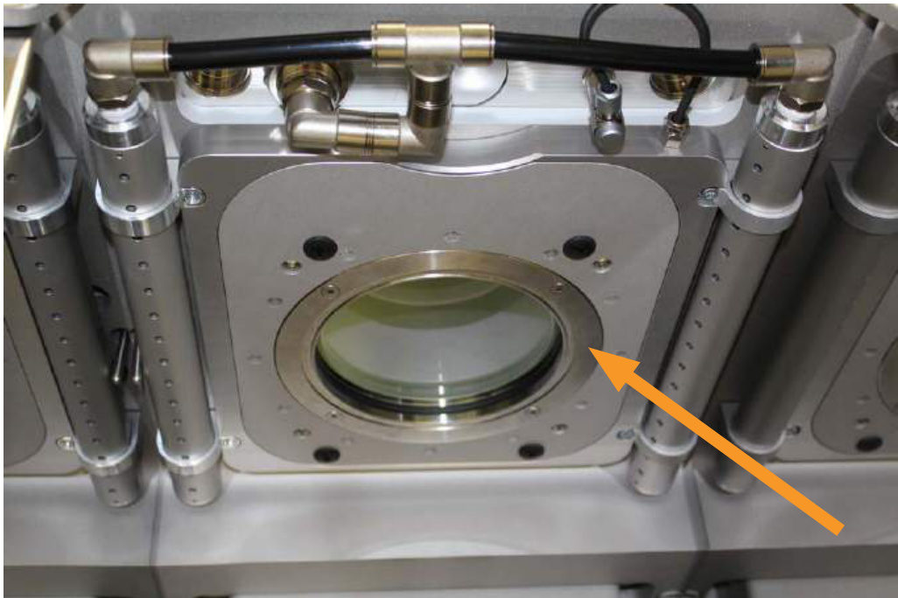  
Figure 339 Window protection system lens outer housing  

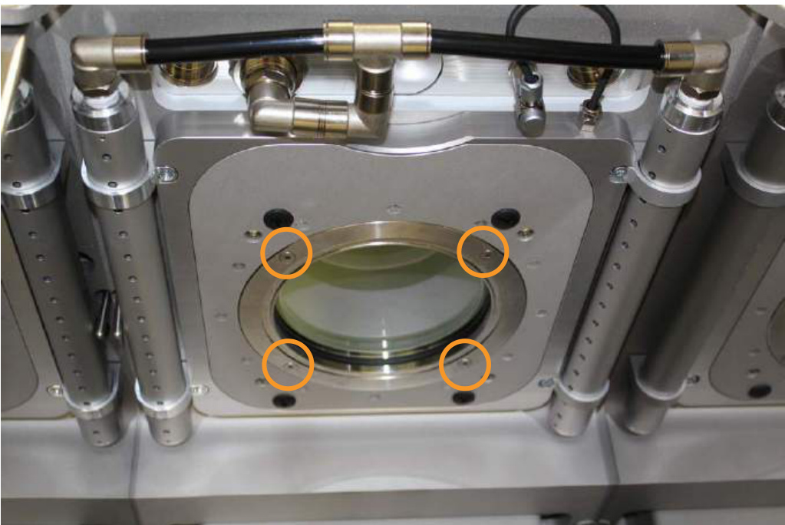  
Figure 340 Window protection system mounting bolts  

# 30.5.1.3 Window cleaning  

1. Place the lens protection assembly onto a clean workbench. It is not necessary to dismantle the lens protection assembly for a post-build clean.   
2. Apply optic cleaner (P-OPTA-0101) to a folded lens cleaning tissue (part number P-WI02-0002) and use it to clean the metal lens housing.   
3. Hold the lens protection assembly up to the light to look for dust or particles.   
4. Any loose particles can be blown off using clean dry air, either from an aerosol (Figure 341) or manual blower (Figure 342). Keep the nozzle at least $1 0 0 ~ \mathsf { m m }$ (4 in) from the lens surface.  

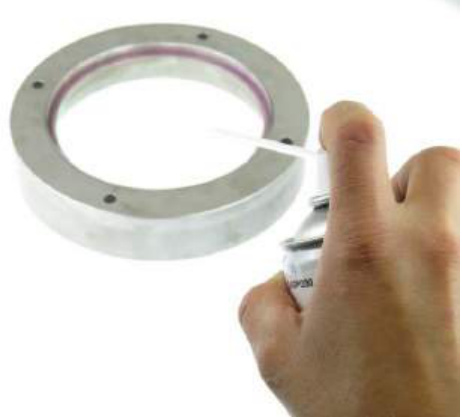  
Figure 341 Blow loose particles using clean dry air from a distance of $> 1 0 0 \mathrm { { m m } }$  

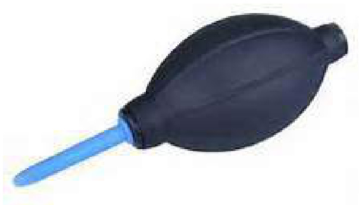  
Figure 342 Manual blower  

# Caution: Do not use a compressed air line to clean the lens protection assembly window, as it may contain oil or water which will contaminate the window.  

5. Put on clean gloves.   
6. Place a lens cleaning tissue on the surface of the window and dampen the back edge of the wipe with optic cleaner.   
7. Without lifting, slowly draw the lens cleaning tissue across the surface of the window. This should be done at approximately $2 0 ~ \mathsf { m m }$ /sec (1 in/sec) so that the liquid evaporates behind the tissue, leaving no streaks.   
8. After several wipes, inspect the window against a light. If there are particularly stubborn stains, take a wipe and fold it several times, then apply optic cleaner.   
9. Gently wipe the window applying minimal pressure. Do not wipe back-and-forth or in a circular motions.   
10. Once complete, there should be no streaks left on the window.   
11.	 Repeat the process for the other side of the window.  

# 30.5.1.4 Refitting the lens protection assembly window  

# Caution: Do not touch the surface of the window.  

1. Put on clean gloves.   
2. Fit the lens protection assembly to the top of the build chamber.   
3. Align the lens protection assembly bayonet lugs with the recesses in the top of the build chamber.   
4. Raise the lens protection assembly to engage the bayonet lugs, and twist clockwise until it will rotate no further. The lens protection assembly will rotate by 15 to $2 0 ^ { \circ }$ .   
5. Refit the four M4 bolts that secure the lens protection assembly in place, (Figure 343) and tighten with a $3 \mathsf { m m }$ (0.125 in) hexagon key to $5 N m$ .  

  
Figure 343 Lens protection assembly securing screws  

Note: You may need to move the lens protection assembly a little in order to align the bolt holes correctly. Take care not to touch the surface of the window or release the lens protection assembly from its bayonet fit.  

# 30.5.2 Deep clean of the lens protection assembly – AM250 with PlusPac and AM400 only  

1. Remove the lens protection assembly in accordance with Section 30.5.1.2. It is necessary to dismantle the lens protection assembly for a deep clean.  

Caution: Removing the lens protection assembly exposes the system optics to the environment. This should only ever be done following a thorough clean-down of the build chamber and the time open should be minimised – Renishaw recommend purchasing a second lens protection assembly or a bung and fitting it as soon as possible after removing the lens protection assembly.  

2. Place the lens protection assembly onto a clean workbench.   
3. Using a $2 . 5 \mathsf { m m }$ (0.0984 in) hexagon key remove the four bolts that secure the lens protection assembly together and separate the lens protection assembly.   
4. Apply optic cleaner (P-OPTA-0101) to a folded lens cleaning tissue (part number P-WI02-0002) and use it to clean the two halves of the lens protection assembly. Remove all traces of condensate from the lens protection assembly metal housing.   
5. Clean both sides of the window in accordance with Section 30.5.1.3.   
6. Refit the window into the lens protection assembly housing.  

# AM250/AM400 user guide  

7. Refit the four bolts that secure the lens protection assembly housing together and tighten with a $2 . 5 \mathsf { m m }$ (0.0984 in) hexagon key to 5 Nm. 8. Refit the lens protection assembly in accordance with Section 30.5.1.4.  

# 30.6 System clean-down – lower chamber  

Before the system is ready for the next build, the bottom chamber must be cleaned of any powder or process by-product.  

In normal operation a small amount of powder may bypass the build platform seals, if significant quantities are experienced it may indicate seal wear – contact your Renishaw service team.  

Keep the top chamber door open and then open the bottom chamber door on the AM250/AM400 system. Use a $1 9 \mathsf { m m }$ $3 / 4$ in) round brush and ATEX vacuum cleaner to remove all the powder residue and process by-product from the bottom chamber (Figure 344). For selection and correct use of the ATEX vacuum, see Section 14.2 – "ATEX vacuum cleaner (wet separator)".  

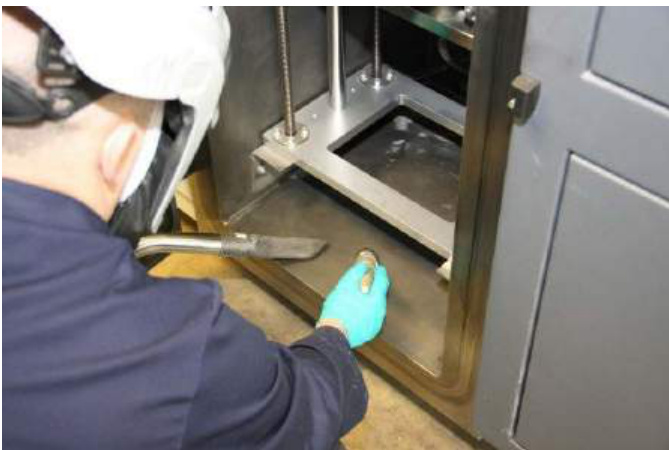  
Figure 344 Vacuum out lower chamber  

Apply isopropanol Class 3 to a disposable cloth and clean-down all surfaces in the bottom chamber (Figure 345).  

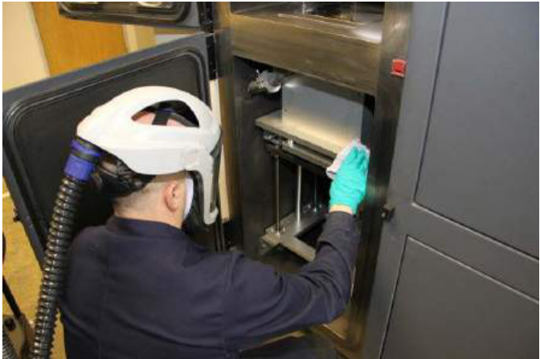  
Figure 345 Clean with isopropanol  

Clean the door seal by vacuuming away loose powder and finally using a cloth and cleaning solution (Figure 346).  

Once the bottom chamber is clean, the AM250/AM400 system is ready for installation of assemblies and setup of the next build process.  

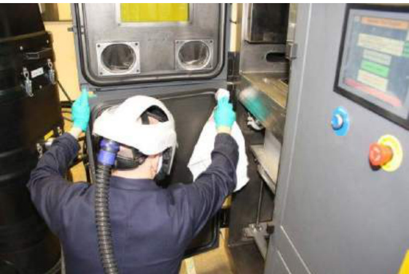  
Figure 346 Clean door seal  

# 30.7 System clean-down – material changeover  

When changing to a new material type additional cleaning will be required to ensure traces of the previous material are removed and cross contamination does not occur. Alloys of a similar composition may be tolerant to residual powder, if in doubt Renishaw recommends this cleaning procedure is followed in full.  

Before starting cleaning; the filter, all powder, and all powder bottles should be removed.  

Renishaw supply a changeover kit, which contains a spare set of components. This enables a set to be dedicated to each material, reducing cleaning time.  

Thoroughly clean the build chamber, by following Sections 30.2 and 30.3 Clean the lens: for AM250 follow Section 30.4 for AM250 with PlusPac and AM400 follow Section 30.5 Clean the lower chamber, Section 30.6 Remove the side covers, and clean the wiper drive, Section 30.7.1 Remove the silo, dismantle, clean, reassemble and re-install, Sections 32.1 to 32.4 and 32.8 Remove, exchange and re-install the dosing mechanism Sections 32.5, 32.6 and 32.7 Further cleaning of the top chamber will be required once silo, covers and doser have been removed Remove and clean (or replace) the system hoses, pipe work and fittings, Section 30.7.2 Clean the overflow manifolds, Section 30.7.3 Clean the recirculation pump as far as is practical, Section 30.7.4 A sieve for each material is preferable, alternatively clean the sieve, Section 14.3.3 to 14.3.5 Clean the exterior and interior of the system • Once satisfied reassemble all components.  

# 30.7.1 Clean the wiper drive  

Drive the wiper to its mid position, using the HMI interface.  

Now remove the two side covers.  

Remove the bottom rear screw, followed by bottom front screw.  

Support the cover whilst removing the screw on the front face.  

Slide the cover forward and out.  

Using an ATEX approved vacuum, clean any loose powder from the drive mechanism, pay particular attention to the drive belts.  

Clean the belts, pulleys, and arms using a cloth and isopropanol alcohol. (Figure 347).  

  
Figure 347 Clean drive mechanism  

Avoid using isopropanol alcohol on the guide rails, as they are lightly lubricated.  

# WARNING: DO NOT OPERATE THE SYSTEM WITH GUARDS/COVERS REMOVED.  

# 30.7.2 Replace and clean hoses and pipework  

All system hoses and pipework that have powder or powder processing waste passing through them must be cleaned or replaced as necessary.  

Remove swing clamps to release the hose assembly.  

If a changeover kit is being used, replace the hoses and pipes and label all pipes with material type.  

Replace swing clamps to reattach the hose assembly.  

Alternatively clean the hoses, pipework and fittings.  

Using a screwdriver remove the worm drive hose clamps.  

Remove the stainless steel KF flanges from each end of the pipes.  

Using a cloth and isopropanol alcohol, clean the inner bore of the hoses, pipework and fittings.  

Reassemble: reinsert the stainless steel KF flanges, tighten the worm drive hose clamps to retain the pipe.  

# 30.7.3 Clean the overflow manifolds  

Use the ATEX vacuum cleaner (wet separator) and a long brush to clean any loose powder from the manifolds.  

As far as is practical, clean the internal surfaces of the manifolds and tube using a cloth and isopropanol alcohol.  

# 30.7.4 Clean the recirculation pump  

Using the ATEX vacuum cleaner (wet separator), clean any loose powder from around the recirculation pump. As far as is practical clean inside the pump inlet and outlet to remove powder from inside the pump.  

Clean the external surfaces, inlet and outlet using a cloth and isopropanol alcohol.  