# 31.1 Introduction  

It is outside the scope of this user guide to define heat treatment methods and processes for AM parts once they have been built. However the following considerations should be made:  

Thick sections may have higher stress and require a normalisation or annealing heat treatment. Builds with a large cross sectional area will have a longer period between laser passes and require heat treatment. Some materials, such as titanium alloy may have higher internal stress following build and require heat treatment as soon as the build finishes. • Almost all alloys will oxidise at elevated temperatures. It is essential that heat treatment is carried out under vacuum or inert gas. For metals that are susceptible to nitrogen embrittlement it is essential that the inert gas is argon (titanium and INCONEL® for example). Renishaw can supply furnace foil wrap (part number 845500000). This is used to provide an extra layer of protection when used in conjunction with an inert gas box.  

For detailed furnace programming and operating instructions, refer to the User guide for your furnace and applicable local procedures.  

# 31.2 Wrapping parts prior to heat treatment  

Renishaw recommends that parts are wrapped in furnace foil wrap as follows:  

Ensure enough foil is used to wrap the part, (Figure 348).  

  
Figure 348 Amount of foil to wrap the part  

Fold and cover approximately $^ 1 / _ { 4 }$ of the part, (Figure 349).  

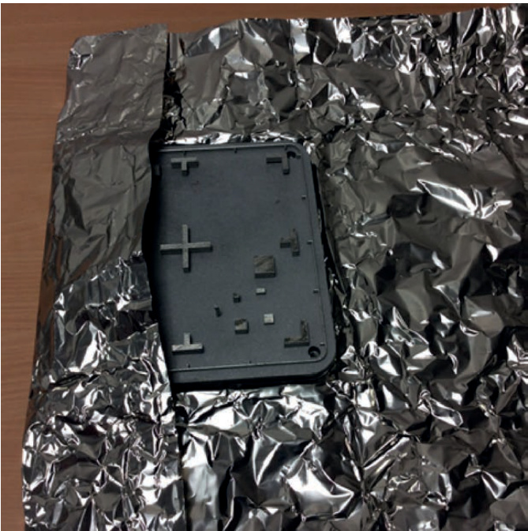  
Figure 349 Fold and cover  

Flip the part over and fold the remaining foil under, (Figure 350).  

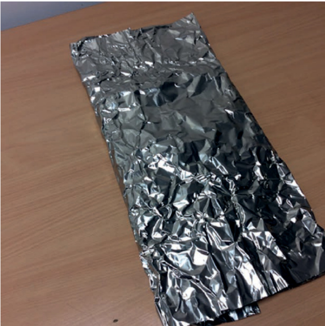  
Figure 350 Fold remaining foil under  

Crimp any open ends of the foil parcel, (Figure 351).  

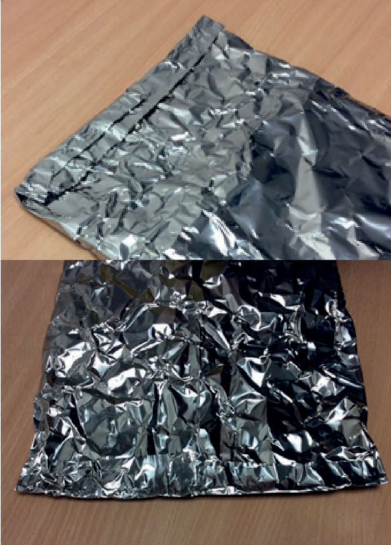  
Figure 351 Crimp any open ends  

Flip the part over again, (Figure 352).  

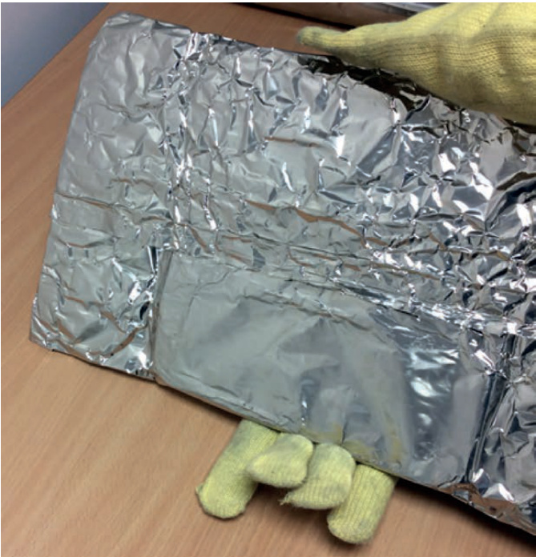  
Figure 352 Flip part over again  

Fold over the edges, (Figure 353).  

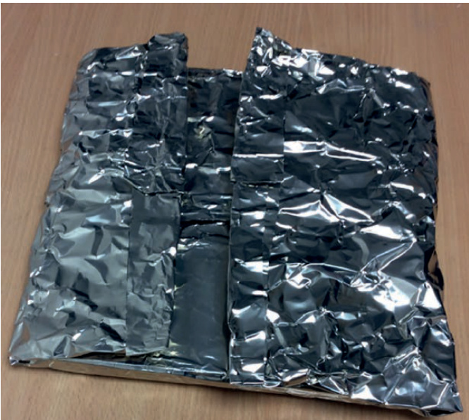  
Figure 353 Fold over edges  

The part is now fully wrapped, (Figure 354).  

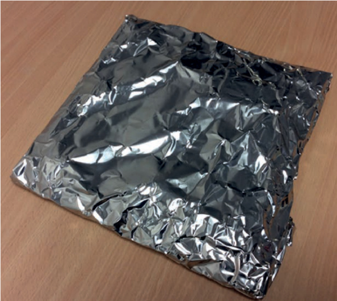  
Figure 354 Part now fully wrapped  

Place the fully wrapped part in a furnace box, (Figure 355).  

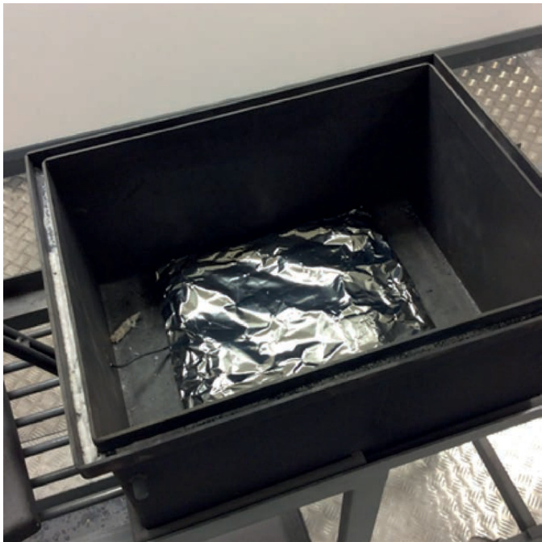  
Figure 355 Place part in furnace box  

With the part in the furnace box cover with an additional piece of furnace foil that extends to the edges of the furnace box, (Figure 356).  

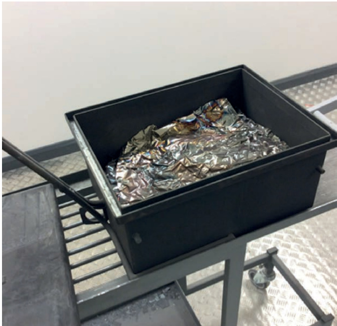  
Figure 356 Cover the wrapped with foil  

Fit the lid to the furnace box and place the part in the furnace, (Figure 357).  

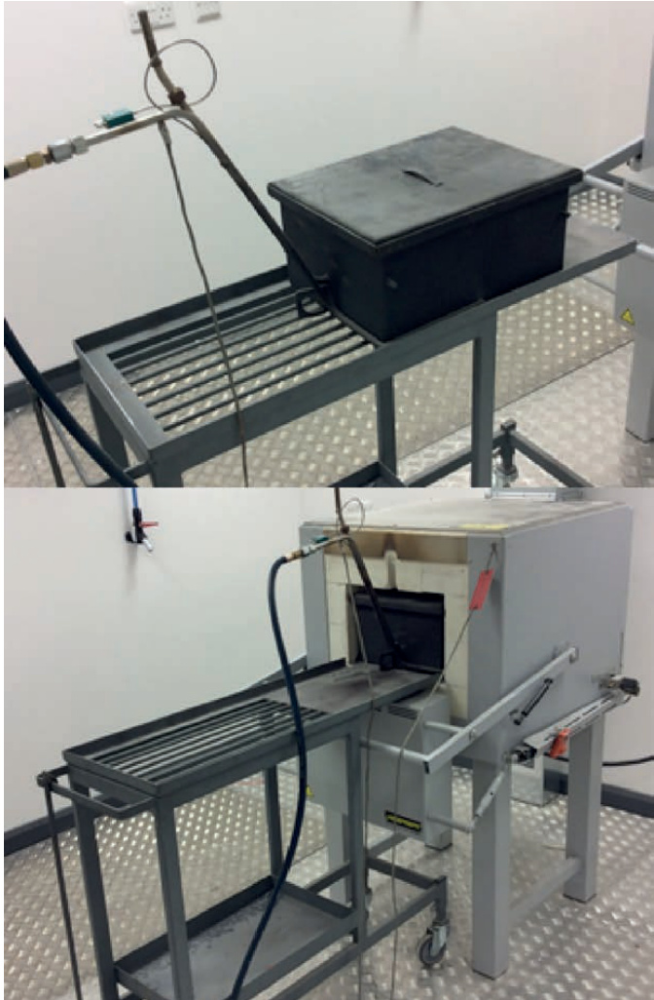  
Figure 357 Place the part in the furnace  

# 32 Silo and dosing mechanism removal/exchange  

One of the main features of the Renishaw AM250/AM400 is the relative ease by which the system can be switched between different materials by removing the silo and using the powder changeover kit which includes overflow pipes and valves etc.  

If the silo is to be exchanged for one dedicated to a different material, then skip step 32.1.  

WARNING: ALWAYS WEAR THE CORRECT PERSONAL PROTECTIVE EQUIPMENT BEFORE STARTING – GLOVES/GAUNTLETS, FULL LENGTH CLOTHING, (MADE FROM NON-STATIC GENERATING FABRIC SUCH AS COTTON (AVOID WOOL AND MAN MADE FABRICS) AND AVOID TURN-UPS OR POCKETS THAT MAY TRAP POWDER, REFER TO NFPA 484 FOR DETAILS) AND RESPIRATORY MASK.  

# 32.1 Emptying the silo  

Dose all the powder out of the silo into overflow bottles for storage under inert atmosphere. Follow the procedure for dosing mechanism removal.  

Once empty, close the valve (IV1) on the silo nose by moving the levers into the vertical position (Figure 358).  

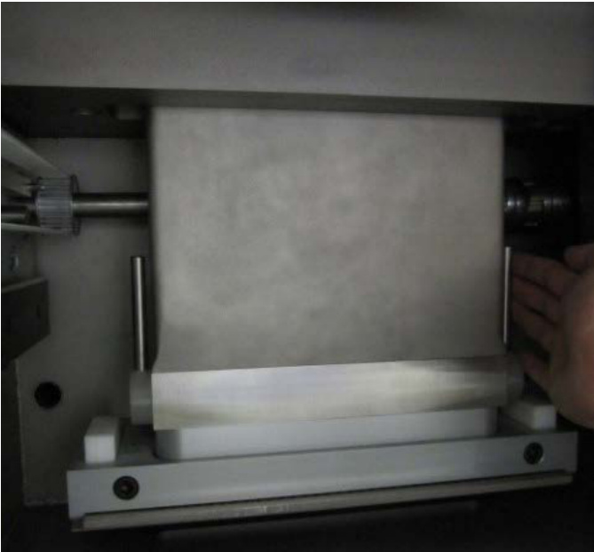  
Figure 358 Valve (IV1) in the closed position on silo nose  

# 32.2 Removing the silo  

# WARNING: REMOVING THE SILO OPENS THE CLASS 1 LASER ENCLOSURE. THE AM250/ AM400 SYSTEM MUST BE SHUTDOWN AND ELECTRICALLY ISOLATED BEFORE REMOVING THE SILO.  

Disconnect the powder level sensor lead on the top panel of AM250/AM400 system (Figure 359).  

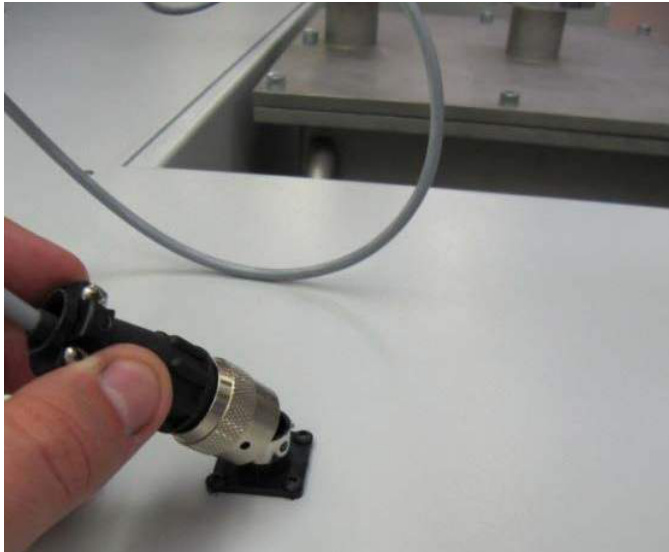  
Figure 359 Disconnection of the powder level sensor  

# WARNING: THE SILO WEIGHS 44.4 KG (97 LB) WHEN EMPTY.  

The silo is heavy and should be emptied before removal. A suitable lifting method must be identified and risk assessed – gantry crane, lifting trolley or multi-person lift. Renishaw recommend using a Renishaw silo changeover lift part number M-5771-1000.  

Tor remove the silo from the AM250/AM400 system, remove the four M8 bolts from the silo flange using a $6 ~ \mathsf { m m }$ hexagon key (Figure 360).  

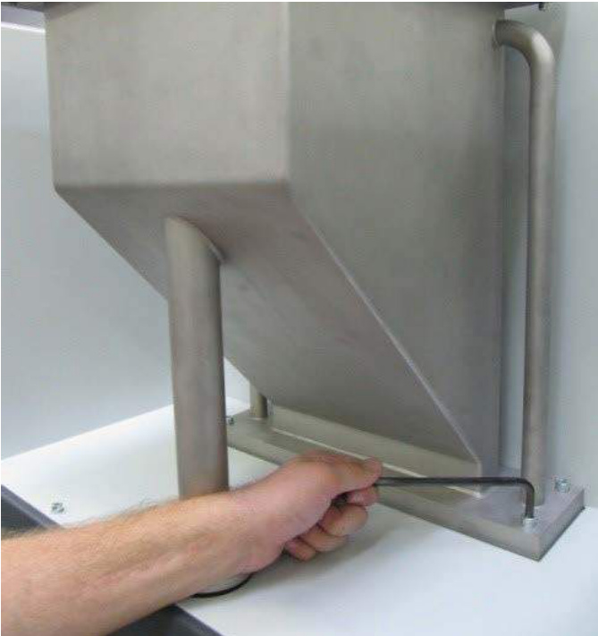  
Figure 360 Remove the four bolts  

Lift the silo vertically from the AM250/AM400 system.  

Once the silo is raised completely out of its assembly position, lower and store safely.  

# WARNING: WHEN THE SILO IS CLEAR OF THE AM250/AM400 SYSTEM, ENSURE THAT THESILO IS LOWERED TO JUST ABOVE GROUND LEVEL TO MINIMISE RISK OF IT FALLING.  

# 32.3 Disassembling and cleaning the silo  

Renishaw recommend maintaining a separate silo for each material. However it is possible to clean the silo.  

WARNING: ALWAYS WEAR THE CORRECT PERSONAL PROTECTIVE EQUIPMENT BEFORE STARTING – GLOVES/GAUNTLETS, FULL LENGTH CLOTHING, (MADE FROM NON-STATIC GENERATING FABRIC SUCH AS COTTON (AVOID WOOL AND MAN MADE FABRICS) AND AVOID TURN-UPS OR POCKETS THAT MAY TRAP POWDER, REFER TO NFPA 484 FOR DETAILS) AND A RESPIRATORY MASK.  

Wipe down all external components with isopropanol and a cloth.  

Open the latch and remove the clamp (L3) on the powder sensor (Figure 361). Carefully remove the powder sensor, valve and o-rings.  

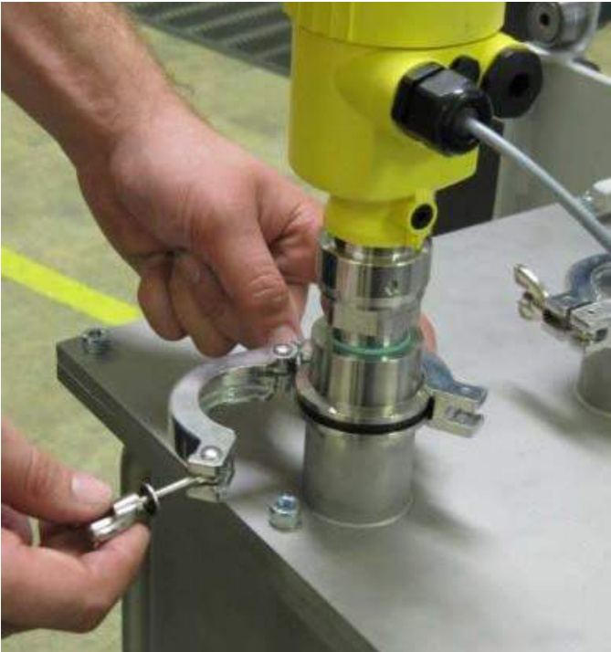  
Figure 361 Disassembly of powder sensor clamp (L3)  

Open the latch and remove the clamp (L2) and o-ring on the silo isolation valve (V1) (Figure 362).   
Remove the eight M8 bolts from the silo lid using a 6 mm hexagon key (Figure 363).  

  
Figure 362 Removing the silo isolation valve (V1) clamp (L2)  

WARNING: THE SILO LID IS HEAVY. ENSURE THAT THE CORRECT MANUAL HANDLING PROCEDURE IS FOLLOWED WHEN LIFTING IT.  

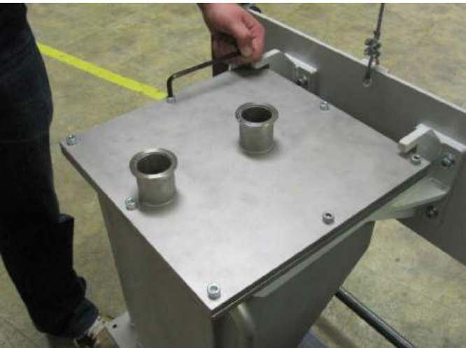  
Figure 363 Removing the silo lid  

Remove the silo lid (Figure 361). Clean with isopropanol and a disposable cloth (Figure 364).  

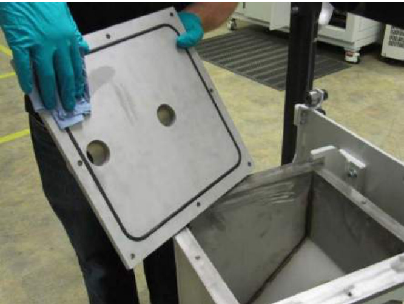  
Figure 364 Clean lid with isopropanol  

Clean the inside of the silo with isopropanol and a disposable cloth, ensuring that the silo nose is thoroughly clean (Figure 365). Leave the disassembled silo for approximately 24 hours to ensure it is fully dry.  

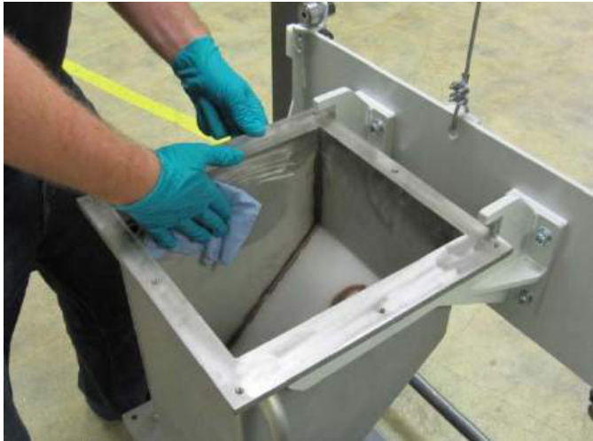  
Figure 365 Cleaning inside of the silo with isopropanol  

Take the opportunity to clean the back wall of the process chamber (this is normally hidden behind the silo nose).  

WARNING: ENSURE THAT THE SILO REMAINS SECURE THROUGHOUT THE CLEANING PROCESS AT THE MINIMUM HEIGHT ABOVE GROUND LEVEL.  

# 32.4 Assembling the silo  

Ensure disassembling and cleaning the silo has been completed, see Section 32.3 "Disassembling and cleaning the silo".  

Fit the lid to the silo. Align the lid, so that edge of the lid with a KF flange closest to its edge is aligned with the vertical face of the silo, (Figure 366).  

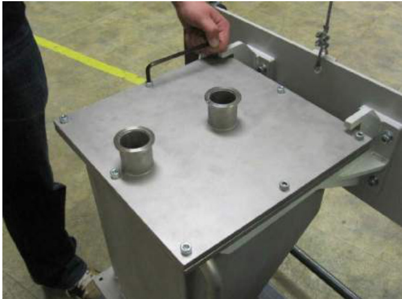  
Figure 366 Aligning the silo lid with the vertical face of the silo  

Fit the eight M8 bolts and tighten them finger tight.  

Using a 6 mm hex key and a torque wrench, tighten the eight M8 bolts to 10 to 16 Nm. Use the tightening sequence in (Figure 367).  

  
Figure 367 Silo lid tightening sequence   
Figure 368 Empty powder silo  

Place an centring ring on both KF flanges of the silo lid.  

Locate the powder sensor over the centring ring on the outer flange, and secure with a swing clamp (L3).  

Fit the silo isolation valve (V1) to the central boss on the lid using a centring ring and swing clamp (L2).   
Ensure the silo isolation valve (V1) is closed (lever at $9 0 ^ { \circ }$ to the flow direction).  

# 32.5 Removing the dosing mechanism  

WARNING: ALWAYS WEAR THE CORRECT PERSONAL PROTECTIVE EQUIPMENT BEFORE STARTING – GLOVES/GAUNTLETS, FULL LENGTH CLOTHING (MADE FROM NON-STATIC GENERATING FABRIC SUCH AS COTTON (AVOID WOOL AND MAN MADE FABRICS) AND AVOID TURN-UPS OR POCKETS THAT MAY TRAP POWDER, REFER TO NFPA 484 FOR DETAILS) AND A RESPIRATORY MASK.  

If the silo is still assembled, close the valve (IV1) on the sides of the silo inside the build chamber nose – levers in the upright position.  

Empty the powder remaining in the dosing mechanism by selecting the following on the user interface (Figure 368 and Figure 369):  

<html><body><table><tr><td colspan="2">Esc. Service Menu</td></tr><tr><td>Set Time and Date</td><td>Laser Menu</td></tr><tr><td>I/O Monitor</td><td></td></tr><tr><td>PC Comms Monitor</td><td>SystemLock</td></tr><tr><td>Network Addresses</td><td>System Tests</td></tr><tr><td>RS232 Comms</td><td></td></tr><tr><td>Reset Alarm History</td><td>EmptyPowder Silo</td></tr><tr><td></td><td>Dosing Test</td></tr><tr><td>System Settings</td><td>User Settings</td></tr><tr><td>Passwords</td><td>PC On/Off Override</td></tr><tr><td>Run Counters</td><td>UPS Settings</td></tr></table></body></html>  

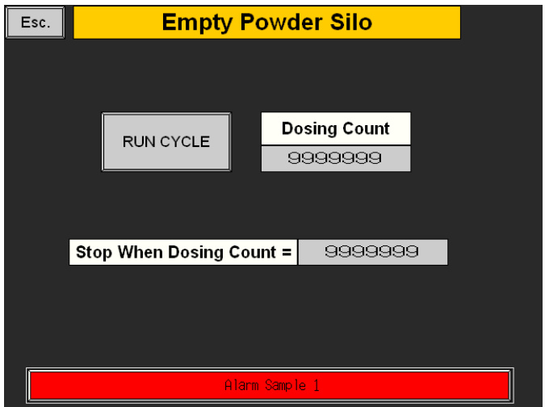  
Figure 369 Enter 250 and run cycle  

Service Menu $>$ Empty Powder Silo $>$ Stop When Dosing Count $= 2 5 0 >$ Run Cycle  

Observe the dosing mechanism. Once empty, the cycle can be stopped by toggling:  

# $>$ Run Cycle  

Ensure that the system has been cleaned down.  

Either remove or raise the silo by approximately $5 0 ~ \mathsf { m m }$ (2 in) to gain access.  

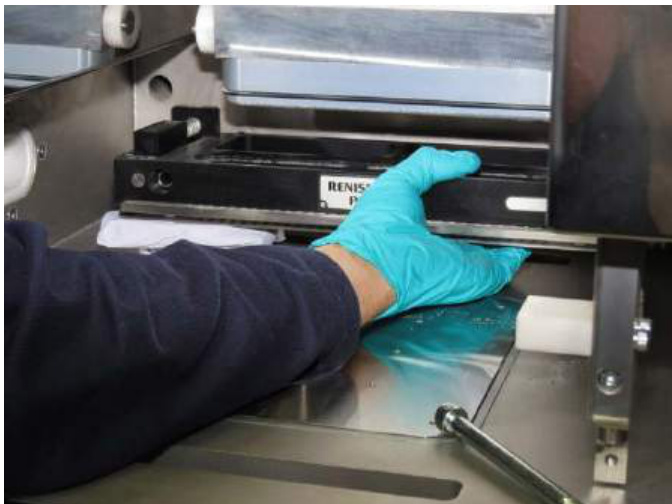  
Figure 370 Support doser  

Support the dosing mechanism to prevent it from dropping. It may help to insert some packing material or a cloth (Figure 370).  

  
Figure 371 Removal of dosing mechanism bolts  

Remove the two M10 bolts on the front face of the dosing mechanism using an 8 mm hexagon key (Figure 371).  

Pour any remaining powder in the dosing mechanism down the front overflow.  

Remove the dosing mechanism from the AM250/AM400 system, ready for storage (Figure 372).  

  
Figure 372 Remove dosing mechanism for storage  

# 32.6 Exchange the dosing mechanism  

Renishaw recommend that you keep a separate dosing mechanism for each different material type you intend to use in your AM250/AM400 system. Renishaw recommend you label your dosing mechanisms to avoid cross contamination of materials between dosing mechanisms.  

Caution: Renishaw recommend that you DO NOT disassemble your dosing mechanism. The dosing mechanism is a complex piece of equipment and errors is disassembly/assembly will affect the quality of built parts.  

Exchange the dosing mechanism for the dosing mechanism assigned to the material you intend to use next.  

# 32.7 Re-install the dosing mechanism  

With the silo removed or elevated clear by at least $5 0 ~ \mathsf { m m }$ (2 in), and with the dosing strip facing into the build chamber, offer the dosing mechanism up to the threaded holes in the rear of the chamber. It may help to insert some packing material to support one end (Figure 373).  

  
Figure 373 Locate dosing mechanism at rear of chamber  

Locate the two M10 bolts in the threaded holes and tighten using an $8 \ : \mathrm { m m }$ hexagon key to approximately $1 6 \mathsf { N m }$ (11.8 lbf/ft) (Figure 374).  

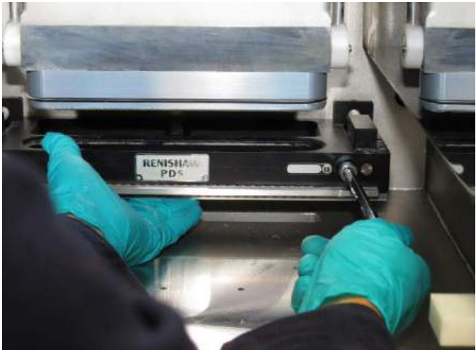  
Figure 374 Tighten bolts  

Gently lower the silo. It will engage with the doser (Figure 375). Insert and tighten the four silo mounting bolts on the rear of the system.  

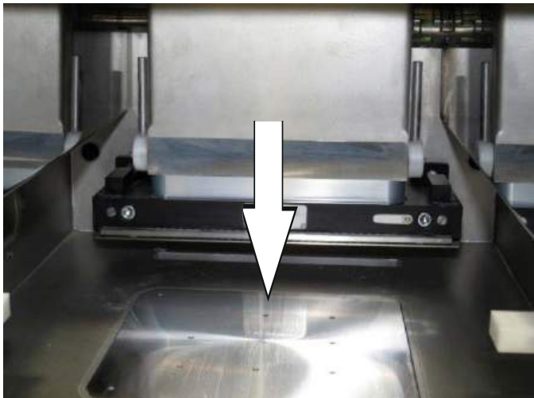  
Figure 375 Lower the silo into the dosing mechanism (shown with the valve (IV1) closed)  

Open the doser isolation valve (IV1) by pushing away until it is horizontal and clicks into place (Figure 376).  

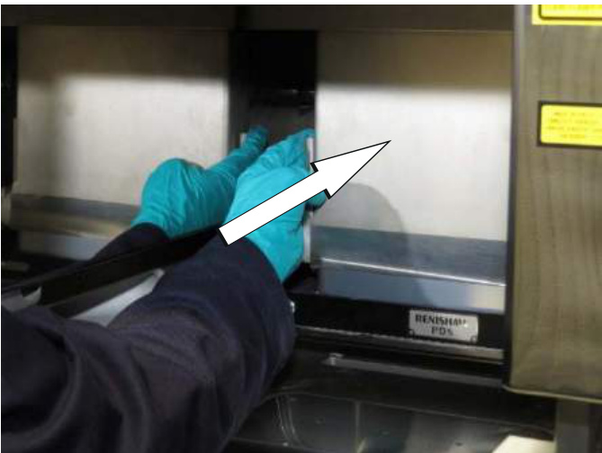  
Figure 376 Open the doser isolation valve (IV1)  

# 32.8 Re-installing the silo  

WARNING: THE SILO MUST BE SECURED TO THE SILO LIFT BRACKET AT ALL TIMES.  

WARNING: THE SILO SHOULD ONLY BE RAISED ON INSTALLATION WHEN IT IS BEHIND THE AM250/AM400 MACHINE.  

# WARNING: THE SILO WEIGHS 44.4 KG (97 LB) WHEN EMPTY.  

After the silo has been assembled see Section 32.4 "Assembling the silo", lift the silo by locating the top face under the lugs on the silo lift.  

Without raising the silo on the silo lift, move the silo lift to the rear of the AM250/AM400 system.  

Pump the handle to raise the silo, until there is clearance between the bottom of the silo assembly and the AM250/AM400 system.  

Move the silo lift towards the AM250/AM400 into the correct position for silo installation – so that the silo nose is above the aperture, (Figure 377).  

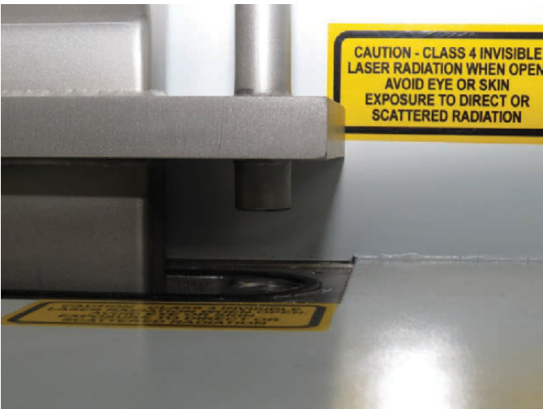  
Figure 377 Silo positioned for installation  

Lower the silo into position. As the silo assembly reaches its final position ensure that the nose locates correctly into the dosing mechanism and that the equalising pipes locate into the corresponding holes in the rear of the machine.  

Lower the silo lift and move clear of the AM250/AM400 system.  

Install the four M8 bolts, tighten the bolts using a $5 \mathsf { m m }$ hex key and a torque wrench to $1 6 N m$ .  