# 33 Inspection and maintenance  

# 33.1 AM250/AM400 system maintenance  

WARNING: WHEN LOGGED INTO THE SYSTEM AT LEVEL 4 FOR MAINTENANCE ACTIVITY, CERTAIN TASKS WILL RESULT IN CLASS 2 LASER EMISSIONS. WHERE THIS OCCURS THE TASK WILL IDENTIFY THIS, AND DESCRIBE THE STEPS TO BE TAKEN TO MINIMISE ANY POSSIBLE EXPOSURE.  

Renishaw recommend that the AM250/AM400 is maintained in accordance with the following maintenance schedule. There are some differences in the maintenance for an AM250 and an AM250 with PlusPac/AM400 – these are identified where they are applicable.  

WARNING: ENSURE YOU ARE WEARING THE CORRECT PPE BEFORE YOU START ANY MAINTENANCE: EYE PROTECTION, FULL FACE RESPIRATOR (TO EN143 TYPE $\mathsf { P 3 } \plus \mathsf { A 1 }$ ), PROTECTIVE GLOVES AND FULL LENGTH CLOTHING, MADE FROM NON-STATIC GENERATING FABRIC SUCH AS COTTON (AVOID WOOL AND MAN MADE FABRICS) AND AVOID TURN-UPS OR POCKETS THAT MAY TRAP POWDER, REFER TO NFPA 484 FOR DETAILS) BEFORE STARTING THIS TASK.  

# 33.1.1 Operator maintenance  

# 33.2 Anciliary equipment maintenance  

In addition to the AM250/AM400 system maintenance, ancillary equipment must also be maintained as follows:  

See Section 14.4.3 "Regular inspection and maintenance" for details of the silo lift maintenance. See Section 14.1.2 "Basic chiller maintenance" for details of the chiller maintenance.   
See Section 14.2.1 "ATEX vacuum cleaner (wet separator) safety checks" for details of the ATEX vacuum cleaner (wet separator) safety checks.   
Refer to the manufacturers User guide for details of the ATEX vacuum cleaner (wet separator) maintenance, see Section 37 Appendix D "Supplier manuals" for information on the make, model and manufacturer.   
Refer to the manufacturers User guide for details of the powder recovery system (sieve) maintenance, see Section 37 Appendix D "Supplier manuals" for information on the make, model and manufacturer.   
Refer to the manufacturers User guide for details of the laser system maintenance, see   
Section 37 Appendix D "Supplier manuals" for information on the make, model and manufacturer. Refer to the manufacturers User guide for details of the dehumidifier maintenance (AM400 only), see Section 37 Appendix D "Supplier manuals" for information on the make, model and manufacturer.   
If additional ancillary equipment, for example a furnace, has been purchased; refer to the manufacturers User guide for details of any maintenance requirements. See Section 37   
Appendix D "Supplier manuals" for information on the make, model and manufacturer.   
Refer to the manufacturers User guide for details of gas detection system maintenance.  

WARNING: THERE MAY BE APPLICABLE LOCAL LEGISLATION REGARDING MAINTENANCE REQUIREMENTS FOR CERTAIN EQUIPMENT ON THE AM250/AM400. REFER TO ANY APPLICABLE LOCAL LEGISLATION REGARDING MAINTENANCE OF EQUIPMENT FOR DETAILS.  

# 33.3 System and air filter maintenance  

There are six filters on the AM250 and five filters on the AM400 system. They need to be cleaned monthly to ensure full working efficiency and air flow through the system. The AM400 filters are larger than the filters fitted to AM250.  

# 33.3.1 AM250 filters  

There are two on the top panel and four are located on the back, (Figure 378).  

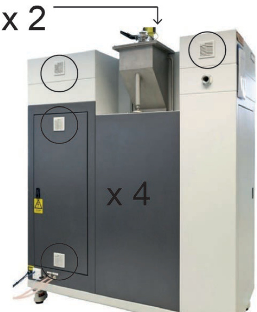  
Figure 378 Rear of AM250 showing air filters  

# 33.3.2 AM400 filters  

There are four filters located on the right hand end and one filter on the back in the top right corner above the argon vent, (Figure 379).  

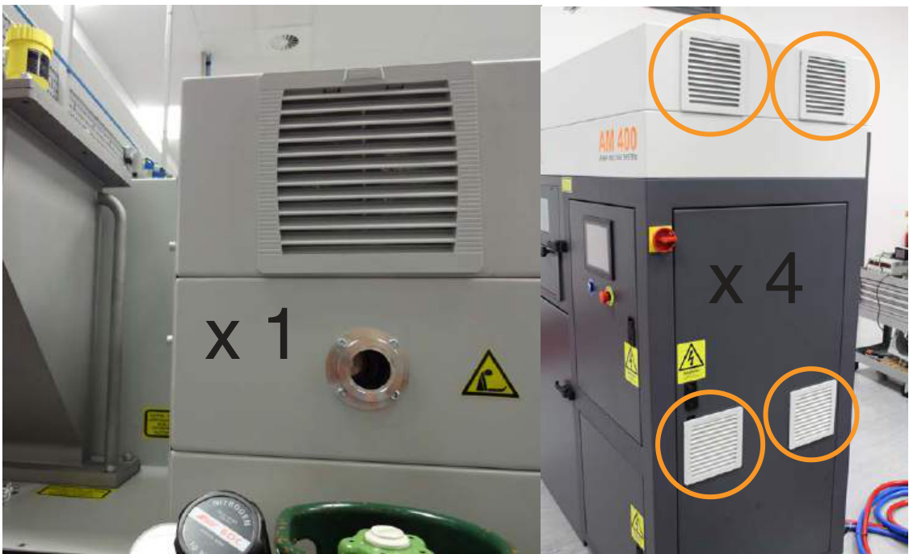  
Figure 379 Rear and right hand side of AM400 showing air filters  

# 33.3.3 Cleaning AM250/AM400 filters  

Using a screwdriver, unclip the machine cover carefully, (Figure 380) from the AM250/AM400.  

  
Figure 380  Lever off cover with screwdriver  

Once unclipped from the AM250/AM400 system, disassemble the filter from the cover.  

Discard the used filter and clean the casing using a vacuum cleaner, (Figure 381).  

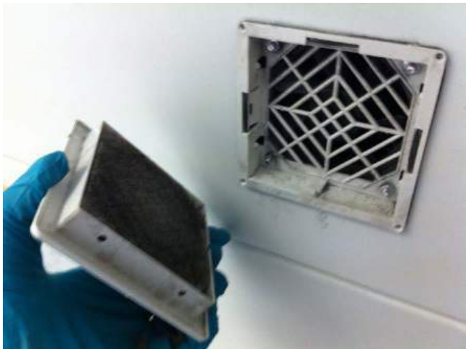  
Figure 381 Contaminated filter assembly  

Fit a new filter (part number 792460000 - AM250 and part number M13FPFK - AM400).  

Fit the cleaned filter assembly back into the AM250/AM400 system.  

# 33.4 Gas safety checks  

Carry out a safety check of the gas system and ensure it is in working condition with no leaks. Replace and damaged or defective parts as required. Keep records of when the gas safety check is carried out.  

# WARNING: GAS REGULATORS CANNOT BE CALIBRATED AND MUST BE REPLACED AT THE END OF THEIR LIFETIME. THE LIFETIME IS DETERMINED BY THE MANUFACTURER OF THE REGULATOR BUT IS TYPICALLY FIVE YEARS.  

# 33.5 Powder safety checks  

Renishaw recommend that you develop a maintenance regime for your powder, powder storage and powder handling areas. Periodically check that powder is being stored correctly in line with applicable Safety Data Sheets and powder suppliers recommendations. Periodically powder storage and handling areas must be deep cleaned to remove all powder traces. Metal powder is very fine and can find its way into very small spaces where it can accumulate with the consequential risk of explosion. Deep cleaning of areas and equipment, including but not restricted to trunking, ducting, ceiling tiles, flooring, furniture, etc must be done to remove all traces of powder.  

# 33.6 AM250/AM400 system batteries  

The AM250/AM400 system contains a number of non-rechargeable lithium batteries. These batteries have a shelf life of 5 years (at $2 5 ^ { \circ } \mathsf { C }$ ), however replacement is recommended at least every 3 years.  

WARNING: BEFORE CARRYING OUT ANY MAINTENANCE ACTIVITIES ON THE AM250/AM400 SYSTEM THAT REQUIRES OPENING THE ELECTRICAL CABINET OR REMOVING THE PC, THE AM250/AM400 SYSTEM MUST BE ELECTRICALLY ISOLATED, AND CAPACITORS ALLOWED TO DISCHARGE. WHEN OPENING THE PC OR HANDLING PRINTED CIRCUIT BOARDS ESD PRECAUTIONS SHOULD BE CARRIED OUT – EITHER TOUCH A GROUNDED PIECE OF METAL TO DISCHARGE STATIC ELECTRICITY FROM YOUR BODY, OR USE A GROUNDING WRIST STRAP.  

The lithium batteries provide power to the backup memory of system parameters and settings, removing a battery may wipe the backup memory. Ensure backup data is available.  

WARNING: CAUTION SHOULD BE TAKEN WHEN HANDLING AND DISPOSING OF BATTERIES:DO FOLLOW BATTERY DISPOSAL ADVICE AND ANY INTERNAL WASTE MANAGEMENTPROCESSES AND PROCEDURES.  
DO NOT EXPOSE THE BATTERIES TO HIGH TEMPERATURES INCLUDING DIRECT SUNLIGHTOR INCINERATE.  
DO NOT TRY TO RECHARGE A PRIMARY (NON-RECHARGEABLE) CELL.  
DO NOT CRUSH, DISASSEMBLE BREAK OPEN OR ABUSE THE BATTERIES.  
NEVER USE A BATTERY THAT HAS BEEN DROPPED ON THE FLOOR OR OTHERWISESUBJECT TO SHOCK AS IT MAY LEAK.  
DO NOT SHORT-CIRCUIT THE BATTERY.  

Renishaw recommend that batteries are only replaced by experienced technicians.  

# 33.6.1 HMI human machine interface battery  

Battery Type: CR14250SE-R  

1. The battery for the HMI is located on the back of the HMI screen within the top electrical cabinet.  

2. To access this battery, open the door to the top electrical cabinet.  

3. The battery is located in the bottom right hand corner of the HMI, (Figure 382).  

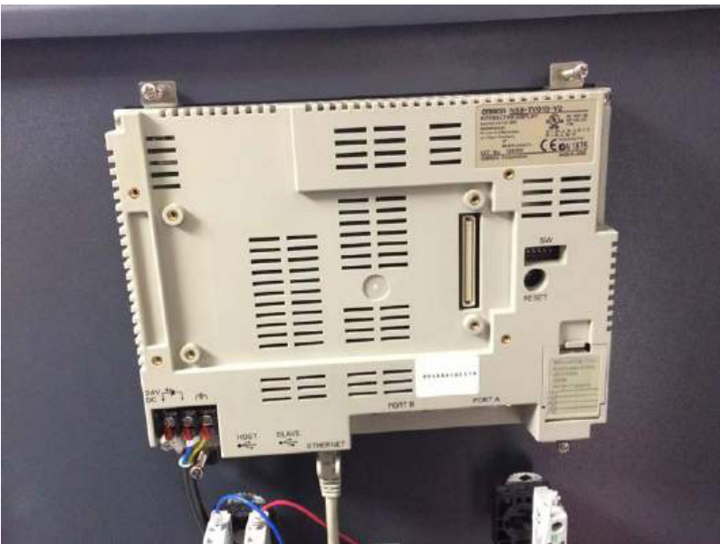  
Figure 382  Rear of HMI screen  

4.	 Press down on the tab securing the battery compartment lid and open the battery compartment, (Figure 383).  

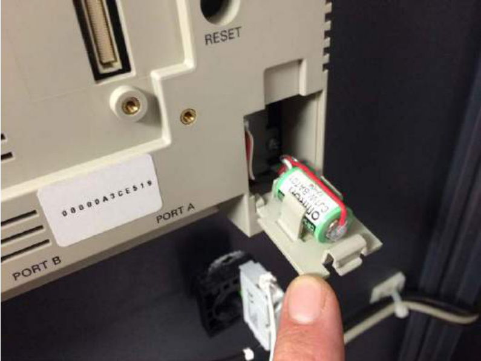  
Figure 383  Battery mounted on battery compartment lid  

5. Remove the battery and fit a replacement, (Figure 384).  

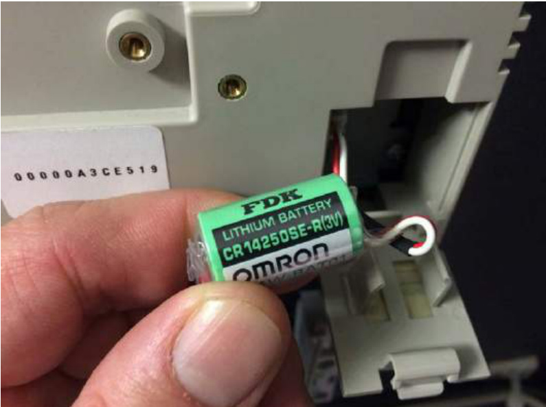  
Figure 384  Battery removed from compartment lid  

6. Close the battery compartment lid.  

# 33.6.2 PC battery  

Battery type: CR2320  

1. The battery for the PC is located within the PC case, near the cooling fan.   
2. Before removing the battery, ensure the BIOS settings have been recorded as the PC will reset once the battery is removed.   
3. Open the lower electrical cabinet door to find the front of the PC case.   
4. To access the battery, the PC must be removed from the AM250/AM400 system and its case opened.   
5. If necessary note and record the location of the connections at the rear of the PC case, (Figure 385).   
6. Remove the connections from the rear of the PC, (Figure 307).   
7. On the front of the PC use a $5 \mathsf { m m }$ hexagon key and remove the four retaining screws that secure the PC, (Figure 386).  

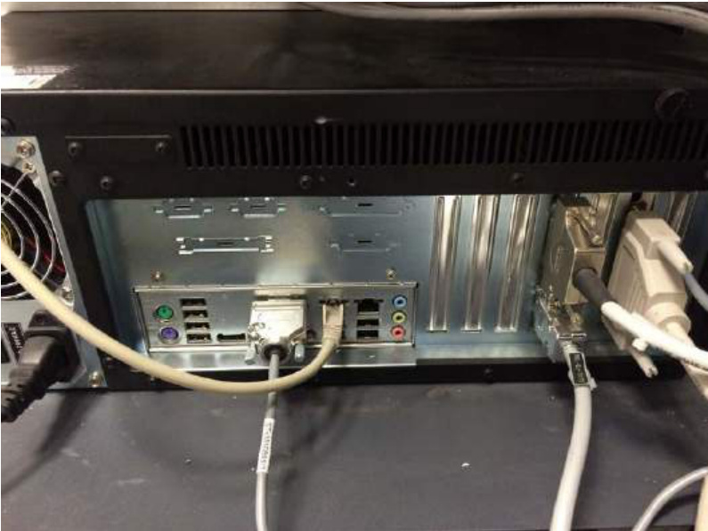  
Figure 385  PC connections  

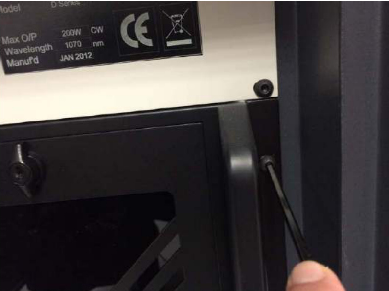  
Figure 386  PC retaining screws  

8. The PC can now be removed from the AM250/AM400 using the two handles on the left and right sides of the front of the PC case. As the PC slides out, support its weight to ensure it does not fall and become damaged, this may be a two-person lift.  

9. Remove the screws securing the case and remove the case, (Figure 387).  

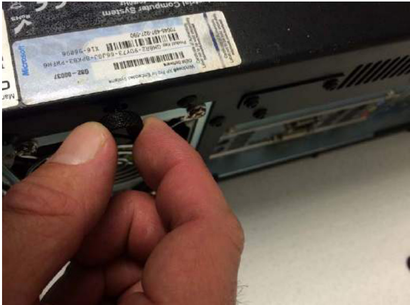  
Figure 387  Case retaining screws  

10.	 The battery is located near the cooling fan, (Figure 388) circled and (Figure 389) circled.  

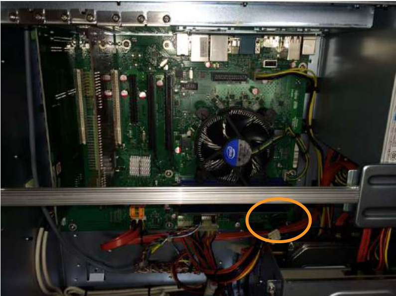  
Figure 388  Battery location  

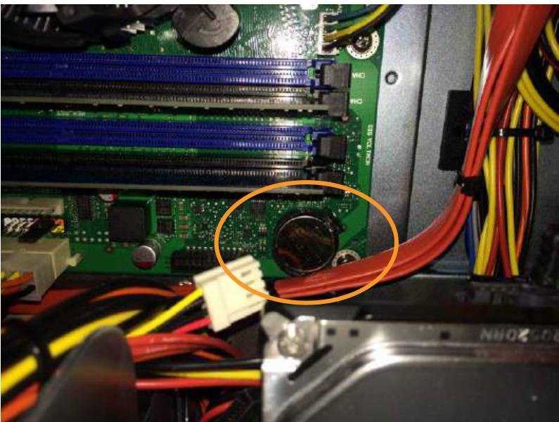  
Figure 389  Battery location  

11.	 Remove the battery from the motherboard and replace with a new battery.  

12.	 Refit the PC case and secure with the retaining screws. Refit the PC back into the AM250/ AM400 and secure with four screws. Refit the connections at the rear of the AM250/AM400 using any notes made during removal.  

# 33.6.3 Oxygen sensor board batteries  

Battery type: CR2430 x 2  

1. The batteries for the oxygen sensor control boards are located within the top electrical cabinet.  

2. Open the cabinet door.  

3. Both batteries can be seen at the bottom left and right hand sides of the cabinet, behind plastic covers, (Figure 390).  

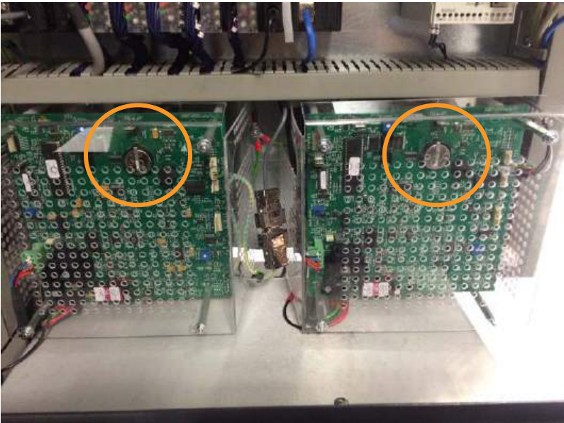  
Figure 390  Oxygen sensor board batteries  

4.	 Remove the four retaining nuts/washers on each cover to gain access to the batteries, (Figure 391).  

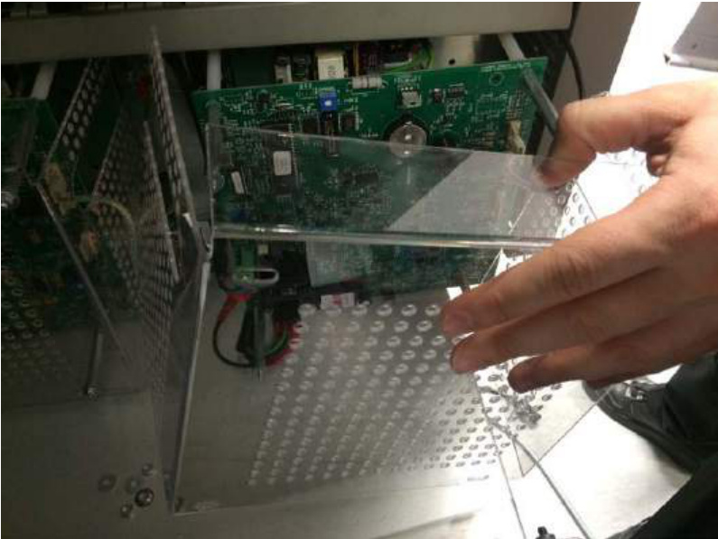  
Figure 391  Removing the board covers  

5. Remove and replace the batteries, (Figure 392).  

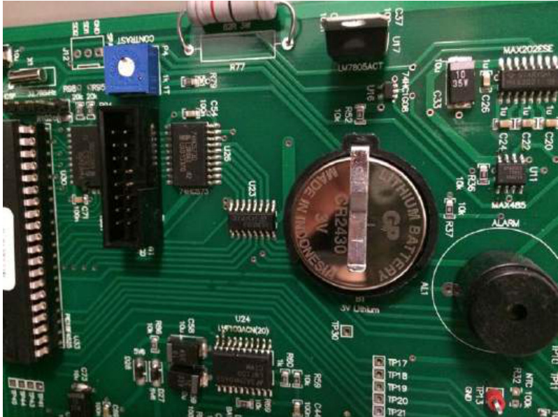  
Figure 392  Oxygen sensor board battery  

# AM250/AM400 user guide  

6. Replace the covers and tighten the four retaining nuts/washers. Do not tighten the nuts excessively as the plastic covers may become damaged.  

# 33.6.4 PLC battery  

Battery type: CR14250SE-R (Omron part number CJ1W-BAT01)  

Note: If the battery is replaced within five minutes (at $2 5 ^ { \circ } \mathsf { C }$ ) of switching Off power to the PLC, memory backup should be maintained.  

1. The battery for PLC is located within the rear electrical cabinet. Open the cabinet door.  

2. The PLC is the second module on the left hand side of the rack, (Figure 393).  

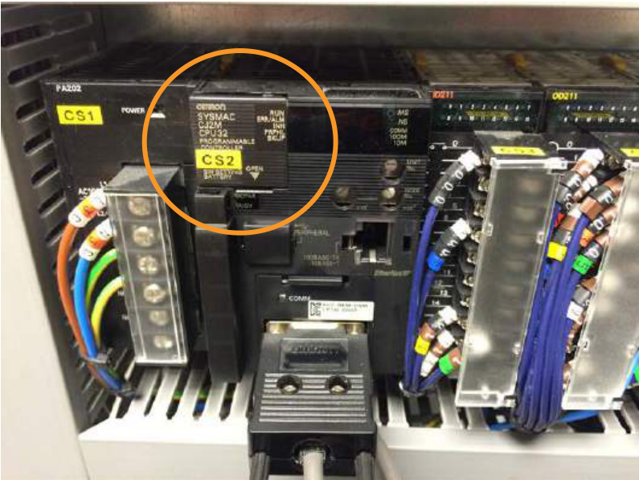  
Figure 393  PLC battery location  

3. Lift the flap in the top left hand corner to access the battery, (Figure 394).  

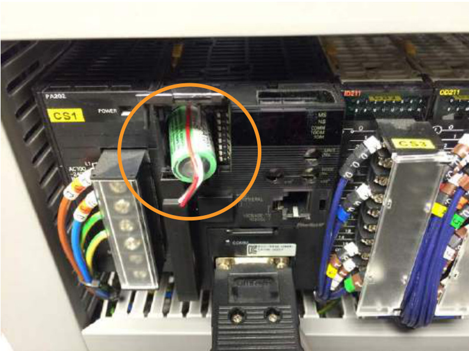  
Figure 394  PLC battery location  

4. Replace the battery and close the battery flap.  

5. Power up the PLC and check it is working correctly.  

# 33.7 Decommissioning  

There are no known residual risks associated with the AM250/AM400 systems. However when decommissioning the system the following steps must be taken:  

Inert and remove the safe change/large safe change filter/filters • Remove all powder, clear the system of powder and clean to remove any residual powder  

WARNING: ENSURE YOU ARE WEARING THE CORRECT PPE: EYE PROTECTION, FULL FACE RESPIRATOR (TO EN143 TYPE $p 3 + A 1$ ), PROTECTIVE GLOVES AND FULL LENGTH CLOTHING, (MADE FROM NON-STATIC GENERATING FABRIC SUCH AS COTTON (AVOID WOOL AND MAN MADE FABRICS) AND AVOID TURN-UPS OR POCKETS THAT MAY TRAP POWDER, REFER TO NFPA 484 FOR DETAILS) BEFORE STARTING THIS TASK.  

Clean the system of any residual dirt/process emissions Shut off the inert gas supply and open the gas inlet valve to depressurise the system Remove the inert gas supply hose Follow the PC shutdown procedure Isolate electrical power to the AM250/AM400 system • Drain down the system coolant, refer to any applicable PPE requirements  

# REFER TO ANY APPLICABLE PPE REQUIREMENTS FOR HANDLING SYSTEM COOLANT.  

AM400 only disconnect the dehumidifier supply hoses  

It is the users responsibility to document the powder types that have been used in the system and highlight any that may pose a residual risk.  

Contact Renishaw for packaging, and relocation or disposal guidance.  