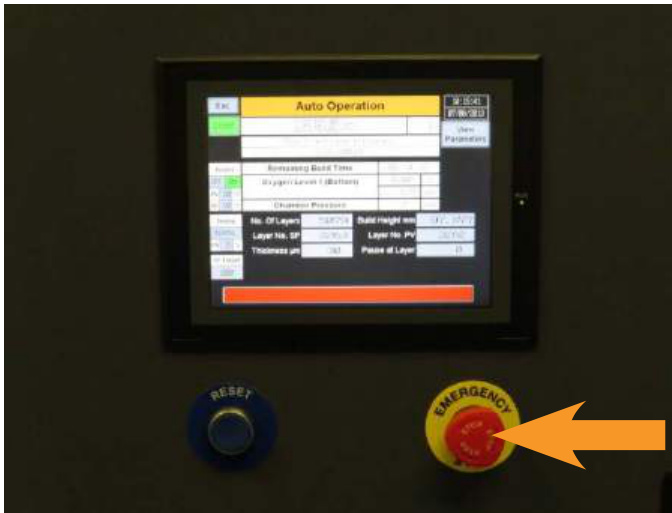
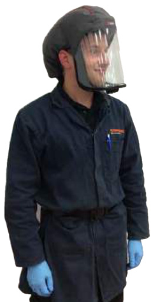
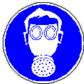
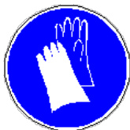

# 8 General safety instructions  

Risk assessments have been carried out to ensure that the Renishaw AM250/AM400 operates in a safe manner under normal defined operating conditions.  

The Renishaw AM250/AM400 conforms to the relevant European standards and legislation in force at the time that the equipment was manufactured.  

# 8.1 What to do in an emergency  

In case of emergency, immediately press the Emergency Stop button located on the front panel of the system as shown, (Figure 26).  

  
Figure 26 Emergency Stop button location on the front panel of the system  

The Renishaw AM250/AM400 also conforms to UL 508A:2010 accredited by TÜV SÜD America Inc.  

# 8.2 Normal operation  

The Renishaw AM250/AM400 may only be started up from the area directly in front of the touch screen. Starting the system from any other location is unsafe.  

During equipment and ancillary equipment operation, no safety devices may be removed or disabled.  

The operating staff must ensure that no unauthorised persons enter the working area of the system, if it is unsafe to do so.  

# 8.3 Training  

Training is included in the scope of supply of the Renishaw AM250/AM400, unless the user indicates that no training is required, for instance where a local Renishaw approved trainer already exists.  

# WARNING: OPERATION OF THE RENISHAW AM250/AM400 IS ONLY PERMITTED BYOPERATORS WHO HAVE COMPLETED A RENISHAW APPROVED TRAINING PROGRAM.  

# 8.4 Safe disposal of waste products  

All waste products must be disposed of in a safe and environmentally-friendly manner in accordance with local regulations.  

# WARNING: THE SUBSTANCES INDICATED BELOW MUST BE DISPOSED OF IN A SAFE MANNER. THEY MUST NOT BE ALLOWED TO CONTAMINATE THE ENVIRONMENT.  

Disposal of metal powder, whether new, used, or in the form of contaminated components and filters, must be done in accordance with the relevant Safety Data Sheets and the local or national requirements. Similarly, metal powders should be handled with caution at all times due to their combustible nature in a normal atmosphere, in accordance with ATEX, DSEAR or the equivalent local guidelines. Disposal of waste product, including process emissions and unused waste powder, must be in accordance with local regulations for hazardous waste. See Section 13.19 "Disposal of waste material".  

# 8.5 Personal Protective Equipment  

Renishaw recommends that full personal protective equipment is worn when handling metal powder, a minimum of:  

Gloves/gauntlets Eye protection Full face respirator (conforming to EN143 Type $\mathsf { P } 3 + \mathsf { A } 1$ ) Toe protection safety shoes ESD dissipative safety shoes (Essential for sieve room ATEX zone, recommended for all areas) • Full length clothing, made from non-static generating fabric such as cotton (avoid wool and man made fabrics) and avoid turn-ups or pockets that may trap powder. Refer to NFPA 484 for details.  

If furnace has been specified, heat resistant gauntlets are required.  

# WARNING: IT IS THE RESPONSIBILITY OF THE END USER TO ENSURE THE CORRECTPERSONAL PROTECTIVE EQUIPMENT IS AVAILABLE FOR EVERY OPERATOR, IT IS WORNCORRECTLY AND WHERE NECESSARY, IT IS MAINTAINED.  

Wash any metal powder contaminated clothing separately from other clothing.  

  
Figure 27 Example of personal protective equipment  

WARNING: PERSONAL PROTECTIVE EQUIPMENT USED IN THE SIEVE ROOM MUST ALSO BE ATEX RATED (FOR EXAMPLE BATTERY OPERATED RESPIRATORS).  

WARNING: WEAR PROTECTIVE EYEWEAR, FULL FACE RESPIRATOR (CONFORMING TO EN143 TYPE $\mathsf { P } 3 + \mathsf { A } 1$ ) AND FULL LENGTH CLOTHING, MADE FROM NON-STATIC GENERATING FABRIC SUCH AS COTTON (AVOID WOOL AND MAN MADE FABRICS) AND AVOID TURN-UPS OR POCKETS THAT MAY TRAP POWDER. REFER TO NFPA 484 FOR DETAILS.  

  

  

  

Do not allow the metallic powder or waste products to form a dust cloud.  

Never eat, drink or smoke in the vicinity of the Renishaw AM system or components produced by the process that have not been properly cleaned.  

Wash hands thoroughly with water and soap after disposal.  

Wash any contaminated clothing separately from other clothing.  

# 8.6 Correct usage  

The Renishaw AM250/AM400 is solely intended for the construction of components from metal powder.  

Acceptable metal powder is provided by Renishaw, or a specification can be provided for third party supply. Materials vary, but broadly the requirements are a particle size distribution of $1 5 \mu \mathrm { m }$ to $4 5 \mu \mathrm { m }$ with a mass-median-diameter $( { \mathsf { d } } _ { 5 0 } )$ of $2 6 \mu \mathrm { m }$ .  

It is recommended that the use of other metal powders is discussed in advance with Renishaw to ensure safe processing, and the appropriate processing parameters are used, if available. Renishaw powders have been tested and validated for use in the AM250/AM400 system.  

Successful part production depends upon the system being properly serviced and maintained, and the use of Renishaw process parameters.  

Where Renishaw materials and process parameters are NOT used users must satisfy themselves that the necessary material validation is carried out. Renishaw cannot be held liable for performance when third party materials or process parameters are used.  

Where non Renishaw metal powder is being used, always refer to the applicable Safety Data Sheets and carry out a risk assessment before using the non-Renishaw metal powder. As an example, nonRenishaw metal powder may produce laser spectral emissions that exceed the specification of the glass panel fitted to the door on the AM250/AM400 system, this must be risk assessed and the risks understood before using the non-Renishaw powder.  

# 8.7 Improper use  

Anything that contravenes or is not specifically mentioned in this manual can be described as improper use, in particular the following:  

1.	 The use of non-approved or highly toxic metal powders and other hazardous substances not approved by Renishaw. For system servicing purposes, Renishaw requires full knowledge of all the materials that have been used in the system in order to protect our staff.   
2.	 The removal of system components and/or the operation of system components in a position other than the one prescribed for them.   
3.	 Warning and safety instructions not properly maintained.   
4.	 Modifications to hardware components that have not been authorised by Renishaw.   
5.	 Modifications to software elements that have not been authorised by Renishaw.   
6.	 Operation without argon shielding gas.   
7.	 Disabling the safety devices.  

# 8.8 Handling of metal powders  

WARNING: ALWAYS RISK ASSESS THE HANDLING OF METAL POWDERS, INCLUDING BUT NOT RESTRICTED TO: CAREFUL EXAMINATION OF THE APPROPRIATE SAFETY DATA SHEET, THE PROCESSES THAT WILL BE FOLLOWED, APPLICABLE LEGISLATION, LOCAL RULES, ETC.  

Some metal powders are reactive and spontaneously form a hard, protective oxide film on contact with oxygen. This oxygen may be in the form of a gas (air, for instance), or in some other form, for example water.  

This ability to rapidly oxidise imparts the need for careful handling, as the potential for fire exists, because the oxidation of the powders gives off heat and, in some cases, explosive gas and is therefore potentially volatile and self-sustaining. Avoid disturbing the powder, particularly in an oxygen rich atmosphere. Risk assess any powders by careful examination of the appropriate Safety Data Sheet.  

# 8.9 Toxicity/personnel exposure  

Some metal powders may be harmful to health. This can only be ascertained by consulting the Safety Data Sheet and once again going through the risk assessment procedure and taking note of the guidance and procedures. In general, metal powders create a family of hazards (harmful or not), for example:  

1.	 Fine airborne solids can create a nuisance dust and prolonged exposure may cause lung irritation. Many powders have a maximum permissible Workplace Exposure Limit of $0 . 5 ~ \mathrm { m g } / \mathrm { m } ^ { 3 }$ (WEL 8-hr limit). The recommended Workplace Exposure Limit will be indicated on the Safety Data Sheet for each respective powder.   
2. Eye contact may cause irritation and burning. In the event of such exposure, the procedure indicated on the Safety Data Sheet should be followed.   
3.	 Similarly, if skin is exposed, the procedure indicated in the Safety Data Sheet should be followed.   
4.	 If large quantities of powder are inhaled, the procedure indicated in the Safety Data Sheet should be followed.  

# 8.10 Flammability  

Metal powders burn rapidly and at elevated temperatures and can produce very noxious gases. Metal powder in layers or in bulk may catch fire and burn if subject to a sufficiently energetic ignition source. Airborne suspensions above the limits indicated in the Safety Data Sheet can pose a dust explosion hazard. Minimum ignition values for a range of powders are available on request.  

# 8.11 Fire-fighting  

Do not place yourself at risk. In all cases when tackling a fire, the first action is to call the emergency services. At all stages, the fire-fighting method must be appropriate for the material concerned and the Safety Data Sheet should be consulted before assigning particular fire-fighting equipment to the areas where the materials are stored and used.  

In all cases, Renishaw recommends that specialist fire-fighting advice is sought before commencing operation of the system.  

In general, metal powder fires should be isolated and contained rather than extinguished. This can usually be accomplished by surrounding the fire with an inert material such as sand, salt or using a type D powder fire extinguisher.  

# WARNING: DO NOT USE WATER OR PRESSURISED FIRE EXTINGUISHERS, AS THERE IS A RISK THAT THE METAL POWDER COULD BE FORCED INTO DUST CLOUD.  

Always use caution when cleaning up burned metal powder, as re-ignition of unburned material is possible.  

WARNING: USING WATER ON SOME TYPES OF BURNING METALS MAY RESULT IN THE RELEASE OF EXPLOSIVE HYDROGEN GAS.  

# WARNING: IN ALL CASES OF FIRE, CALL THE EMERGENCY SERVICES AND ADVISE ON THE EXACT NATURE OF THE MATERIALS BEING PROCESSED AND THOSE IN STORAGE.  

# 8.12 Handling and processing  

Avoid contact of metal powders with potential ignition sources (for example flames or sparks).  

Spills – see Section 8.14 "Spills".  

• Ensure that any vacuuming of powder is kept to a minimum quantity – ideally only vacuum what cannot easily be collected by brushing. Brushing must only be done with non-sparking tools and avoiding the creation of a dust cloud, see Section 8.14 – "Spills". Only ever use an ATEX vacuum cleaner (wet separator) approved for use with combustible metal dusts.  

Stagnation points should be minimised.  

Good housekeeping measures should be implemented and adhered to with regular and thorough cleaning regimes in place at all times.  

Generating airborne dust clouds of metal powder must be avoided.  

Avoid the creating of static sparks – the use of static-dissipative footwear or inserts is recommended.  

Methods of transport of metal powders are dependent on the type of material. Consult the Safety Data Sheet. Note that original containers may have been inert gas purged.  

All hazardous shipments need to quote a hazardous material classification code (UN / US Department of Transport) and a proper shipping name.  

Metal powders may be subject to export control regulations, which may restrict shipment to some countries.  

# 8.13 Storage  

Generally, metal powder should be stored in a cool dry place in hermetically sealed non-flammable containers away from ignition sources. Bulk storage should be in accordance with local building and fire codes. Consider zone-classified storage cabinets. Refer to the Safety Data Sheet.  

# 8.14 Spills  

Avoid contact of spilled material with greases, oils, solvents or combustibles. • Spills of powder should be immediately cleaned-up by gentle sweeping using a non-synthetic brush into a metal receptacle (anti-static dustpan and brush).  

Small amounts of residual material may be removed using an ATEX vacuum cleaner (wet separator) approved for use with combustible metal dusts. Ensure that any vacuuming of powder is kept to a minimum quantity – ideally only vacuum what cannot easily be collected by brushing.  

# WARNING: DO NOT USE COMPRESSED AIR TO CLEAN-UP SPILLS OF METAL POWDER.  

# 8.15 Metal powder safety checklist  

Have you read and understood the metal powder’s physical and chemical properties and the associated hazards from the supplied Safety Data Sheet and other product information?  

Are you compliant with all national, regional, and local building and fire codes for the handling and storage of metal powder? (For example in the United Kingdom and USA refer to the National Fire Protection Association (NFPA), International Building Code $\textcircled{8}$ (IBC), and International Fire Consultants (IFC)).  

Are there other flammable materials stored in this area?  

Is the metal powder stored under proper conditions and isolated from:  

a. Fuels   
b. Strong oxidising agents   
c. Steam   
d. Oils   
e. Grease   
f. Water  

? Are the metal powder storage area doors kept closed?   
? Does the metal powder storage area have limited access?   
• Is the metal powder inventory controlled?   
• Have you contacted the local fire protection agency to make them aware of the specific firefighting procedures and equipment required in the event of a metal powder fire? Have you supplied the local fire protection agency with a copy of the Safety Data Sheet? Have area personnel been trained to handle small metal powder fires? Do personnel know whom to contact if they are unable to isolate and contain a metal powder fire?   
• Are emergency contact phone numbers posted?   
• Are correct metal powder fire-fighting materials readily available to isolate and handle small fires?   
• Does your business have written Standard Operating Procedures (SOPs) for all aspects of metal  

powder handling and processing, including proper risk assessment, Control of Substances Hazardous to Health (COSHH) assessment or similar local equivalent, and Personal Protection Equipment assessment?  

Is there a written procedure in place or engineering controls present to address the reduction or elimination of metal powder dust formation during handling? Are employees appropriately trained on workplace hazards? Are written procedures in place which address safety issues to be considered during maintenance and repair activities in metal powder storage or processing areas? Is there a written procedure for metal powder shipping that meets international standards? Are correct containers available? Are there written procedures in place for spill clean-up and waste disposal for metal powder? • Is the ancillary equipment, such as an ATEX vacuum cleaner (wet separator) and powder sieve, approved for use with the materials in use?  

This checklist along with any other documents relating to risk management should be stored in your organisations Explosion Prevention Document.  

# 8.16 Residual dangers, maintenance and protective measures  

Ensure that local risk assessments have been carried out to ensure that the Renishaw AM250/AM400 system operates in a safe manner under normal defined operating conditions.  

Ensure that the risk assessments are revised regularly, particularly if any process variables change, such as new materials, changes to the type of inert gas used and other material changes to the operating conditions, as these can affect the control measures and equipment used when operating the system.  

# 8.17 Explosion prevention document  

Renishaw recommend that you develop and maintain an Explosion Prevention Document in line with the applicable local legislation in the geographic area where the AM250/AM400 is located. In the absence of applicable local legislation, Renishaw recommend that you refer to the applicable DSEAR (ATEX 137) or NFPA standard (NFPA 484) and develop your Explosion Prevention Document in accordance with one of these standards. It is recommended that an Explosion Prevention Document includes the following as a minimum:  

Identify potentially explosive atmospheres   
Information on adequate measures taken   
Prepare a list and diagrams of ATEX zoning   
Operational and maintenance measures to maintain a safe working environment  

# 9 Safety during maintenance  

The following is intended as a general guide. However, it may not be exhaustive. It is the responsibility of the end user to ensure that any maintenance work is conducted in a safe manner.  

WARNING: THERE IS THE POSSIBILITY OF PERMANENT EYE DAMAGE AND SERIOUS INJURYWHEN EXPOSED TO LASER LIGHT.  

WARNING: MAINTENANCE PERSONNEL MUST FOLLOW THE APPROPRIATE SAFETY PROTOCOLS WHEN MAINTAINING THE SYSTEM, INCLUDING WEARING THE RELEVANT PERSONAL PROTECTIVE EQUIPMENT AND FOLLOWING WARNINGS.  

# 9.1 Guide to general maintenance  

Maintenance work may only be carried out by qualified technicians who are trained to work on the Renishaw AM250/AM400.  

The following statements cover general advice for users when preparing systems for scheduled service visits.  

Ensure that the system is fully cleaned and free from waste powder and other process byproducts captured in the filter system.   
Before maintenance starts, carry out a risk assessment to determine what actions are necessary to complete the work safely.   
Wear the correct personal protective equipment for the work being undertaken and restrict access to the working area.   
Isolate at the mains power supply by turning the main switch to the 0 or OFF position and lock off with a personal padlock. Attach a visible warning sign to indicate that the panel is isolated. Carry out safe isolation procedure checks in accordance with IEE standards.   
Isolate the supply of argon. This is used to operate valves and to provide the gas shielding blanket.   
Ensure that all equipment elements that become hot during operation have cooled down to room temperature.   
Allow time for the power supply units to drain.   
Ensure that adequate hoisting devices and load-bearing equipment are on hand for the   
replacement of larger equipment parts.  

Cordon off access to the work area of the system. • Replace worn or damaged parts using only original replacement parts supplied by Renishaw.  

# 9.2 Work on electrical equipment  

The following points must be observed when working on live electrical equipment:  

• Work on electrical equipment must only be carried out by qualified electrical technicians who are trained to work on the Renishaw AM250/AM400.   
• It is generally considered safe to work on isolated equipment only after carrying out a safe isolation procedure in accordance with IEE standards.   
• Check electrical equipment regularly. Retighten loose connections and immediately replace any damaged cables or wires.   
• Always keep the switch cabinet and all power supply units closed. Access to these is only permitted for authorised persons with a key or special tool.   
• Never clean electrical devices with water or similar liquids.  

WARNING: NEVER WORK ON LIVE EQUIPMENT. FAILURE TO OBSERVE THIS RULE COULD RESULT IN INJURY OR DEATH TO INDIVIDUALS AND THIRD PARTIES BY ELECTROCUTION.  

WARNING: THE ELECTRICAL ENCLOSURE MUST REMAIN LOCKED SHUT DURING NORMALOPERATION. THE KEY MUST BE HELD BY A MAINTENANCE TECHNICIAN OR SIMILARSUPERVISOR.  

# 9.3 Thermal hazards  

If scheduled maintenance work is to be undertaken, the equipment must be isolated and a period of time should be allowed for hot parts of the equipment to cool. Care must also be taken if unplanned maintenance is to be carried out.  

WARNING: HOT SURFACES CAN CAUSE INJURY. TAKE CARE WHEN USING THE GLOVE BOXTO ACCESS THE SYSTEM CHAMBER.  

# 9.4 Hazards due to latent energy sources  

Isolated equipment may still present hazards to maintenance technicians. Some typical examples of latent energy sources are as follows:  

Heated components will remain hot. The period of time required to cool to a safe temperature $\leq 4 3 ^ { \circ } \mathsf { C }$ $( \leq 1 0 9 ^ { \circ } \mathsf { F } )$ is dependent on the material of construction and the shape and mass of the component.   
• Some components may continue in motion after a process has halted. The period of time required for the component to become stationary is dependent on the shape and mass of the component.   
• Some components may be stopped in positions which make them unsafe. Sealed pneumatic lines will remain pressurised. Other fluid lines may remain pressurised.   
• Capacitors may remain charged in electrical circuits.   
• Risk and method statements for maintenance work should identify any latent hazards and the steps required to nullify them.  

# 9.5 Hazards due to unexpected malfunctions  

Although this equipment has been rigorously tested, the danger of unexpected malfunctions cannot be entirely ruled out when working on the equipment. Malfunctions may occur as a result of:  

Failure of the control system.   
Restoration of the power supply after a power failure.   
External influences on electrical equipment.  

# WARNING: SERIOUS INJURY MAY RESULT FROM UNEXPECTED SYSTEM MOVEMENT.  

# 9.6 Hazards due to fire or explosion  

Metal powders may produce flammable or explosive events under certain conditions. All measures must be taken to ensure that the conditions required to cause such an event are understood by the operators so that the possibility does not arise. In order for a fire or explosion to occur, the following basic elements must be present:  

A combustible powder or inflammable substance.   
An oxygen source (air).   
An ignition source.  

An ATEX area zone classification will define the risk of an explosive event.  

WARNING: FIRE AND/OR EXPLOSIONS MAY CAUSE SERIOUS INJURY OR DEATH TOPERSONNEL AND DAMAGE TO PROPERTY.  

# WARNING: ATEX AND DSEAR REGULATIONS REQUIRE RISK ASSESSMENTS TO DETERMINE THE REQUIRED AREA ZONE CLASSIFICATION BEFORE PUTTING THE EQUIPMENT INTO USE.  

# 9.7 Identifiable ignition sources  

Laser energy.  

Electrostatic discharge. Electrostatic discharge is recognised as an initiator of fires or explosions when the correct amounts of combustible dust (metal powder), or any other hazardous substances, and oxygen are present.  

All equipment and ancillary equipment must be at the same electrical potential as everything within the area zone classification, including the operators and any other personnel authorised to be in the area.  

All electrical earth bonding straps must be in place and maintained.  

All operators and any authorised personnel must wear anti-static footwear and full length clothing, made from non-static generating fabric such as cotton (avoid wool and man made fabrics) and avoid turn-ups or pockets that may trap powder. Refer to NFPA 484 for details. Only tools and other items that are suitable for the zone classification may be used in that area.  

  
Figure 28 AM250/AM400  