# 10.1 Technical specification  

Technical specifications may change from time to time. Renishaw reserves the right to change any technical specification at any time without prior notification. Any specification not listed in the table below is available on request by using the contact details indicated earlier.  

For the Site preparation guide refer to H-5800-0838 or contact your local Renishaw office.  

All dimensions are quoted length $\times$ width $\times$ height.  

<html><body><table><tr><td>Dimensions without accessories - AM250/ AM400</td><td>853 mm ×1700 mm ×2115 mm (33.6 in × 66.9 in × 83.3 in)</td></tr><tr><td>Height including fill bottle - AM250/AM400</td><td>2 500 mm (98.4 in)</td></tr><tr><td>Size of build chamber (X x Y x Z)</td><td>250 mm × 250 mm × 300 mm (10 in × 10 in × 12 in)</td></tr><tr><td>Typical maximum build envelope (X x Y x Z) (using standard 15 mm /3/5 in substrate)</td><td>248 mm × 248 mm × 285 mm (10 in × 10 in × 11 in)</td></tr><tr><td>Minimum pressure in chambers (vacuum)</td><td>950 mbar-gauge or 5 kPa (-13.8 psi)</td></tr><tr><td>Working pressure in chamber (overpressure)</td><td>10 to 20 mbar-gauge or 101 to 202 kPa (0.15 to 0.30 psi)</td></tr><tr><td>Power supply</td><td>220 V to 240 V, 16 A, 45 to 60 Hz, single phase, or localised via transformer</td></tr><tr><td>Data connections</td><td>Standard network connection RJ45</td></tr><tr><td>Chilled water connection</td><td>From chiller</td></tr><tr><td>Argon gas supply connection</td><td>3/8 in BSP male cone fitting</td></tr><tr><td>Dry air supply - AM400 only</td><td>10 mm diameter pneumatic tube to air drier, 6 mm diameter from drier to AM400. 1.6 bar to 2.4 bar (23 psi to 35 psi) minimum flow</td></tr><tr><td>Running argon consumption (after initial fill)</td><td>of 10 I/min (0.35 ft3) 10 L/hr to 50 L/hr (0.4 to 1.8 ft3/hr)</td></tr><tr><td>Filling / purge consumption</td><td>600 L to 1 500 L (21 ft to 53 ft3)</td></tr><tr><td>Argon quality (greatest permissible</td><td>20 ppm or better (99.998% pure)</td></tr><tr><td>impurities) Continuous noise level</td><td>67 dB</td></tr><tr><td>Maximum noise level (temporary)</td><td>68 dB</td></tr></table></body></html>  

# 10.2 Oxygen level monitoring within the room  

Refer to the Site preparation guide, risk assessments to establish whether or not there is a need for low-level oxygen level monitoring within the room. Argon can be discharged into the room when the chamber doors are opened. Additionally, whilst the system is purging, argon is exhausted to the atmosphere.  

The system features an argon exhaust port which may be connected to an external ventilation point, Renishaw do not recommend this. Refer to the Site preparation guide for details of AM250/AM400 system emissions.  

WARNING: RENISHAW RECOMMEND THAT A ROOM OXYGEN SENSOR IS INSTALLED.  

# 10.3 Transport and system relocation  

If your AM250/AM400 is to be moved to an alternative production facility or resold, Renishaw is happy to assist and advise. With this in mind, please inform us at your earliest convenience.  

Caution: The transport of the AM250/AM400 should only be carried out following the advice and recommendations of Renishaw plc.  

# 11.1 Laser safety precautions  

When using or maintaining laser equipment, any local regulations or legislation take precedence over these instructions.  

# WARNING: MAINTENANCE WORK ON THE LASER SYSTEM MAY ONLY BE CARRIED OUT BY EMPLOYEES OF RENISHAW OR RENISHAW AUTHORISED SERVICE PERSONNEL.  

Normal system maintenance can be undertaken without risking exposure to laser light above Class 2.  

Under extreme circumstances, it may be necessary for maintenance to be undertaken with laser covers removed. If so, the requirements of laser Class 4 must be fulfilled. These include:  

Secure the installation room to prevent both unauthorised access and laser light leakage – ensure that all windows are covered, or use laser screening.   
It must be possible to seal off access to the installation room.   
Ensure that the following safety warning is fitted to all access doors to the installation room:  

# CLASS 4 LASER IN OPERATION. NO ADMITTANCE.  

Only personnel who have received instructions in laser safety are allowed in the hazard area, wearing complete personal protection equipment, including laser goggles with protection level D L7 for wavelengths in the range of 1000 nm to 1100 nm according to EN 207 (European Norm). These guidelines are not intended to be exhaustive, for the most up to date recommendations always refer to the local legislative body, for example the European Committee for Standardisation for EN (European Norm) standards, or Laser Institute of America for ANSI (American National Standards Institute) standards.  

# 11.2 Fire precautions  

Do not place yourself at risk. In all cases when tackling a fire, the first action is to call the emergency services. See section 8.11 – "Fire-fighting".  

Renishaw recommends that specialist fire-fighting advice is sought before commencing operation of the system.  

Place the following safety warning on all access doors to the installation room:  

  

OPEN FLAMES, SMOKING AND FIRE ARE PROHIBITED  

# 11.3 Metal powder handling advice  

WARNING: THE FOLLOWING CONSTITUTES GENERAL ADVICE. ALWAYS CONSULT THE SAFETY DATA SHEET FOR SPECIFIC HANDLING AND SAFETY INFORMATION FOR EACH MATERIAL.  

WARNING: PROTECTIVE GLOVES, FULL FACE RESPIRATOR (TO EN143 TYPE $p 3 + A 1$ ), EYE PROTECTION, ESD SAFETY SHOES AND COTTON OR FIRE RETARDANT OVERALLS WITH FULL LENGTH SLEEVES (MADE OF STATIC-DISSIPATIVE MATERIALS) SHOULD ALWAYS BE USED WHEN EXPOSED TO METAL POWDER.  

# WARNING: ALWAYS IDENTIFY AND LABEL HAZARDOUS METAL POWDERS.  

All metal powders are combustible. The user must review the Safety Data Sheet and ensure that the correct handling procedures are followed. Combustible metal powders must be used, stored and disposed of in non-sparking (anti-static) o approved containers. Powder must be stored in sealed dry container, damp or humid power may give off flammable hydrogen gas. Containers containing combustible metal powders must be labelled to identify a Flammable Solid. Combustible metal powder must not be stored in plastic bags because of the possibility of electrostatic discharge. Always keep combustible metal powders away from any sources of ignition. • When cleaning up spills of combustible metal powders, ensure that the cleaning equipment is safe to use.  

Never use compressed air to clean spills or residual traces of combustible metal powder. This could cause an explosive cloud to form.   
Do not brush combustible metal powders for long distances, as this could cause electrostatic charges to be formed.   
We recommend the following safety equipment:   
ATEX vacuum cleaner (wet separator), suitable for use with combustible metal powder with a ga ventilation capability.   
Washbasin with eye washing station.   
Non-sparking containers for the storage of waste powder residues.  

# 11.4 Inert gas safety  

# WARNING: THE CONCENTRATION OF INERT GAS IN THE AMBIENT AIR NEEDS TO BE MONITORED AND LOW OXYGEN CONCENTRATION $( < 1 9 . 5 \% )$ INDICATED BY A VISIBLE AND AUDIBLE WARNING DEVICE.  

The Renishaw AM250/AM400 is designed to consume minimal amounts of inert gas. It is possible to use either argon or nitrogen to create an inert atmosphere but the AM250/AM400 has been qualified using argon gas only. As a consequence of this low gas consumption, our recommendation is to use argon gas, which offers the additional benefit of being compatible with materials that are nitrogen reactive.  

# WARNING: IT IS POSSIBLE THAT NITROGEN GAS MAY GIVE YOU BUILD RESULTS WHICH ARE MORE SUITABLE FOR YOUR ADDITIVE MANUFACTURING APPLICATION. THE AM250/AM400 HAS BEEN QUALIFIED USING ARGON GAS AND RENISHAW RECOMMEND THE USE OF ARGON GAS DURING BUILDS. THE USE OF NITROGEN IN THE AM250/AM400 IS AT THE RISK OF THE END USER OF THE AM250/AM400 SYSTEM.  

A small amount of inert gas is emitted from the sieving station and AM250/AM400 system when in use. On the AM250/AM400 system, it is possible to connect the argon vent port to a connection outside the building to deal with gas emitted whilst the working chamber is being prepared.  

Argon gas is odourless, heavier than air and as it displaces oxygen, is an asphyxiant. This creates a potential hazard and, although the concentration of argon gas under normal operation is low, there is a potential danger of suffocation. On this basis, Renishaw recommends that the room is well ventilated in accordance with the guidance in the installation section of this manual and also in accordance with local regulations.  

Under normal use with argon, ground level oxygen level monitoring is advised.  

WARNING: ARGON GAS CYLINDERS ARE HEAVY. ENSURE GAS CYLINDERS ARE CORRECTLY SECURED TO PREVENT THEM FROM FALLING OVER. USE SUITABLE EQUIPMENT AND PROCESSES TO MOVE CYLINDERS. CONSIDER CONTACTING YOUR ARGON GAS SUPPLIER FOR EQUIPMENT, INFORMATION AND ADVICE ON HANDLING GAS CYLINDERS.  

# 11.5 Build plate materials  

Ideally all build plates should be indelibly marked (for example engraved or stamped) on the edge of the plate to indicate their material composition.  

Plates are to be cleaned-up after use by grinding, milling or turning. The cleaned-up plates should maintain a tolerance of $5 0 ~ { \mu \mathrm { m } }$ for flatness and parallelism over their thickness, and a surface finish of up to $1 . 6 \mu \mathrm { m }$ Ra (ground finish).  

It is particularly important to ensure that the underside of the build plate is not convex, as this can have a detrimental effect on the flatness of the upper working face when installed in the system. This can lead to failed builds because of uneven powder distribution on the initial layers and poor adhesion to the plate.  

After machining, all cutting fluid residue must be removed using an appropriate cleaning medium.   
Normally ethanol or isopropanol is sufficient.  

Build plate thickness must be measured prior to final fixing onto the build table. Failure to input the correct thickness value may result in damage to the system or process inconsistency.  

Depending on the application a build plate thicker than standard may be required, to ensure the internal stress in the part is adequately resisted – this is typically only when very large and particularly dense parts are fabricated. If in doubt contact the applications team.  

See Appendix A "AM250/AM400 build plate drawings" for standard build plate drawings, and Appendix B "Part numbers of spare parts" for build plate part numbers.  

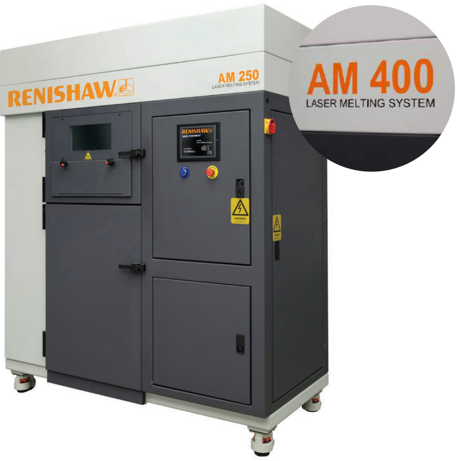  
Figure 29 AM250/AM400  

# 12 Overview of system features  

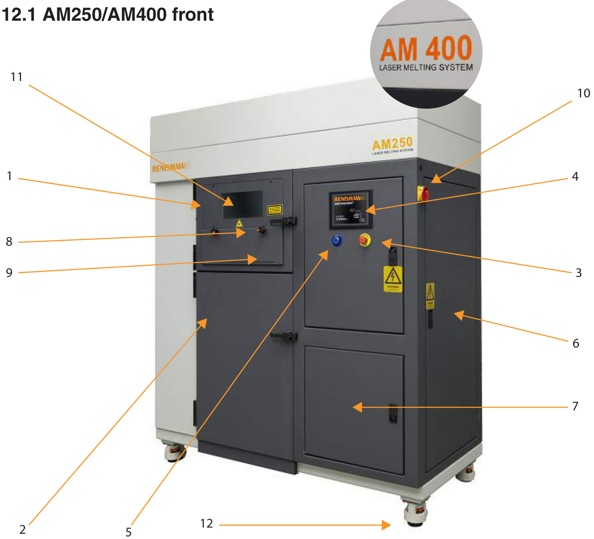  
Figure 30 AM250/AM400 front  

<html><body><table><tr><td>1</td><td>Process chamber door</td><td>7</td><td>Laser and PC door</td></tr><tr><td>2</td><td>Lower door</td><td>8</td><td>Lockable glove hatch</td></tr><tr><td>3</td><td>Emergency Stop button - see Section 13.1</td><td>9</td><td>Chamber access gloves</td></tr><tr><td>4</td><td>Operator touch screen interface (HMI) - see Section 13.2</td><td>10</td><td>Main electrical isolator- see Section 13.1</td></tr><tr><td>5</td><td>Reset button</td><td>11</td><td>Laser safe viewing window</td></tr><tr><td>6</td><td>Electrical access panel</td><td>12</td><td>Adjustable feet</td></tr></table></body></html>  

# 12.2 Left hand user access door AM250/AM400  

# 12.2.1 AM250 with safe change filter  

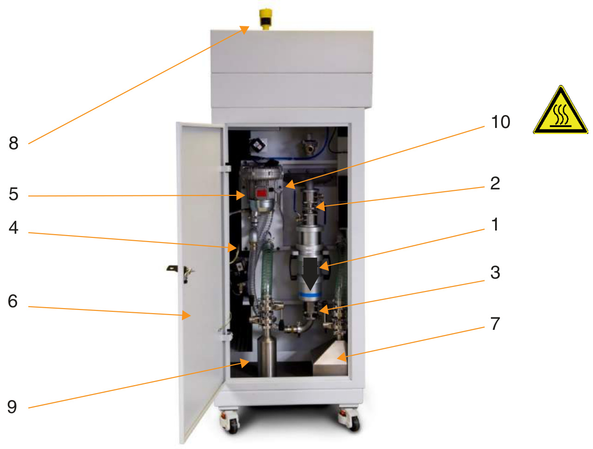  
Figure 31 Left hand user access door AM250 safe change filter  

<html><body><table><tr><td>1</td><td>Removable safe change filter</td><td>6</td><td>Left hand access door for safe change filter</td></tr><tr><td>2</td><td>Upper safe change filter isolation valve (V4)</td><td>7</td><td>Large overflow bottle</td></tr><tr><td>3</td><td>Lower safe change filter isolation valve (V5)</td><td>8</td><td>Powder level sensor</td></tr><tr><td>4</td><td>Argon connection to system circuit</td><td>9</td><td>Small powder bottle</td></tr><tr><td>5</td><td>Gas recirculation pump</td><td>10</td><td>Oxygen sensor - Warning hot surface</td></tr></table></body></html>  

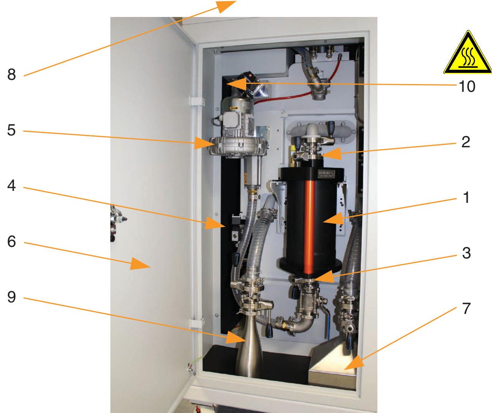  
12.2.2 AM250/AM400 with large safe change filter   
Figure 32 Left hand user access door AM250/AM400 with large safe change filter  

<html><body><table><tr><td>1</td><td>Removable large safe change filter</td><td>6</td><td>Left hand access door for large safe change filter</td></tr><tr><td>2</td><td>Upper large safe change filter isolation valve (V4)</td><td>7</td><td>Large overflow bottle</td></tr><tr><td>3</td><td>Lower large change filter isolation valve (V5)</td><td>8</td><td>Powder level sensor (on top of AM250/AM400 system - not shown)</td></tr><tr><td>4</td><td>Argon connection to system circuit</td><td>9</td><td>Small powder bottle</td></tr><tr><td>5</td><td>Gas recirculation pump</td><td>10</td><td>Oxygen sensor-Warning hot surface</td></tr></table></body></html>  

# 12.3 Keys and user accessibility  

There are three access areas:  

Trained operator – the glove box and left hand user access door (powder filter).   
Trained operator – the panel housing the laser, the laser key, and the operating PC enclosure key.   
Maintenance / trained electrician – the three electrical panels.  

Keys are provided to access the areas above.  

The electrical enclosures must remain locked when the system is in operation. Keys should only be allocated to personnel who have received adequate training to operate the system.  

# WARNING: ISOLATE SUPPLY BEFORE OPENING COVER. ELECTRICAL ENCLOSURE MUST REMAIN LOCKED, AND ACCESS RESTRICTED TO TRAINED PERSONNEL.  

# 12.4 Valve labels  

All valves fitted to the AM250/AM400 system are labelled. The complete list of valves and their locations are as follows:  

<html><body><table><tr><td>Serial</td><td>Label</td><td>Description</td></tr><tr><td>1</td><td>AV1</td><td>Powder bottle filling adaptor valve (Figure 33)</td></tr><tr><td>2</td><td>A1</td><td>Small powder bottle valve (rear overflow, sieve upper and sieve lower) (Figure 34)</td></tr><tr><td>3</td><td>B1</td><td>Large powder botle valve - front overflow (Figure 35)</td></tr><tr><td>4</td><td>V1</td><td>Silo isolation valve (Figure 36)</td></tr><tr><td>5</td><td>V2</td><td>Rear overflow valve on system pipework (Figure 37)</td></tr><tr><td>6</td><td>V3</td><td>Front overflow valve on system pipework (Figure 38)</td></tr><tr><td>7</td><td>V4</td><td>Upper safe change filter/large safe change filter isolation valve on system outlet pipework (Figure 39)</td></tr><tr><td>8</td><td>V5</td><td>Lower safe change filter/large safe change filter isolation valve on system recirculation pipework (Figure 40)</td></tr><tr><td>9</td><td>F1</td><td>Upper safe change filter/large safe change filter isolation valve on filter assembly (Figure 41)</td></tr><tr><td>10</td><td>F2</td><td>Lower safe change filter/large safe change filter isolation valve on filter assembly (Figure 42)</td></tr><tr><td>11</td><td>S1</td><td>Sieve upper valve (Figure 43)</td></tr><tr><td>12</td><td>S2</td><td>Sieve lower valve (Figure 44)</td></tr><tr><td>13</td><td>IV1</td><td>Doser isolation valve (Figure 45)</td></tr></table></body></html>  

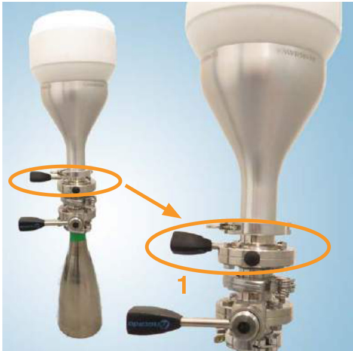  
Figure 33 1 – Powder bottle adaptor fill valve – AV1  

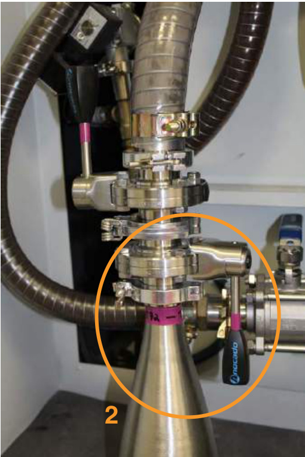  
Figure 34 2 – Small powder bottle (rear overflow, sieve upper and sieve lower) – A1  

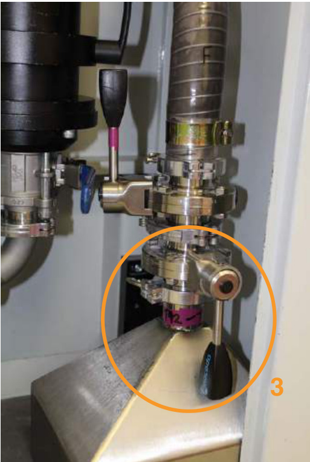  
Figure 35 3 – Large powder bottle valve – front overflow – B1  

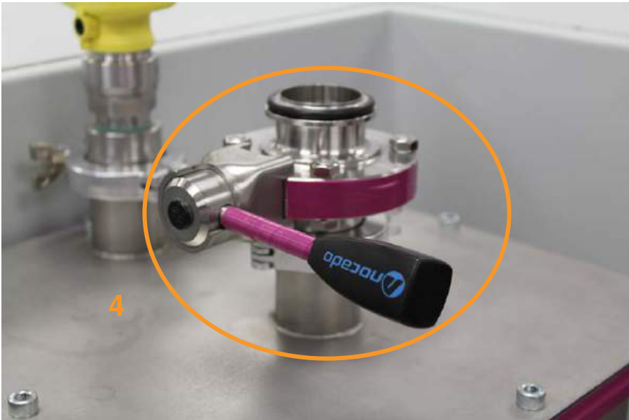  
Figure 36 4 – Silo fill valve – V1  

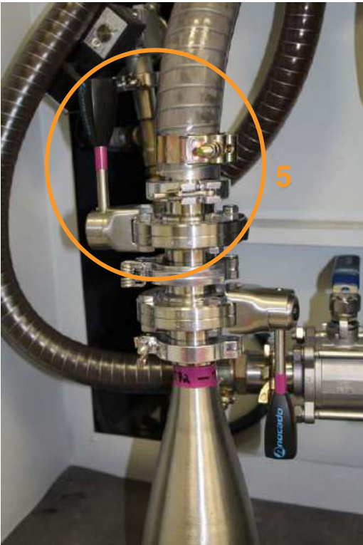  
Figure 37 5 – Rear overflow valve on system pipework – V2  

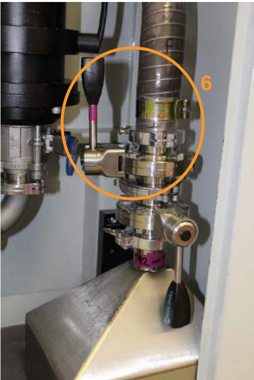  
Figure 38 6 – Front overflow valve on system pipework – V3  

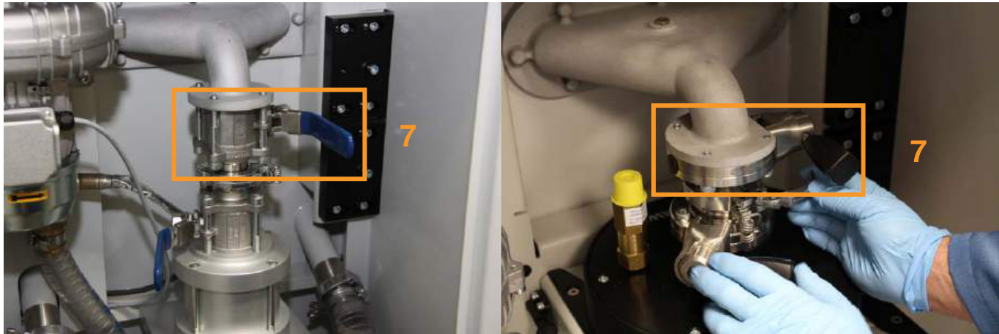  
Figure 39 7 – Upper safe change filter/large safe change filter isolation valve on system outlet pipework – V4  

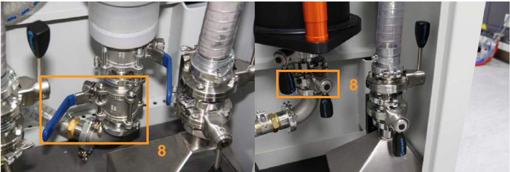  
Figure 40 8 – Lower safe change filter/large safe change filter isolation valve on system recirculation pipework – V5  

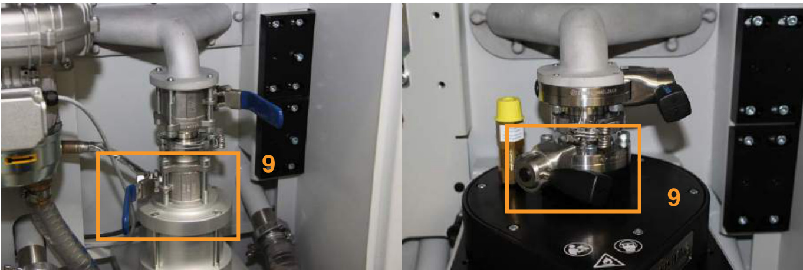  
Figure 41 9 – Upper safe change filter/large safe change filter isolation valve on filter assembly – F1  

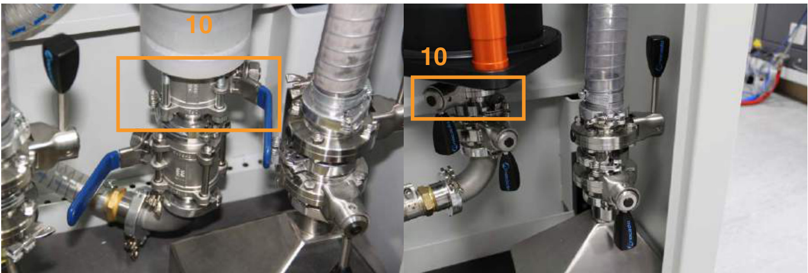  
Figure 42 10 – Lower safe change filter/large safe change filter isolation valve on filter assembly – F2  

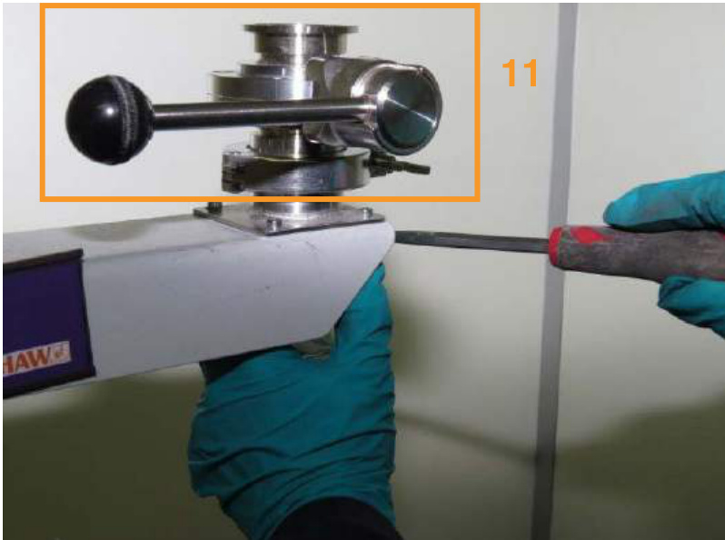  
Figure 43 11 – Sieve upper valve – S1  

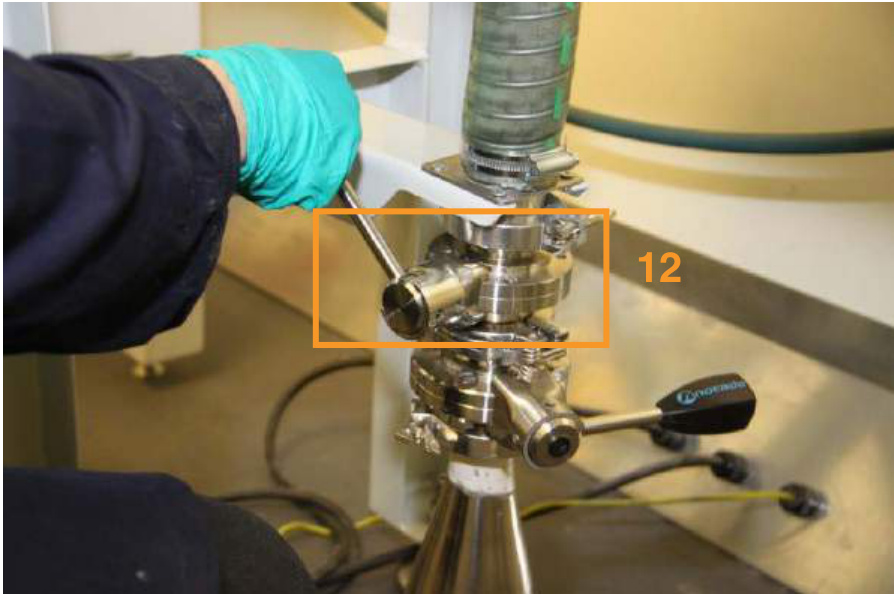  
Figure 44 12 – Sieve lower valve – S2  

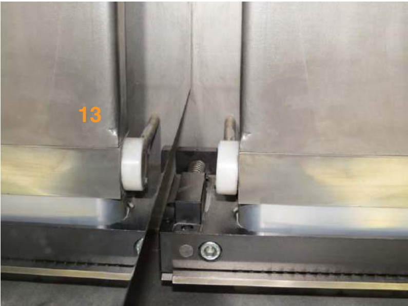  
Figure 45 13 – Doser isolation valve – IV1  

# 12.5 Clamp labels 夹具标签  

All clamps fitted to the AM250/AM400 system are labelled. The complete list of clamps and their locations are as follows:  

<html><body><table><tr><td>Serial</td><td>Label</td><td>Description</td></tr><tr><td>1</td><td>L1</td><td>Silo fill clamp (Figure 46)</td></tr><tr><td>2</td><td>L2</td><td>Silo isolation valve to silo lid clamp (Figure 46)</td></tr><tr><td>3</td><td>L3</td><td>Powder level sensor to silo lid clamp (Figure 46)</td></tr><tr><td>4</td><td>L4</td><td>Safe change filter/large safe change filter upper clamp (Figure 47)</td></tr><tr><td>5</td><td>L5</td><td>Safe change filter/large safe change filter lower clamp (Figure 48)</td></tr><tr><td>6</td><td>L6</td><td>Filter waste pipe inlet clamp (Figure 49)</td></tr><tr><td>7</td><td>L7</td><td>Filter waste pipe outlet clamp (Figure 50)</td></tr><tr><td>8</td><td>L8</td><td>Rear overflow upper clamp (Figure 51)</td></tr><tr><td>9</td><td>L9</td><td>Rear overflow flexi pipe to rear overflow isolation valve clamp (Figure 52)</td></tr><tr><td>10</td><td>L10</td><td>Rear overflow clamp (Figure 52)</td></tr><tr><td>11 12</td><td>L11</td><td>Front overflow upper clamp (Figure 53)</td></tr><tr><td></td><td>L12</td><td>Front overflow flexi pipe to rear overflow isolation valve clamp (Figure 54)</td></tr><tr><td>13 14</td><td>L13 SL1</td><td>Front overflow clamp (Figure 55)</td></tr><tr><td></td><td></td><td>Small powder bottle to sieve upper isolating valve clamp (Figure 55)</td></tr><tr><td>15</td><td>SL2</td><td>Sieve upper isolating valve to bracket clamp (Figure 55)</td></tr><tr><td>16</td><td>SL3</td><td>Sieve inlet to KF flange adaptor clamp (Figure 56)</td></tr><tr><td>17</td><td>SL4</td><td>Sieve outlet to KF flange adaptor clamp (Figure 57)</td></tr><tr><td>18</td><td>SL5 SL6</td><td>Bracket to sieve lower isolation valve clamp (Figure 57)</td></tr><tr><td>19</td><td></td><td>Sieve lower isolation valve to small powder bottle clamp (Figure 57)</td></tr></table></body></html>  

Note: There are a number of worm drive clamps fitted to the AM250/AM400. These are not listed in the table above.  

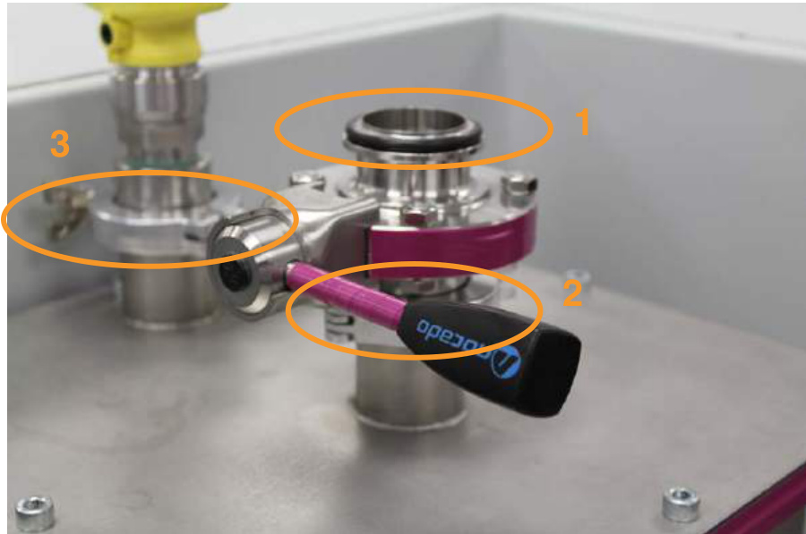  
Figure 46 1,2 & 3 – Silo fill, silo isolation valve and powder level sensor clamps – L1, L2 and L3  

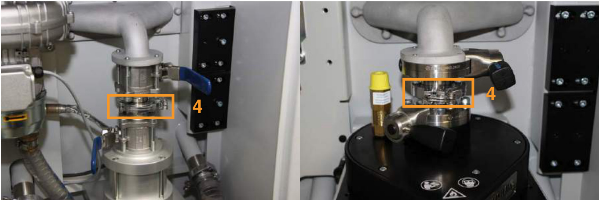  
Figure 47 4 – Safe change filter/large safe change filter upper clamp – L4  

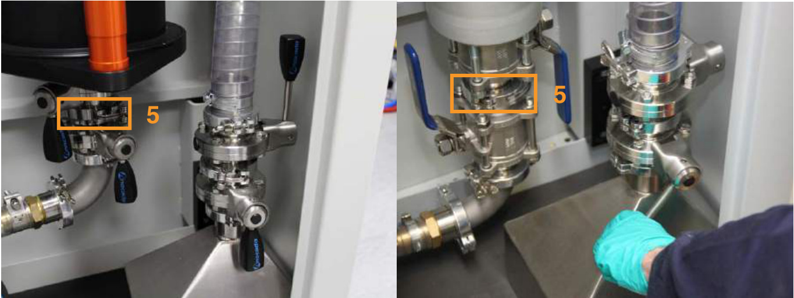  
Figure 48 5 – Safe change filter/large safe change filter lower clamp – L5  

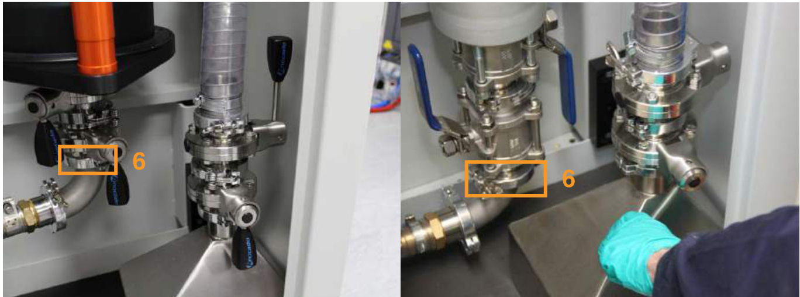  
Figure 49 6 – Filter waste pipe inlet clamp – L6  

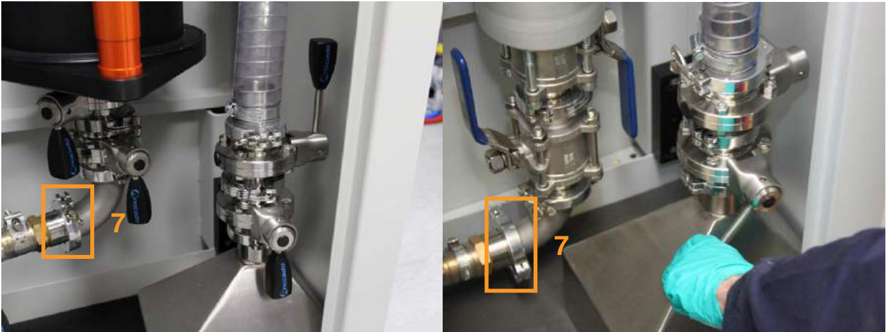  
Figure 50 7 – Filter waste pipe outlet clamp – L7  

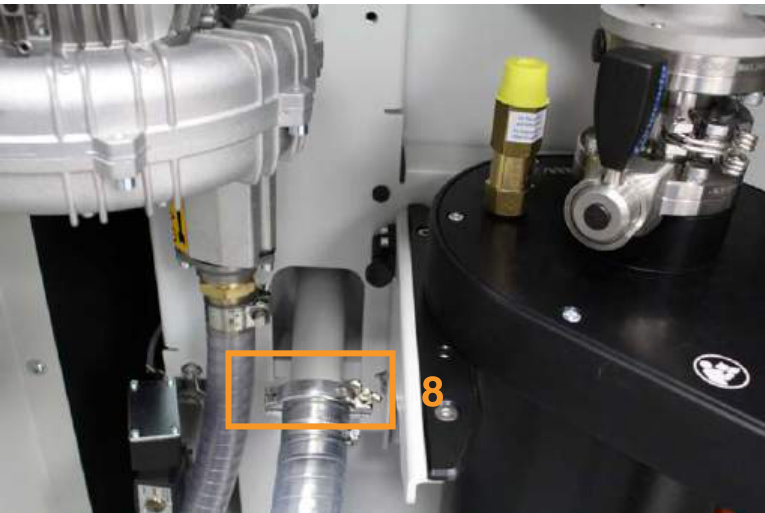  
Figure 51 8 – Rear overflow upper clamp – L8  

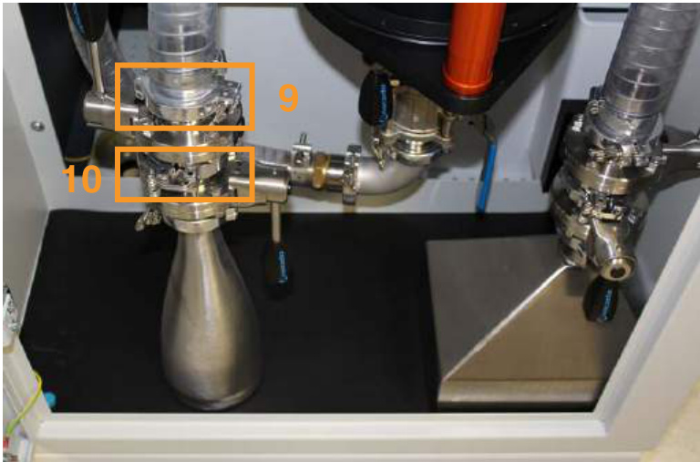  
Figure 52 9 & 10 – Rear overflow flexi pipe to rear overflow isolation valve clamp and rear overflow clamp – L9 & L10  

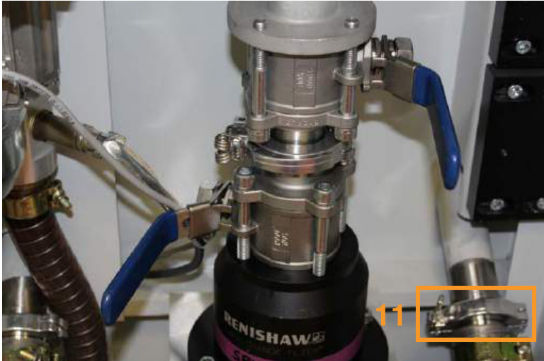  
Figure 53 11 – Front overflow upper clamp – L11  

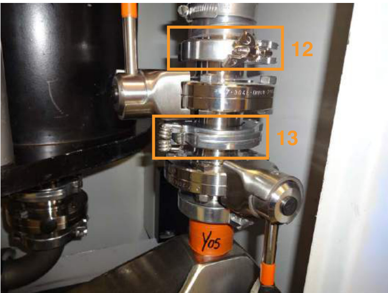  
Figure 54 12 & 13 – Front overflow flexi pipe to front overflow isolation valve clamp  – L12 and front overflow clamp – L13  

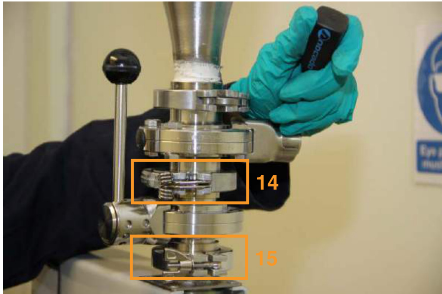  
Figure 55 14 & 15 – Small powder bottle to sieve upper isolating valve clamp – SL1 and sieve upper isolating valve to bracket clamp – SL2  

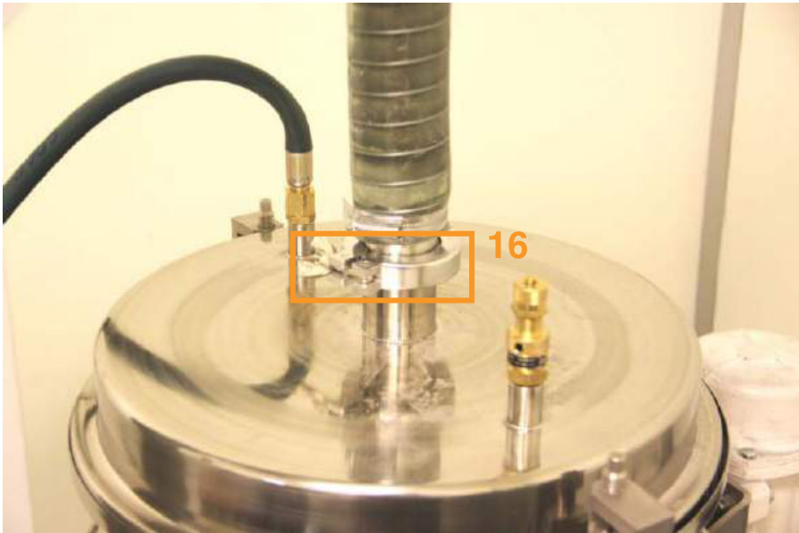  
Figure 56 16 – Sieve inlet to KF flange adaptor clamp SL3  

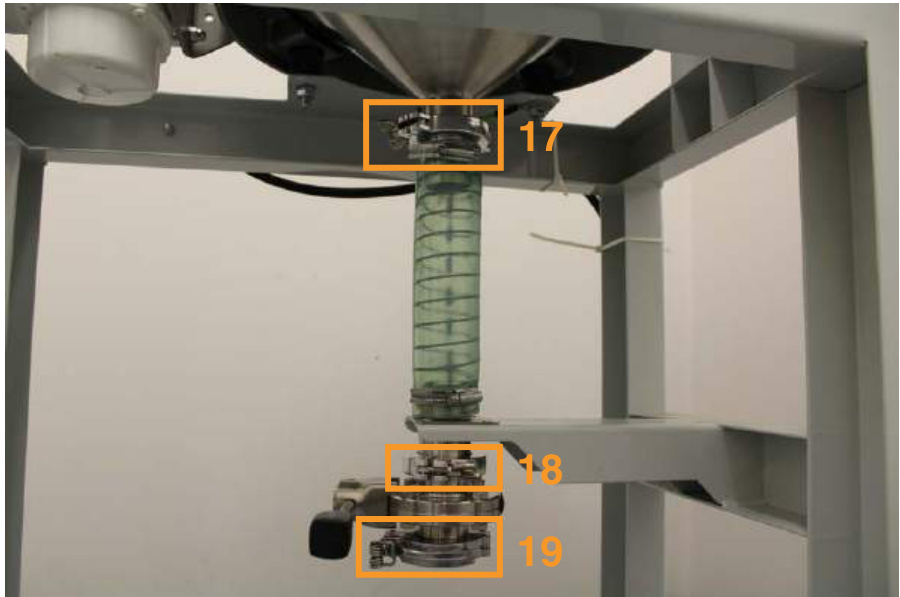  
Figure 57 17, 18 & 19 – Sieve outlet to KF flange adaptor clamp – SL4, bracket to sieve lower isolation valve clamp – SL5 and sieve lower isolation valve to small powder bottle clamp – SL6  