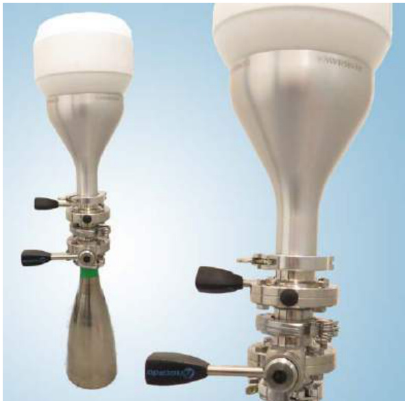
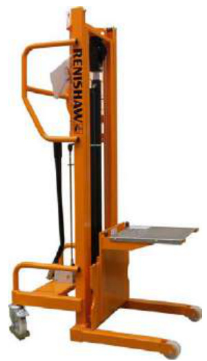
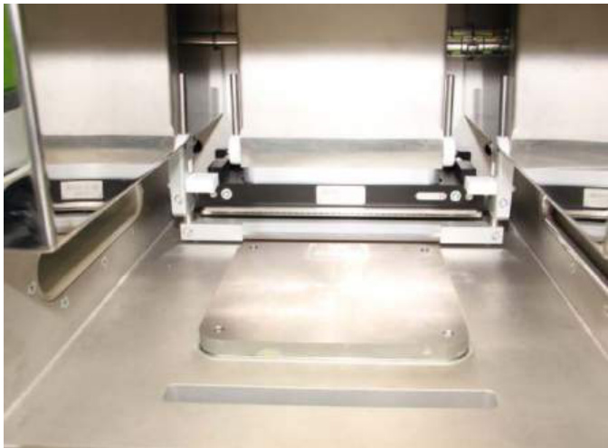

# 13.1 Main switch and Emergency Stop button  

The equipment main isolator switch is mounted on the right hand side of the AM250/AM400 cabinet. Switch the main isolator to ON or 1. The controller and the main computer will then begin the start-up routine.  

# WARNING: OPERATING THE EQUIPMENT MAIN ISOLATOR DOES NOT ISOLATE THEELECTRICAL SUPPLY TO THE MAINS CONDITIONING MODULE. TO ISOLATE POWER TO THEMAINS CONDITIONING MODULE ISOLATE THE POWER AT THE CUSTOMERS MCB.  

Switch on the main regulator for the argon gas located on top of the argon cylinder connected to the equipment. This should be regulated to 1.5 bar (do not exceed 2 bar maximum).  

When the controller and the main computer have started, the system is ready for operation.  

To operate the equipment, unlatch the Emergency Stop button, situated below the touch screen on the front of the cabinet, by rotating it clockwise. To enable the safety relay, press the blue RESET button next to the Emergency Stop.  

Caution: DO NOT leave the Emergency Stop in the latched position for long periods of time.  

Caution: Ensure that the laser key switch is in the on position.  

Pressing the Emergency Stop button at any point in the cycle will stop the manufacturing process. The laser and mechanical components will be inoperable. The main computer and controller will be available to the operator; however their functionality will be disabled until the alarm messages have been cleared. The argon atmosphere will remain in place to retain a safe inert atmosphere inside the process chamber. If the Emergency Stop is pressed, to enable the safety relay, press the blue RESET button next to the Emergency Stop. The z-axis uses an incremental encoder, with a proximity sensor to provide an accurate home position. Operating the Emergency Stop will require the z-axis home position to be re-taught.  

# 13.2 Touch screen (HMI) and PLC  

The Additive Manufacturing build process is controlled from a Human Machine Interface (HMI) touch screen on the front of the AM250/AM400 cabinet. It incorporates a user privilege access system. The level of access will depend on the individual operator’s unique login code (up to a maximum of six alphanumeric characters).  

The Programmable Logic Controller (PLC) controls the system operation, the mechanical and monitoring functions of the equipment such as wiper assembly, z-axis, pumps and valves and the selection of the parts for building.  

# 13.3 Main computer  

The build and process control software runs on this PC. It is located within the framework of the AM250/AM400 cabinet inside the lower door. In normal use there are no input or output devices for human intervention. The PC will be started and stopped from the PLC system using the PC on/off override buttons.  

# 13.4 Laser  

The laser provides the energy source for the AM process. It is located within the framework of the system. Further information about the laser can be obtained from Renishaw upon request.  

# 13.5 Chiller  

A chiller (supplied with the system) maintains a stable temperature for the laser and optical system. It is imperative that the chiller is maintained in accordance with the manufacturer’s instructions and that a suitable anti-fungal inhibitor is used. See Section 14.1 "Chiller". There are two sizes of chiller, the size of chiller supplied depends upon the AM system supplied.  

# 13.6 Beam aperture protective window  

The F-Theta lens focuses the laser beam on to the metal powder surface on the substrate plate housed in the top chamber. For AM250 the lens protective cover should only be cleaned by following the procedure as detailed in section 30.4. For AM250 with PlusPac and AM400 the WPS (Window Protection System) should only be cleaned by following the procedure as detailed in section 30.5.  

A cleaning kit is available from Renishaw – see Appendix B "Part numbers of spares" for details of the kit and its contents.  

# 13.7 Viewing window  

The main chamber door of the build volume features a viewing window and a protective insert. This meets the standard ANSI Z136.1 – 2007 and is specified to protect against scattered laser radiation for the wavelength used in the AM250/AM400. The viewing port is located in the door of the top chamber and in this application permits a Class 1 laser specification to be achieved.  

# 13.8 Loading metal powder using powder bottles  

Metal powder of the correct particle size should be loaded from the supplier’s containers into small powder bottles using a mask, gloves and eye protection as detailed in the safety section of this manual.  

# WARNING: DO NOT LOAD POWDER DIRECTLY FROM THE SUPPLIERS CONTAINER INTO THE AM250/AM400 – POWDER MUST FIRST BE DECANTED INTO A POWDER BOTTLE. DO NOT ATTEMPT TO FILL THE SILO WHILST THE SYSTEM IS PREPARING THE BUILD ATMOSPHERE (DURING THE VACUUM CYCLE).  

  
Figure 58 Decanting adaptor and powder bottle  

Decanting reactive materials, such as titanium and aluminium, should be done in an inert atmosphere – inside an argon glove box.  

Alternatively, Renishaw is able to provide adaptors for a range of powder containers that link a supplier’s container to a KF40 adaptor. (These are designed and manufactured on request depending on the supplier’s container type.)  

The Renishaw powder bottles are sealed with a butterfly valve and can be used to load material into the system. The large powder bottle is a large capacity vessel designed to collect excess powder. It is located in the lower part of the side access door alongside the safe change filter. To empty, connect it to a small powder bottle to decant material. Only the small powder bottle (part number 796531000) should be fitted to the sieving station following a build.  

# WARNING: THE FULL LARGE POWDER BOTTLE IS HEAVY (UP TO 40 KG (88 LB) DEPENDING ON MATERIAL) – USE SUITABLE MANUAL HANDLING PROCEDURES.  

# 13.9 Loading the powder silo  

The AM250/AM400 features a removable silo arrangement; this can be exchanged for a cleaned or powder-specific unit when changing powders. An overhead crane or gantry with a minimum lifting capacity of $2 0 0 ~ \mathsf { k g }$ is required when removing the silo. Renishaw recommend using a Renishaw silo changeover lift part number A-5771-1000, (Figure 59).  

Loading powder into the silo requires a small powder bottle to be fitted to the top of the silo. Two valves are required – one to isolate the bottle (A1) and one to isolate the silo (V1).  

The silo can be refilled whilst a build is in process, but not until the initial vacuum and inert cycle has completed.  

  
Figure 59 Renishaw silo lift  

# WARNING: DO NOT ATTEMPT TO FILL THE SILO WHILST THE SYSTEM IS PREPARING THE BUILD ATMOSPHERE (DURING THE VACUUM CYCLE).  

# 13.10 Powder level sensor  

The AM250/AM400 is fitted with a Vega powder level sensor. A separate user manual is available for this device. The integration in to the AM250/AM400 gives a reading down to the point at which the silo meets the main chamber. The silo volume is non-linear and, as such, the calibration curve programmed into the sensor incorporates an allowance for this. The system can be configured to pause at a given level via the user interface.  

# 13.11 Powder delivery  

The powder delivery mechanism is situated inside the chamber and dispenses a dose of metal powder on to the base of the top chamber process plate. The mechanism can be configured to vary the amount of powder dosed. The percentage dosage can be entered using the HMI touch screen, see Section 27.5 "Setting the dosing percentage".  

# 13.12 Wiper assembly  

The wiper assembly, (Figure 60) comprises the wiper arm, pulleys and toothed belts concealed behind sheet metal covers. The wiper traverses the base of the top chamber, distributing a uniform layer of metal powder over the top of the substrate plate. Excess powder is discharged through front and rear apertures in the process plate.  

  
Figure 60 Wiper assembly  

# 13.13 Gas circuit  

On the AM250 system gas enters the build chamber from the lower right hand side of the chamber. On AM250 with PlusPac and AM400 gas enters the build chamber from the top left, top right and lower right hand sides of the chamber. It creates a flow of gas directed across the substrate plate. The finest metal powder and soot particles produced during the build process are collected and directed to a port on the left hand side of the top chamber which is connected in turn to a safe change filter/large safe change filter outside the chamber. The filter housing containing the filter element can be accessed through the left hand door, isolated and removed for replacement.  

On AM250 systems fitted with PlusPac and on AM400 systems, the gas circuit has additional pipework fitted to the top of the build chamber to more efficiently direct the flow of gas.  

On AM250 systems fitted with PlusPac and on AM400 systems, there is an option to control the flow of gas across the build plate when the system is dosing powder. If enabled, flow regulation decreases the output of the recirculation pump whilst the doser is delivering powder into the build chamber and whilst the wiper is distributing this powder across the build plate. Flow regulation is enabled in Level 4 login. The reduction in recirculation output is configurable in Level 2 login, and by default is set to a $50 \%$ reduction. If a value outside the normal range is entered an error message wil be shown.  

# 13.14 Build plate  

The build plate is the surface upon which the build process takes place. It is bolted onto the top surface of the table housed in the bottom chamber using M5 cap screws. It then gets covered by progressive layers of metal powder. The powder is selectively melted, fusing it first to the substrate then to the previous layer to create a homogeneous solid component. Each powder type requires a compatible substrate material. See Section 36 Appendix A "AM250/AM400 build plate drawings", for build plate requirements.  

# 13.15 Heating/temperature control  

There are heaters built into the table which can be used to heat the substrate plate. The temperature can be set in degrees on the thermostat ( $1 7 0 ^ { \circ } \mathsf { C }$ max ( $3 3 8 ^ { \circ } \mathsf { F }$ max)) via the HMI touch screen.  

# 13.16 Safe change filter and large safe change filter  

The system features a recirculating gas flow across the build area, flowing from right to left. The rate of flow can be altered from the HMI touch screen. The finest metal powder and soot that is emitted from the process is carried by the flow of gas and captured in either the safe change filter or large safe change filter housed in an aluminium cylinder located on the left hand side of the cabinet. AM250 systems will be fitted with a safe change filter. AM250 with PlusPac and AM400 systems will be fitted with the large safe change filter. The filtered inert gas is then re-circulated through the system to maintain extremely low oxygen content. The filter housing can be isolated using the upper and lower valves (V4 and V5) and then removed by releasing the two KF40 flanges.  

Following removal of the safe change or large safe change filter housing, it must be made inert by filling with water, and placed into a vented drum full of water and a $5 \%$ solution of Hydra-Sol-MAG additive (P-LU08-0004) – see Section 22 – "Safe change or large safe change filter".  

Please seek advice from your local waste disposal provider; details of the contaminants for a range of materials can be provided on request.  

# 13.17 Oxygen monitoring sensors  

The oxygen levels in the chamber and the gas recirculation circuit are continuously monitored at two separate points in the system gas circuit. If the oxygen level exceeds the maximum value set in the user interface, the system will add inert gas. The process will pause briefly until the required level is achieved.  

In practice, oxygen levels are generally maintained well below 500 ppm (parts per million) or $0 . 0 5 \%$ . The default setting is 1000 ppm $( 0 . 1 \% )$ before the build will commence, and the upper safe threshold is 5000 ppm $( 0 . 5 \% )$ .  

# 13.18 Dehumidifier – AM400 only  

A dehumidifier (supplied with the system) maintains a supply of clean, dry and temperature-controlled air to the AM400. The supply of air is required to cool parts of the optical system on the AM400 laser.  

# 13.19 Disposal of waste materials  

WARNING: THE SUBSTANCES INDICATED BELOW MUST BE DISPOSED OF IN A SAFE MANNER. THEY MUST NOT BE ALLOWED TO CONTAMINATE THE ENVIRONMENT.  

# 13.19.1 Metal powders  

Disposal of metal powder, whether new, used, or in the form of contaminated components and filters, must be conducted in accordance with the relevant COSHH sheet and/or applicable local legislation.  

  

Wear eye protection, full face respirator (to EN143 Type $\mathsf { P } 3 + \mathsf { A } 1$ ), protective gloves and cotton or fire retardant overalls with full length sleeves (made of staticdissipative material).  

Do not allow the dust to form a cloud.  

  

Do not eat, drink or smoke in the vicinity of the AM system.  

  

Wash hands thoroughly with water and soap after disposal.  

Wash any contaminated clothing separately from other clothing.  

# 13.19.2 Storage and disposal of waste products  

Some process waste is hazardous in nature. This includes materials that are combustible when dry and give off flammable gaseous emissions when mixed with water. Further information on safe working practices is given in this manual, see Section 14.2 "ATEX vacuum cleaner (wet separator)" and Section 22 – "Safe change or large safe change filter". Further information is available on request.  

In general, our recommendation is to remove and store waste filters in water and a $5 \%$ solution of Hydra-Sol-MAG additive (part number: P-LU08-0004) in well ventilated containers, to await disposal from a suitably accredited organisation accustomed to dealing with hazardous waste.  

WARNING: WASTE FILTERS MUST BE STORED IN WATER WITH A $5 \%$ SOLUTION OF HYDRASOL-MAG ADDITIVE IN A WELL VENTILATED CONTAINER.  