# 14.1 Chiller  

# 14.1.1 Chiller cooling fluid level check  

The AM250/AM400 requires a supply of temperature-controlled fluid to keep the optical components at a stable temperature. The chiller is a closed-loop cooling circuit and has a direct communication connection to the system that allows status and warnings to be viewed via the HMI touch screen.  

Regular weekly checks are required to ensure that the chiller fluid level is maintained – it should not be allowed to drop below the L mark on the sight glass (Figure 61). The chiller cooling circuit can be filled with either Glycol or Nalco fluid. Using Glycol requires the use of a corrosion inhibitor / fungicide which is available from your local Renishaw office. Glycol is a concentrated solution and is mixed with purified filtered water at a concentration of $2 5 \%$ by volume. Description – Glycol chiller additive. Part number: P-HX04-0001. Nalco is supplied pre-mixed, does not require the use of any additional additives and should only be topped up with pre-mixed Nalco. Description – Nalco chiller additive. Part number: P-HX04-0003. Do not fill above the H mark on the sight glass. Do not mix the chiller fluids.  

In addition to this regular inspection, maintenance is required, refer to the recommendations in the manufacturers service manual, see Section 37 "Supplier manuals" for information on the make, model and manufacturer. There are two sizes of chiller, the chiller supplied depends upon the AM system supplied.  

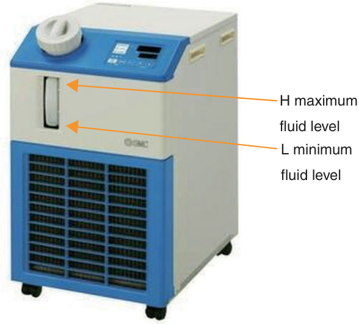  
Figure 61 Chiller fill levels  

# 14.1.2 Basic chiller maintenance  

The cover for the chiller is held in place by magnetic strips. Release the cover by sliding it downwards and pulling the bottom edge out (Figure 62).  

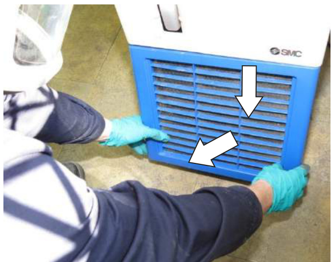  
Figure 62 Release cover by sliding down  

Use the ATEX vacuum cleaner (wet separator) to vacuum the dust from the chiller filter (Figure 63).  

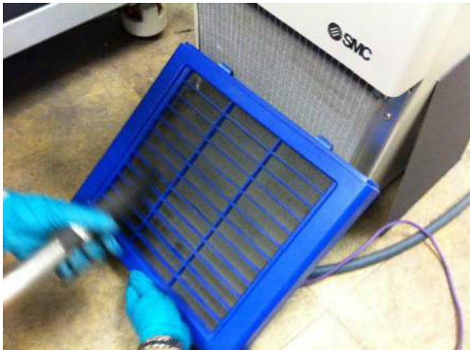  
Figure 63 Cleaning the chiller cover  

After vacuuming, replace the cover using the magnetic strips at the bottom of the chiller (Figure 64).  

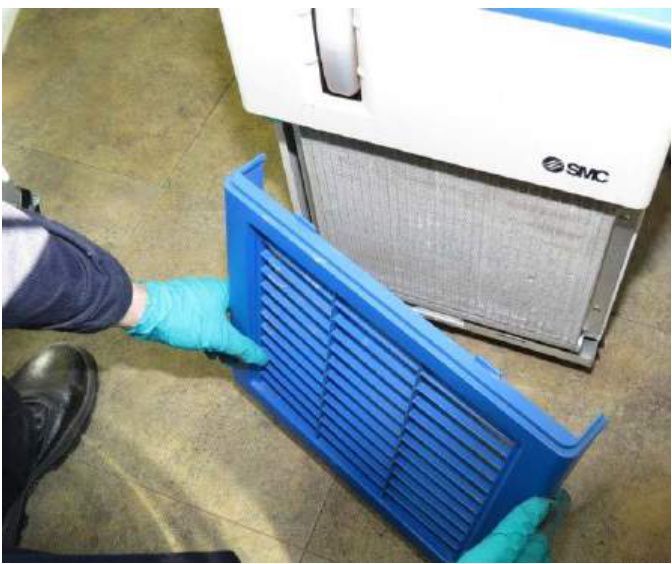  
Figure 64 Reassemble the cover  

The temperature parameters should be checked every two weeks to ensure efficient use of the chiller (Figure 65).  

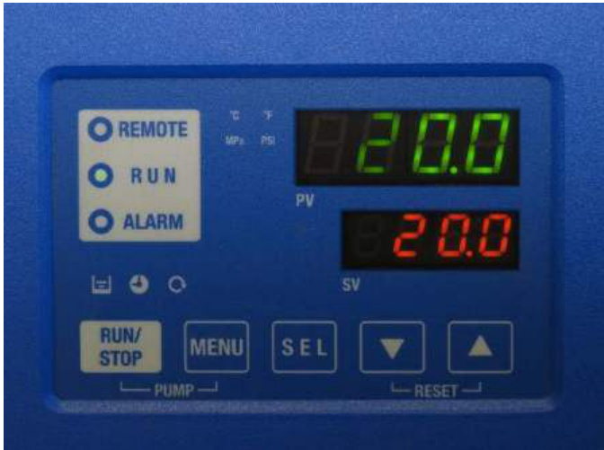  
Figure 65 Recommended temperature parameters  

Check the fluid levels are within the H (maximum) and L (minimum) markings, (Figure 66). If required top-up with chiller fluid, this is either Glycol or Nalco. Do not mix the chiller fluids together.  

Glycol $2 5 \%$ , (part number P-HX04-0001) mixed with purified filtered water Nalco pre-mixed, (part number P-HX04-0003)  

Do not fill above the H mark on the sight glass.  

To ensure efficient use of the chiller for the AM250/AM400 system, these tasks should be completed on a monthly basis.  

Caution: Only mix Glycol with purified filtered water. DO NOT mix Glycol with any other type of water. Do not mix Glycol with de-ionised, de-mineralised, tap or plant water. Nalco is supplied pre-mixed and does not need water adding.  

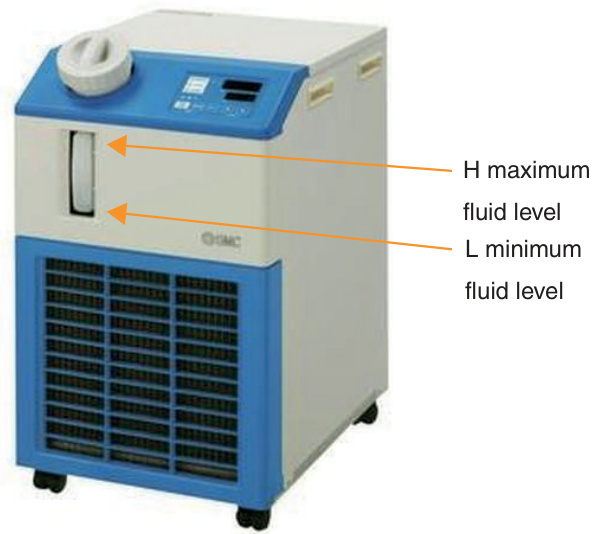  
Figure 66 Check fluid level  

# 14.2 ATEX vacuum cleaner (wet separator)  

WARNING: DO NOT STORE THE ATEX VACUUM CLEANER (WET SEPARATOR) IN A CLOSED UNVENTILATED SPACE. ALWAYS MAINTAIN THE ATEX VACUUM CLEANER (WET SEPARATOR) IN ACCORDANCE WITH THE MANUFACTURER’S INSTRUCTIONS. NEVER USE AN INAPPROPRIATE VACUUM CLEANER TO CLEAN AWAY POWDER OR WASTE PRODUCT.  

WARNING: IN AREAS WHERE POWDER IS NOT EXPECTED TO BE PRESENT BUT MAY BE PRESENT FOR SHORT PERIODS ALL EQUIPMENT IN THAT AREA (INCLUDING PORTABLE) MUST BE ELECTRICALLY BONDED AND EARTHED. IT IS RECOMMENDED THAT ALL PORTABLE EQUIPMENT IS FITTED WITH STATIC-DISSIPATIVE WHEELS, AND IT IS ALSO GOOD PRACTICE TO GROUND WITH AN EXTERNAL GROUND WIRE. CONSIDER CREATING AN ATEX ZONE 22 OR NFPA 484 IN HANDLING AREAS SUCH AS SIEVING, DECANTING, AND DE-BUILD.  

WARNING: VACUUM NOZZLES, HOSES AND FITTINGS MUST BE CONDUCTIVE (ELECTROSTATIC-DISSIPATIVE) AND NON-SPARKING. NEVER USE INSULATING PLASTIC, DOMESTIC NOZZLES, OR MAKE ANY UNAPPROVED MODIFICATIONS. IT IS RECOMMENDED TO CLEARLY MARK ESD VACUUM FITTINGS (WITH YELLOW TAPE AND AN ESD SYMBOL) TO ENSURE THEY CAN NOT BE MIXED WITH NON-ESD PLASTIC FITTINGS.  

WARNING: COMPONENTS/SUBSTRATES BEING VACUUMED MUST BE EARTHED. PRACTICALLY THIS CAN BE ACHIEVED BY CONSTRUCTING BENCHTOPS AND WORKTOPS FROM CONDUCTIVE MATERIAL (NON-SPARKING METAL, FOR EXAMPLE ALUMINIUM OR ESD MATTING) WHICH IS EARTHED. METALLIC BENCHES MUST BE EARTHED. IT IS RECOMMENDED THAT SUPPLEMENTARY BONDING IS FITTED BETWEEN THE VACUUM AND OBJECT BEING VACUUMED (SUBSTRATE PLATE, BENCH TOP OR AM SYSTEM). RENISHAW OR RUWAC CAN PROVIDE A SUPPLEMENTARY BONDING LEAD (RUWAC PART NUMBER 59803 FOR NA7 OR 68134 FOR NA35).  

WARNING: A REGULAR INSPECTION, TESTING, AND MAINTENANCE PROGRAM INCLUDING TESTING OF ELECTRICAL CONTINUITY (BONDING BETWEEN PIECES OF EQUIPMENT) AND EARTHING/GROUNDING (RESISTANCE TO GROUND) MUST BE PUT IN PLACE AND RECORDS KEPT. ESD DISSIPATIVE MATERIALS HAVE A RESISTANCE OF $\bullet \bullet ^ { 6 }$ AND $1 0 ^ { 8 }$ OHMS. THE LOWER LIMIT ( $1 0 ^ { 6 }$ OHMS) IS SPECIFIED TO PROTECT PERSONNEL FROM ELECTROCUTION DUE TO INADVERTENT CONTACT WITH ENERGIZED ELECTRICAL EQUIPMENT, WHILST THE UPPER RESISTANCE LIMIT ( $1 0 ^ { 8 }$ OHMS) IS SPECIFIED TO ENSURE ADEQUATE CHARGE DISSIPATION.  

WARNING: AS MUCH POWDER AS POSSIBLE MUST BE REMOVED WITHIN THE AM250/AM400BUILD CHAMBER. WHERE PRACTICAL POWDER MUST BE SWEPT UP USING NON-SPARKINGRECEPTACLES AND BRUSHES WITH NATURAL FIBRE BRISTLES (NON-STATIC GENERATING).VACUUMING IS ONLY PERMITTED FOR RESIDUAL POWDER THAT CAN NOT BE REMOVEDUSING THE PREVIOUS METHODS. DO NOT USE COMPRESSED AIR FOR POWDER REMOVALOR CLEANING AS IT WILL GENERATE A DUST SUSPENSION.  

WARNING: THESE ACTIONS DO NOT CONSTITUTE A FULL ASSESSMENT OF RISK. USERS MUST SATISFY THEMSELVES THAT THE INSTALLATION STANDARDS AND WORKING PRACTICES ARE SUITABLE. THE FOLLOWING STANDARDS SHOULD BE REFERRED TO: ATEX, NFPA 77, NFPA 484.  

The Renishaw AM system requires the use of an ATEX vacuum cleaner (wet separator) to clean away small remnants of material and waste process emissions. These materials are potentially dangerous and the appropriate procedures as detailed in this manual must be observed.  

Two main hazards exist:  

1. The potential for powder explosion due to static charge caused by powder in suspension. To control and mitigate this hazard, an ATEX vacuum cleaner (wet separator) is used to extinguish any potential ignition whilst the material is vacuumed.   
2. The use of water potentially causes a secondary hazard with some materials, where the reaction between the material and water causes a chemical reaction that can lead to the generation of hydrogen gas which is volatile. a. To control and mitigate this hazard, the ATEX vacuum cleaner (wet separator) features a ventilation valve which remains normally open when the cleaner is not being used. b. For the ventilation valve to function effectively, it is essential to store the ATEX vacuum cleaner (wet separator) in a well ventilated area. c. Use of a $5 \%$ solution of Hydra-Sol-MAG additive (P-LU08-0004) in the ATEX vacuum cleaner (wet separator) will help to inhibit the generation of hydrogen.  

The Renishaw supplied and approved ATEX vacuum cleaner (wet separator) is a Ruwac NA7 (Figure 34) (earlier installations may also be using the Ruwac NA35).  

The manufacturer’s user manual for the Ruwac NA7 is supplied, and should be read before use. Key points are listed below:  

# 14.2.1 ATEX vacuum cleaner (wet separator) safety checks  

  

Ensure the ATEX vacuum cleaner (wet separator) is electrically earthed.   
< 106 Ohms between plug and components.   
< 1 MOhm for conductive components.   
< 108 Ohms for dissipative parts. Check fluid level is correct before every start-up, and top-up as necessary.   
Ensure correct additives are used.  

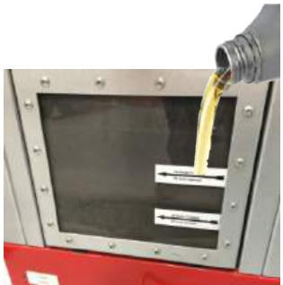  

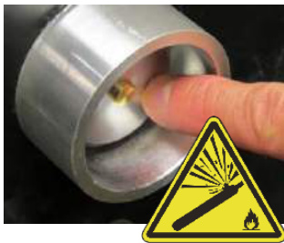  

Check the hydrogen ventilation valve(s) work before start-up by pressing and ensuring they spring back (open).  

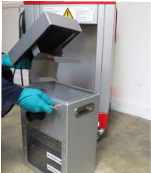  

Ensure the ATEX vacuum cleaner (wet separator) is emptied and cleaned after every shift.  

These checks must be carried out on both the Ruwac NA35 and NA7 models.  

Ensure the ATEX vacuum cleaner (wet separator) is electrically earthed.  

Check the earth continuity between each of the components that come into contact with powder against each other. Check the resistance of the plug earthing (largest diameter pin) against the body. If a reading greater than 1 MOhm (open circuit) is detected between any component, the unit must be disassembled and checked.  

Ruwac recommends that an insulation tester is used with a voltage of $2 5 0 \vee$ ; however a low voltage multimeter should be sufficient. Renishaw recommends that this is checked at least after every disassembly or weekly if no disassembly occurs.  

Ensure the fluid level is checked before every start-up and the correct additives are used.  

This can be easily checked through the window of the Ruwac NA7, however the NA35 must be disassembled to check.  

Users must have completed the appropriate Renishaw training course before handling oxygen reactive metals. Among other recommendations this will specify the need to add a $5 \%$ solution of Hydra-SolMAG additive (part number P-LU08-0004) to the Ruwac ATEX vacuum cleaner (wet separator).  

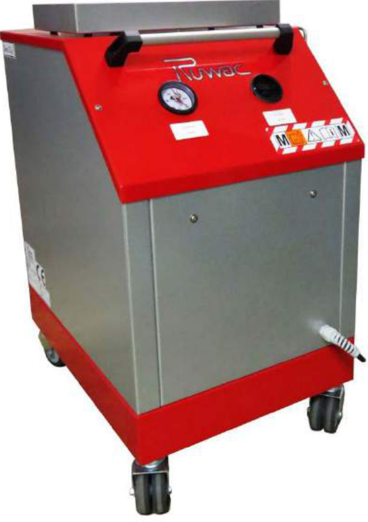  
Figure 67 Ruwac NA7 ATEX vacuum cleaner (wet separator)  

Depending on the metal powder (particularly aluminium alloy) and local water hardness it may also be necessary to add $0 . 1 \%$ by volume of anti-foaming agent (part number 792322000). It is essential that foam is not allowed to build up as it will be drawn into the cleaner resulting in corrosion.  

Ensure the ventilation valve(s) are checked before start-up  

Note that the ventilation valve is designed to close when in use. First, turn off the Ruwac ATEX vacuum cleaner (wet separator). Push the inner disk (Figure 68 and Figure 69). It should move approximately $5 \mathsf { m m }$ and spring back (open) – if no movement is detected the valve is stuck. Immediately quarantine the Ruwac ATEX vacuum cleaner (wet separator) by placing it in a well ventilated area away from possible ignition sources.  

Contact Renishaw for replacement parts.  

Ensure the ATEX vacuum cleaner (wet separator) is emptied and cleaned after every shift. This will limit the time that the oxygen reactive metal is in contact with water. Waste water must be stored in a vented drum in a well ventilated area (preferably outdoors) until it can be recycled.  

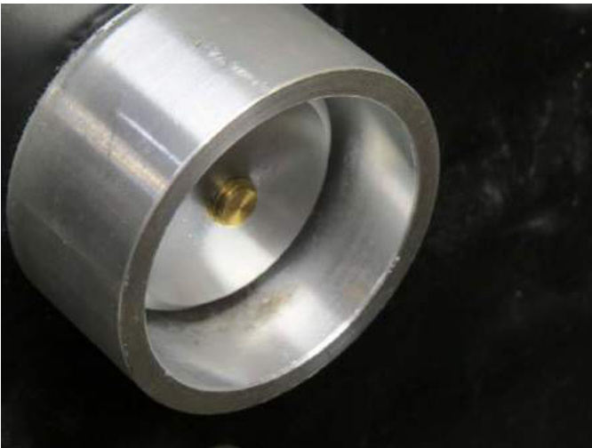  
Figure 68 Ventilation valve in open position  

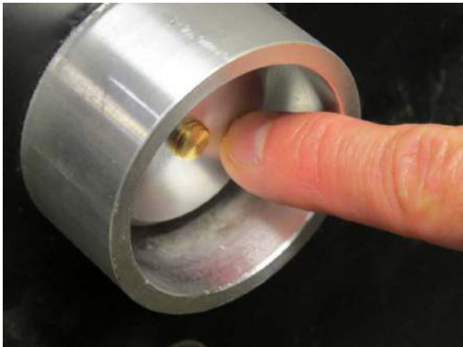  
Figure 69 Press the ventilation valve to confirm movement  

# 14.3 Renishaw powder recovery system (sieve)  

WARNING: ENSURE YOU ARE WEARING THE CORRECT PPE: EYE PROTECTION, FULL FACE RESPIRATOR (TO EN143 TYPE $\mathsf { P 3 } \plus \mathsf { A 1 }$ ), PROTECTIVE GLOVES AND FULL LENGTH CLOTHING, (MADE FROM NON-STATIC GENERATING FABRIC SUCH AS COTTON (AVOID WOOL AND MAN MADE FABRICS) AND AVOID TURN-UPS OR POCKETS THAT MAY TRAP POWDER, REFER TO NFPA 484 FOR DETAILS) BEFORE STARTING THIS TASK.  

Note: To minimise the risk from Argon leakage Renishaw recommend using a small argon gas cylinder of approximately 1000 L (35 cu/ft). Renishaw also recommend using a trigger type gas valve to prevent the gas supply being accidently left on.  

WARNING: WHEN IN OPERATION THE BODY OF THE SIEVE MOVES RELATIVE TO THESUPPORT FRAME. THERE IS A POSSIBILITY OF BODY PARTS BECOMING TRAPPEDBETWEEN THE SIEVE BODY AND SUPPORT FRAME. ENSURE HANDS ETC ARE KEPT AWAYFROM THE SIEVE WHEN IT IS IN OPERATION.  

# 14.3.1 Attaching the argon supply  

The sieve station has a gas supply port, which can be connected to an argon supply. This is essential for oxygen reactive metals (titanium for example). This should be regulated to 0.1 bar (1.5 psi). The sieve is ATEX rated to run containing air, however the properties of oxygen reactive metals may be affected by doing so. Ensure the argon supply line is connected to the sieve (Figure 70).  

  
Figure 70 Sieve with argon inlet attached  

Place an o-ring seal on an empty powder bottle. Engage the empty powder bottle KF flange to the bottom flange of the sieve assembly and seal the connection using a quick-release clamp (SL6) (Figure 71).  

Open the valves of both sieve assembly (S2) and empty bottle (A1) to complete connection (levers aligned with direction of flow) (Figure 72).  

Open the argon valve and ensure it is regulated to 0.05 bar to 0.15 bar (0.7 psi to 2.2 psi).  

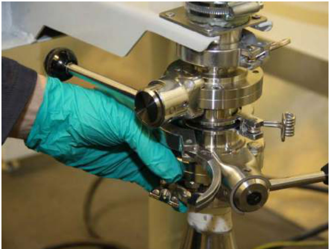  
Figure 71 Insert seal and attach clamp (SL6)  

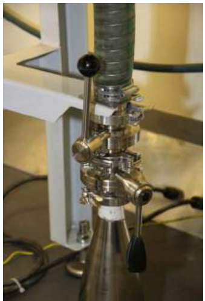  
Figure 72 Open valves (A1 and S2)  

Open the sieve upper valve (S1) to allow air to be purged. Leave open for 30 seconds (Figure 73), switch off the argon supply and close the sieve upper valve (S1).  

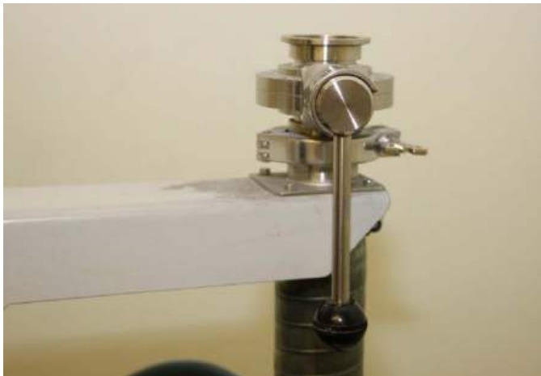  
Figure 73 Open sieve upper valve (S1)  

WARNING: DO NOT PRESSURISE THE SIEVE BY MORE THAN 1 BAR (15 PSI) AS THE OVERPRESSURE VALVE WILL RELEASE THE ARGON.  

# 14.3.2 Loading material  

Connect a bottle full of un-sieved powder onto the top of the sieve using an o-ring and quick-release clamp (SL1) (Figure 74).  

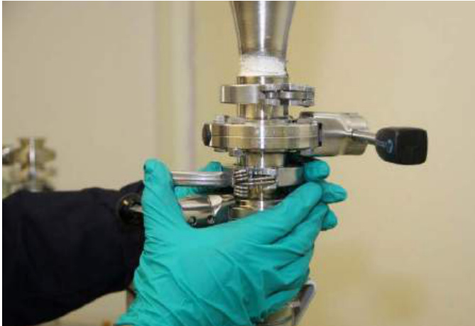  
Figure 74 Connect full bottle – Insert seal and attached clamp (SL1)  

Open both of the upper valves (S1 and A1) to complete the connection (Figure 75).  

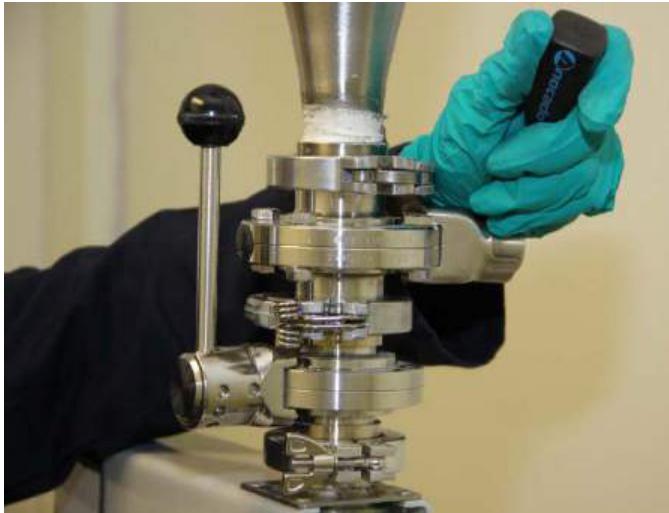  
Figure 75 Open valves (S1 and A1)  

Where multiple materials are used Renishaw recommend colour coding both sieve and powder bottles – check the correct material is being loaded.  

Switch on the sieve and start sieving powder (Figure 76).  

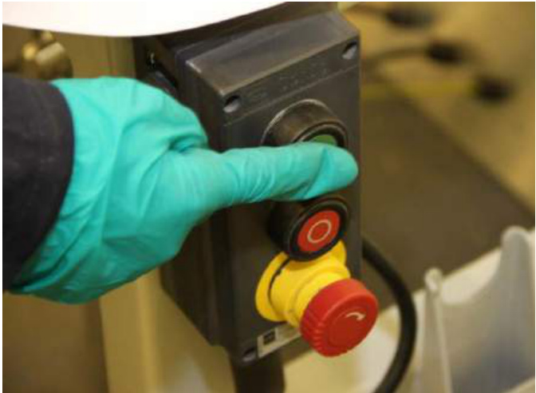  
Figure 76 Press start button  

Run the sieve for at least 10 minutes to allow sufficient time to sieve all of the powder, set a timer (Figure 77).  

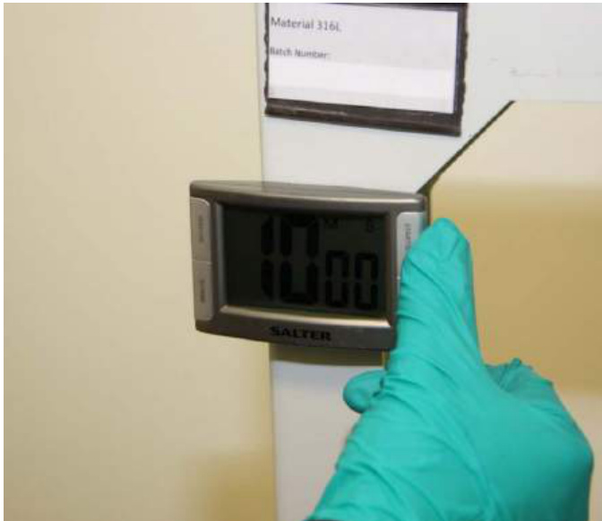  
Figure 77 Set timer for 10 minutes  

Caution: Running the sieve for less than 10 minutes may result in powder being left in the sieve – this will overfill the next bottle resulting in a spillage.  

Check completion by tapping the neck of the lower powder bottle. If it sounds hollow run the sieve for longer.  

When the appropriate amount of time has passed switch off the sieve.  

Close both of the valves on the sieve (S1 and S2) and the bottom powder bottle (A1) (lever perpendicular to flow) (Figure 78).  

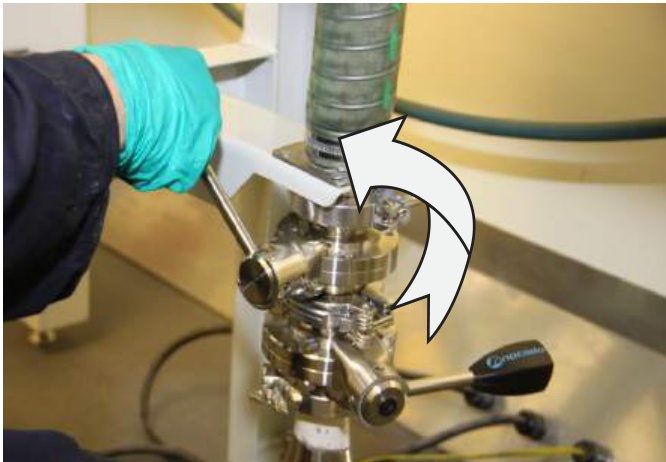  
Figure 78 Shut off valves (S1 and S2)  

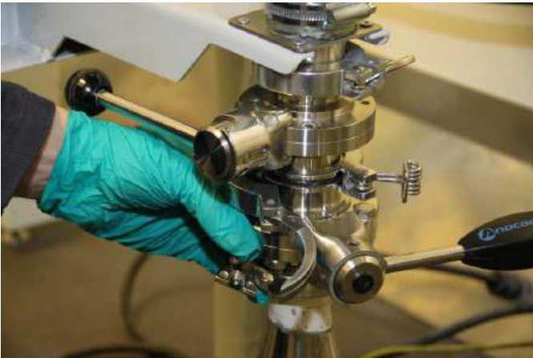  
Figure 79 Remove clamp (SL6)  

Remove the quick-release clamp (SL6) (Figure 79).  

Remove the full powder bottle from the bottom of the sieve and repeat for empty bottle on top of the sieve. Ensure that the bottle containing the sieved powder is correctly labelled, with both material type and status (that it is sieved).  

14.3.3 Disassembly of the sieve for cleaning and maintenance  

WARNING: SIEVE MAINTENANCE MAY RELEASE SMALL AMOUNTS OF POWDER FROM THE SIEVE. THIS MUST BE RISK ASSESSED AND SUITABLE PRECAUTIONS TAKEN, REFER TO THE APPLICABLE ATEX AND DSEAR DIRECTIVES.  

WARNING: ENSURE THAT NO POWDER REMAINS IN THE SIEVE, THAT THE PIPES ARE EMPTY AND THE BOTTLES HAVE BEEN REMOVED.  

  

It is still necessary to wear the correct Personal protective equipment to protect against residual powder.  

Remove any external powder resting on the outer body of the sieve and on top of the lid using an ATEX vacuum cleaner (wet separator).  

Electrically isolate the sieve by switching the isolator to 0 or OFF.  

Disassemble the clamp connecting the top pipe to the lid of the sieve (SL3), then remove the centring ring (Figure 80).  

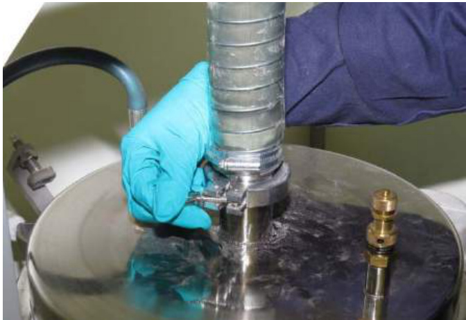  
Figure 80 Remove top clamp (SL3)  

Release the two clamps applied to the lid (Figure 81).  

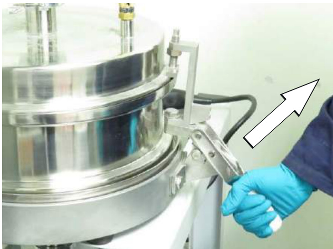  
Figure 81 Release both clamps  

Ensure the argon supply has been switched off. Remove the argon line connection to the sieve lid using two adjustable spanners (Figure 82).  

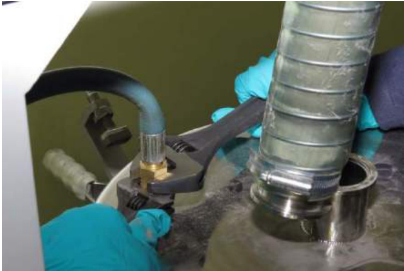  
Figure 82 Remove argon line  

Remove the lid (Figure 83).  

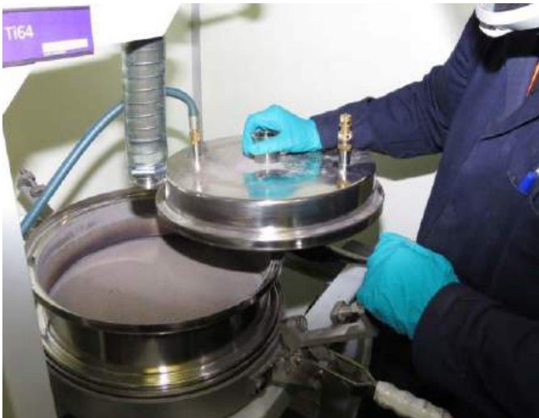  
Figure 83 Remove lid  

Disassemble the seal and main body of the sieve leaving the mesh grating exposed (Figure 84).  

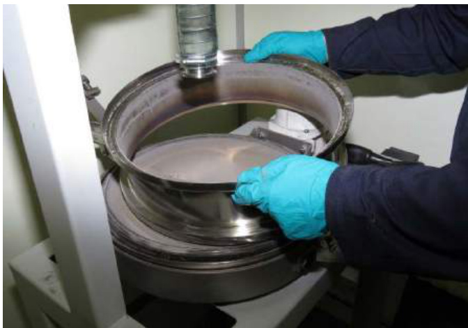  
Figure 84 Remove body  

Carefully remove the mesh grating and dispose of the scrap powder remaining on the mesh. (Figure 85)  

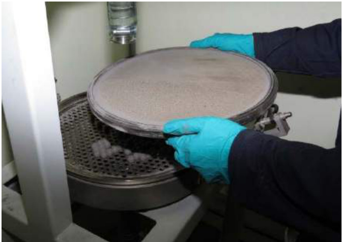  
Figure 85 Remove sieve and dispose of powder  

Disassemble the large seal around the mesh grating (Figure 86).  

Caution: Sieve mesh is a delicate component and must be removed with care. Do not vacuum or otherwise clean the mesh.  

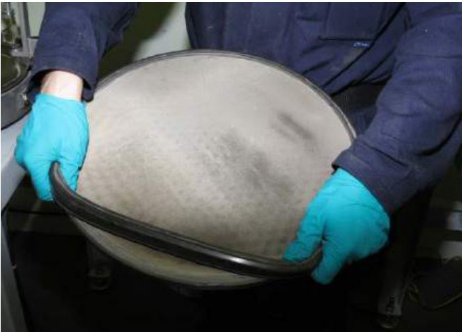  
Figure 86 Remove outer seal  

Remove the sieve balls and store in a bottle full of Isopropanol Class 3 (Figure 87).  

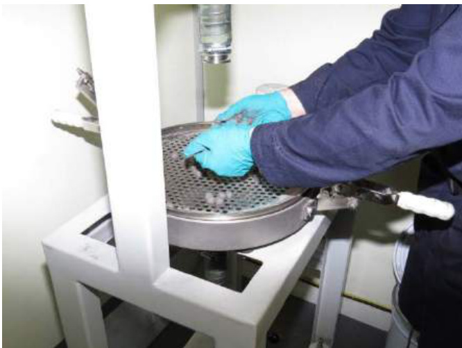  
Figure 87 Remove balls and store in IPA  

Remove the perforated plate (Figure 88).  

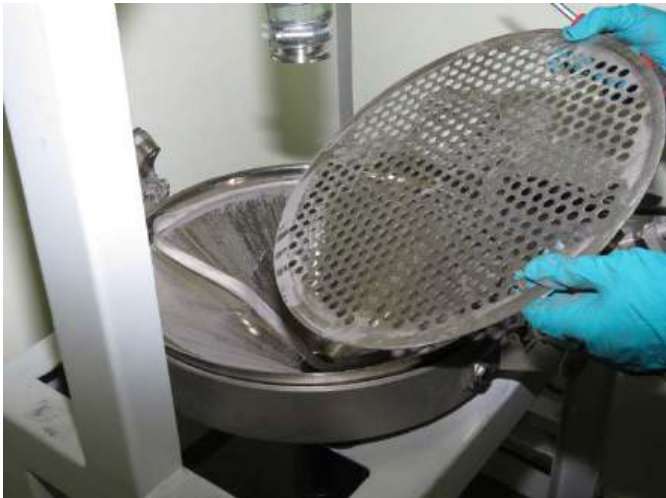  
Figure 88 Remove perforated plate  

Remove the sieve funnel top seal (Figure 89).  

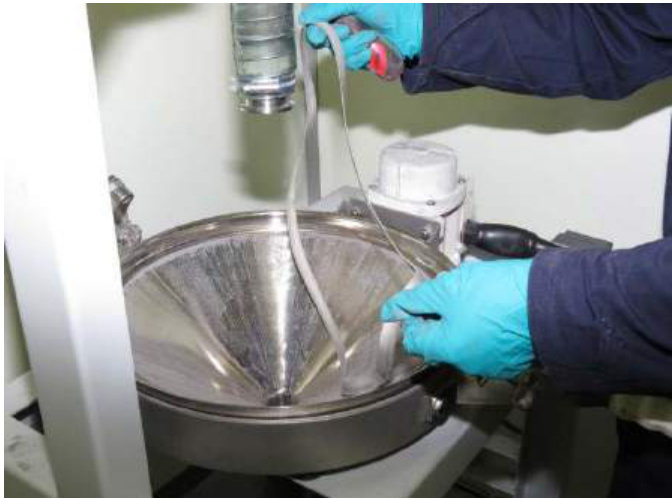  
Figure 89 Remove funnel seal  

Remove the worm drive hose clamp retaining the top pipe to the upper valve (S1), (Figure 90).  

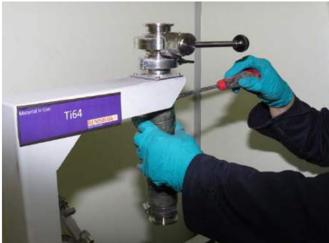  
Figure 90 Remove worm drive hose clamp and pipe  

Following the same procedure remove and disassemble the bottom pipe and lower valve (SW2) assembly, (Figure 91).  

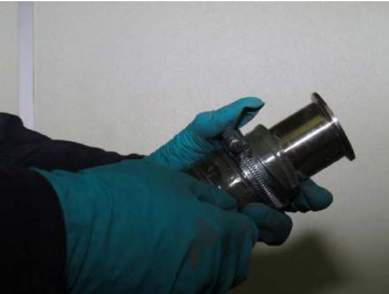  
Figure 91 Remove pipe insert  

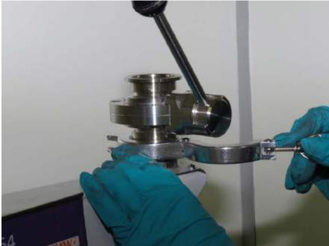  
Figure 92 Remove upper valve (S1) assembly  

When all the components have been removed, they need to be cleaned down.  

Firstly, use the ATEX vacuum cleaner (wet separator) to remove any powder on the sieve components (Figure 93).  

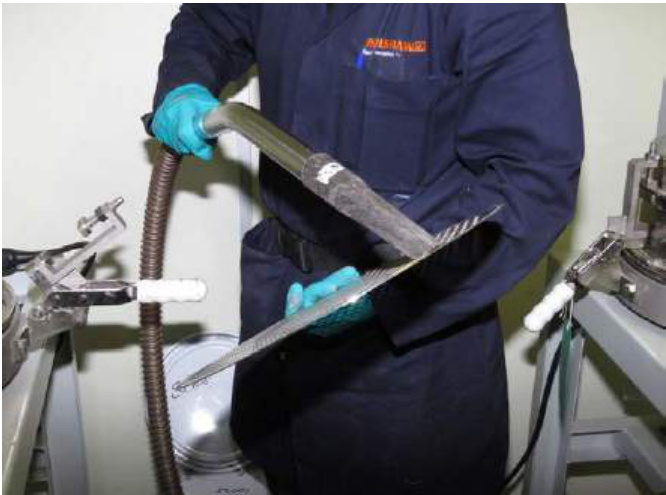  
Figure 93 Use the ATEX vacuum cleaner (wet separator) to vacuum all components  

Use Isopropanol and disposable cloth for cleaning of all other components including pipes, valves (S1 and S2), and centring rings (Figure 94).  

  
Figure 94 Clean-down all components with IPA  

It may be necessary to insert IPA soaked cloth down the length of the tube to fully clean the inner bore.  

Clean the sieve ball by rinsing in Isopropanol Class 3, then wiping clean with disposable cloth (Figure 95).  

Note: Renishaw recommends a set of sieve balls for each material type used; in which case cleaning during material changeover is not required.  

  
Figure 95 Wipe sieve balls with IPA  

# 14.3.4 Disassembly of the sieve for material changeover  

Follow Section 14.3.3 to disassemble and clean the sieve.  

Once all components are removed from the sieve station the sieve frame and stand need to be cleaned down.  

Firstly, use the ATEX vacuum cleaner (wet separator) to remove any powder on the sieve frame and stand. Then use Isopropanol and disposable cloth to clean off all the surfaces on the sieve frame and stand (Figure 96).  

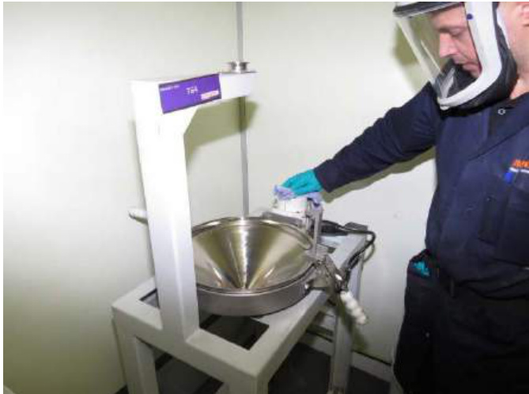  
Figure 96 Wipe down all surfaces with IPA  

Once you are satisfied that all traces of the previous material have been removed, reassemble the sieve.  

# 14.3.5 Reassembly of sieve  

Note: Ensure all components are completely dry before they are reassembled.  

Reassemble the components of the sieve in reverse order.  

Replace the funnel seal (Figure 97).  

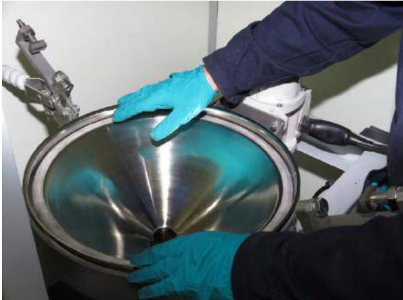  
Figure 97 Replace the funnel seal  

Replace the perforated plate (Figure 98).  

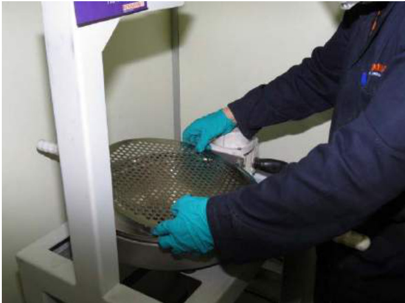  
Figure 98 Replace the perforated plate  

Caution: Sieve mesh is a delicate component and must be removed with care. Do not vacuum or otherwise clean the mesh.  

Replace the sieving balls (Figure 99).  

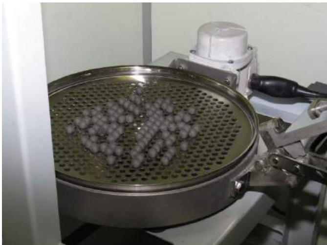  
Figure 99 Replace the sieving balls  

Assemble the large seal around the mesh (Figure 100).  

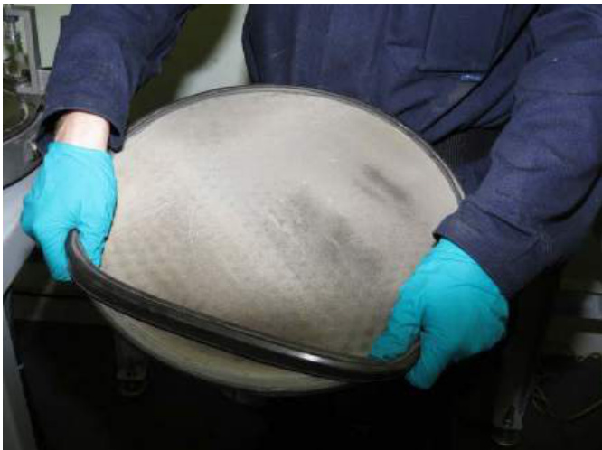  
Figure 100 Assemble the mesh seal  

Replace the mesh on top of the sieving balls. Ensure the deeper recess is face down.  

Place the main body on top of the mesh (Figure 101).  

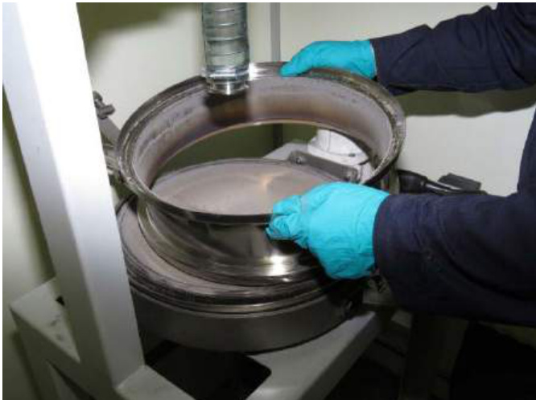  
Figure 101 Assemble the main body  

Place the seal on top of main body.  

Replace the lid on the sieve (Figure 102).  

  
Figure 102 Replace the lid  

Place the centring o-ring onto the upper KF flange (Figure 103).  

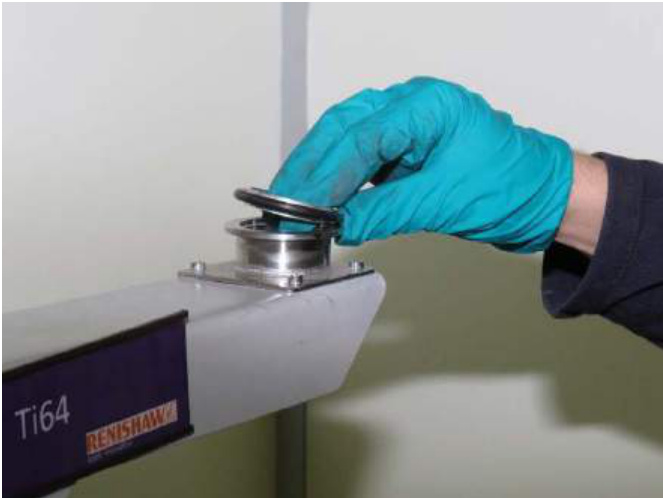  
Figure 103 Place the centring o-ring  

Attach the upper valve (S1) using a clamp (SL2) (Figure 104).  

  
Figure 104 Attach the upper valve (S1) with clamp (SL2)  

Attach the top pipe using a worm drive hose clamp, (Figure 105).  

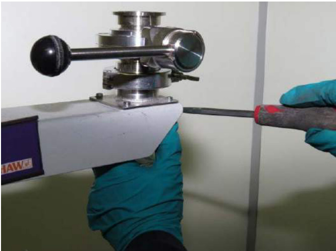  
Figure 105 Attach the top pipe  

Slide the worm drive hose clamp over the pipe, locate the insert into the pipe, place the o-ring over the flange and then connect to the lid with a swing clamp (SL3) (Figure 106).  

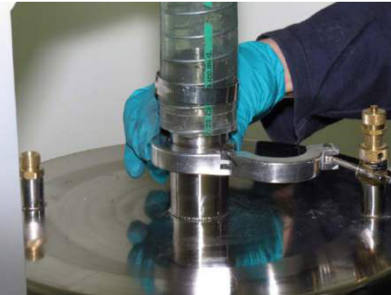  
Figure 106 Connect pipe insert to lid using clamp (SL3)  

Now tighten the worm drive hose clamp (Figure 107).  

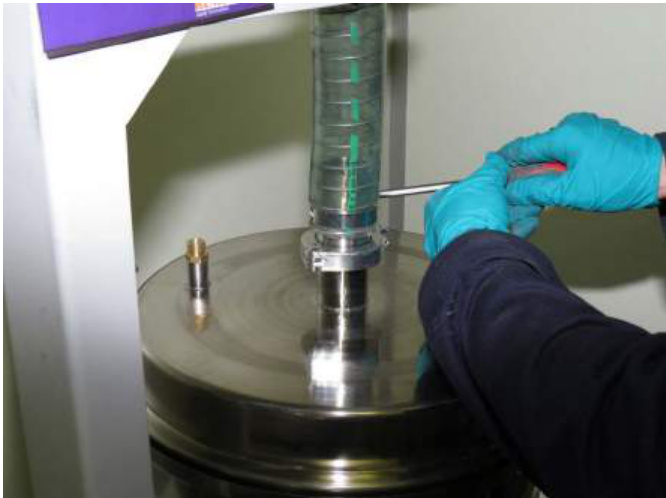  
Figure 107 Tighten worm drive hose clamp  

Follow the same process to assemble the lower pipe.  

Apply the clamps to the sieve (Figure 108).  

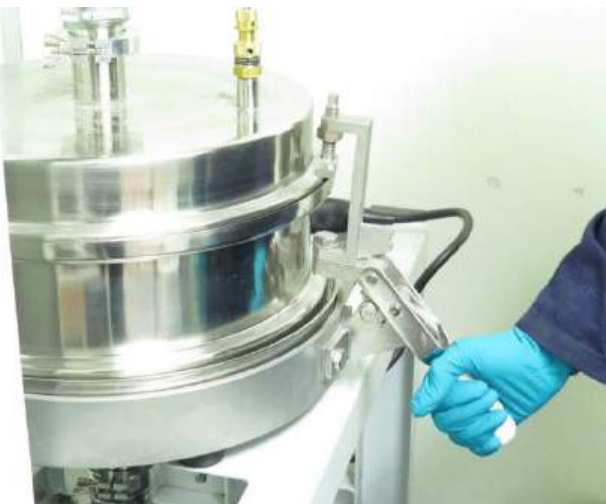  
Figure 108 Apply the clamps  

The clamping torque should periodically be checked using the Russell Finex clamp assist tool, (Figure 109).  

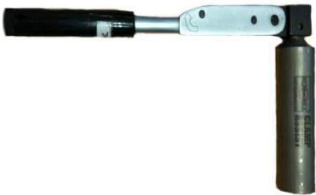  
Figure 109 Russel Finex clamp assist tool  

See the following pages for the operating instructions for the Russell Finex clamp assist tool.  

Attach the argon connection (Figure 110).  

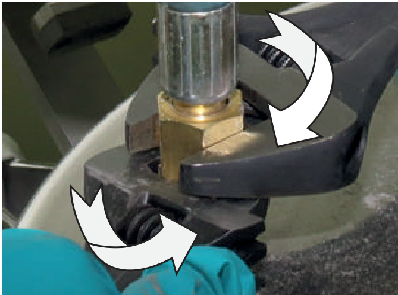  
Figure 110 Tighten the argon connection  

# 14.3.6 Operating instructions for Russell clamp assist tool  

The Russell Clamp, (Figure 111) has been developed to assist the operator in setting the correct clamping force on hand-operated sieve clamps. It is for use on both under-clamps and toggle-clamps fitted onto the Russel Finex range of sieves. It has been preset to enable the operator to apply the correct torque setting by hand.  

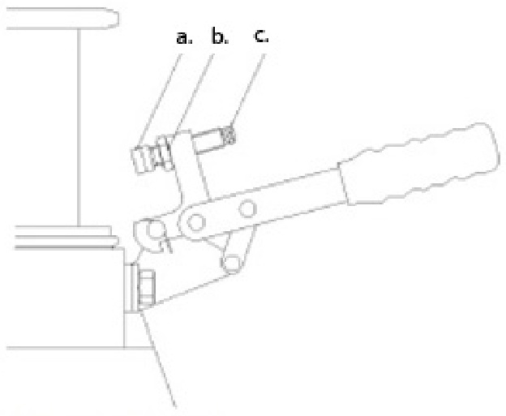  
Figure 111 a. Clamp pad, b. Hex nut, c. Spindle  

1. Ensure that the clamp pad (a.) is aligned with the sieve panwork.  

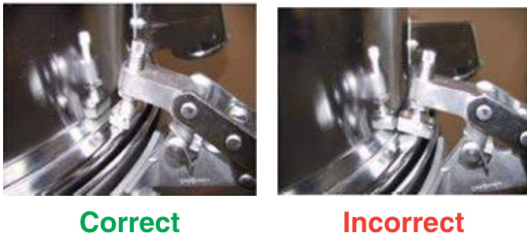  

2. Engage the clamp by hand. If the clamps are too tight to engage, screw the spindle (c) up by a few half turns. If too loose, screw the spindle down by a few half turns.  

# AM250/AM400 user guide  

3. Repeat the above until it is possible to engage the clamps by hand but without requiring excessive force. Release the clamps.   
4. Slide the Clamp Assist over the clamp handle.   
5. Engage the clamp using the tool as shown, ensuring the torque arrow on the tool is correctly orientated, (Figure 112).  

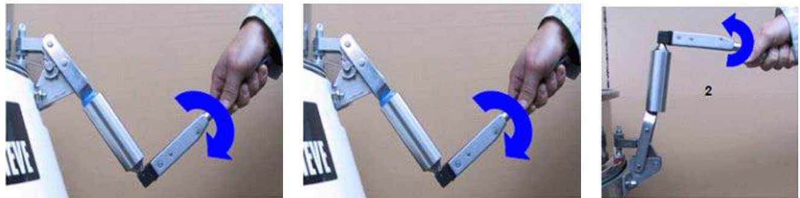  
Figure 112 Under-clamp type (left), toggle-clamp type 1 (middle) and type 2 (right)  

6. Follow the actions in the table to adjust the clamp to the correct settings.  

<html><body><table><tr><td></td><td>When using the Clamp Assist</td><td>Clamp setting</td><td>Action</td></tr><tr><td>A</td><td>The Tool clicks well BEFORE the clamp engages</td><td>CLAMP IS TOO TIGHT</td><td>Adjust pad upwards</td></tr><tr><td>B</td><td>The tool DOES NOT click before the clamp engages</td><td>CLAMP ISTOOLOOSE</td><td>Adjust pad downwards</td></tr><tr><td>C</td><td>The tool clicks on engagement of the clamp</td><td>Correct clamp settings achieved</td><td>None</td></tr></table></body></html>  

7. Tighten the Hex nut.  

8. Repeat the above procedure for the other clamp.   
9. Check the clamps periodically and reset to the correct torque when required.   
10. Clamps should be checked and reset to the correct when replacing any of the following: • Gaskets   
• Mesh frames   
• Underpan/sieve deck – ensure surfaces are clean   
11. Check clamps operate smoothly and replace any clamps that do not function properly or have become stiff.   
12. Check the clamp pads periodically and replace when signs of wear are observed.  

# 14.4 Renishaw silo lift  

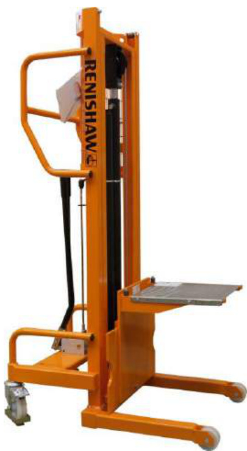  
Figure 113 Renishaw silo lift  

# 14.4.1 Operating instructions  

WARNING: BEFORE USING THE SILO LIFT, IT IS THE USERS RESPONSIBILITY TO COMPLYWITH LOCAL LIFTING LEGISLATION, TO CARRY OUT A RISK ASSESSMENT AND TO ENSURETHAT THE SILO LIFT IS SUITABLE FOR THE TASK FOR WHICH IT HAS BEEN PURCHASED. NOFORMAL LICENCE OR TRAINING IS REQUIRED TO OPERATE THE SILO LIFT, BUT RENISHAWSTRONGLY ADVISE FAMILIARISATION TRAINING IS CARRIED OUT.  

Before using the silo lift, ensure that all functions are working correctly. • Never exceed the maximum permissible load for the silo lift and comply strictly with the requirements of the load diagram, on any equipment supplied. • Ensure that the load is evenly distributed. • Ensure that your silo lift is the correct type for the area you are to work in. Do not enter a hazardous zone with an unsuitable silo lift. • Do not carry divisible loads that sit higher than the fork carriage or backrest extension. • Keep a safe stopping distance. Laden silo lifts cannot be stopped as quickly. • If the silo lift develops a fault or feels unsafe, suspend operations, park and report. • The silo lift should not be left unattended on a gradient. • Be cautious of overhead limitations or obstructions.  

# Driving and braking  

The silo lift is not fitted with any kind of drive or braking devices and so driving and braking are both controlled by the operator pushing the silo lift. The rear castors are fitted with foot brakes for parking purposes.  

# Loading  

The forks are specifically designed to securely locate a silo, ensure the silo is pushed against the dead-stops, and fork tips located correctly.  

When using the plate for general purpose lifting ensure it is fixed in place and the load appropriately located.  

# Lifting  

Operate the manual hand pump by moving the pump handle lever backwards and forward at full stroke. Lift is achieved by each stroke of the handle.  

# Lowering  

Open the manual control valve by turning the release lever anti-clockwise.  

This lever can be set at any required angle by depressing the top button and revolving. It will lock automatically once the button has been released.  

Note: The speed of lowering can be controlled directly through the degree of turn of the knob, the valve will spring shut once the lever is released and lowering will halt.  

Caution: Always apply the wheel brakes when lifting or lowering a load.  

# 14.4.2 Rated capacity  

WARNING: DO NOT EXCEED THE LIFT’S RATED CAPACITY OF 200 KG AT 200 MM (440 LB AT 8 IN).  

# 14.4.3 Regular inspection and maintenance  

Every user shall ensure that work equipment is maintained in an efficient state, in efficient working order and in good repair.  

Every user shall ensure that where any system has a maintenance log, the maintenance log is kept up to date.  

It is important that equipment is maintained so that its performance does not deteriorate to the extent that it puts people at risk. Efficient relates to how the condition of the equipment might affect health and safety. It is not concerned with productivity.  

Lifting equipment needs to be checked frequently to ensure that safety-related features are functioning correctly. The frequency of checks/inspection and maintenance should take into account the duty cycle.  

Maintenance should only be carried out by a suitably qualified person, if in doubt contact Renishaw.  

<html><body><table><tr><td colspan="2">Recommendedchecks</td></tr><tr><td>Wheels</td><td>3 monthly be acted upon.</td><td>Check for any damage or excessive wear. Any damage to the wheels must</td></tr><tr><td>Fork arms</td><td>Annually</td><td>Arms shall be inspected carefully by trained engineers at a minimum interval of 12 months,or depending on application.Any damage, failure,or deformation which may impair safe use must be acted upon.</td></tr><tr><td>Wire rope</td><td>6monthly</td><td>Every six months the lifting wire rope must be inspected for fraying or damage.If frayed or damaged in any way, the rope must be replaced. Slack in any rope can be removed/taken up,by adjusting the threaded end fiting end nut which is anchored to a cross tie.The top bolt must be returned to a position where it prevents the rope from accidentally disengaging the pulley.</td></tr><tr><td>Mast/ carriage rollers</td><td>3 monthly</td><td>The rollers are greased when fitted and should require no further lubrication in use (Lithium complex grease 873). Check for damaged or worn rollers and arrange replacement if necessary.</td></tr><tr><td>Hydraulic circuit</td><td>3 monthly</td><td>Check the hydraulic fluid level in the reservoir. Fully lower the fork carriage. Remove the hydraulic reservoir top filler cap and inspect level of fluid.Top- up to cap if necessary with ISO grade 11158 grade 32 (EN 51524).</td></tr></table></body></html>  

For further information refer to the manual supplied with the equipment, see Section 37 Appendix D "Supplier manuals" for information on the make, model and manufacturer.  

# 14.5 Dehumidifier  

The AM400 requires a supply of temperature-controlled air to keep some of the optical components at a stable temperature.  

Regular checks are required to ensure that the dehumidifier functions correctly and continues to supply temperature-controlled air to the optical system, see Section 37 Appendix D "Supplier manuals" for information on the make, model and manufacturer.  

Caution: The dehumidifier and laser optics require a reliable compressed air supply. This should be checked regularly.  