Maintenance should only be carried out by a suitably qualified person, if in doubt contact Renishaw.  

<html><body><table><tr><td colspan="2">Recommendedchecks</td></tr><tr><td>Wheels</td><td>3 monthly be acted upon.</td><td>Check for any damage or excessive wear. Any damage to the wheels must</td></tr><tr><td>Fork arms</td><td>Annually</td><td>Arms shall be inspected carefully by trained engineers at a minimum interval of 12 months,or depending on application.Any damage, failure,or deformation which may impair safe use must be acted upon.</td></tr><tr><td>Wire rope</td><td>6monthly</td><td>Every six months the lifting wire rope must be inspected for fraying or damage.If frayed or damaged in any way, the rope must be replaced. Slack in any rope can be removed/taken up,by adjusting the threaded end fiting end nut which is anchored to a cross tie.The top bolt must be returned to a position where it prevents the rope from accidentally disengaging the pulley.</td></tr><tr><td>Mast/ carriage rollers</td><td>3 monthly</td><td>The rollers are greased when fitted and should require no further lubrication in use (Lithium complex grease 873). Check for damaged or worn rollers and arrange replacement if necessary.</td></tr><tr><td>Hydraulic circuit</td><td>3 monthly</td><td>Check the hydraulic fluid level in the reservoir. Fully lower the fork carriage. Remove the hydraulic reservoir top filler cap and inspect level of fluid.Top- up to cap if necessary with ISO grade 11158 grade 32 (EN 51524).</td></tr></table></body></html>  

For further information refer to the manual supplied with the equipment, see Section 37 Appendix D "Supplier manuals" for information on the make, model and manufacturer.  

# 14.5 Dehumidifier  

The AM400 requires a supply of temperature-controlled air to keep some of the optical components at a stable temperature.  

Regular checks are required to ensure that the dehumidifier functions correctly and continues to supply temperature-controlled air to the optical system, see Section 37 Appendix D "Supplier manuals" for information on the make, model and manufacturer.  

Caution: The dehumidifier and laser optics require a reliable compressed air supply. This should be checked regularly.  

# 15 Argon supply connection and changeover  

The AM250/AM400 requires a supply of inert gas in order to safely process the raw material. The AM250/AM400 will run from either mains supply or bottled argon, the following procedure covers gas cylinders.  

A minimum cylinder pressure of approximately 25 bar (363 psi) is recommended at the start of any build. If the argon supply is depleted, the build process will pause and an alarm will sound. Depending on the expected build duration it may be prudent to exchange for a full argon cylinder.  

WARNING: ARGON GAS CYLINDERS CAN BE HEAVY. ENSURE GAS CYLINDERS ARE CORRECTLY SECURED TO PREVENT THEM FROM FALLING OVER. USE SUITABLE EQUIPMENT AND PROCESSES TO MOVE CYLINDERS. CONSIDER CONTACTING YOUR ARGON GAS SUPPLIER FOR EQUIPMENT, INFORMATION AND ADVICE ON HANDLING GAS CYLINDERS.  

# WARNING: TAKE SUITABLE PRECAUTIONS WHEN HANDLING PRESSURISED GAS BOTTLES.  

# 15.1 Removing and re-installing the gas cylinder  

Note: The following photographs and text describe a typical gas cylinder available in the UK. The size and type of gas cylinder, and gas regulator will be different in the geographic area where your AM250/ AM400 machine is located.  

Close the argon gas cylinder valve by rotating it clockwise (Figure 114).  

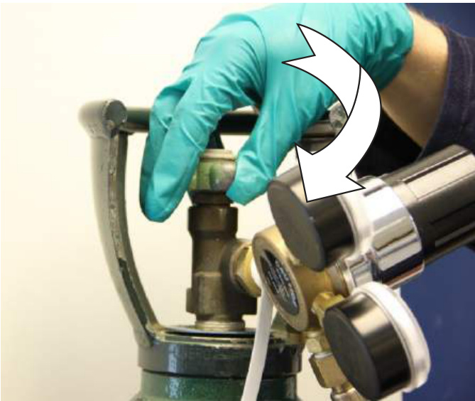  
Figure 114 Close cylinder valve  

Detach the regulator from the gas valve using a $1 \%$ in (approximately $2 9 \mathsf { m m }$ ) or adjustable spanner, (Figure 115).  

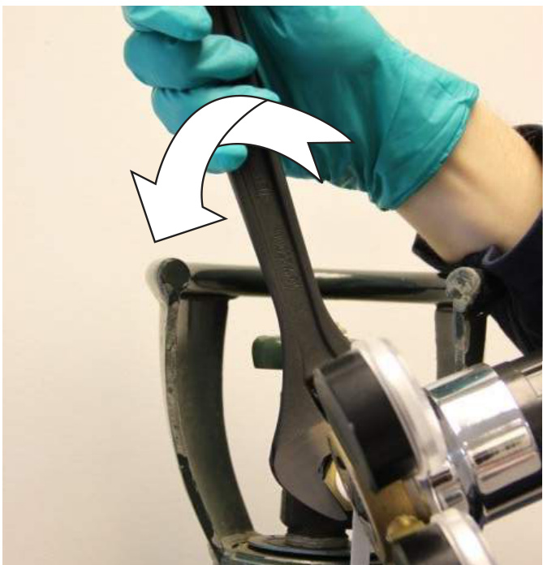  
Figure 115 Unscrew regulator from the cylinder  

Remove the empty gas cylinder, store securely, by chaining it in the designated storage location.  

Install a full gas cylinder in the designated location near the system, and secure appropriately (Figure 116).  

  
Figure 116 Secure the gas cylinder  

Attach the regulator to the cylinder valve using a $1 \%$ in (approximately $2 9 \mathsf { m m }$ ) or adjustable spanner (Figure 117).  

WARNING: NEVER USE OIL OR GREASE, SEALING COMPOUNDS OR TAPES ON THE GAS CYLINDER CONNECTIONS.  

  
Figure 117 Attach regulator  

Open the argon gas valve by unscrewing the valve completely (anti-clockwise), then back off by screwing clockwise half a turn.  

Regulate the supply pressure to between 1.5 bar and 1.8 bar (22 psi to 26 psi) (Figure 118).  

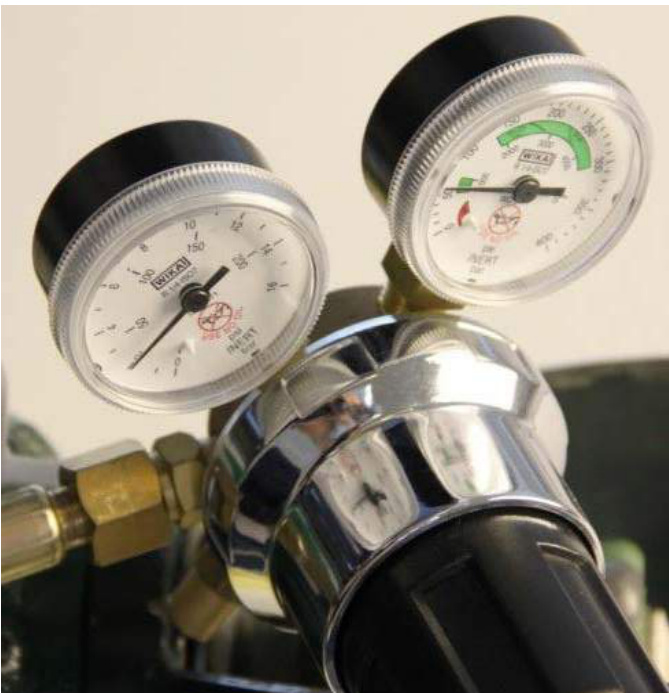  
Figure 118 Left gauge shows supply pressure, right gauge cylinder pressure.  

# WARNING: DO NOT EXCEED 2 BAR (29 PSI) LINE PRESSURE WHEN REGULATING ARGON GAS. OVERPRESSURE WILL CAUSE THE SYSTEM TO HALT  

Clockwise on the regulator valve will increase the pressure (Figure 119).  

  
Figure 119 Rotate regulator right to increase supply pressure  

A minimum cylinder pressure of approximately 25 bar (363 psi) is recommended at the start of any build. If the argon supply is depleted, the build process will pause and an alarm will sound.  

Test the installation as follows to ensure there are no leaks of argon gas. Ensure the AM250/AM400 valves are closed. Pressurise the supply hoses to 1.8 bar, close the regulator, wait ten minutes, ensure the supply hose pressure on the gauge has not dropped. Open the regulator and pressurise to 1.8 bar.  

# 16.1 Powering on the system  

WARNING: BEFORE SWITCHING ON – ENSURE THE SYSTEM DOOR IS CLOSED.  

WARNING: ALWAYS CHECK THE CHILLER AND DEHUMIDIFIER HAVE BEEN SWITCHED ON BEFORE STARTING THE AM250/AM400. SEE SECTIONS 16.2 "POWERING ON THE CHILLER" AND SECTION 16.3 "POWERING ON THE DEHUMIDIFIER".  

The equipment main isolator switch is mounted on the right hand side of the AM250/AM400 cabinet. Switch the main isolator to ON or 1 (Figure 120), when the reset button illuminates, press it. The controller and the main computer will then begin the start-up routine.  

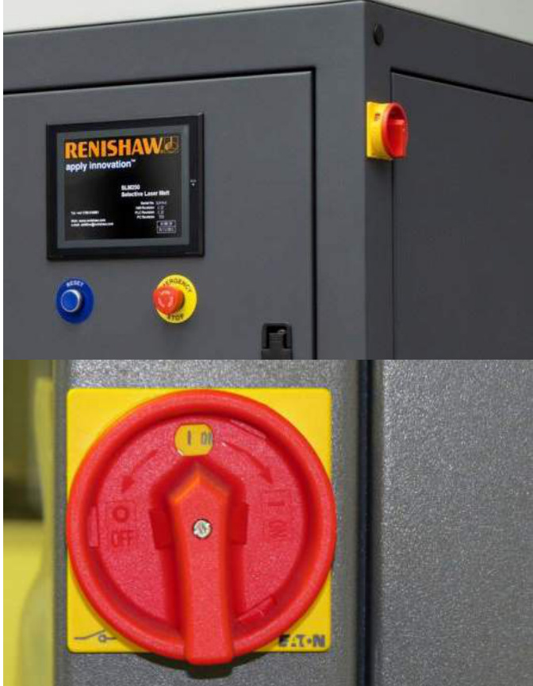  
Figure 120 Main isolator switch  

The chiller, process heating system and laser will also be enabled when the main isolator is switched on.  

When the controller and main computer are booted, the system is ready for operation. This is indicated by the welcome screen (Figure 121).  

User guide  

  
Figure 121 Welcome screen  

# 16.1.1 Powering down the system  

# WARNING: DO NOT SWITCH OFF USING THE ISOLATOR BEFORE FOLLOWING THIS PROCEDURE TO AVOID DAMAGE TO THE CONTROL PC.  

From the main menu, select the following on the AM250/AM400 HMI touch screen (Figure 122):  

$>$ Service $>$ PC On / Off Override $>$ Shutdown PC  

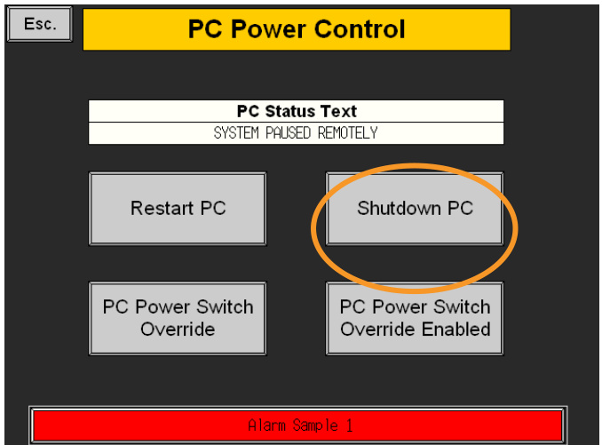  
Figure 122 Select shutdown PC  

This will begin the shutdown sequence for the control PC, after several seconds the PC communication alarm will show.  

Open the lower right door, then open the cover on the PC – once the green LED light has gone out the PC has been successfully shutdown (Figure 123).  

It is now safe to shut off power to the AM250/AM400 by turning the main isolator to 0 or OFF.  

Once the AM250/AM400 has been switched off, the chiller can also be switched off.  

# WARNING: DO NOT SWITCH OFF THE CHILLER WHILST THE SYSTEM IS STILL ON.  

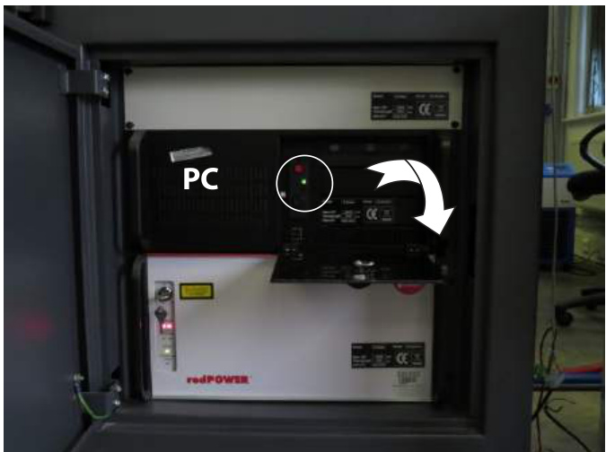  
Figure 123 Open PC cover and wait for green LED light circled to expire  

# 16.2 Powering on the chiller  

The AM250/AM400 requires a supply of temperature-controlled fluid to keep the optical components at a stable temperature.  

To switch on the chiller, ensure that the main power lead is connected to a suitable power supply, then switch on the main switch on the back of the unit (Figure 124). Press the RUN / STOP button once to switch on the pump, the run light will illuminate (Figure 124).  

Once the chiller is switched on, it can be set to run using the controls on the front panel circled below.   
The SV (Set Value) temperature should be set to $2 0 ^ { \circ } \mathsf { C }$ $( 6 8 ^ { \circ } \mathsf { F } )$ (Figure 124).  

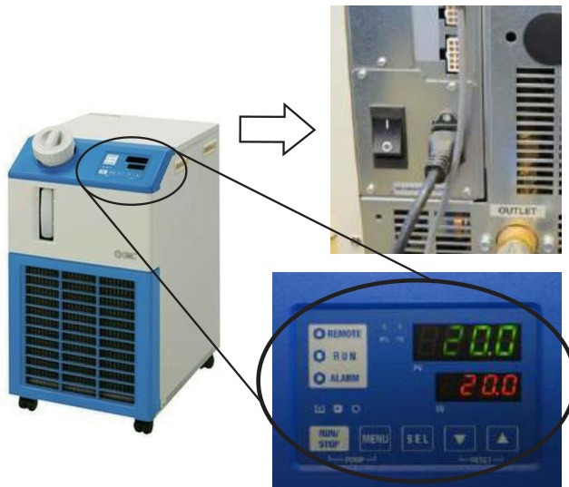  
Figure 124 Chiller on switch (top) and chiller temperature (bottom)  

# 给除湿机供电  

# 16.3 Powering on the dehumidifier – AM400 only  

The AM400 only requires a supply of temperature-controlled air to keep parts of the optical system at a stable temperature.  

To switch on the dehumidifier, ensure that the main power lead is connected to a suitable power supply. Switch on the illuminated On/Off switch, (Figure 125) on the front of the dehumidifier. The switch should illuminate to show that the dehumidifier is operating normally.  

User guide  

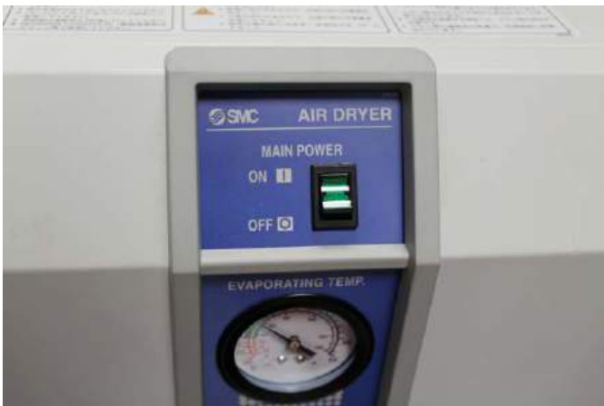  
Figure 125 Dehumidifier on/off switch  

# 16.4 Pages not requiring login  

The AM250/AM400 features a touch screen interface from which the system and other user interactions can be controlled. All file preparation is completed in an offline environment within the file preparation software and then loaded to the system via network connection or ethernet connection.  

In order to allow viewing of the system status and modes, several pages can be toggled without user login. This allows language configuration and viewing of information pages (Figure 126). Navigating these pages can be done safely without affecting the system, providing the user is not logged in.  

  
Figure 126 Language selection page (optional on software installation)  

Following the start-up page, user languages can be selected by pressing the appropriate flag, if installed.  

To loginto the AM250/AM400 control interface, tap the screen and select the following (Figure 127):  

$>$ Login In/Out  

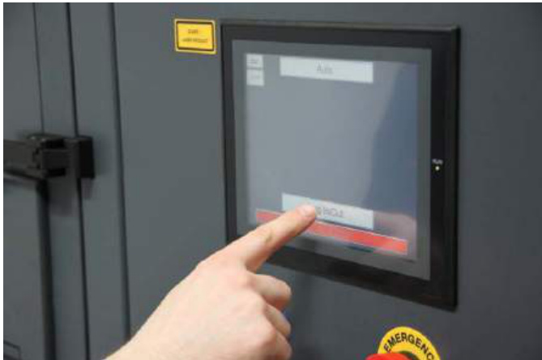  
Figure 127 Loginto the user interface before selecting the required user level  

The AM250/AM400 has different access levels depending on the user (Figure 128). The default levels passwords are:  

Level $1 >$ AMPD1: End user operator level  

Level $2 >$ AMPD2: End user technician level  

Level $3 >$ Maintenance engineer level  

Level $4 >$ Software engineer and configuration engineer  

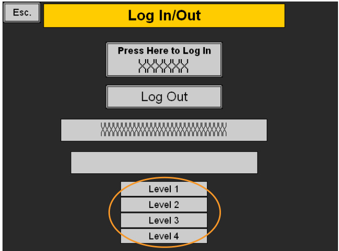  
Figure 128 Range of levels which the user can gain access to  

# Select <Press Here to Login>  

Key in the alphanumeric pass-code using the keypad (Figure 129) and press return.  

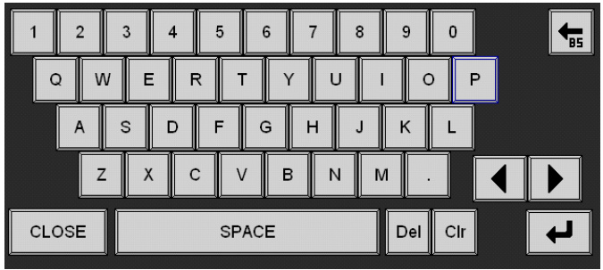  
Figure 129 Enter pass-code using keypad  

The user access level is defined by the individual user account. User account entry level is highlighted in yellow.  

All operations are carried out from the menu page. Once logged on, continue to the menu page as follows (Figure 130).  

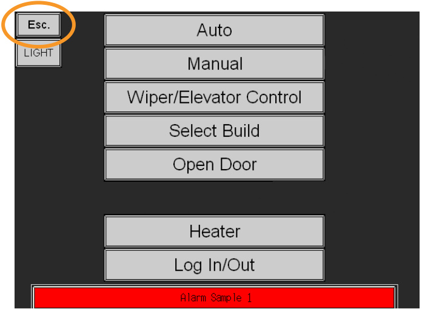  
Figure 130 Select <Esc.>  

# Select <Esc>  

Note: Before a new user can login, the previous user must be logged out, unless the 15 minute timeout has elapsed.  

Note: The default access passwords can be altered when logged into level 4.  

# 17.1 Logging out  

To log out of the system, select the following:  

$>$ Esc. $>$ Login In/Out $>$ Log Out  

# 18 Opening and closing the system doors  

# WARNING: ALWAYS ENSURE THAT YOU ARE WEARING THE REQUIRED PERSONAL PROTECTIVE EQUIPMENT BEFORE OPENING THE SYSTEM PROCESS CHAMBER DOOR.  

  

  

  

Wear eye protection, full face respirator (to EN143 Type $\mathsf { P 3 } \star \mathsf { A 1 }$ ), protective gloves and cotton or fire retardant overalls with full length sleeves (made of staticdissipative material.)  

Do not allow the dust to form a cloud.  

Do not eat, drink or smoke in the vicinity of the AM250/AM400 system.  

Wash hands thoroughly with water and soap after contact or use.  

Wash any contaminated clothing separately from other clothing.  

To open the system door, user login is required. Do not attempt to open the door whilst the process is running.  

# 18.1 Opening the process chamber door  

To open the upper chamber door, override the door interlock by selecting the following (Figure 131):  

Open Door $>$ Door Interlock Override Disabled  

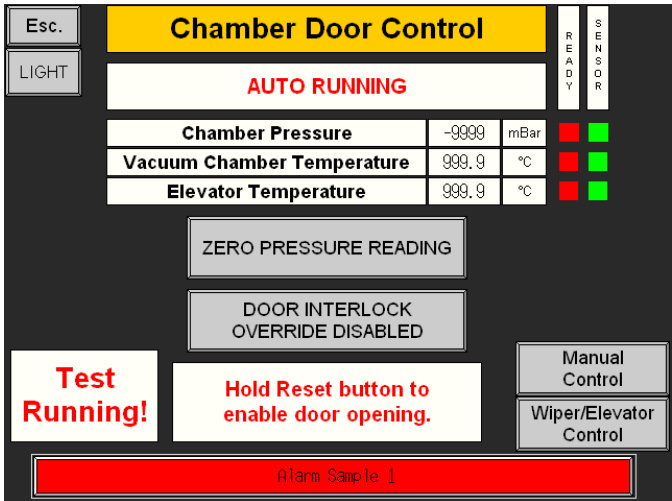  
Figure 131 Open door window in AM250/AM400 control screen interface  

Open the door by holding the reset button and pulling the handle (Figure 132).  

  
Figure 132 Opening the door whilst pressing the reset button  

# 18.1.1 Closing the process chamber door  

To then close the door, ensure the latch engages fully, push firmly with one hand, whilst shutting the latch with the other, (Figure 133).  

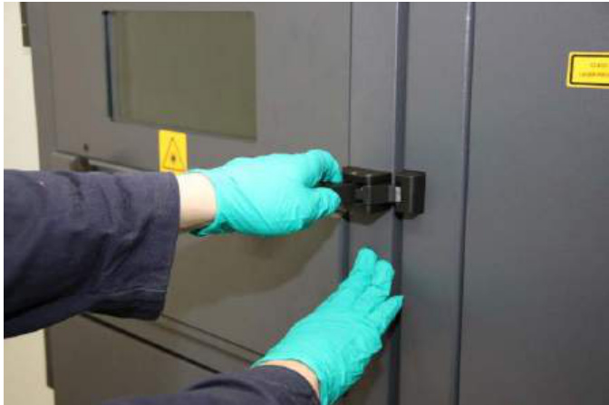  
Figure 133 Engage the latch and push firmly shut  

# 18.1.2 Resetting the door alarm  

After opening the door, an Emergency Alarm initiates that needs to be reset before operating the system. Select the following on the AM250/AM400 control interface:  

# $>$ Override enabled  

Press the blue reset button on the AM250/AM400 system to remove the alarm.  

Wiper home will be required before any functions may be used. To find Wiper Home, select the following on the AM250/AM400 control interface (Figure 134):  

$>$ Wiper/Elevator Control  

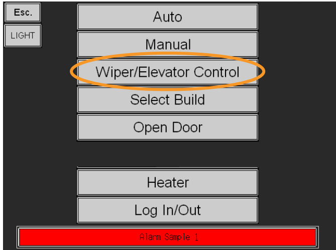  
Figure 134 Wiper/Elevator control button in AM250/AM400 main menu  

Then select the following (Figure 135):  

# $>$ Wiper/Elevator Control $>$ FIND WIPER HOME  

  
Figure 135 Wiper/Elevator control window in AM250/AM400 control interface  

# 18.2 Opening and closing the lower chamber door  

This is only possible once the upper door is open.  

Pull on the lower handle (Figure 136).  

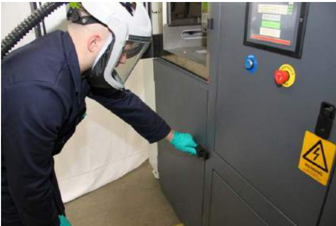  
Figure 136 Opening the lower door  

When closing the door, ensure that the latch engages fully. Push firmly on the door with one hand, whilst shutting the handle with the other (Figure 137).  

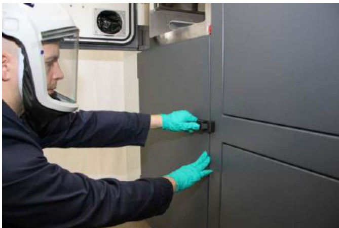  
Figure 137 Engage the latch and push firmly shut  

# 18.3 Checking the pressure sensor  

The ambient pressure reading must be checked and re-zeroed after every build, to accommodate changes in atmospheric pressure  

With the door open the chamber pressure reading should be 0 mbar (Figure 138).  

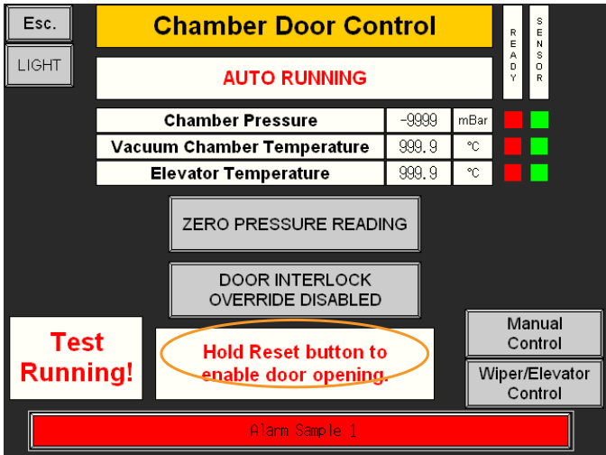  
Figure 138 Zero pressure reading if not reading zero when the door is open  

If it is not 0, when the door is open the Zero Pressure Reading button will be visible. Pressing this will reset the pressure sensor.  

Note: An incorrect pressure reading may prevent the system from achieving the set pressure required to operate.  

Caution: An incorrect pressure reading may result in a build halting or failing.  